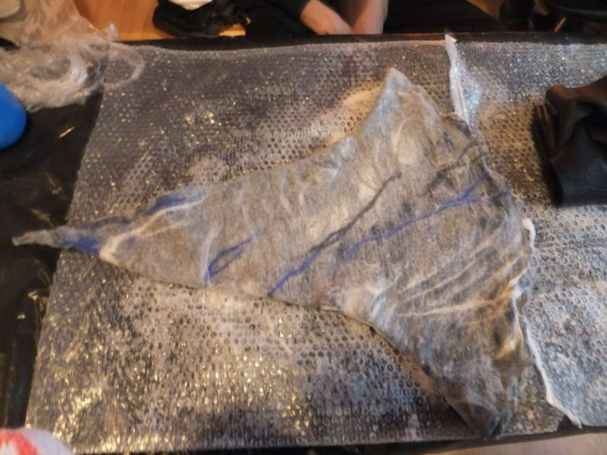

So, scheinbar habe ich meine Berufung gefunden... es sind die Filzhüte. Da ein Magier nicht ernst zu nehmen ist, solange er keine angemessene Kopfbedeckung trägt (wobei über "Angemessenheit" die LARP-Gruppe der Bewahrer des Gleichgewichts entscheidet) musste auch für einen weiteren Freund ein Hut gefilzt werden. Yiha er ist ein Steinmagier und endlich habe ich (zumindest am Anfang) daran gedacht Fotos vom Entstehungsprozess zu machen. Und ich muss sagen die Steinadern geben dem Hut noch den "gewissen Nerven-Kiesel".

Und nach weniger Stunden als gedacht ist mal wieder ein sehr eigentümliches liebenswertes Flauscheteil für den Kopf entstanden. Sogar mit echtem eingefilztem Amethyst namens Wilbert.

