Auch ich war in der letzten Zeit natürlich nicht untätig, und wie ihr bestimmt schon mitgekriegt habt, ist meine Spezialität ja der Kleinkram, bei dem sich auch noch das letzte Fetzchen Stoff verwenden läßt.

Ich habe ein weiteres Dokumentenmäppchen genäht: Ein Cover, die Innenseite des Covers, vier unterschiedlich gestaltete Seiten mit viiiiielen Fächern, jeweils zwei Teile zusammennähen oder verstürzen, Spitzen, Borte und sonstige Verzierungen drauf. Zu guterletzt werden die drei "Blätter" genau aufeinander gelegt und mittig zusammengenäht. Voila!

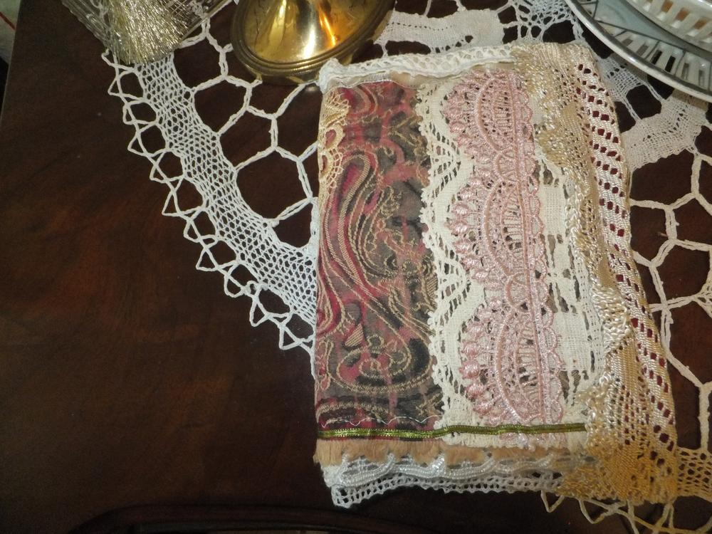
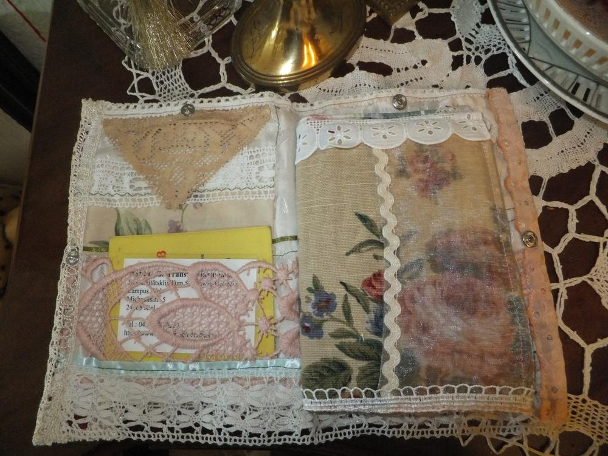
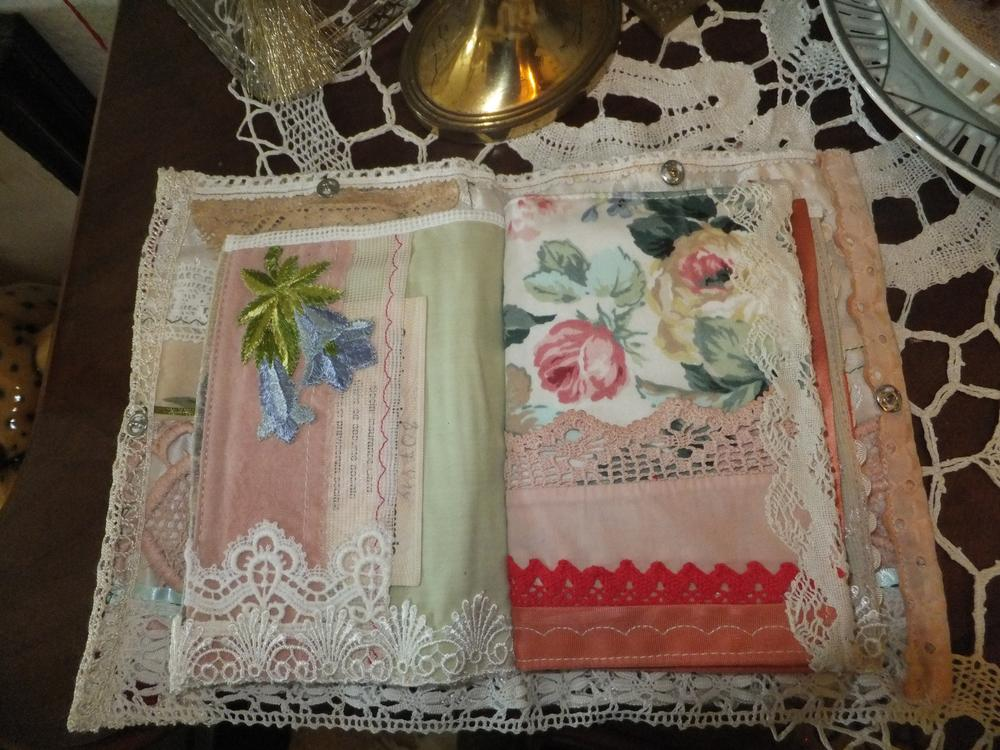
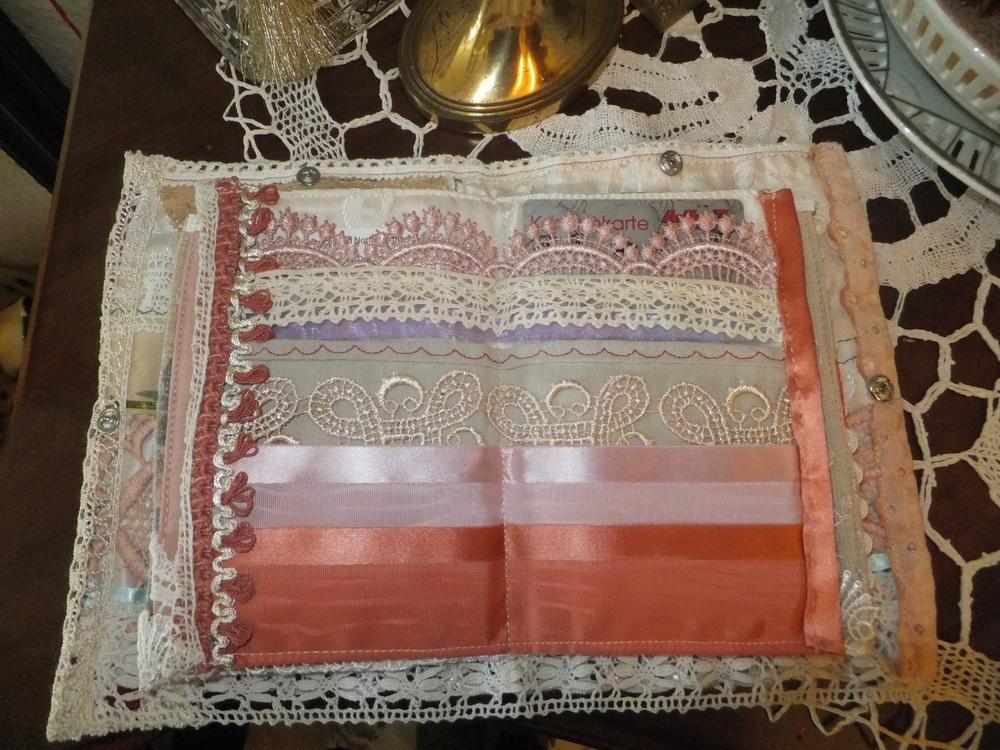
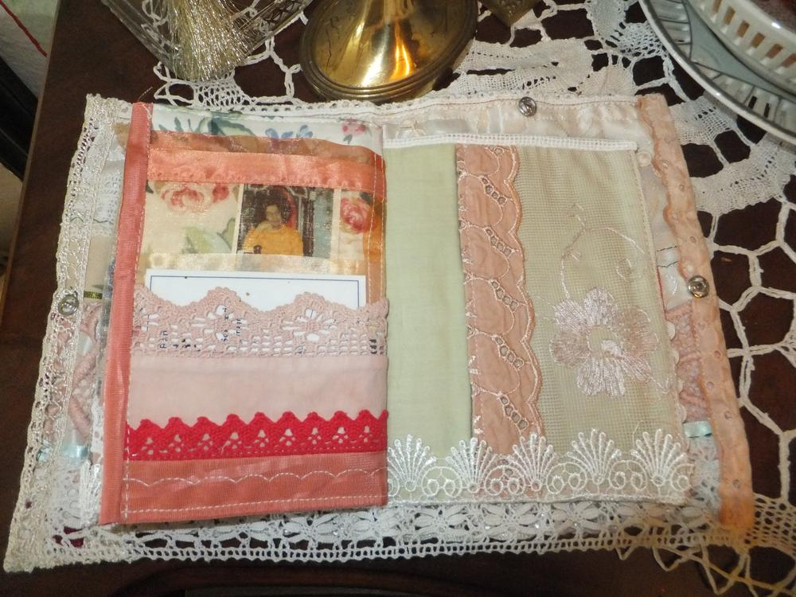
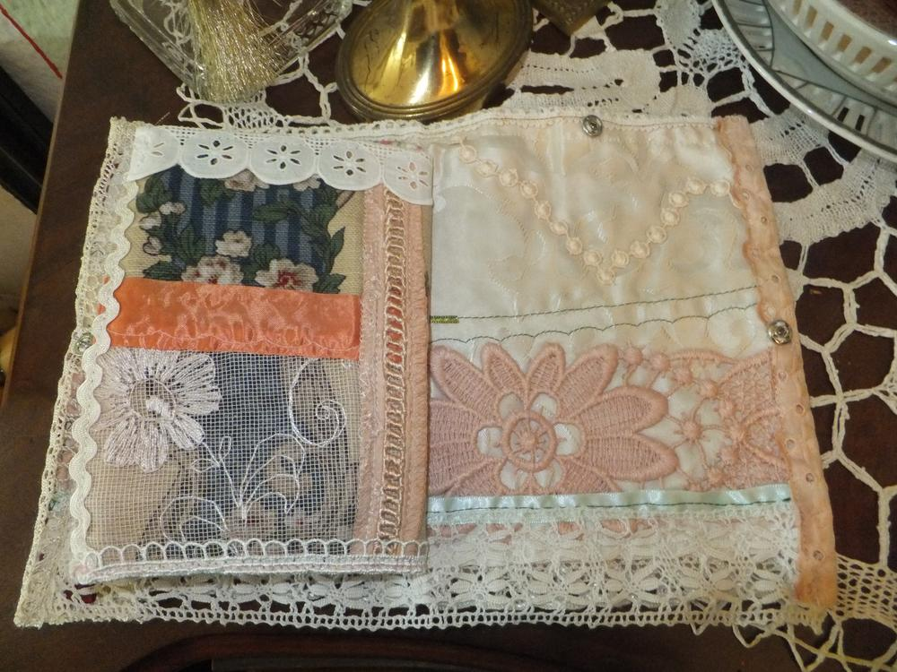
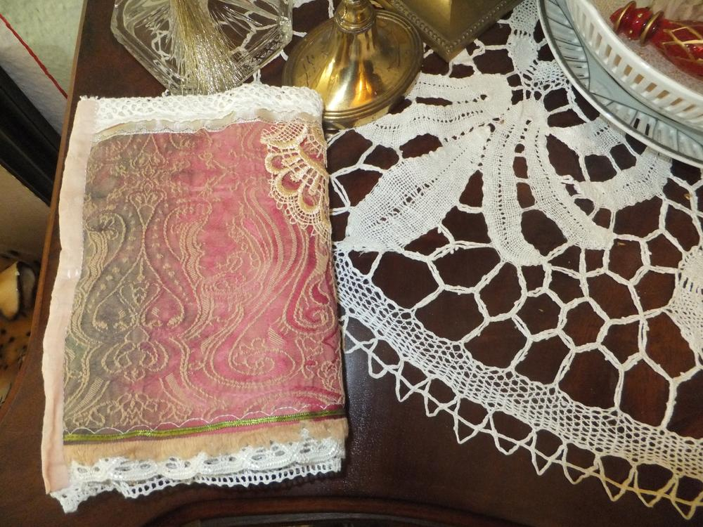
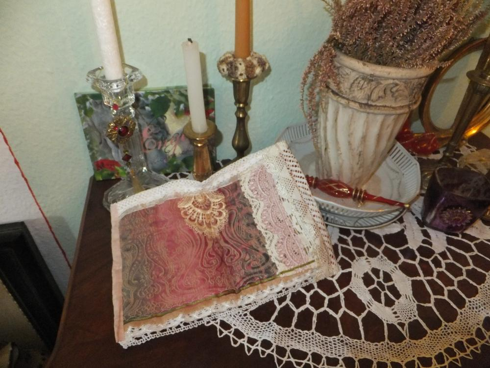

Wie ihr an den vorhergegangenen Mäppchenposts [eine Spitzensache](/2016/01/eine-spitzensache/) und [bunte Dokumentenmappe](/2016/06/bunte-dokumentenmappe/) und auch bei der [Challenge](/2016/05/die-challenge/) bemerkt, wenn ich erst einmal dabei bin, mach ich gleich ne Serie daraus. Dieses Exemplar ist größer geraten, weil ich den Stoff sicherheitshalber großzügig zugeschnitten habe. Aber irgendwie habe ich dann doch nicht so stark wie gedacht eingekürzt. Nun ist sie eben größer.

Um auch noch die kleinsten Schnipsel zu verbrauchen, die in Mengen anfallen, habe ich kleine Freundschaftskissen gepatcht. Dafür werden ca. 10 cm große Teile ausgeschnitten und mit einer Seitenöffnung zum Füllen zusammengenäht. Die Füllung besteht aus ... ihr ahnt es schon... SCHNIPSELN. Danach schließe ich das kleine Loch mit ein paar Handstichen. 

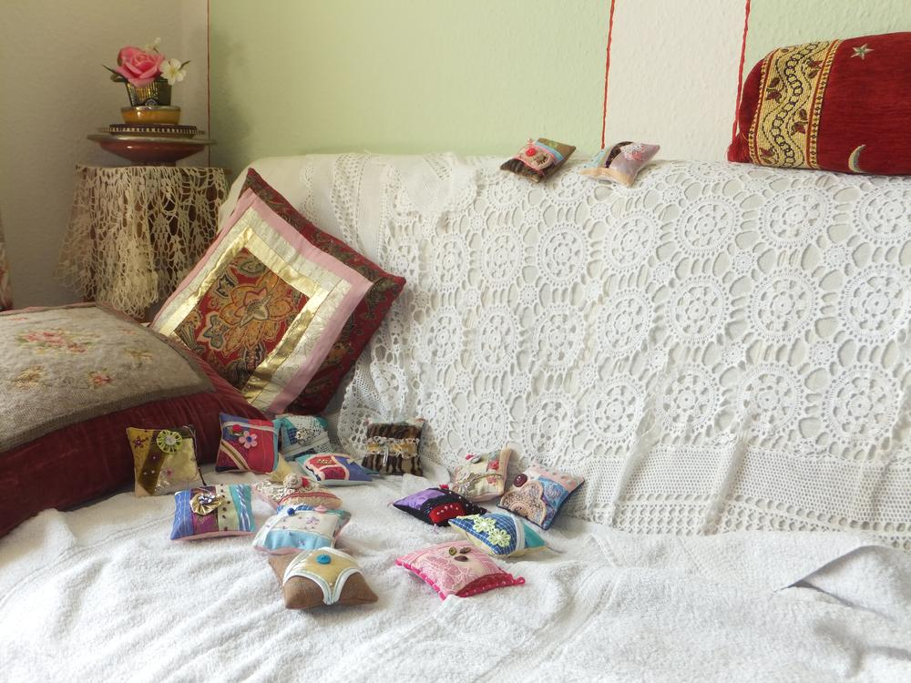
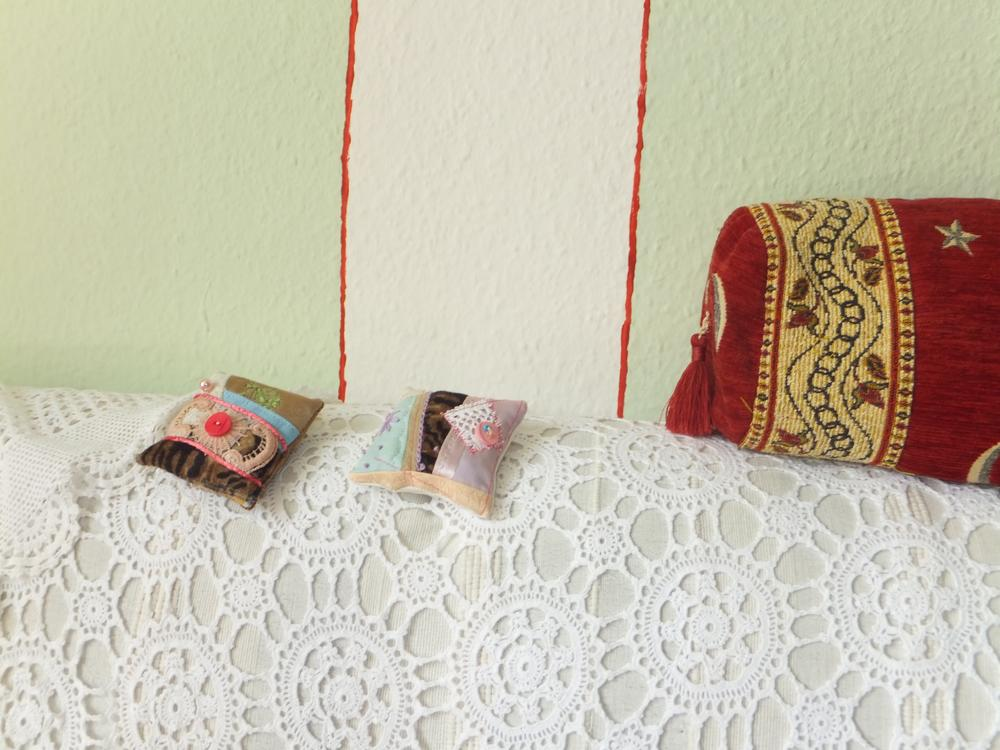
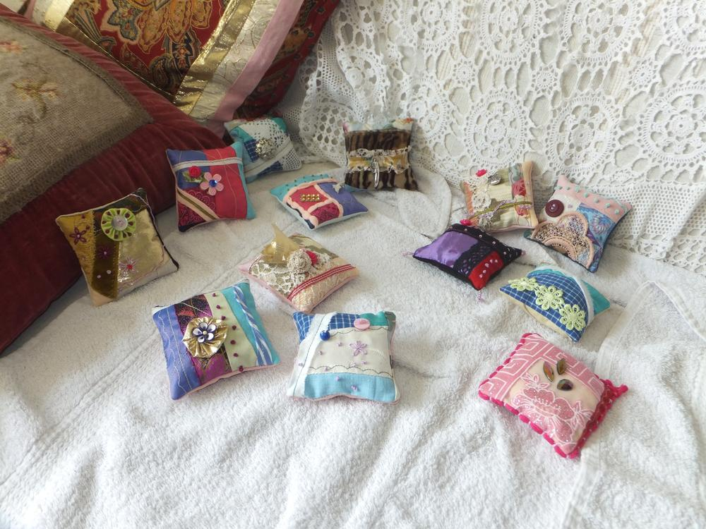
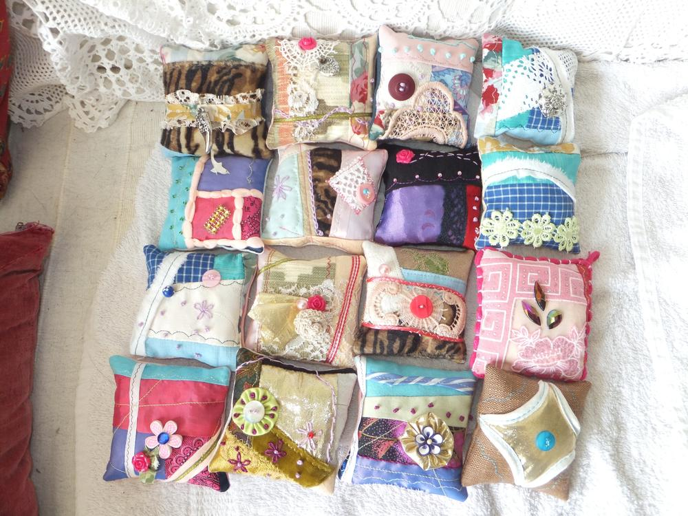
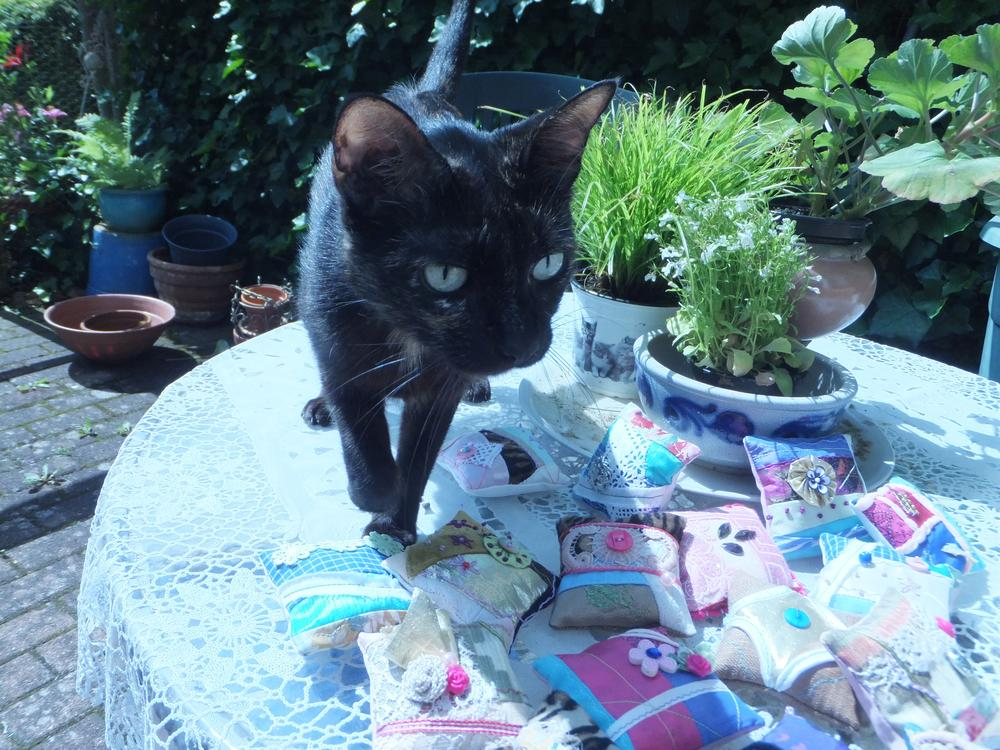

Auch diese Woche hat sich mal wieder eine "hidden cat" versteckt, wer sie findet, dem sei gesagt: dies ist Cannika eine meiner drei neuen Mitbewohner.
Ich wünsche euch eine herrlich kreative Woche. Eure Lucy

