Die Pfeilraupe hat es Lucy und mir angetan. Neben der [glamourösen Pfeilraupe](/2016/12/pfeilraupe/) von Lucy und meiner aus selbstgesponnenen Wolle gestrickten,[frühlingshaften Pfeilraupe](/2017/01/pfeilraupenvirus/), habe ich nun endlich eine weitere lange angefangene Raupe zuendegebracht.

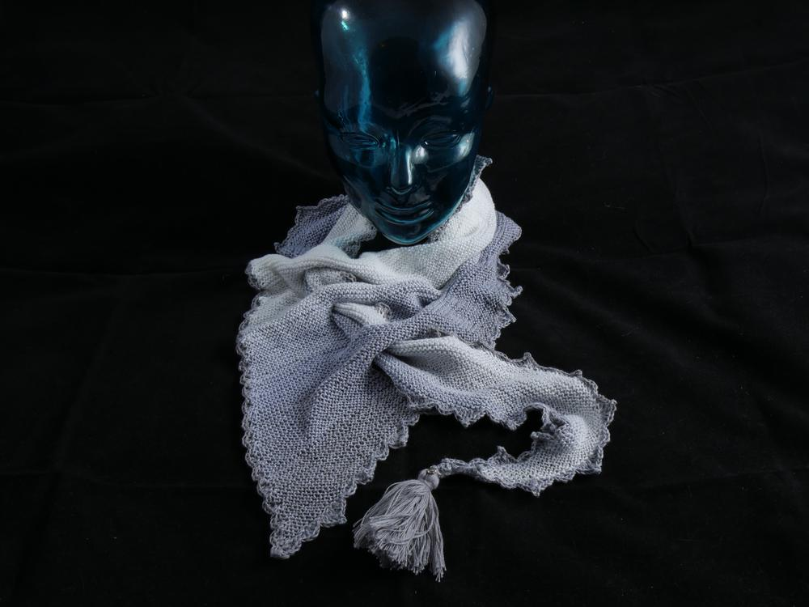

Man sieht den Bildern an, das zu Beginn der Raupe meine kleine Jemima wirklich noch klein war.

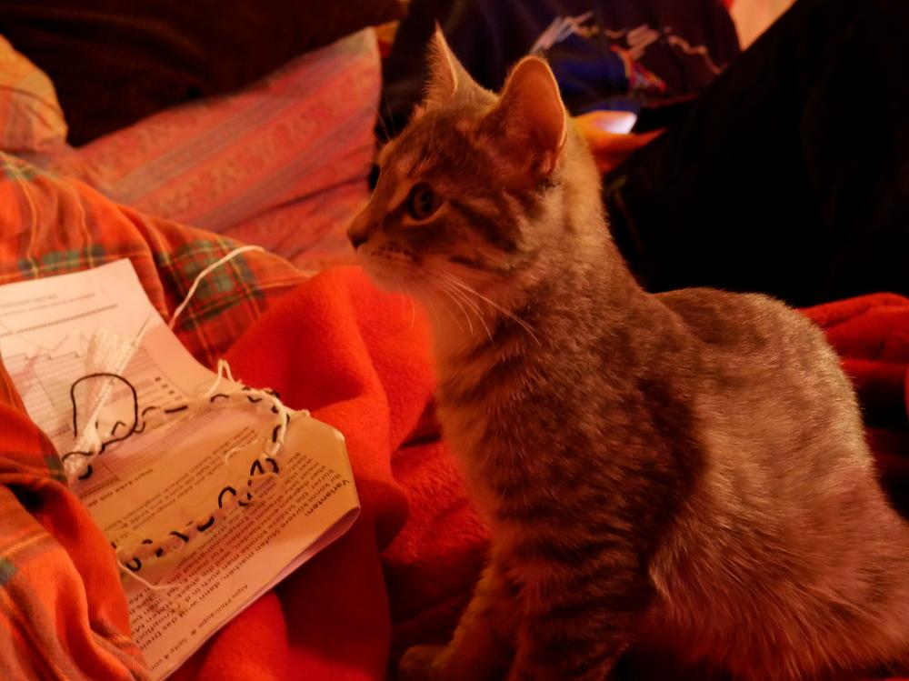
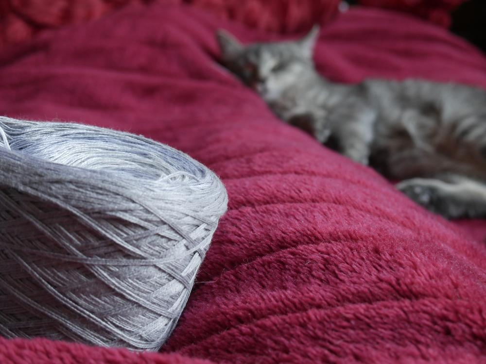

Am Anfang sind es immer nur ein Paar Maschen, dann werden es mehr und dann wieder weniger und man bangt, dass die Wolle reicht.

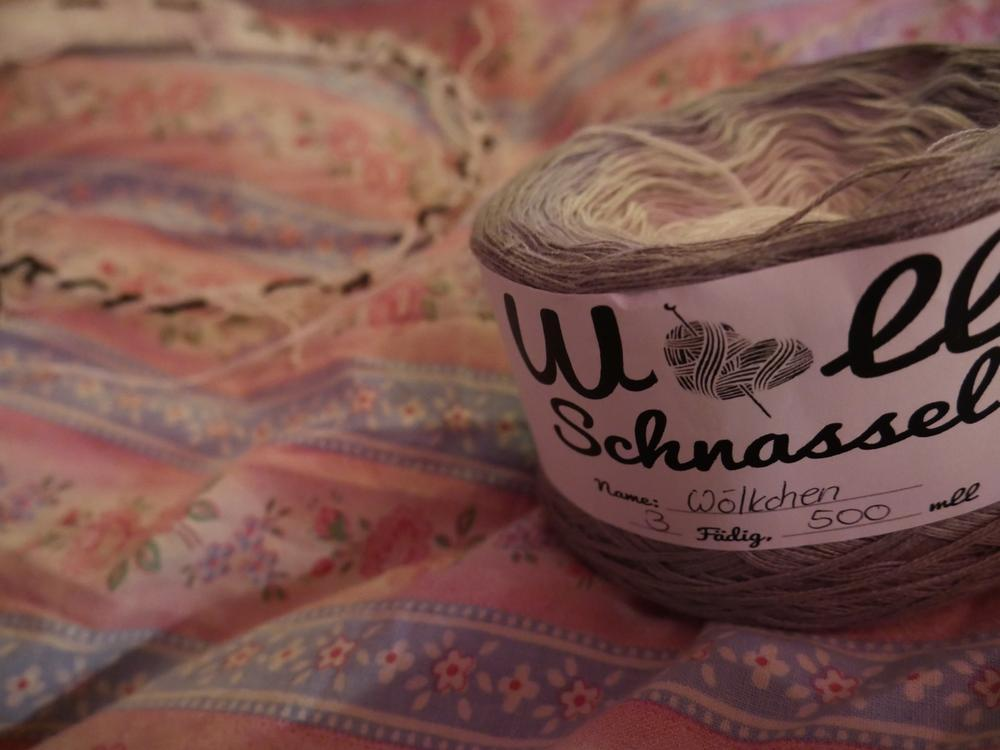
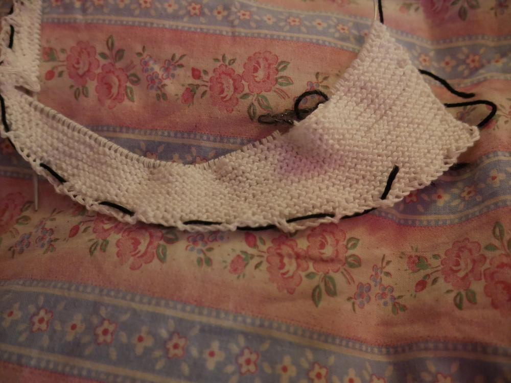

Aber ich hatte sogar noch Wolle übrig, mit der ich diese tolle Spitze am Rand häkeln und die Quaste am Ende machen konnte.

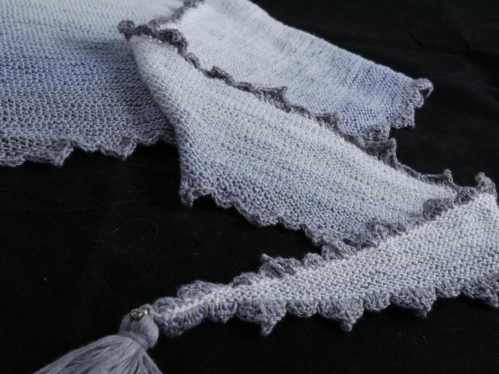
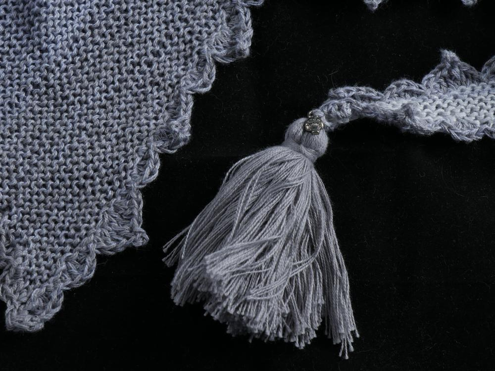

Die fertige Pfeilraupe begeistert mich immer wieder.

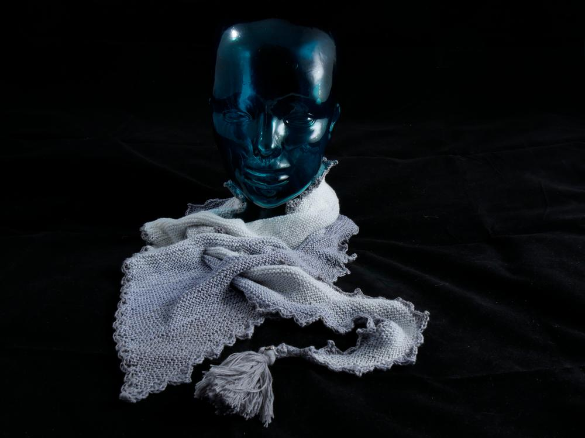
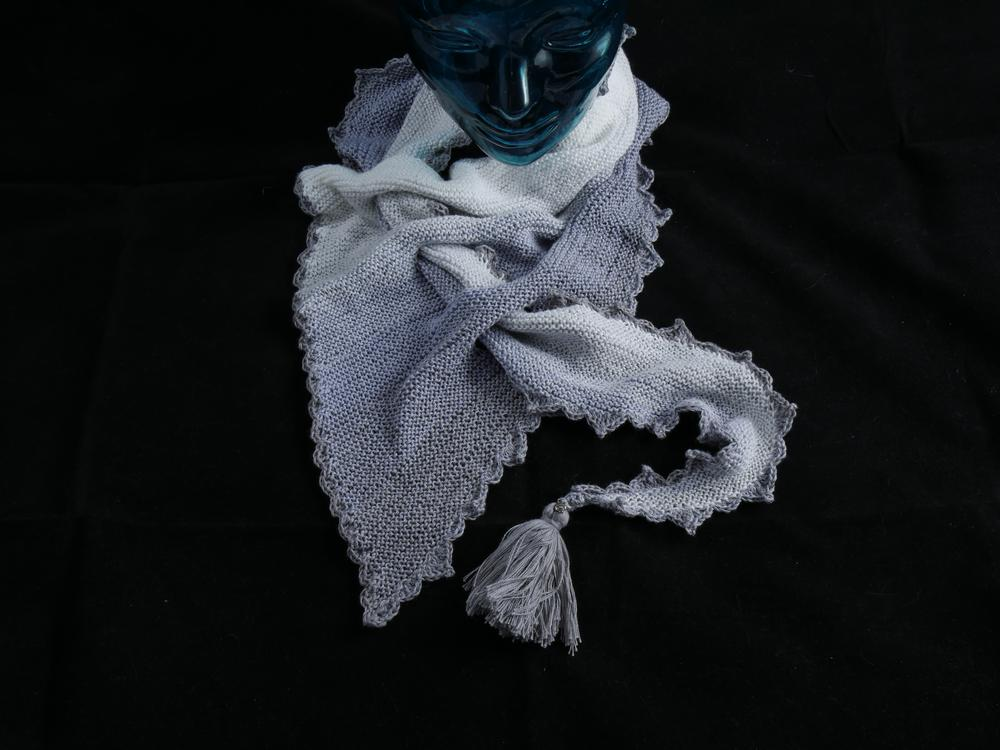

Und ausgebreitet sieht das dann so aus.

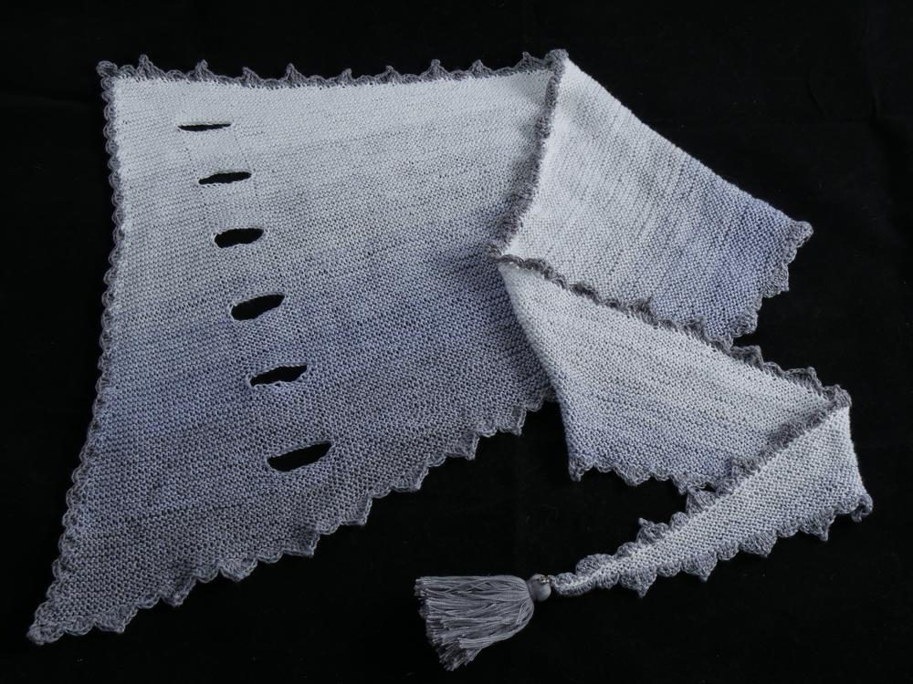
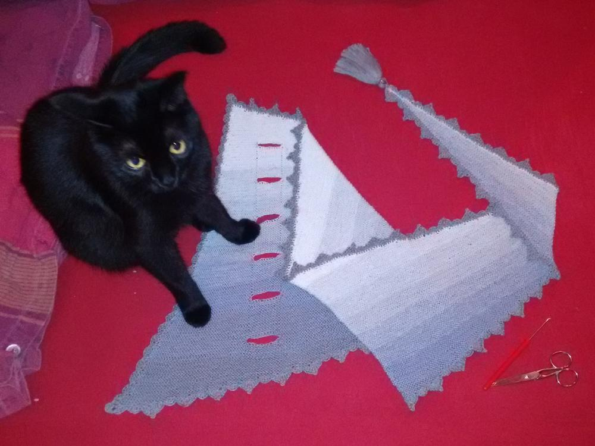

Einen kuscheligen Sonntag wünscht Eure Ermeline.
