Der Winter kommt bestimmt bald wieder. Naja, das oder die Tatsache, dass ich Lust hatte diese Mütze zu häkeln wird der Grund sein, dass sie nun existiert. 

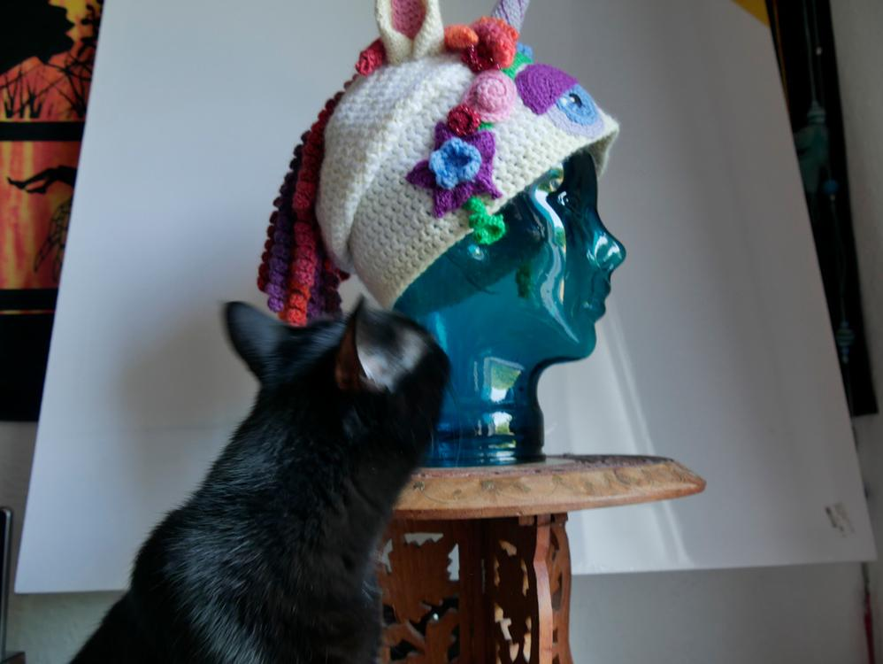

Eine angenehm warme Einhornbeanie aus Acylgarn ist nun das zukünftige Accessoire für die nächste Kälteperiode. Damit reiht sie sich in die Sammlung meiner gehäkelten [Mützenexponate](/2015/01/monstermutzen/) und dem [Stirnband](/2015/11/kaninchen-stirnband/) und sonstigen [Einhornbeklopptheiten](/2018/02/amigurumi-babyeinhorn/) ein. 

Tja der Grund, warum ich erst jetzt mal wieder einen Beitrag veröffentliche ist schlichtweg, dass mich das Studium zeitlich sehr beansprucht und ich ein schlechtes Gewissen bekomme, wenn ich während des Semsters nicht lerne sondern handarbeite. Ideen habe ich nahezu unendlich viele. Die Folge ist dann, dass ich in den Ferien so viele Projekte habe, dass ich nicht weiß wo mir der Kopf steht und was ich als erstes fertig machen soll. Neben einigen Großprojekten an denen ich noch arbeite, die hoffentlich bald fertig werden, habe ich in letzter Zeit viele digitale Kreativitäten erschaffen. Ob das mit dem Studiengang zu tun hat? (z.B. habe ich ein Hörbuch zu Lucys Geburtstag aufgenommen von ihrem Buch [Angela](/2014/06/das-buch-angela/), und arbeite gerade an dem Layout für ein Buch und ein paar Postkarten)

Aber widmen wir uns nun der Mütze... ziemlich viel Spielkram ist nun hier verarbeitet.

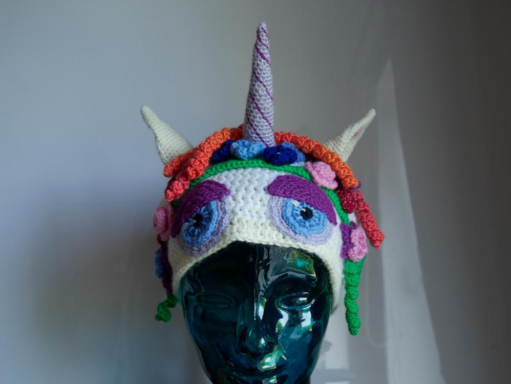
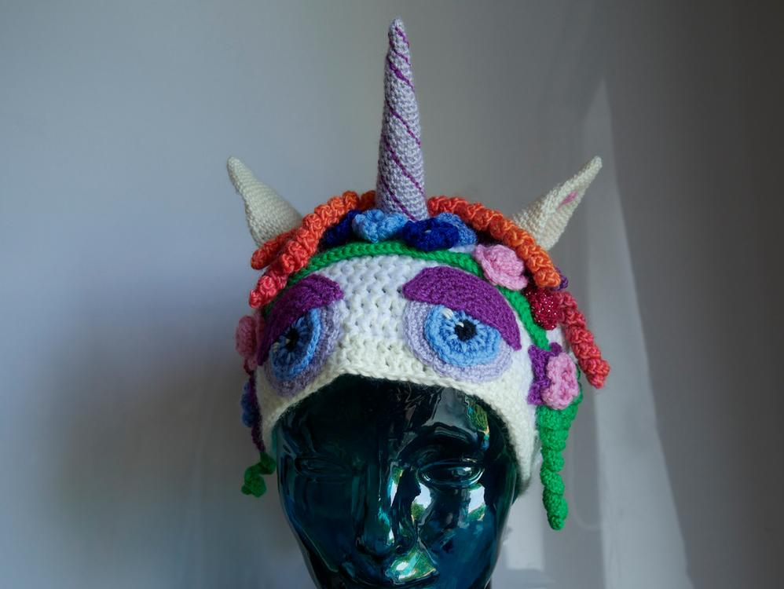
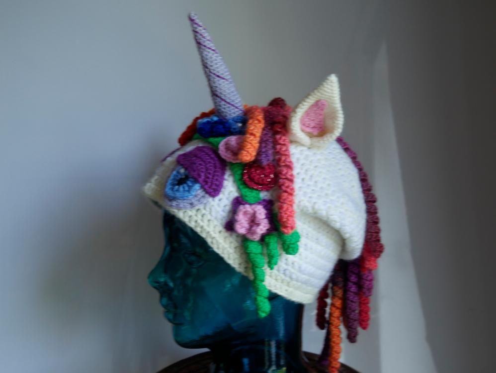
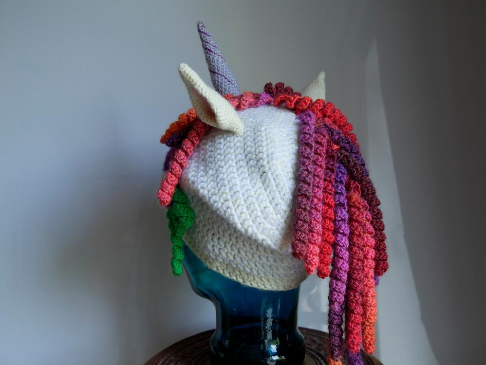
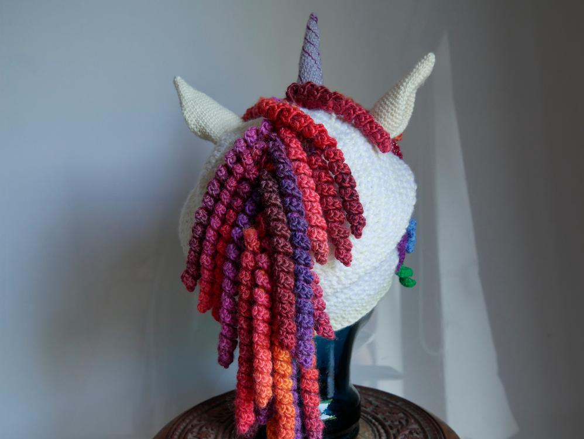
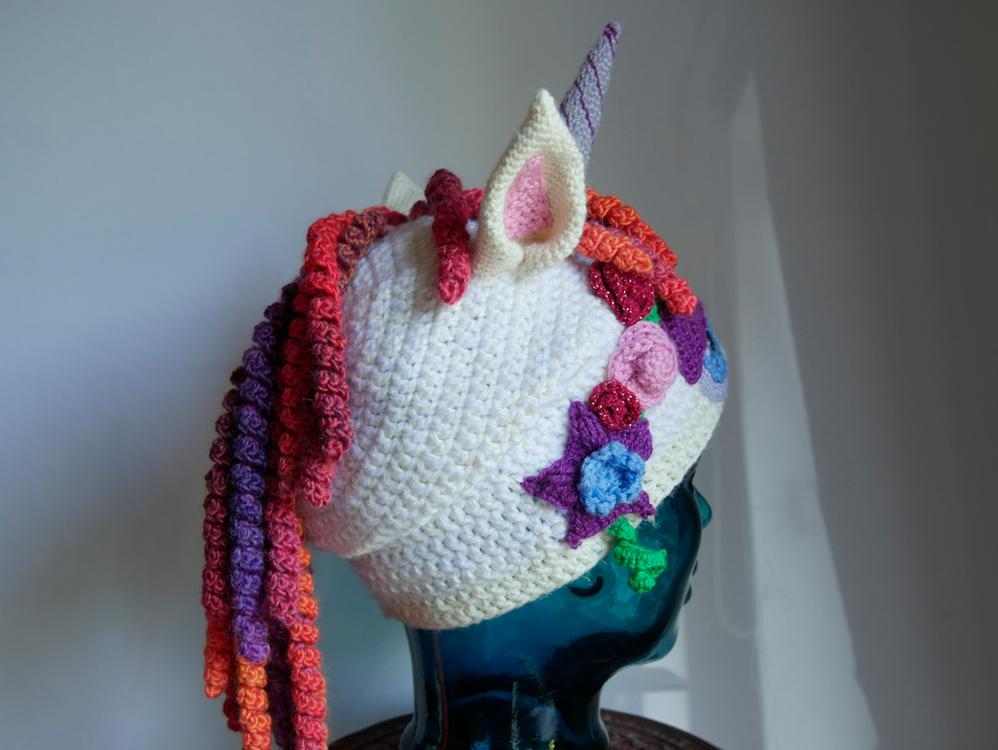
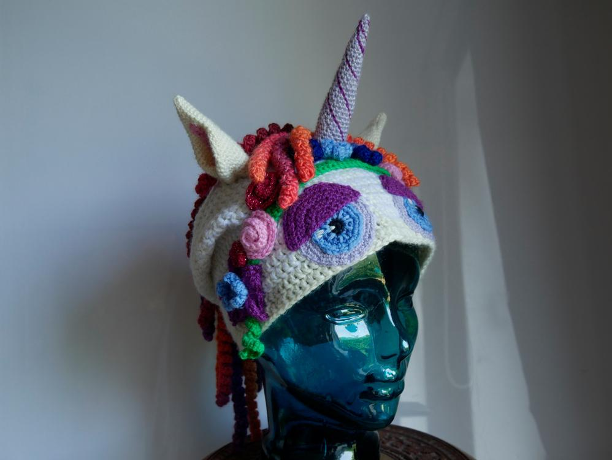

Ich konnte kleine Blümchen häkeln und viele Reste damit verarbeiten. 

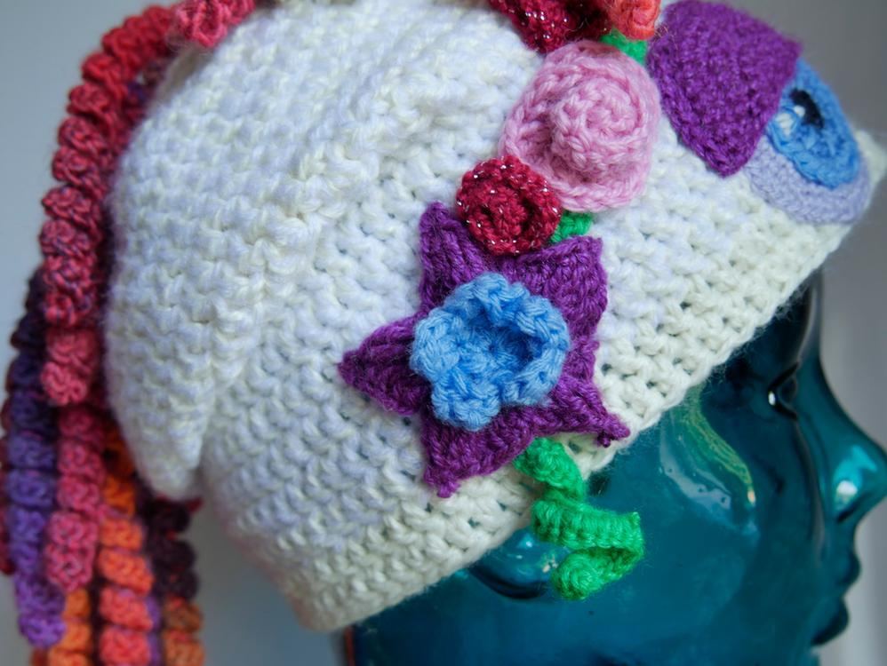
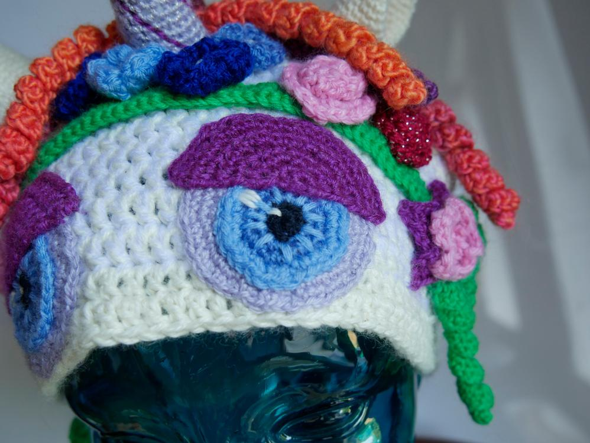

Das Horn habe ich mit viel Watte ausgestopft, damit das auch so schön - einhornig - ist.

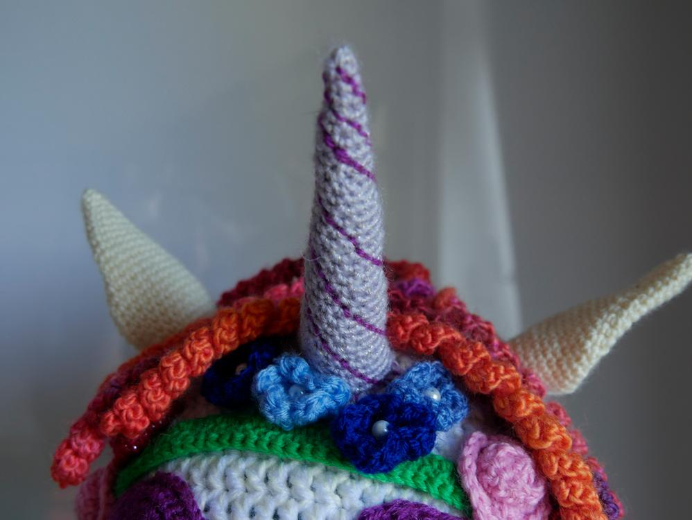

Die Öhrchen sind angelehnt an die von meinem [Häkeldrachen](/2014/07/amigurumi-hakeldrache/). 

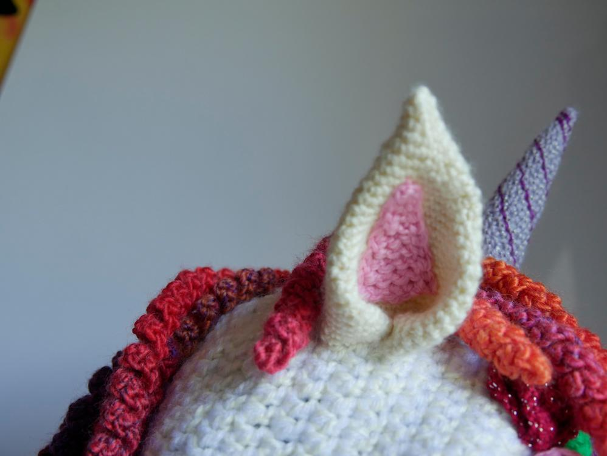

Die Locken für die Mähne haben mir besonders viel Spaß gemacht, einfach eine Luftmaschenkette häkeln und dann in jede Masche 3 Stäbchen arbeiten. Ich hatte da noch die ideale Wolle herumliegen. Wenn man den Kopf schüttelt fliegt dei Mähne richtig.

 

Da kann man sich schon fast auf den nächsten Winter freuen. 

Bleibt kreativ! Grüße von eurer Ermeline!!!
