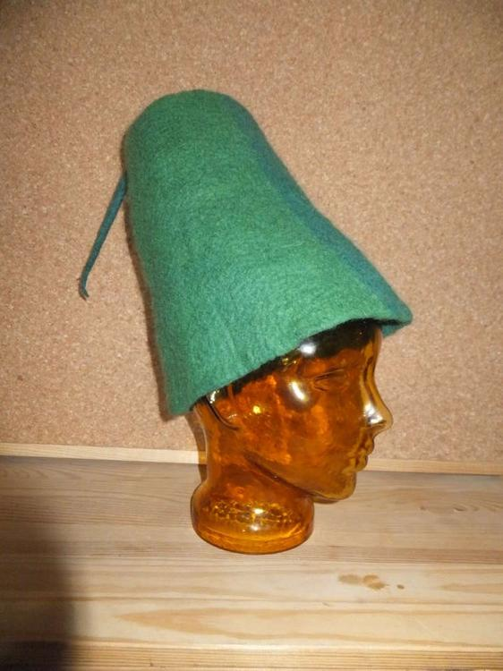
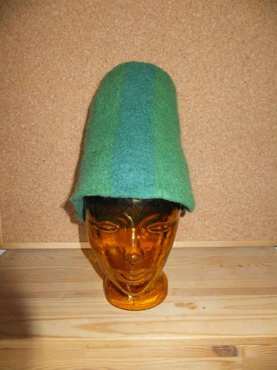
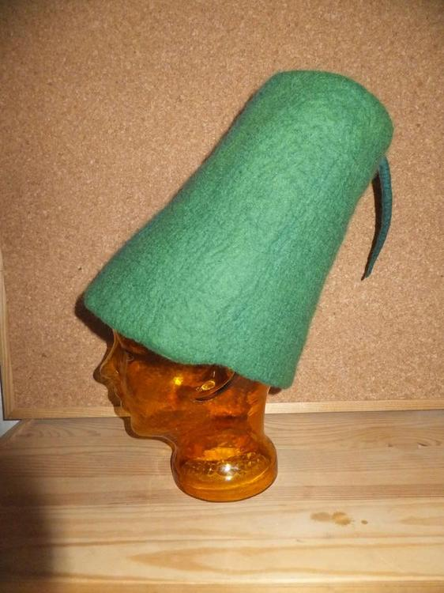
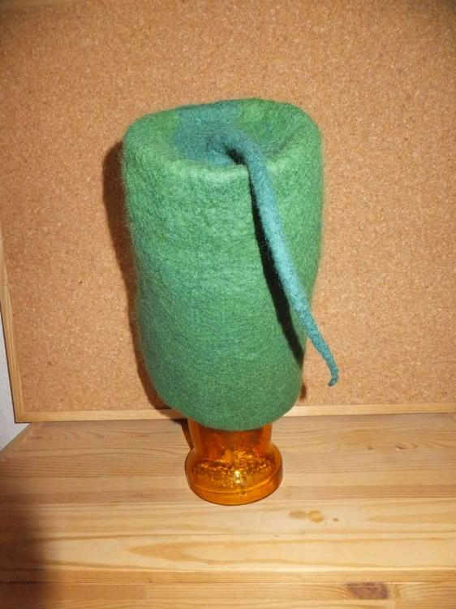

Dieser an einen Fez angelehnte Hut, darf nun den Charakter eines Flaschengeistes visuell bereichern. Er ist so stark gewalkt, dass er von alleine steht wie eine Eins. Hierfür sind etwa 150 Gramm Merinowolle aus dem Kammzug draufgegangen, also eher ein leichter Vertreter meiner Hutkinder.
