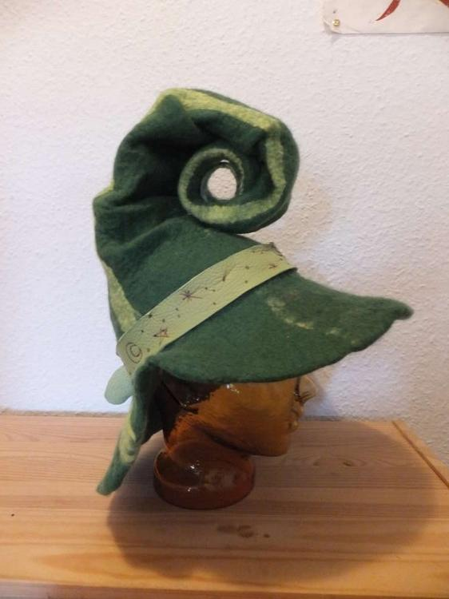
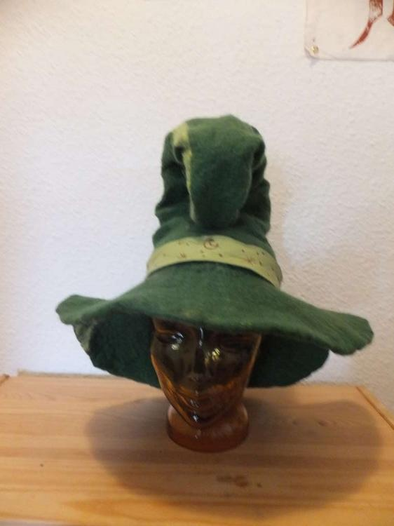
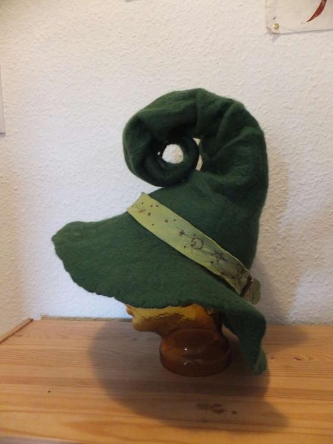
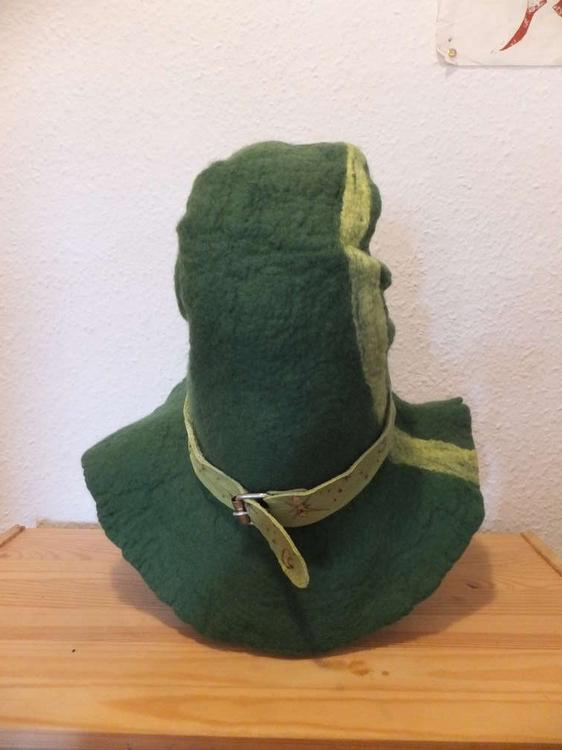

Diesmal ist es ein grünes Zwirbelchen geworden. Dieser Hut ist mit meiner großen [Spitzhutvorlage](http://flauschiversum.de/2014/07/ermelines-neuer-hexenhut/) von einem Meter gefilzt worden. Der Zwirbel ist an einer Stelle fixiert, damit er auch größeren Belastungen stand hält und das Hutband besteht aus einem frühlingsgrünen Lederstreifen, der mit dem Holzbrenner noch ein Paar Sterne und Monde verpasst bekommen hat.
