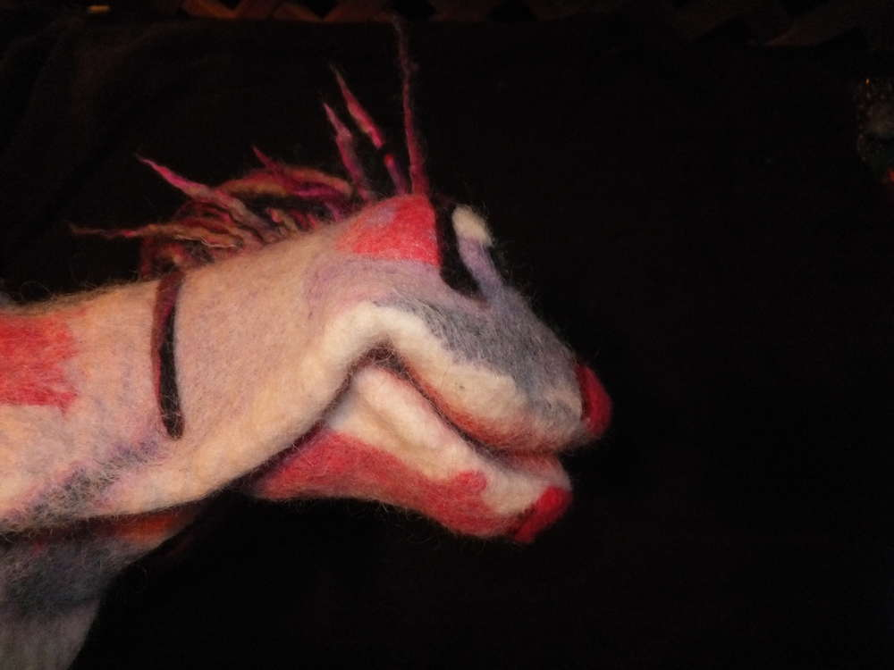
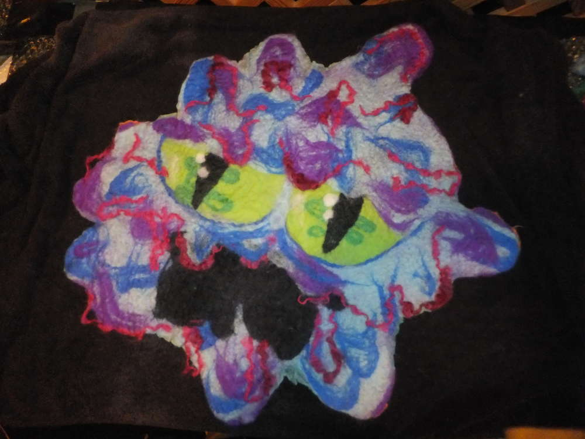
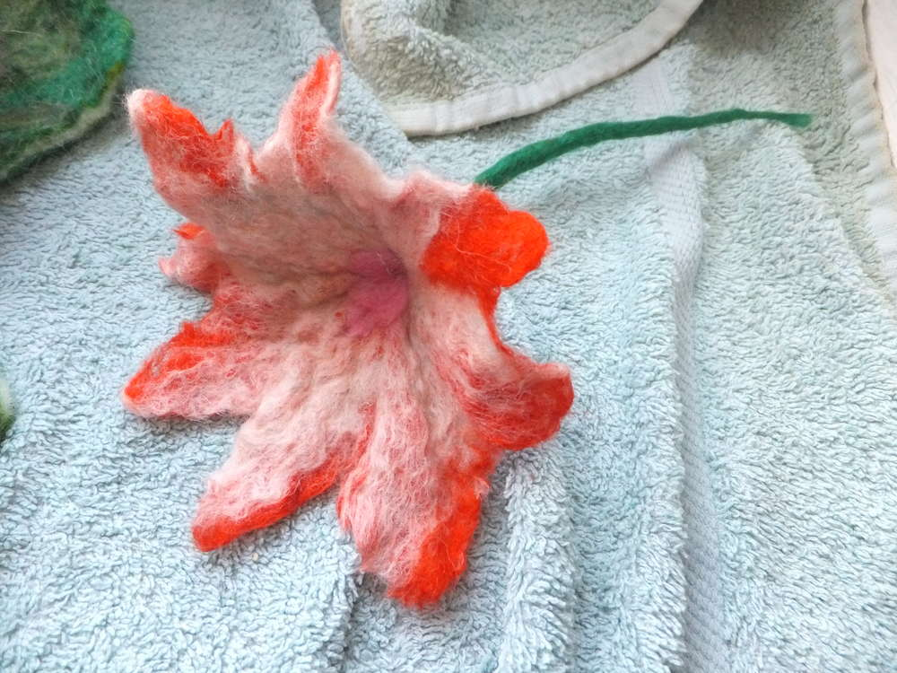
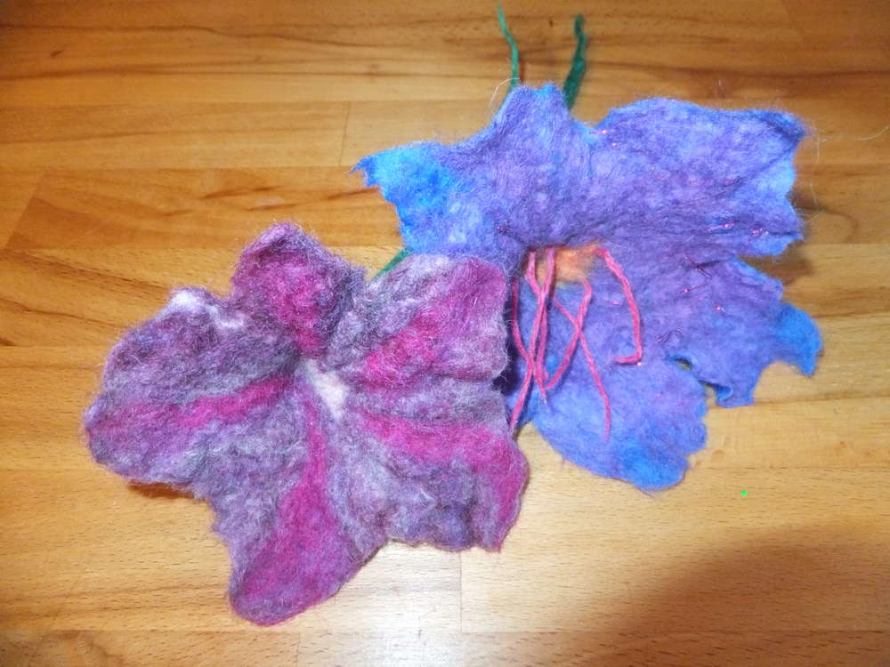
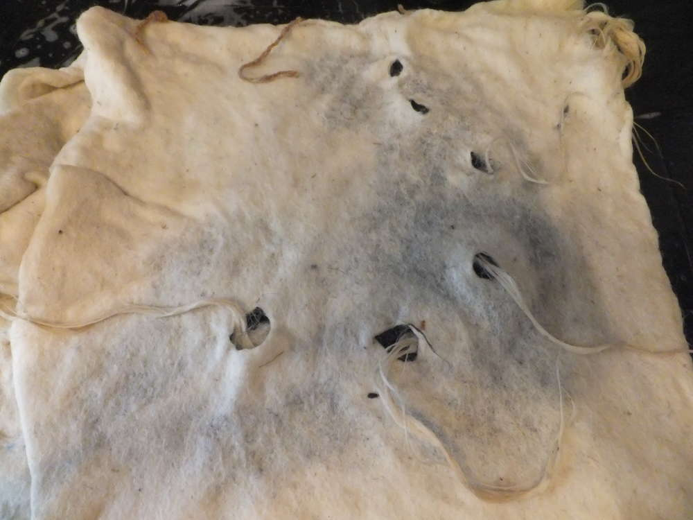
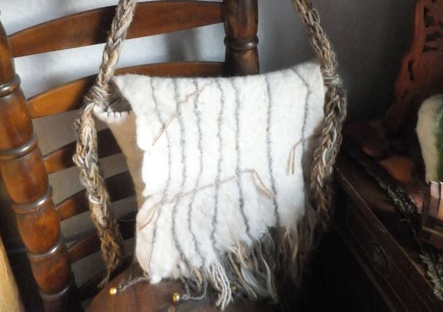

Einige Tage des Filz-Kreativismus liegen hinter mir. Meine Hände sind schrumplig, der Wollvorrat hat sich stark reduziert und ich bin über die Ergebnisse glücklich. Endlich hat sich auch mal eine gemeinsame Filzsession mit Lucy ergeben, die mit der genialen Idee eine Seerose filzen zu wollen ein Lauffeuer entfacht hat. Entstanden innerhalb der letzten sieben Tage sind:

eine Handpuppe Namens "Susette" (die nicht anders aussehen könnte als sie es sollte - ein rosa Einhorn kommt selbst mit viel Phantasie nicht hin, da hat einiges spontan nicht gepasst.)

zwei Seerosen mit Blatt (rechts von Lucy; links von mir) 

zwei Sitzkissen (die trotz der ähnlichen Materialien kaum verschiedener sein könnten) hier ist das Kissen von Lucy

hier mein Kissen, mal wieder ein [Schleimmonster](/2015/02/kuschelmonster/).

drei kleine Blumen 

zwei große Rosen

ein Blumenhut 

ein Paar Stulpen

eine Tasche Ich bin selber total geplättet, was alles so im Filzrausch entsteht. Und ich bin noch nicht mal fertig mit der Filzaktion, mir schweben noch allerhand Dinge im Kopf herum und zum Glück sind ja jetzt Ferien. Habe dennoch den Tapeziertisch aus dem kleinen Wohnzimmer abgebaut und werde nun auf kleinere Projekte umsteigen bzw. ein großes wird es hoffentlich in den Ferien noch geben, wenn gutes Wetter ist. Ich sag mal soviel, es soll was zum Anziehen sein und es wird so viel Platz beim Filzen beanspruchen, dass ich dafür auf den Hinterhof ausweichen muss. Für heute wird erst mal gestrickt und mal schauen was der Zauberkasten heute so zeigt.
