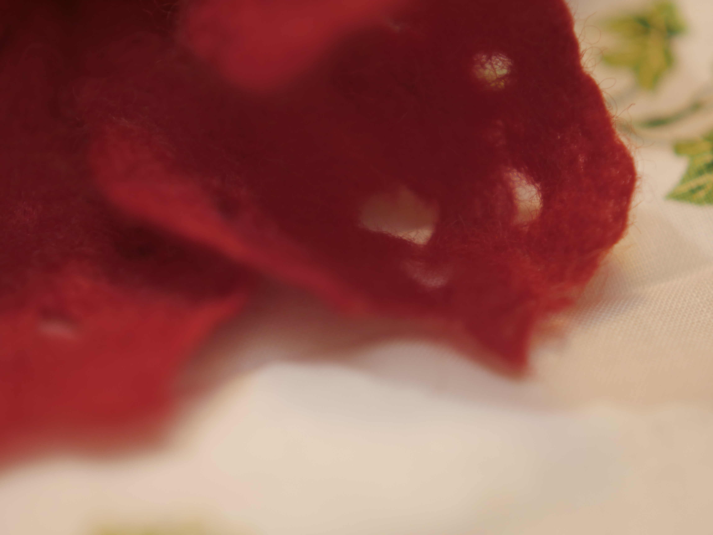

Ein Frühlingsbasar an der Grundschule steht an - was passt da besser als farbenfrohe Filzblumen aus Kinderhand? An zwei Terminen sind so einige Blümchen mit den Kindern entstanden und in einer Wochenendsitzung am gestrigen Samstag mit meiner Teampartnerin und einer Freundin sind noch ein paar weitere Blüten produziert worden.

Nebst Chaos auf dem Tisch, waren die Katzen natürlich mit von der Partie. Während Shubia mal wieder in der Wolle döste, zerpflückte Jemima unter dem Tisch einen heruntergefallenen Fussel. 

Mehr als dreißig Blüten verschiedenster Art freuen sich nun hoffentlich, am Dienstag neue Besitzer zu finden. Von Petunie über Calla bis Glockenblume ist alles mit dabei auch was das Fanatsiespektrum anbelangt wurde in die Vollen gegangen. Die größte Herausforderung ist es nun noch für die Kinder sich von ihren Blumen zu trennen und sie nicht selbst weg zu kaufen. 

Tolle Strukturen und liebevolle Details runden das Ganze ab.

Auch ich habe mich noch ein wenig ausgetobt, das Finale bildete eine Regenbogen-Blüte, die mich mehr Zeit als erwartet gekostet hat. Diese werde ich nicht verkaufen - Egoistin ich - Pfui!!

Um 11:00 Uhr angefangen ist um 22:00 Uhr alles endlich wieder aufgeräumt und die Blumen liegen zum Trocknen auf der Heizung.

Aber die Arbeit hat sich gelohnt, bin nun sehr gespannt auf den Basar.

