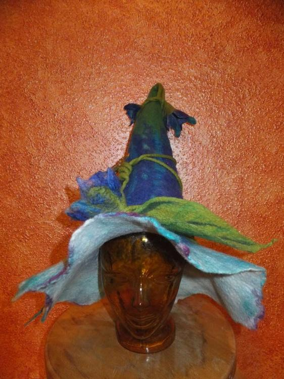
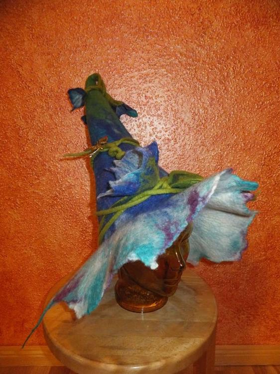

Irgendwie habe ich einen Narren an Spitzhüten gefressen. Ich wollte nämlich auch schon immer mal einen Hut haben der aussieht wie eine Glockenblume... ich finde das Projekt ist geglückt. Eine Anleitung zur Fertigung meiner Hüte findest du im Post [(F)Lauschangriff](http://flauschiversum.de/2014/04/flauschangriff/).
