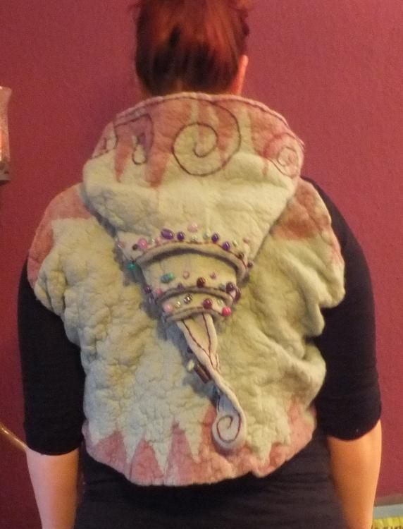
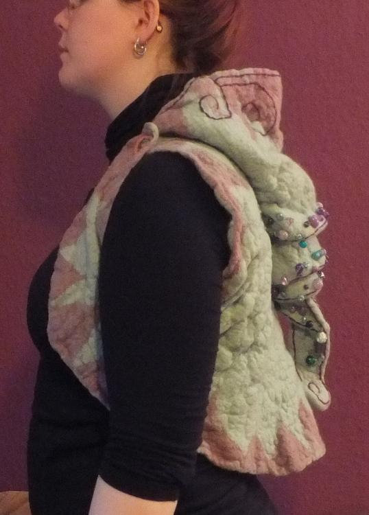
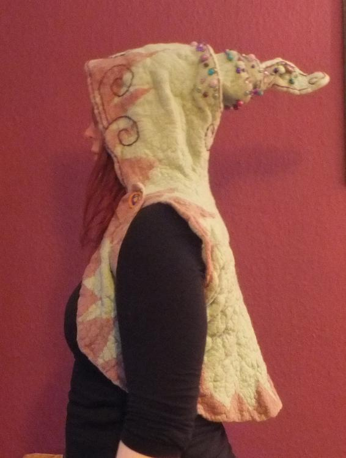
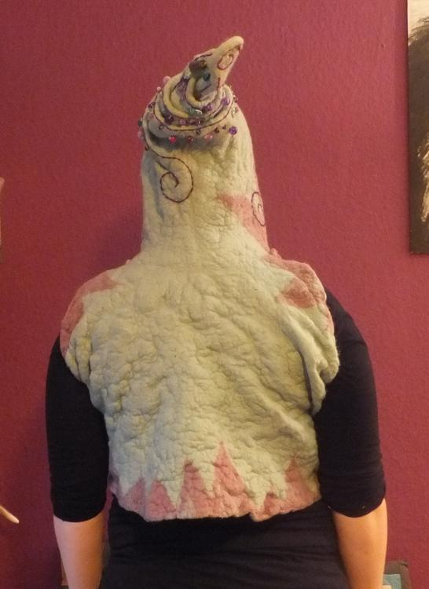
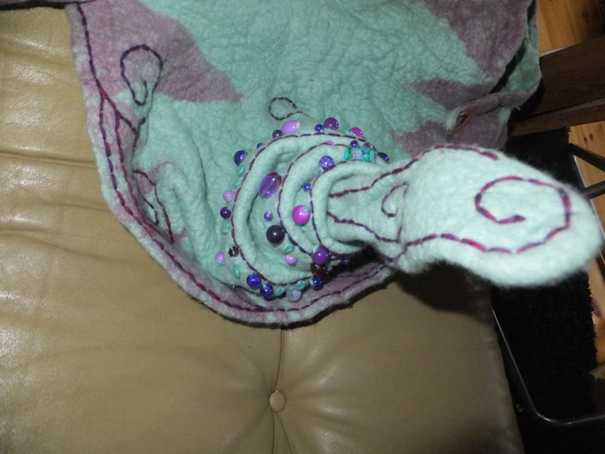
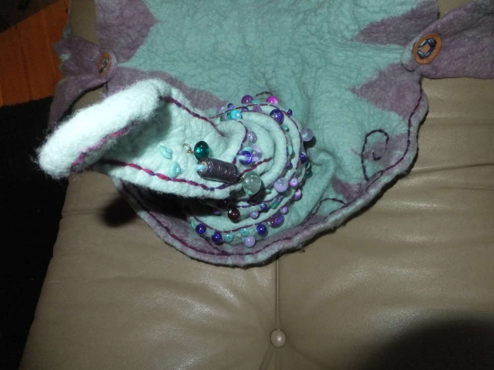
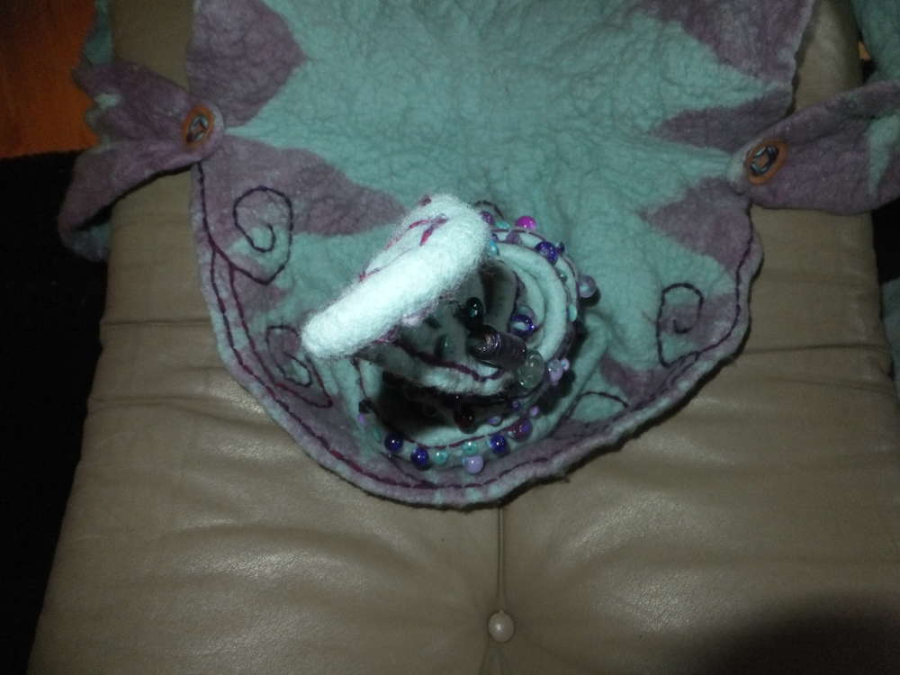
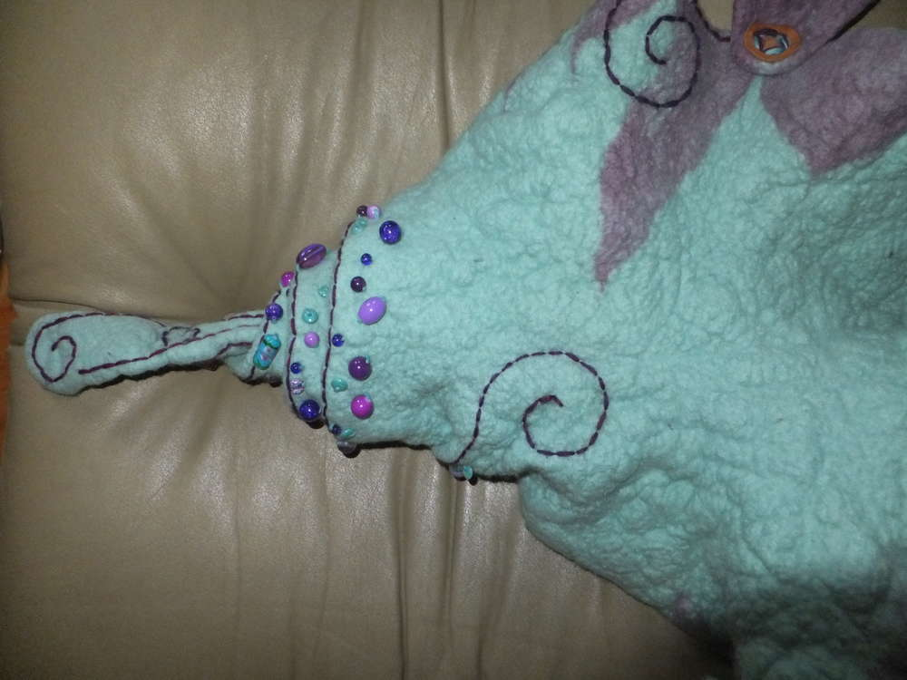
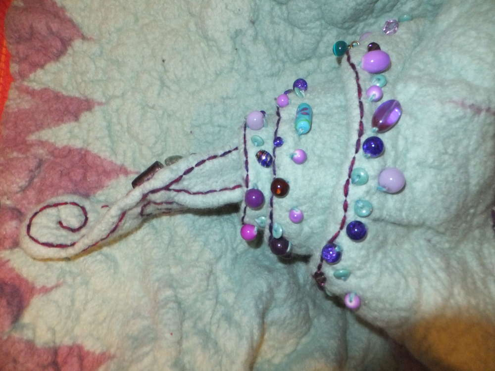
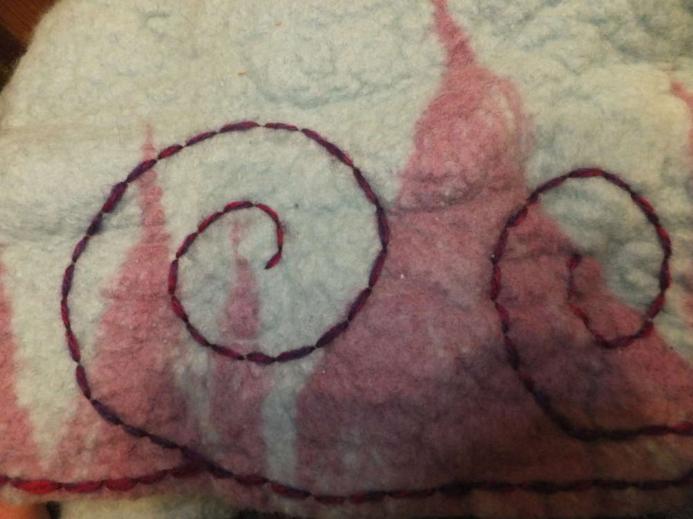

Lange lange lag dieses Projekt herum, noch vor meinem Umzug wurde dieses Ding angefilzt, unfertig und farblich nicht mehr meiner Stimmung entsprechend, für über ein Jahr auf Eis gelegt und fast vergessen. Ursprünglich angedacht war es, dass ich mir eine Gugel filze, leider schrumpfte sie unter meinen Händen nicht schnell genug und ich hatte mich tatsächlich übernommen, so war das Ding nur angefilzt und trocknete allmählich, sodass ich es dann zunächst mal in eine Plastiktüte verbannte und in meinem Frust vergaß. Nur so nebenbei, dies ist der denkbar unwürdigste Weg ein Filzwerk zu behandeln. Ich hatte es einfach trocknen lassen mit all der Seife, die noch enthalten war. Glücklicherweise hat sich mein schlecht behandeltes Werk nicht gerächt, die Wolle stank nicht, sie war nicht verklebt oder spröde... mein Glück.

Als ich dann letztens so vor mich hin lernte und dennoch den Drang verspürte etwas Sinnvolles zu tun (an dieser Stelle darf gelacht werden), erinnerte ich mich des unfertigen Werkes und beschloss (um nicht noch einmal Frust aufkommen zu lassen) den Vorfilz in die Waschmaschine zu stopfen. Ich habe also das Innenleben mithilfe eines Fliegengitters vor dem Zusammenfilzen geschützt und den Vorfilz in einen Kissenbezug gesteckt, dann noch ein paar andere Sachen zum Waschen reingestopft (aber nicht zu viel) und los ging es mit nur der Hälfte (erinnere: es war noch die ganze Seife drin) der normalen Waschmitteldosis im Normalwaschgang. Da die Gugel eh zu groß war, konnte es nicht schaden dem Ganzen die volle Filzdröhnung zu geben.

Naja als die Wäsche fertig war, stand ich nun da und probierte das Werk an... Es sah mehr aus wie eine Zipfelmütze mit nem komischen Supermancape hintendran. Enttäuschung groß... Was jetzt? Aber ich wäre nicht die Ermeline, wenn ich ein komisches Projekt aufgeben würde. Nachdem ich erst einmal ein wenig daran herumgezogen habe und dabei nebenbei, um die Zipfel zu begradigen, diese unter den Achseln nach vorne zog, war die Begeisterung groß. Das sollte eine Weste sein! Also ich war mehr als zufrieden mit diesem Endergebnis.

Na und diese Fotos zeigen nun das (vielleicht) endgültige Werk mit diverser Stickerei und Perlenbesatz aus meinem Fundus. Die viiiiel zu lange Kapuze habe ich wie eine Schnecke eingedreht und dann noch mit Ziernähten versehen, die sich über die Kapuze verteilen. Obwohl mir die Weste so sehr gut gefällt, denke ich mir, wenn ich eine tolle Idee haben sollte, was ich noch auf den Rücken sticken könnte, werde ich mich daran auch noch austoben. Ich habe sogar schon neue verrückte Ideen, was ich für Westen machen kann, also wenn die nächsten was werden, gibt es auch die Filzvorlage.
