Die Filzsaison ist eröffnet und wie hätte ich sie besser starten können, als gemeinsam mit Tomcat. Lange wollte ich mal wieder etwas filzen, da kam er mit seiner Idee einer Katzenhöhle für seine beiden Flauschis James und Arthos wie gerufen. Eine Skizze sollte Aufschluss über das Design geben. Der Film 'Nightmare before Christmas' von Tim Burton hat hier inspieriert.

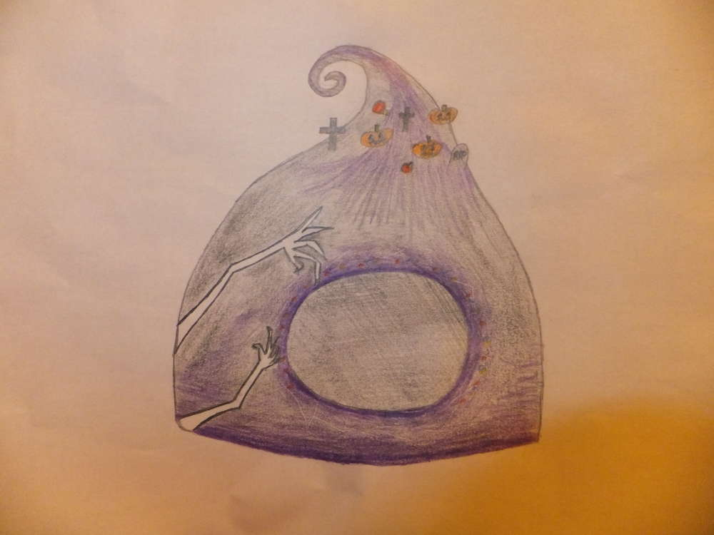

Also wird alles für das Filztreffen vorbereitet und die Wolle gekauft.

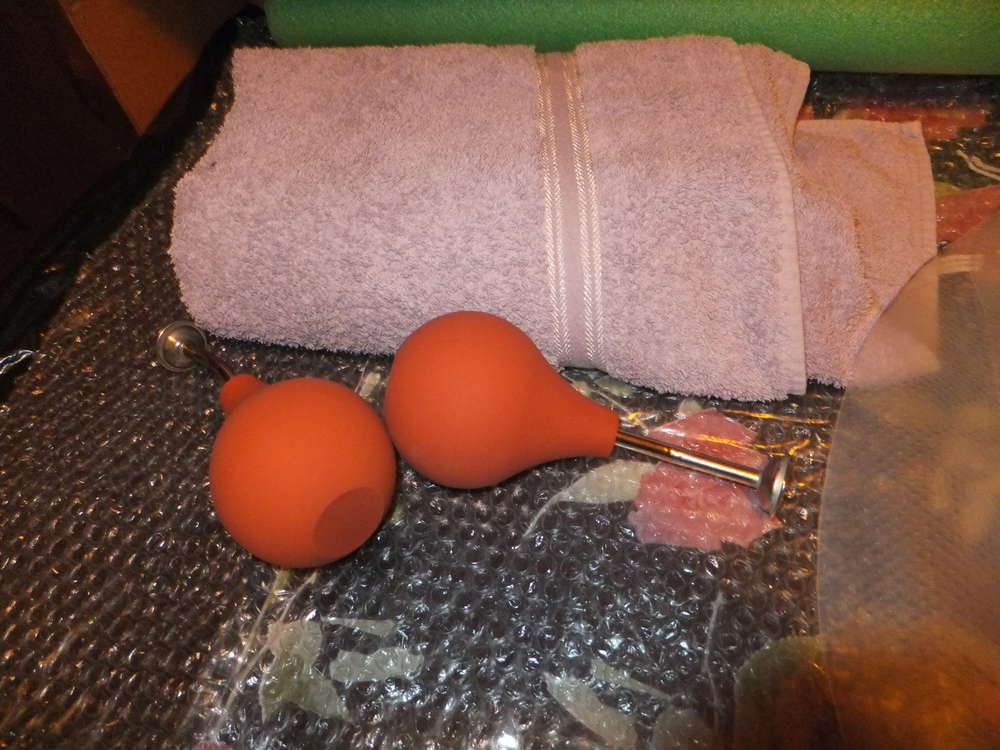

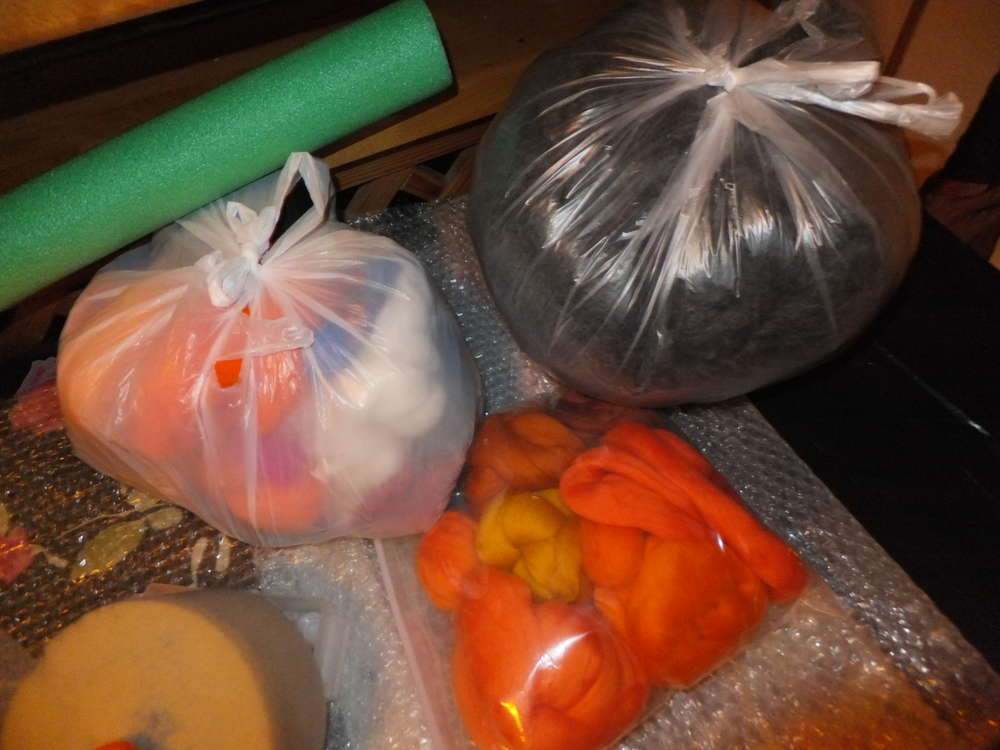

Wo wir hinwollen ist uns klar, doch so richtig zu sehen ist das noch nicht, da muss ich Tomcat noch überzeugen.
Also legen wir unsere Wollschichten um die Form und legen los. 

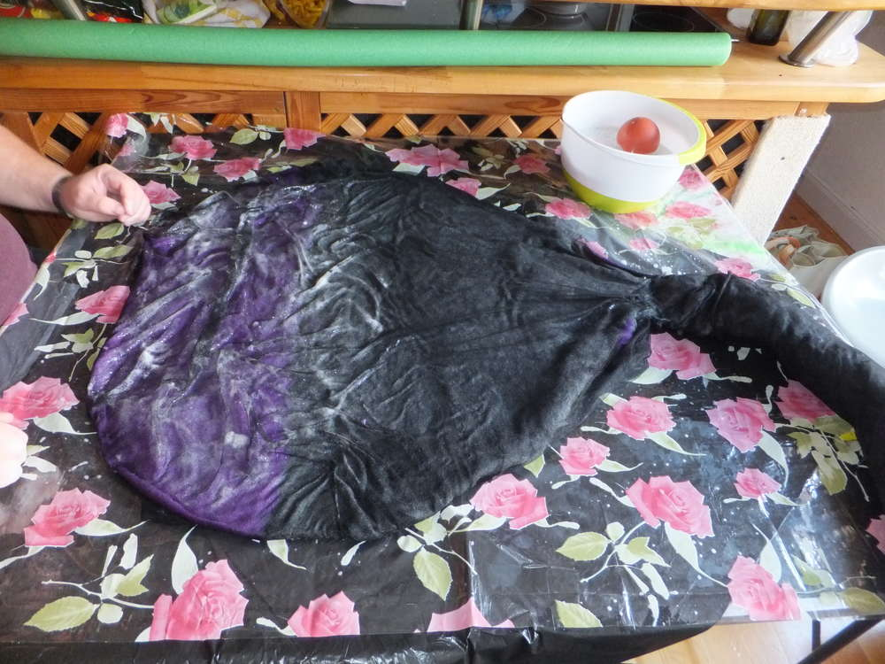

Und wo Kreative am Werk sind, sind Neider nicht weit... in diesem Fall leisten Jemima und Shubia ebenfalls einen kleinen Beitrag.

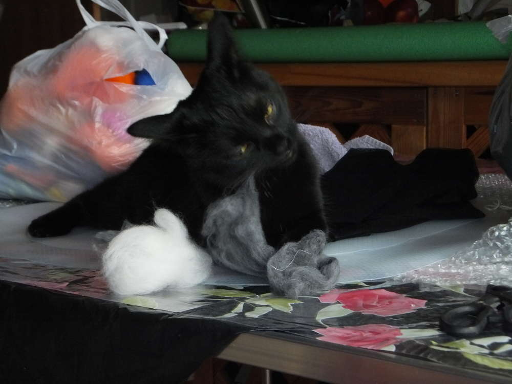
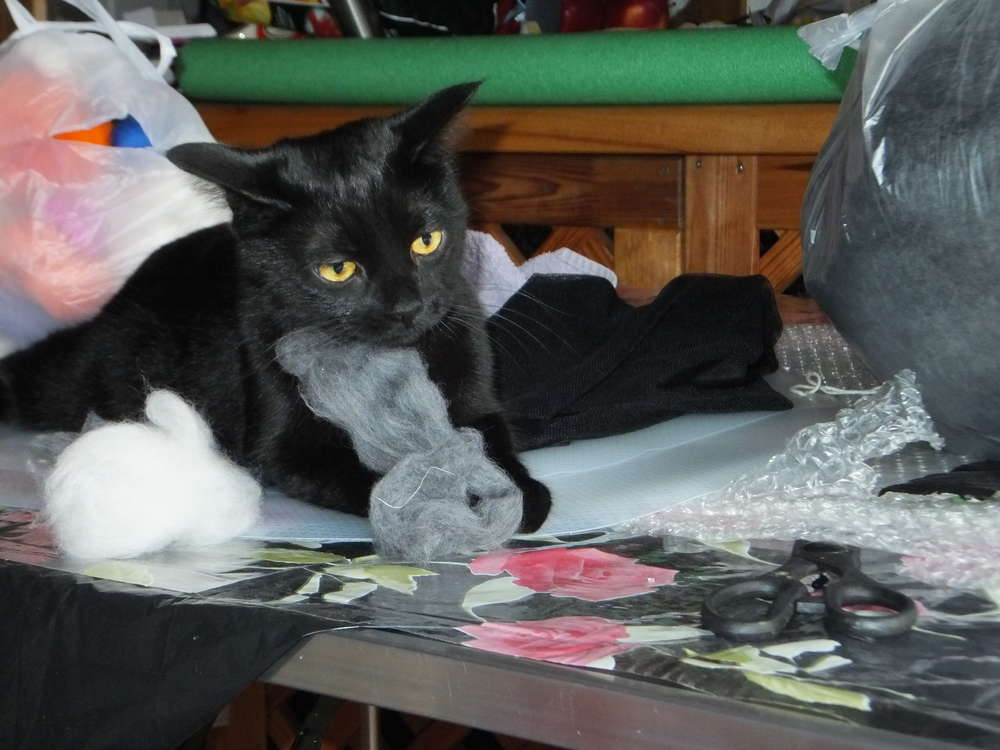
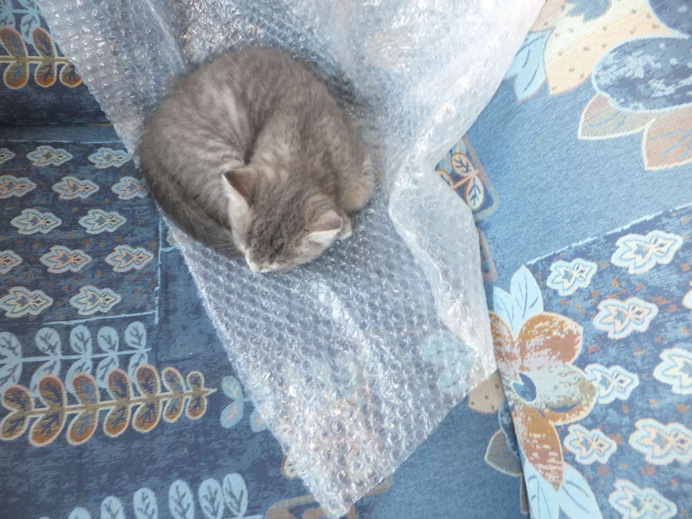

Doch nach einiger Arbeit ist das Projekt dem Ziel schon sehr nahe.

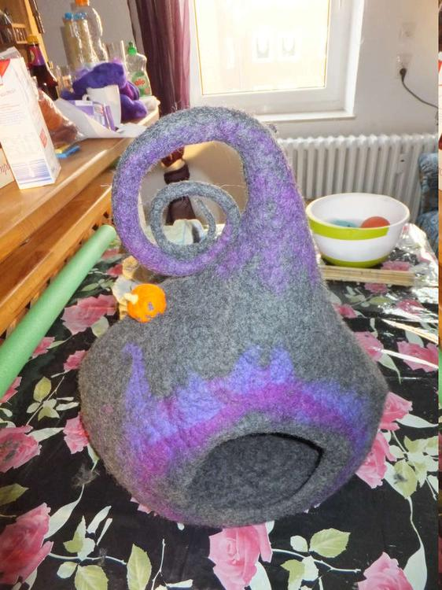

Nachdem die Höhle erstmal fertig ist, wollen wir die kleinen Kürbisse und Grabsteine mit der Nadel filzen. Das klappt schon ganz gut. Erst die Bällchen, dann der Stiel, die Furchen und das Gesicht, Tomcat hat sich auch noch an Blatt und Zwirbel als Kürbiszier gemacht.

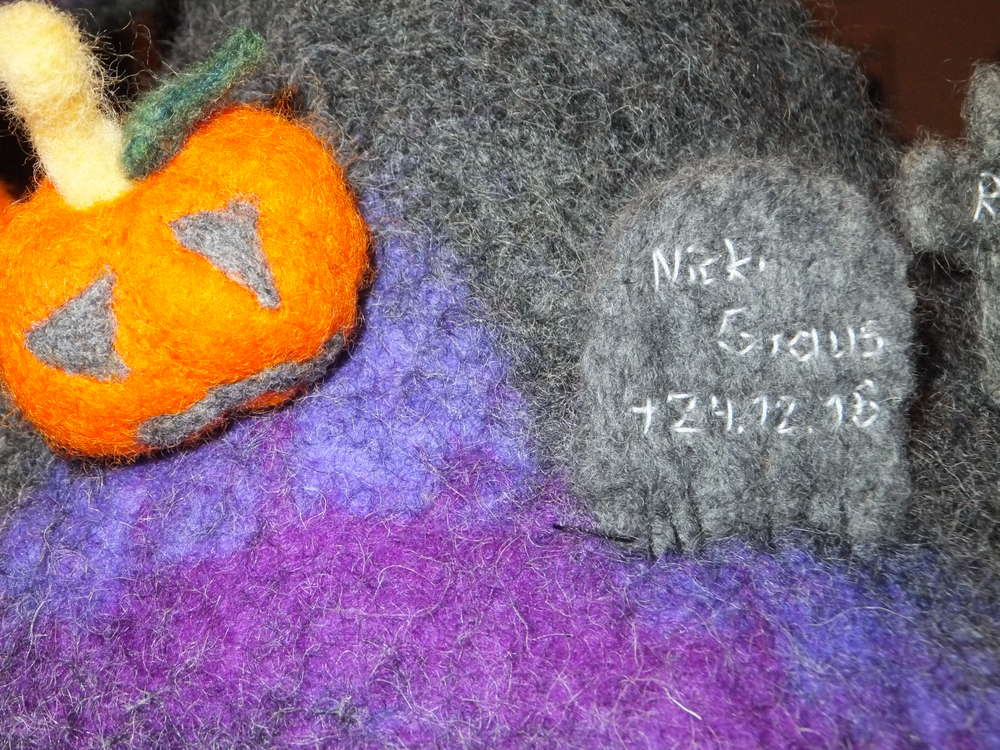
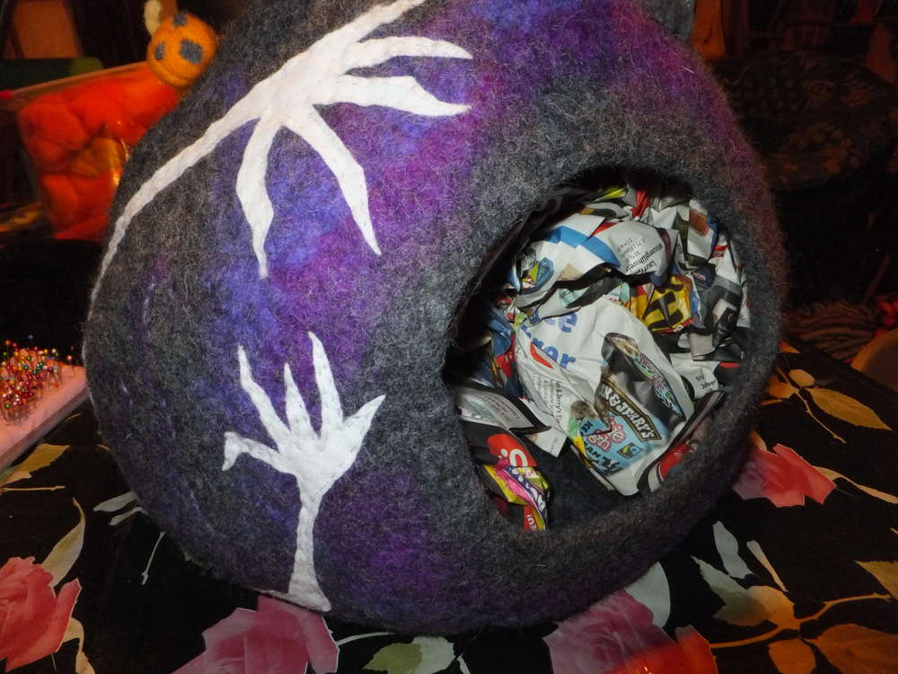

Die Geisterhände, hat Tomcat aus weißem dünnem Filz ausgeschnitten, das Aufnähen habe ich dann wieder übernommen.
Angefangen haben wir mit diesem Projekt um 13:00 Uhr das Ende war erst nach 21:00 Uhr, dafür aber auch mit allen Details und äußerster Zufriedenheit. Jetzt muss alles nur noch trocknen, dann kann eingezogen werden. Scherze über undankbare Katzen die ins Tierheim kommen, wenn sie die Höhle nicht benutzen, sind nicht ernst zu nehmen.

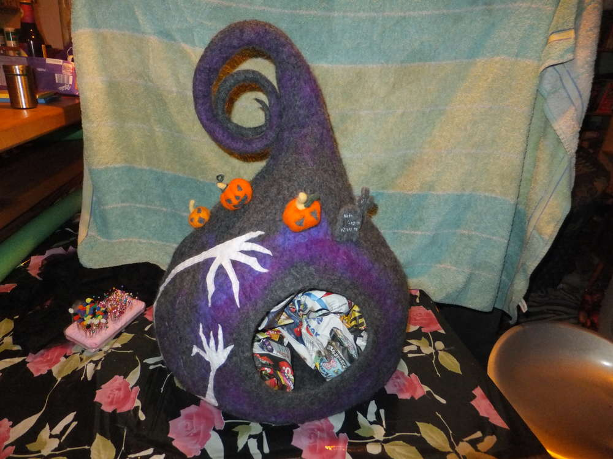

Alles trocken, jetzt wird das Ding mal unter die Lupe genommen.

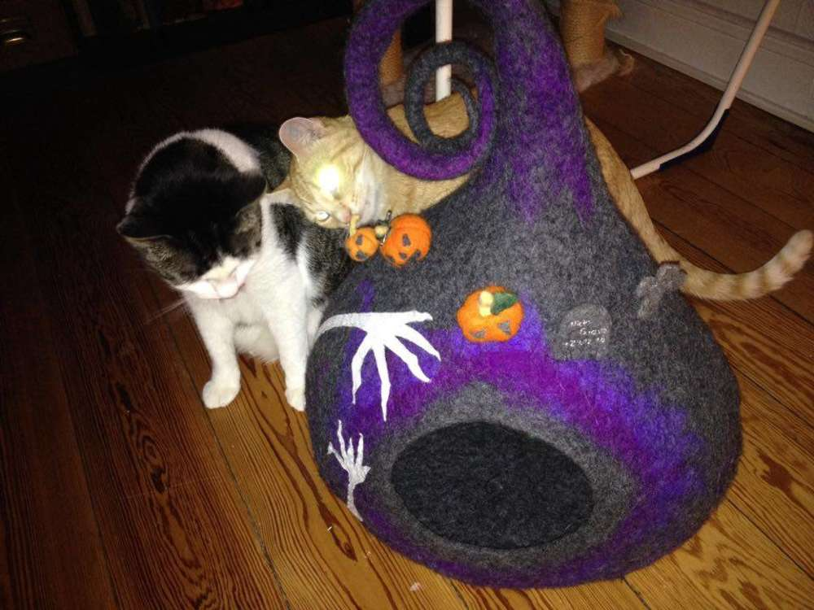

Und dann zieht Arthos ein. 

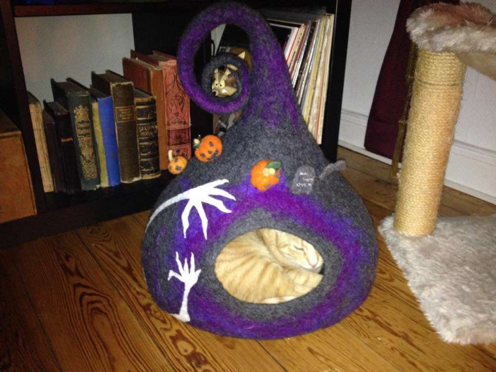

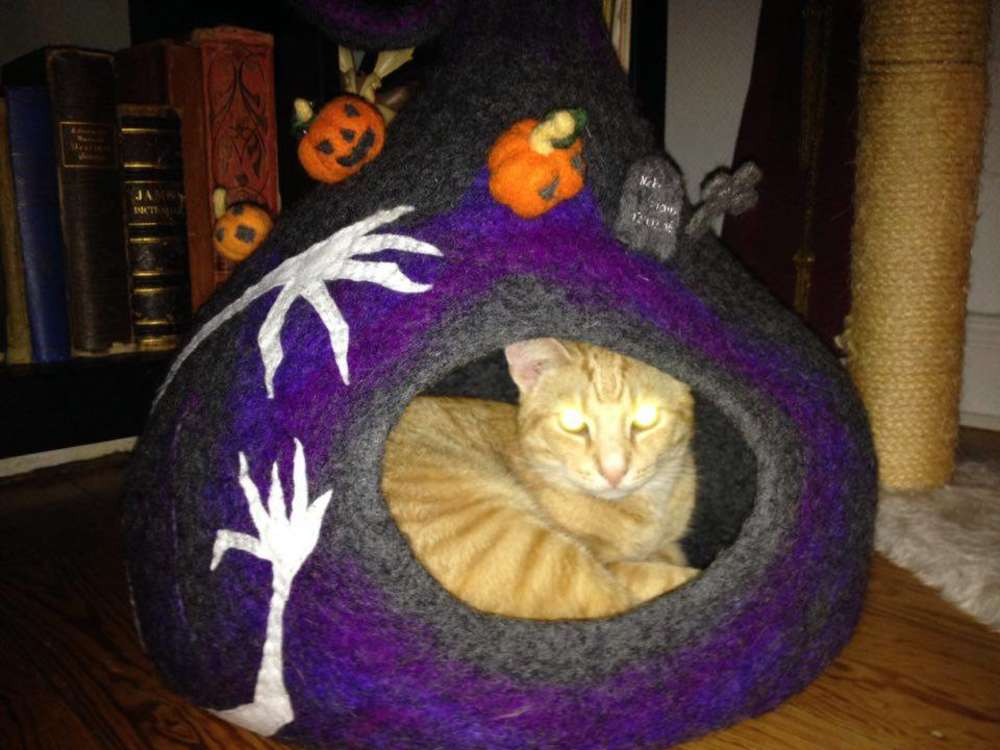

Wie schön, dass sich unsere Arbeit gelohnt hat, nicht nur die Flauschis sondern auch die Dosenöffner sind glücklich. Bei diesen Temperaturen hätte ich manchmal auch gerne eine kleine Kuschelhöhle... Einen schönen Sonntag wünschen Euch Tomcat und Ermeline.
