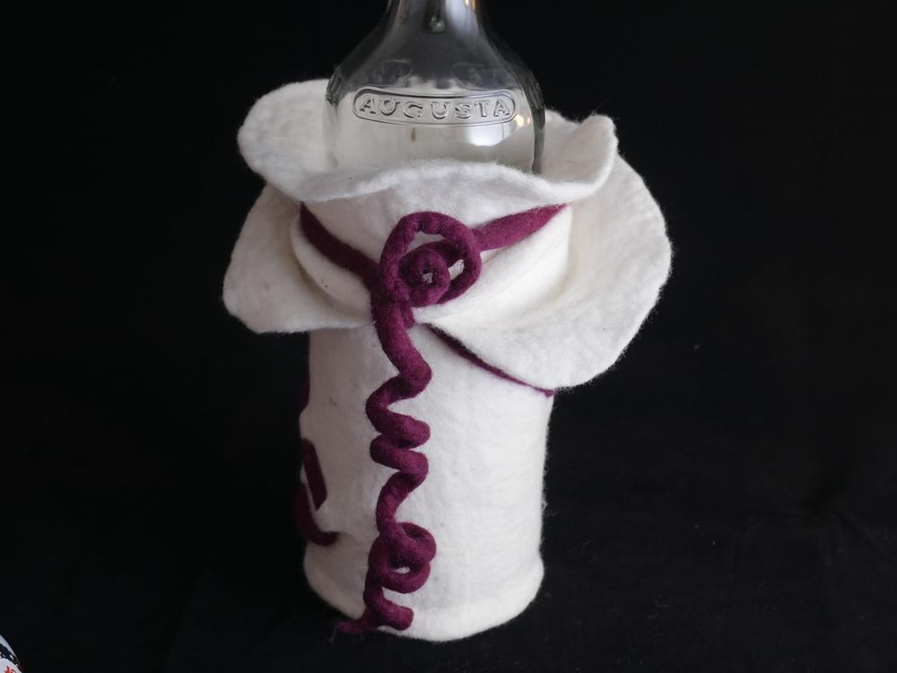
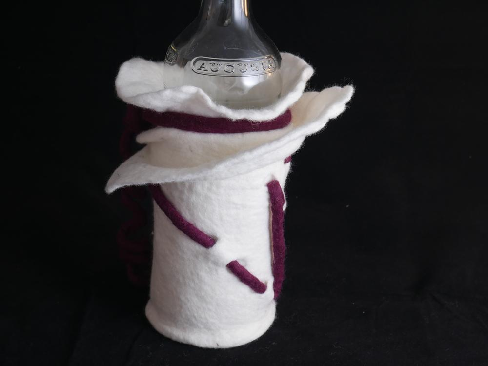
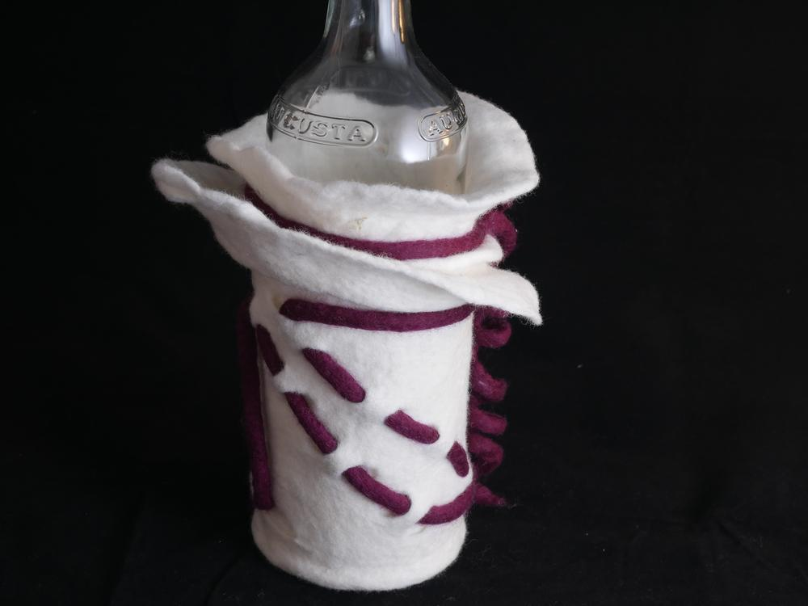
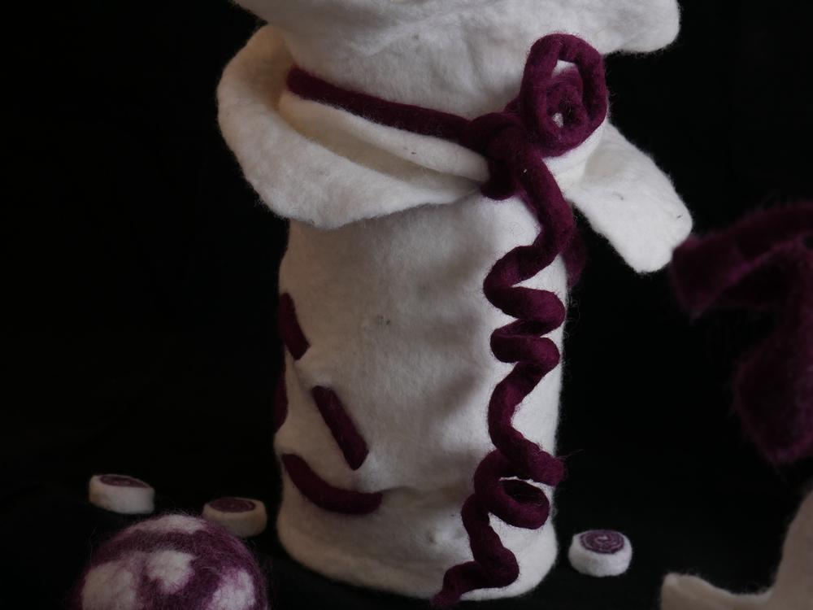
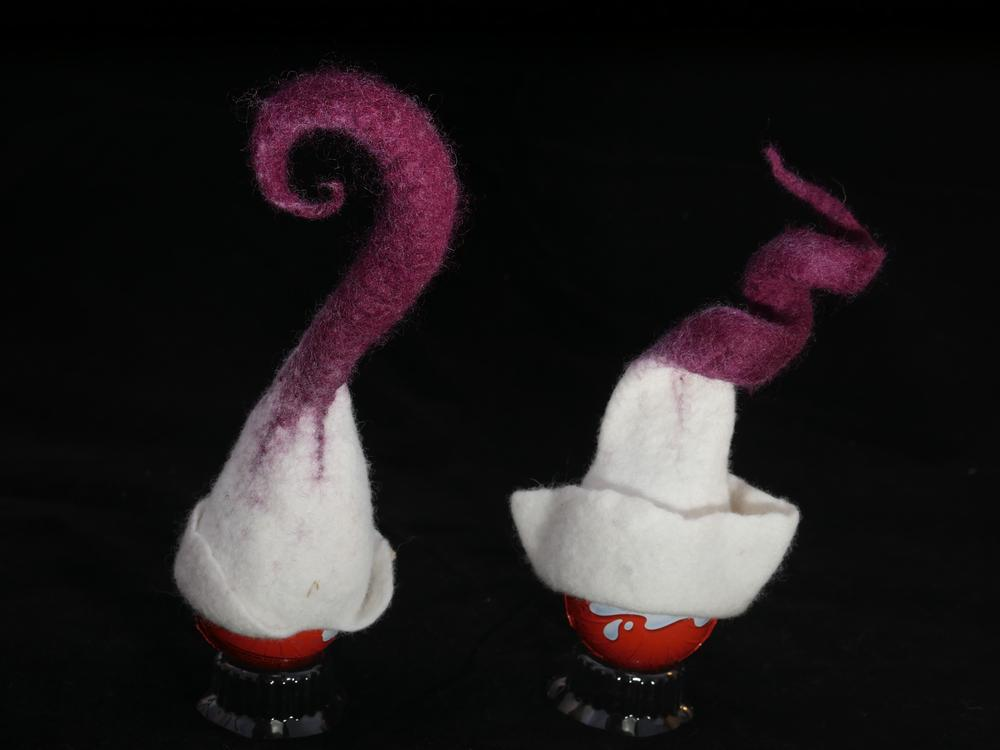
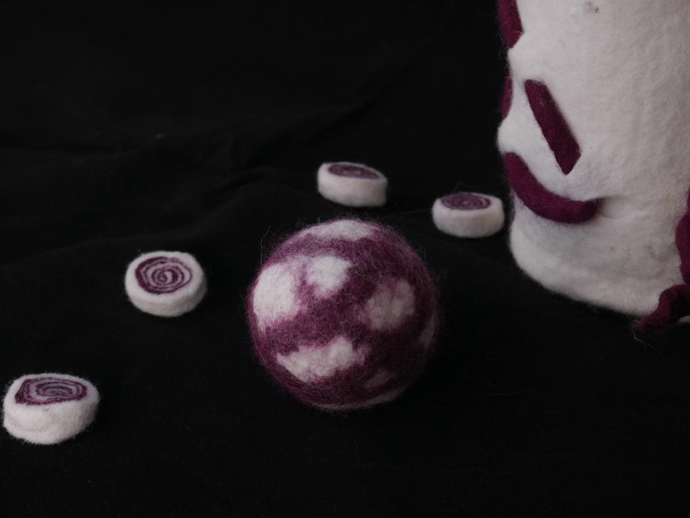

Österlich ist's auch im Flauschiversum gewesen. Da setzt man sich auch mal hin um Ostergeschenke mit Kollegen zu filzen und die Ermeline probiert dann allerhand aus. Entstanden sind zwei Eierwärmer, eine Schale, eine Flaschenhülle und diverse "Bonbons". 

Schon des öfteren ist es passiert, das ich eine Vorstellung hatte und leider nicht in der Lage war sie umzusetzen. So auch geschehen bei der Flaschenhülle, eigentlich hatte ich vor Stulpen zu filzen, habe aber das Vlies unterschätzt, es war für Stulpen zu dick und wurde ziemlich schnell zu unflexibel. Die Flasche meiner Kollegin stand da sehr inspirierend herum und so kam eines zum anderen. Etwas was ich so nie gefilzt hätte ist entstanden und als Vase oder Ähnliches sieht das doch ganz nett aus.

Die Schale ist mit einer runden Hohlform gefilzt, dafür war das Wollvlies ideal, denn so ist die Schale schön stabil. 

Die beiden Eierwärmer entstanden eigentlich mehr aus Verlegenheit. Meißt ist sowas ein Einsteigerprojekt, weil kaum etwas schief gehen kann und schnell ein Ergebnis zu sehen ist. Während meine Hände etwas zu tun hatten, entschlüpften ihnen diese beiden lustigen Gesellen. 

Die Bonbons sind aus einer dicken Wollrolle entstanden, sie wurde aus dem Wollvlies und einer Schicht farbiger Wolle gefilzt und danach in Scheiben geschnitten. 

Aus Resten entstand dann noch dieses Bällchen.

Und an dieser Stelle kommt dann noch ein Dankeschön von der Person hinter Ermeline. Danke, an alle, die mit mir meinen Geburtstag gefeiert haben und mich auf so vielfältige Weise kreativ unterstützen, ich habe mich sehr gefreut viele alte und auch altbekannte Gesichter wiedergesehen zu haben, auch die lieben Glückwünsche die mich erreichten, haben sehr zu meiner Freude beigetragen. Eure Geschenke waren der Hammer, da gibt es jetzt schon viele Ideen.

In dem Sinne: auf ein weiteres Jahr voller kreativer Ergüsse, eure Ermeline.
