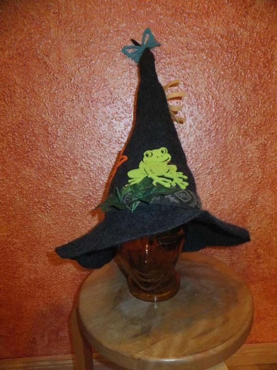
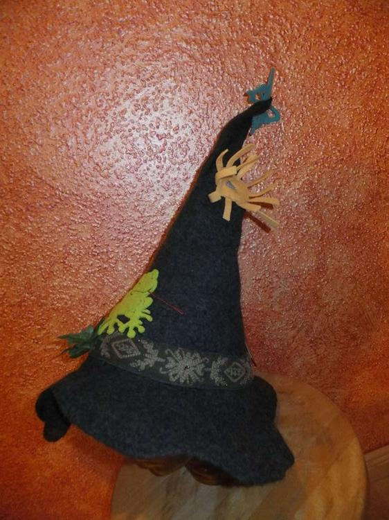
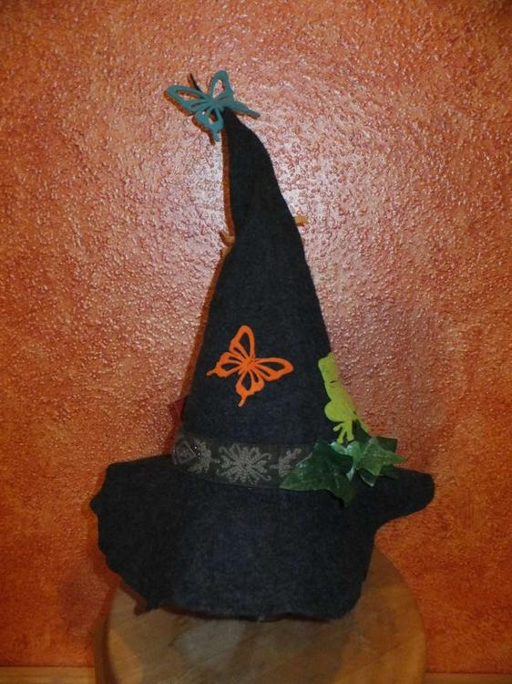
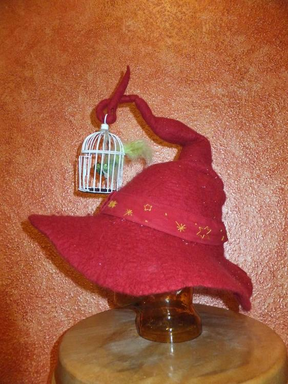
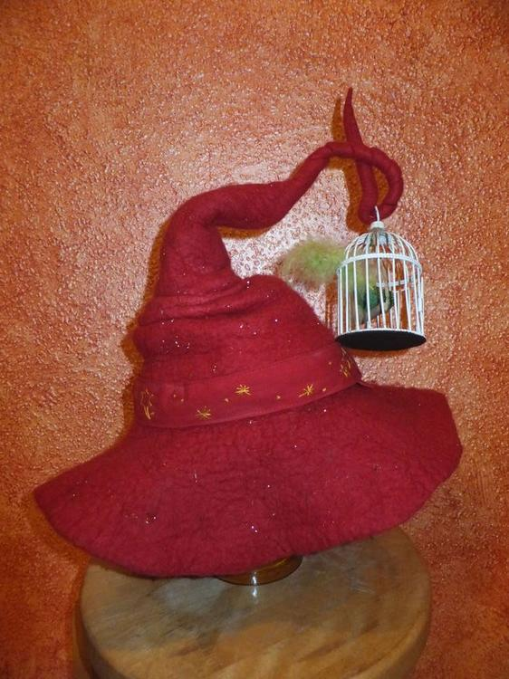
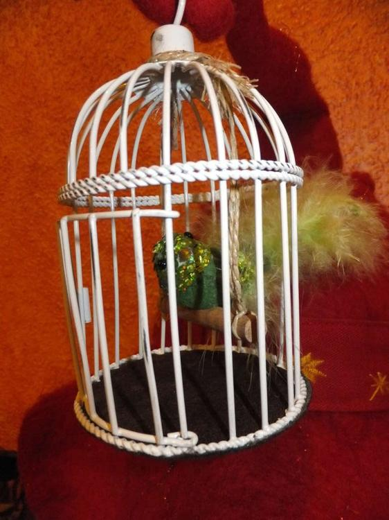

Tja, wo ein Hut was geworden ist, ist der zweite Hut nicht weit, jetzt wollte mein Freund für seinen Magier-Charakter auch einen haben... wer kennt die Scheibenwelt von Terry Pratchett? Er hat sich einen recht Rincewind-ähnlichen Charakter gebastelt und ein Magier ist nichts ohne seinen Hut. Das Resultat unserer vereinten Filzversuche war ein schlichter jedoch recht ansehnlicher Magierhut, welchen wir jedoch bald gegen Nr.3 ersetzt haben und nun noch als Oberhexenhut für die Walpurgisnacht nutzen.

Der dritte Hut ist ein Meisterstück, acht Lagen Merinowolle mit Glitzerfäden und einem eingenähten Drahtgestell um Form und Vogelkäfig zu halten. Ein wahrer Balanceakt aber das wird für die Blicke und Kommentare in Kauf genommen... oder was würdest du sagen, wenn dir ein Magier mit dem Hut begegnen würde?
