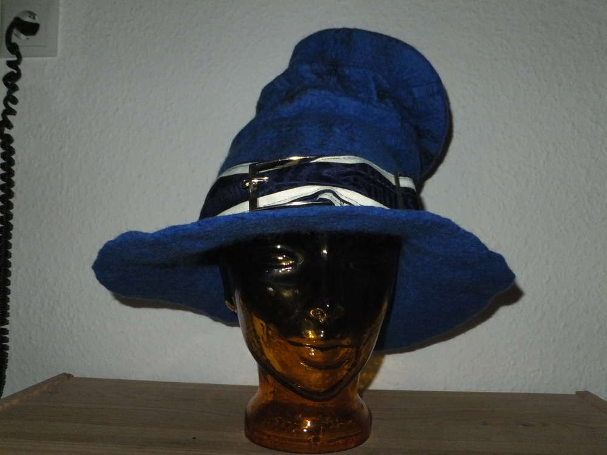

Diesmal sollte es kein Spitzhut sein. Aber die Alternative kann sich sehen lassen. Ein zerknautschter, blauer Zylinder ist absolut akzeptabel. Mit ein bisschen Hutstärke und Bügeleisenpower dürften die Falten viel Action standhalten. Das Hutband ist aus einem Stück Stoff genäht, welches auch an der zum Magier gehörigen Gewandung zu finden ist, daher rundet der Hut das Outfit perfekt ab und hat seinen ersten Auftritt auf der diesjährigen Mythodea. Ich hab das Gefühl "Behüterin" ist ein treffender Begriff für mich.
