Es war einmal... ... ein Freund und der wollte (wie könnte es anders sein...) einen Hut. Und wie man den Hut macht, kann im Folgenden begutachtet werden.  

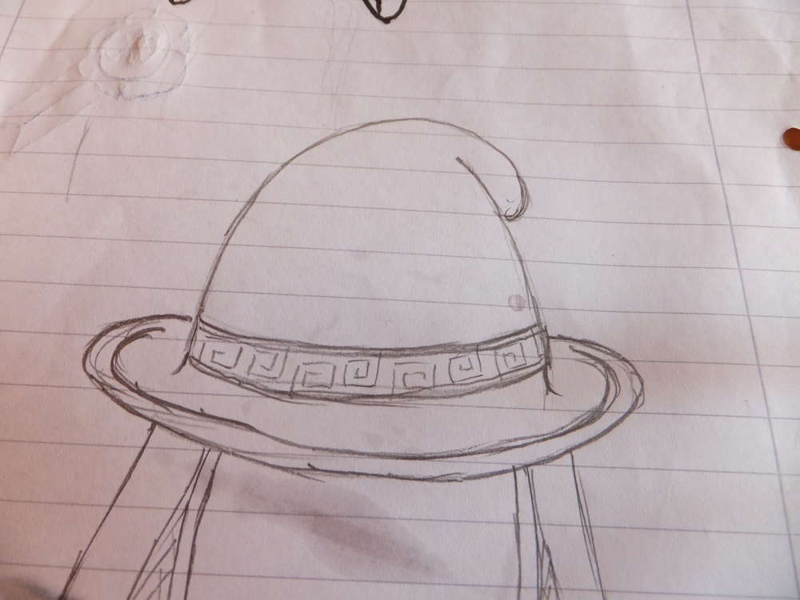
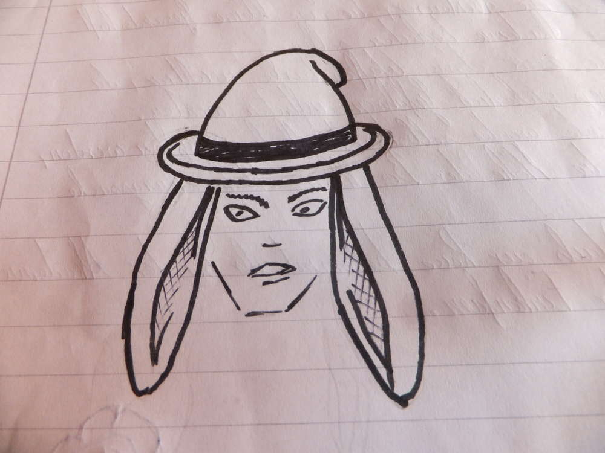
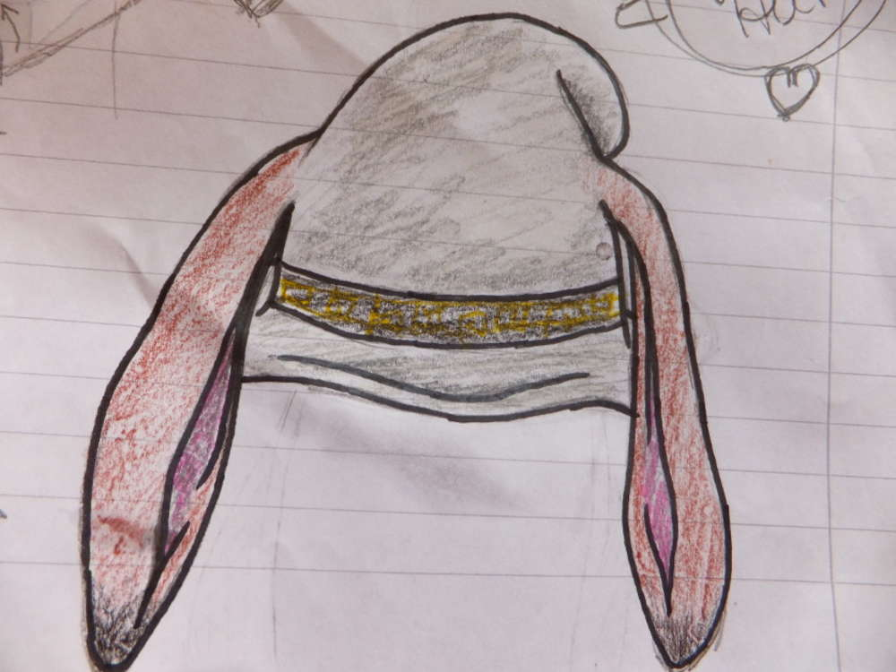
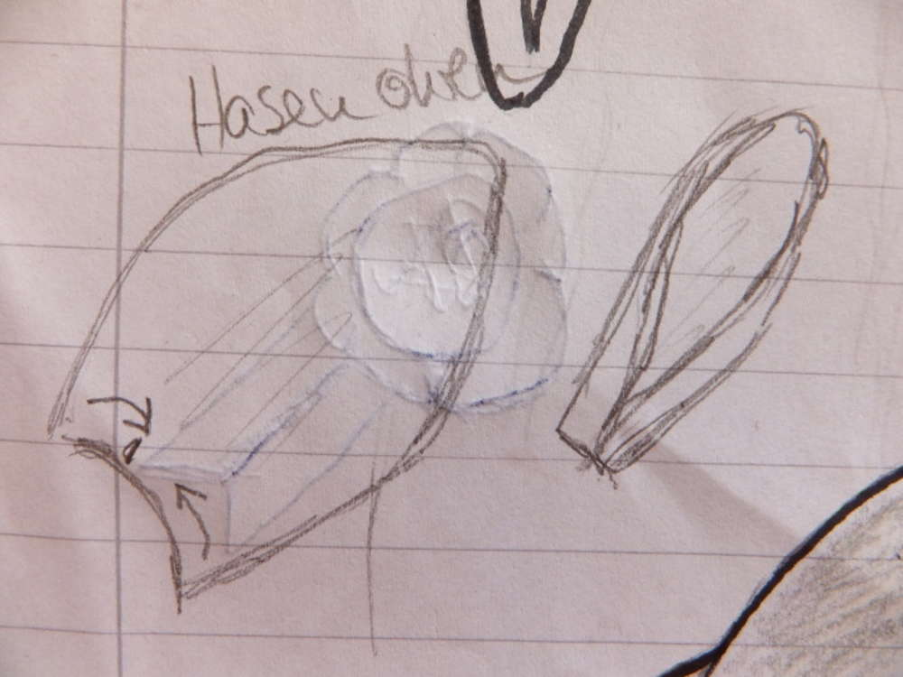

Diesmal habe ich mich zusammengerissen und von Anfang bis Ende mit Fotos dokumentiert, stell dich also auf einen längeren Beitrag ein.

Man braucht ganz klar eine Idee bevor man starten kann, glücklicherweise kam ein Freund mit dieser grandiosen Idee genau zum richtigen Zeitpunkt. Also habe ich mir Gedanken gemacht und ein paar Skizzen angefertigt, unter Zuhilfenahme meiner Filz und Nähbücher, denn Hasenohren wollen schließlich die richtige Form haben. Tja und dann ab zum [Wolldealer](http://www.dewullstuuv.de/shop/?XTCsid=c7e1ac307d900ccfcb00aa599ea032c0) des Vertrauens...

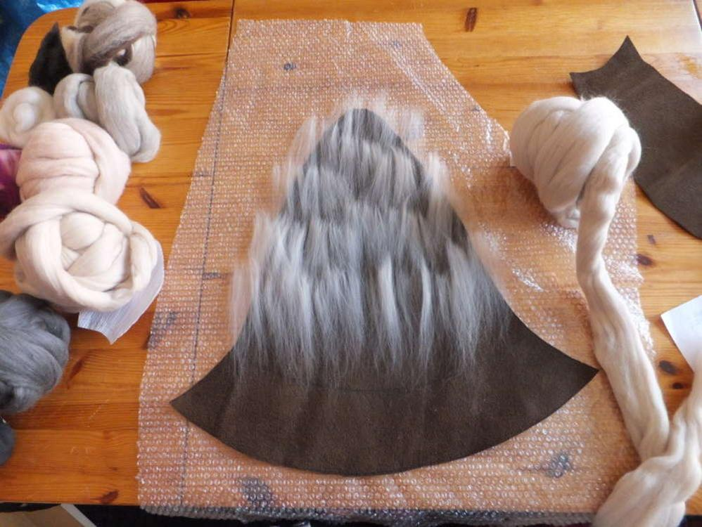
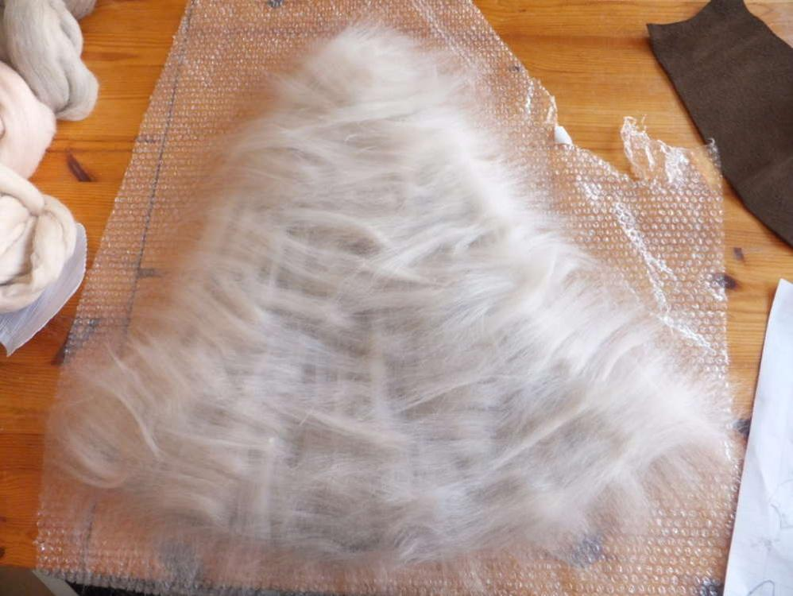
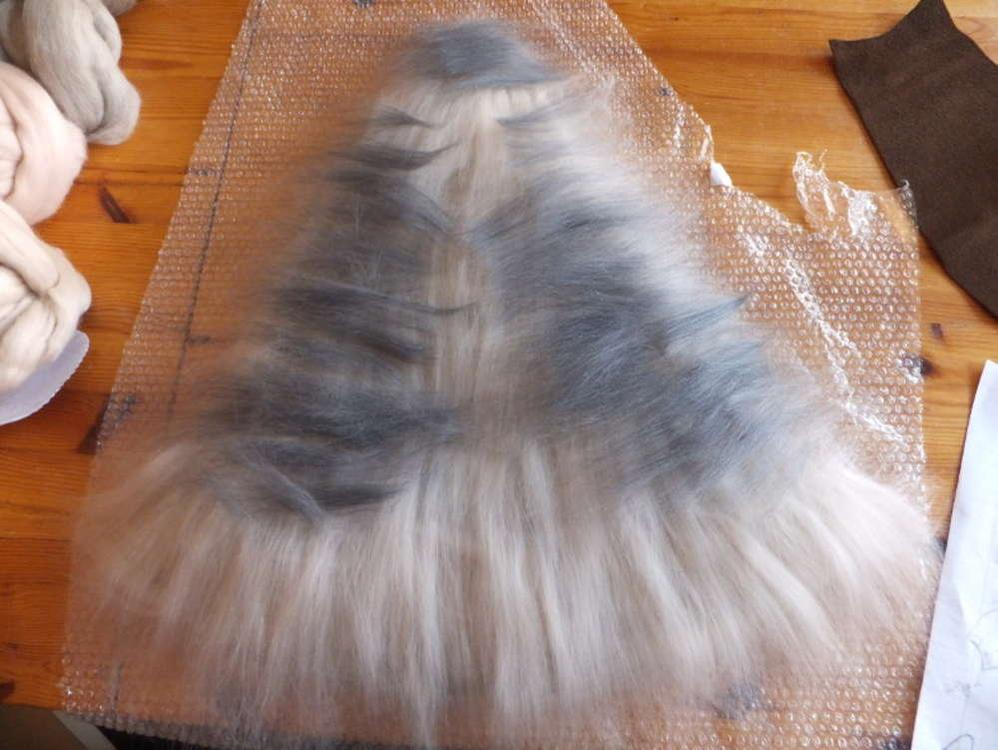
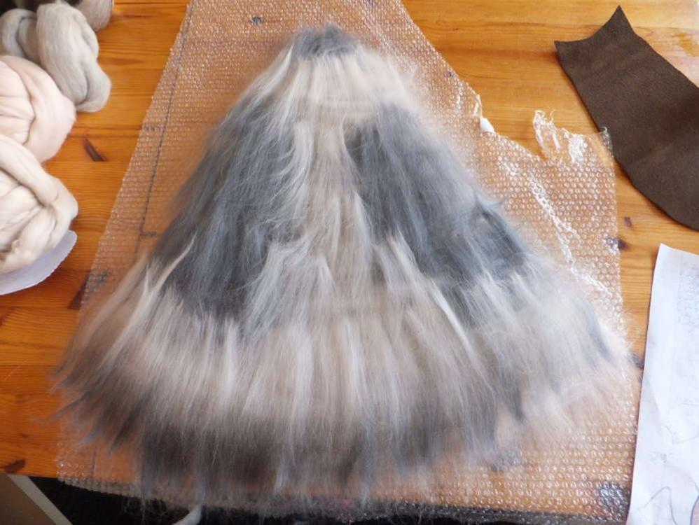

Als besagter Freund das Konzept abgenommen hatte, habe ich für den Hut eine Hohlform angefertigt um die der Hut gefilzt wird. Danach wird die Wolle ausgelegt, jeweils abwechselnd waagerecht und senkrecht. Insgesamt habe ich 9 Schichten gelegt.

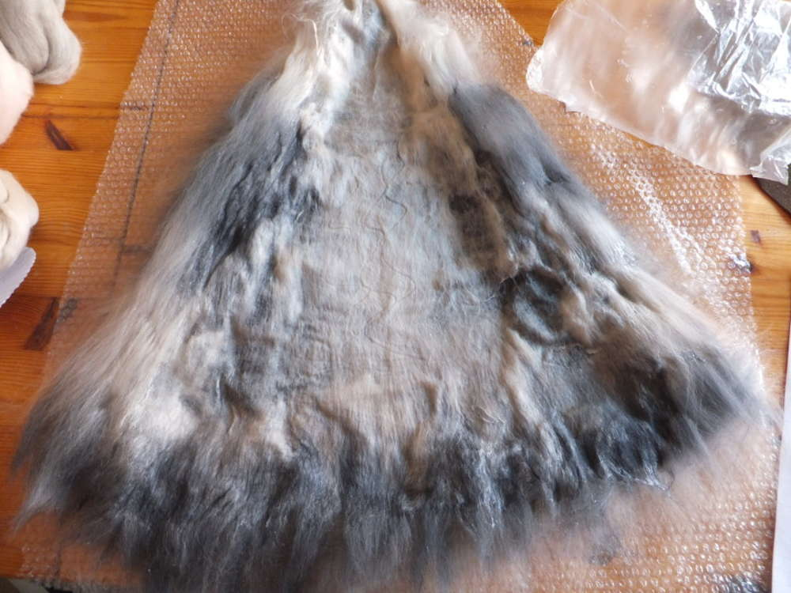

Los gehts, die erste Seite wird mit Seifenwasser nass gemacht und mit vorsichtigem Reiben angefilzt. Ich nehme eine Brottüte zum Anfilzen, denn da kleben die Wollfasern nicht so leicht wie an den Händen. Aus einer leeren PET-Flasche mit großem Deckel habe ich mir eine Sprühflasche gemacht, mit der ich das Seifenwasser auf das zu filzende Stück sprühe. Achtet beim Anfilzen der ersten Seite darauf, dass die Ränder einigermaßen trocken bleiben, denn die brauchst du noch zum Verbinden mit der anderen Seite.

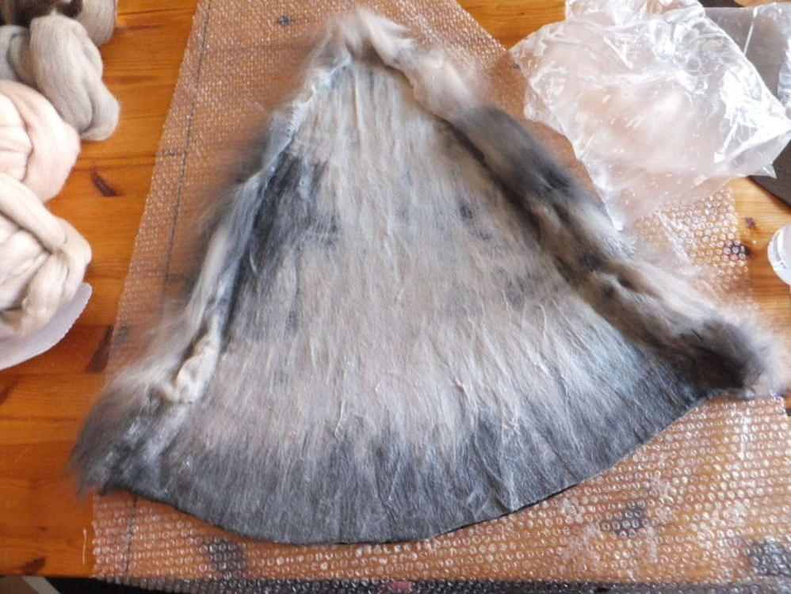

Und nachdem wir vorsichtig angefilzt haben und alles mit dem Wasser getränkt ist kann ich anfangen mit den bloßen Händen zu arbeiten. Die Arbeit wird zusehends glatter und es bildet sich ein Gewebe. Bevor die Hutkrempe zu sehr verfilzt, habe ich sie umgeschlagen, denn so verfilzt sie mit dem Inneren des Hutes und man bekommt eine saubere Kante.  

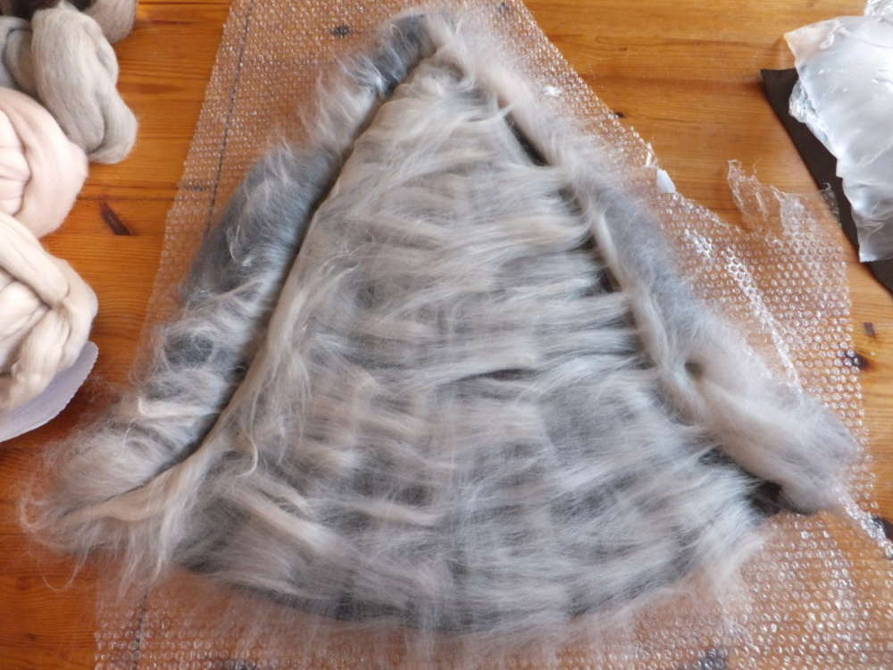

Schreibt euch auf einem Zettel am besten auf wie ihr die Schichten gelegt habt, wenn ihr, so wie ich in diesem Falle, mehrere Farben verwendet. Ich lege nun wieder die Schichten abwechselnd waage- und senkrecht nachdem das Werkstück gewendet wurde.

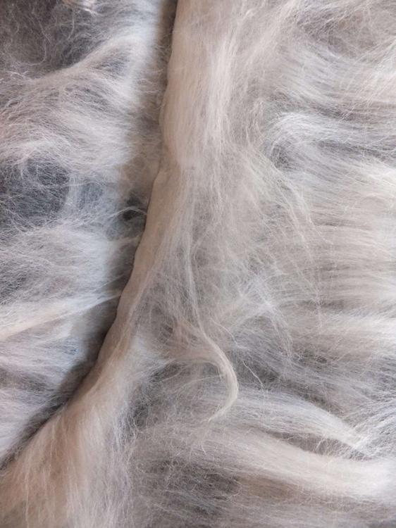

Ich klappe ca. alle 2 Schichten die Ränder vom zuerst gefilzten Stück um.

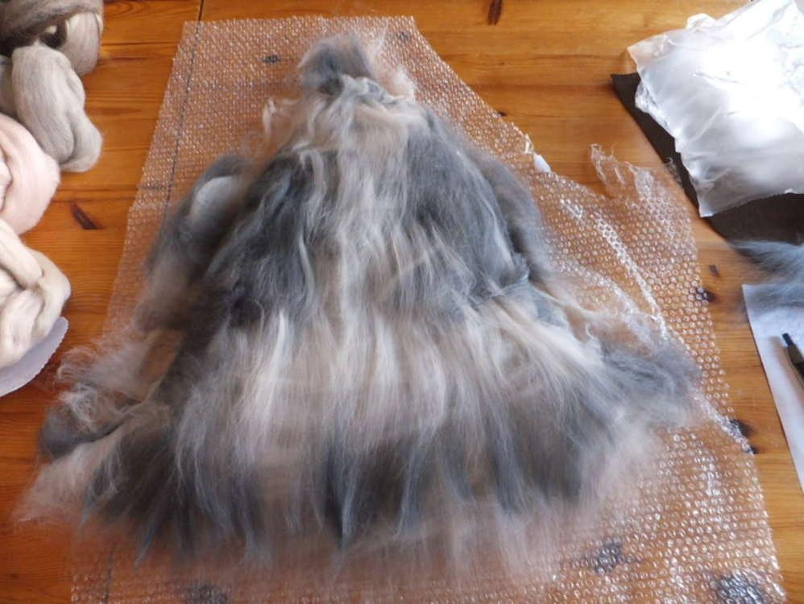
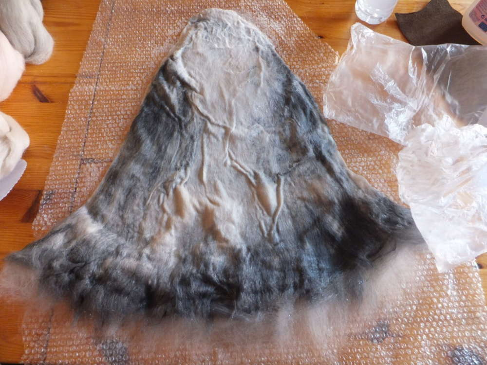

Auf diese Weise verfilzen die Ränder zuverlässig durch mehrere Schichten miteinander und es gibt keine Löcher. Bis die letzte Schicht gelegt ist verfahre ich so und dann geht die Planscherei wieder los... einmal nass machen bitte!

Jetzt gut aufpassen, die Ränder müssen gut verfilzt werden, dafür mit leichten reibenden Bewegungen die Kante zur Innenseite der Filzarbeit reiben. Sobald die Kanten dann angefilzt sind, kann man wieder großflächig reiben und streicheln. (Ist die oberste Schicht leicht angefilzt, ist dies der perfekte Zeitpunkt um andere Dinge anzufilzen.) Dann wieder die Hutkrempe umklappen und los geht das Reiben, man kann zusehends grober arbeiten, man merkt, dass die Wolle sich nicht mehr verschiebt. Gelegentlich kann man einmal vorsichtig an der Oberfläche zupfen, wenn sich noch Fasern herauslösen muss noch weitergerieben werden. Ist die Oberfläche gut verfilzt, sodass sich keine Fasern mehr bei der Zupfprobe lösen, kann die Hohlform herausgenommen werden und der Hut an den Kanten an denen die Vorder- und Rückseite zusammengefügt wurde geglättet werden.

Wenn du einen einfachen Hut möchtest musst du an dieser Stelle das Walken beginnen um deinem Hut Stabilität zu verleihen.

Willst du einen Hut wie den hier, dann wird er leicht angefilzt so wie er ist, erst mal zur Seite gelegt. Denn wir erinnern uns an das Foto von oben... da sind Ohren dran!! Also zu den Ohren.

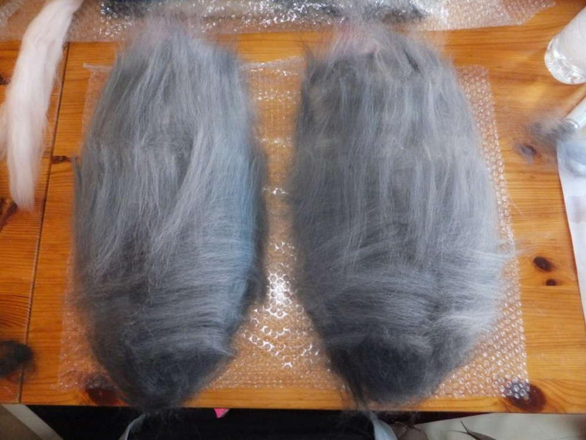

In der gleichen Legetechnik, wie auch schon beim Hut, werden mehrere Schichten gelegt. Am besten macht man die Ohren parallel, denn sonst vergisst man leicht welche Farben man in welcher Schicht verwendet hat. Ich habe die Ohren von der zukünftigen Innenseite her aufgebaut. Also erst das rosa Innenleben und dann Schicht für Schicht das Grau mit den dunkleren Spitzen aufgelegt. Und wieder einnässen.

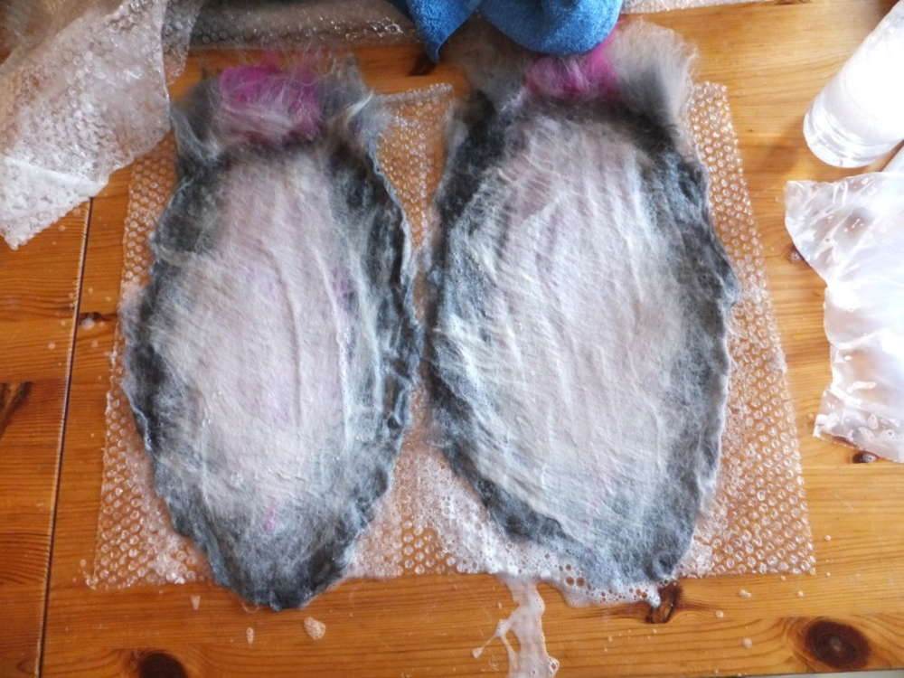

Bei flachen Filzarbeiten ist es nicht so schlimm wenn die Ränder etwas unregelmäßig sind, die kann man wenn genug angefilzt ist mit einer Schere nachschneiden und dann die Kanten nachfilzen. Da die Ohren an den Hut rangefilzt werden sollen, bleibt der Löffelansatz unbehandelt, damit er später an den Hut rangesetzt werden kann. Und das Anfilzen war auch für mich neu. Telefon ausstöpseln, Facebook aus und bloß keinen Besuch erwarten, jetzt muss man gaaaaanz vorsichtig arbeiten.

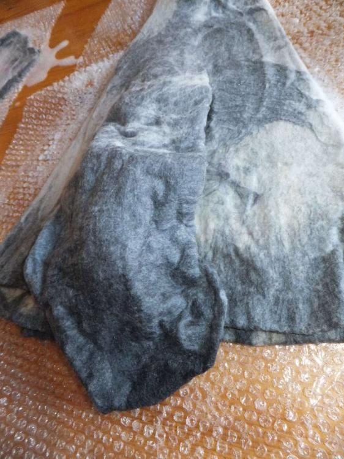

Die Ohren einklappen, damit es richtige Löffel werden, dann das unbehandelte Ende etwas auffächern und auf den Hut an der richtigen Stelle ansetzen. Dafür die trockene Wolle an der Stelle des Hutes aufdrücken, sie tränkt sich dann mit dem Seifenwasser des Hutes. Jetzt noch gleichfarbige Wolle in verschiedenen Richtungen um das Ohr herum auflegen und ebenfalls anfeuchten. Lege dir ein Fliegengitter auf die Wollschichten, so verrutschen sie nicht. Jetzt wieder ganz vorsichtig reiben und wenn man das Gefühl hat es hält einigermaßen dann lieber nochmal so lange weiterreiben ;). Dann kann mit dem vorsichtigen Walken begonnen werden. Bitte nur ganz seicht die Wolle aufeinanderreiben, noch sind wir im kritischen Stadium! 

So, wenn beide Öhrchen an der richtigen Stelle sitzen dann wollen wir die mal so richtig walken, jetzt wird der Filz dicker und der Hut stabiler und robuster aber er schrumpft auch. Also aufgepasst, wenn man zu viel walkt passt er am Ende nicht mehr, also immer mal schauen ob der Kopf noch reinpasst und wenn er die richtige Größe hat, geht es an die Feinarbeit.

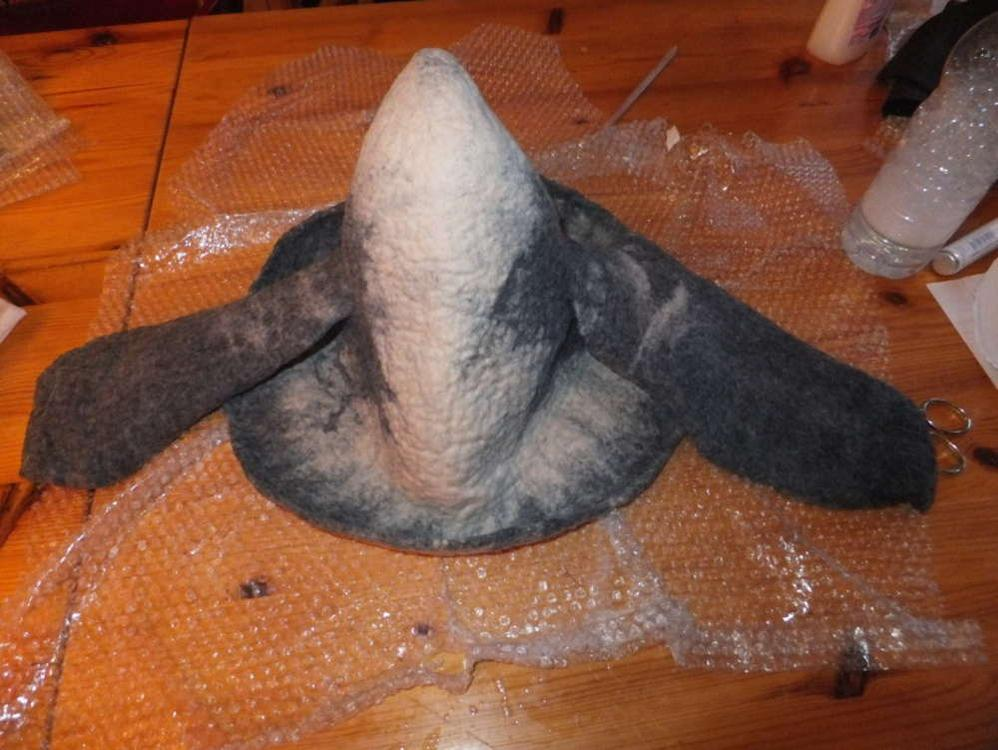

Jetzt muss die Krempe in Form gebracht werden und die Löffel brauchen noch Form, der Zipfel soll auch noch nach hinten schauen, also... walk, walk, walk...scheint ok zu sein, waschen wir mal die Seife raus und neutralisieren die Reste anschließend mit Essig und waschen nochmal durch... ein letztes Mal anpassen und mit Zeitungspapier ausstopfen und trocknen lassen. Dieser meiner Hüte braucht definitiv keine Stärke.

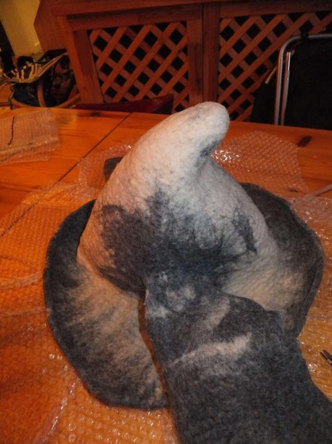
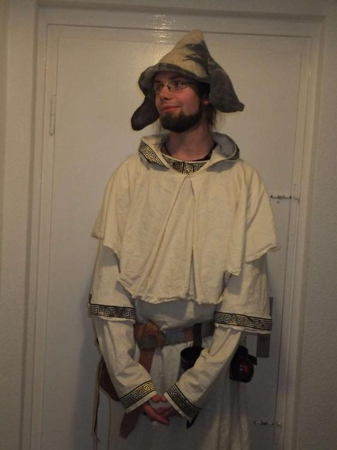
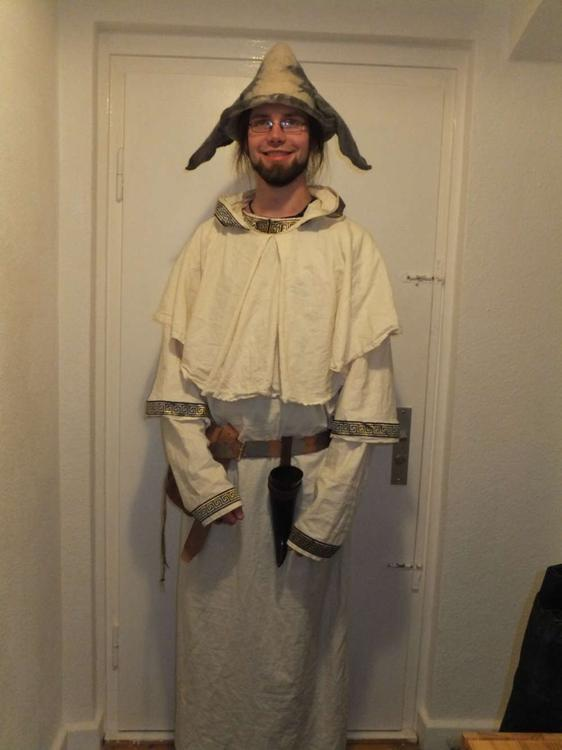
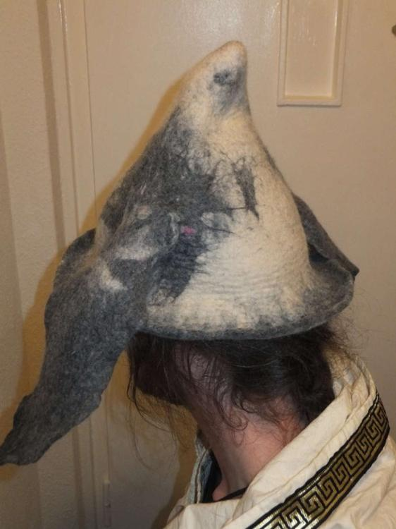

Tja, und nach 5 Stunden Non-Stop-Arbeit ist der Hut mit den Hasenohren fertig. Und der Besitzer glücklich, wie man sieht.    
