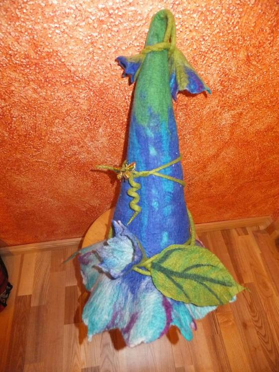
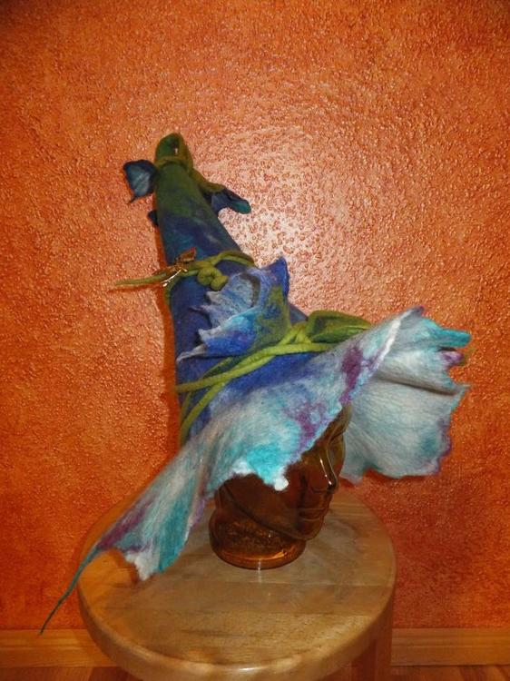
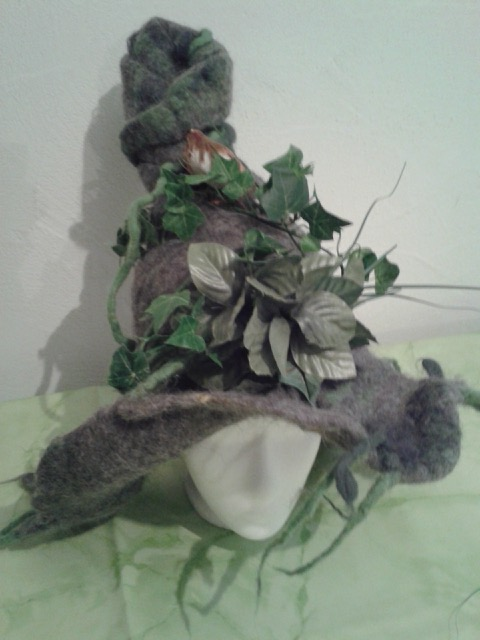

Irgendwie habe ich einen Narren an Spitzhüten gefressen. Ich wollte nämlich auch schon immer mal einen Hut haben der aussieht wie eine Glockenblume... ich finde das Projekt ist geglückt. Eine Anleitung zur Fertigung meiner Hüte findest du im Post [(F)Lauschangriff](/2014/04/flauschangriff/).

## Nachtrag: 
Ich habe von einer mutigen Leserin dieses Bild ihres ersten Hutes zugeschickt bekommen. Ich freue mich riesig über Zusendungen eurer Werke. Dieser Hut wurde auch verzweifelt in die Waschmaschine gestopft wie mein [erster Hut](/2014/01/mein-erster-filzhut/), irgendiwe haben diese Waschmaschinenunfälle ziemlich viel Charakter.

