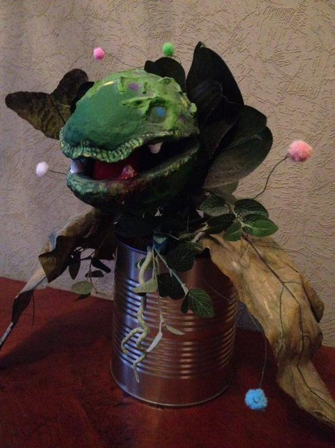
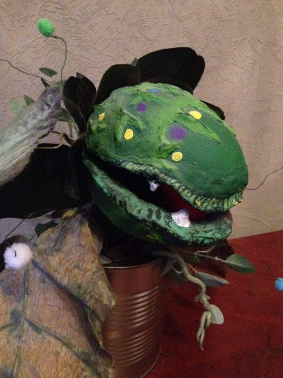
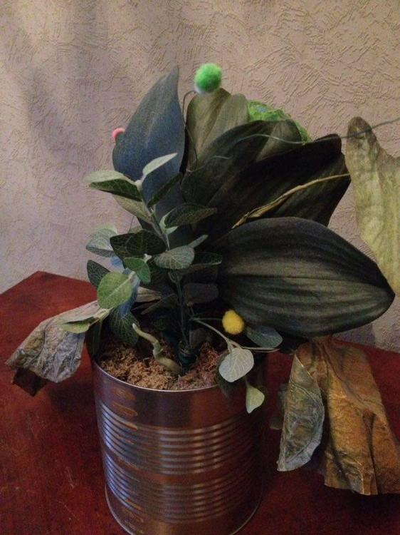
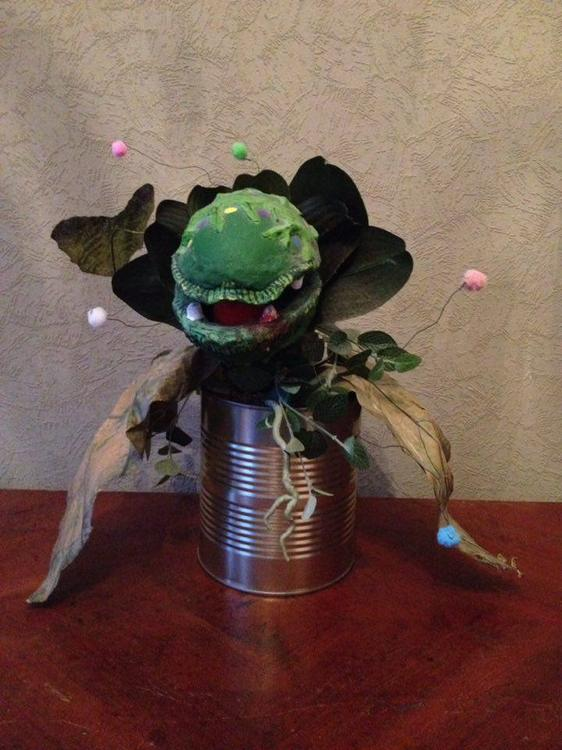
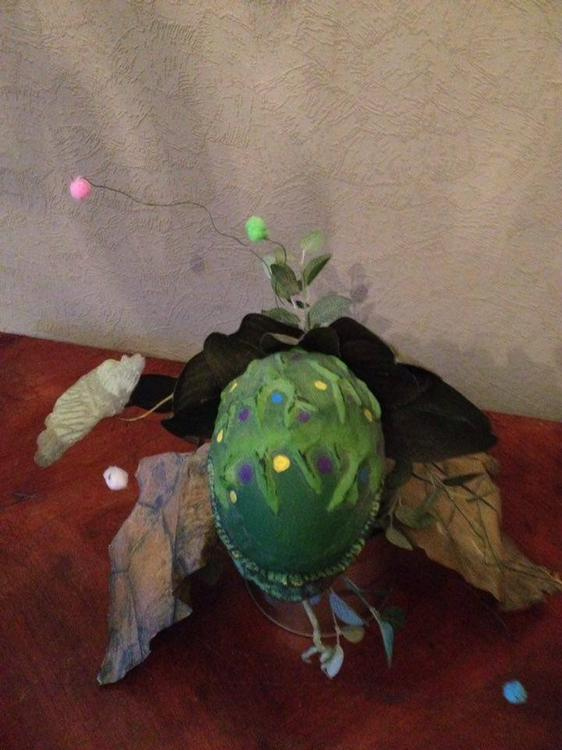

Mein erster Beitrag gilt auch gleich meinem Liebling, der Audrey II aus
dem Film/Musical "Little shop of horrors"! Die Audrey II ist eine
FleischBlutMenschenfressende Pflanze, die während einer plötzlichen
Sonnenfinsternis ihren Spross, unterlegt mit unheimlichen Sphärenklang,
in einen örtlichen Blumengroßmarkt an den Stand eines alten Chinesen mit
exotischen Pflanzen setzt. Dort wird sie vom Blumenhändler Seymour
entdeckt und großgezogen. Ihr Siegeszug um die Welt beginnt… Meine
Audrey II habe ich meinem grünen Daumen und einer gewissen Portion
Kreativität zu verdanken. Dem Freund der FleischBlutMenschfressenden
Botanik sei hier nun verraten, aus was so eine Audrey II besteht. Der
Kopf wurde aus einem Styroporei mit selbsttrocknender Fimo und einer
genähten Filzzunge mit Drahtgestell geformt. Bemalt/betupft ist das
ganze mit herkömmlicher Acrylfarbe.  Der Kopf ist auf einem dünnen
Holzstück gespießt, an dem auch das hintere Blattwerk mit Draht
angebunden ist. Das Wurzelwerk der Audrey II sitzt in einer großen
gebrauchten Konservendose, die mit Steckschaum gefüllt ist welcher
selbst mit Moos kaschiert ist. Audrey II\`s kleine Ableger sind kleine
bunte Flauschebällchen an Draht. "mancher Dummkopf gab sich dafür her,
und schon schrie diese Pflanze nach mehr, und die Pflanzen
wuchsen heran, und dann…"  Genug davon, ich brauch schnell ne Portion
Blut! ;) 

