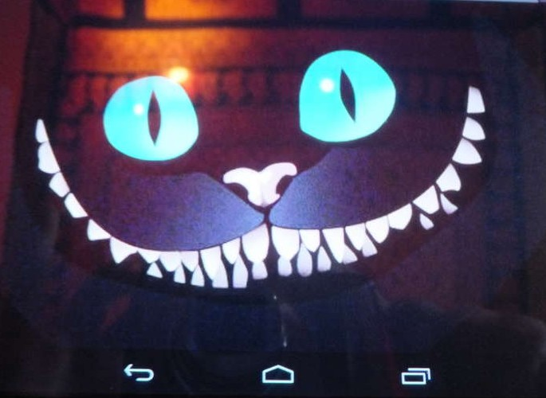
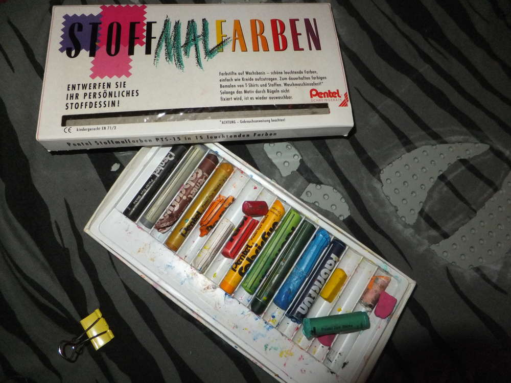
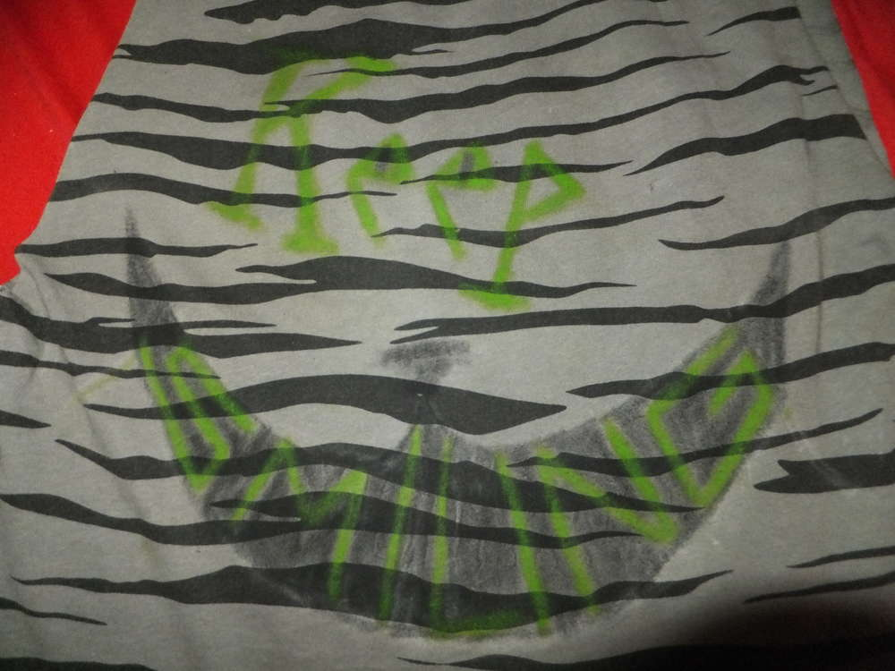

Nachdem das Flauschiversum nun viiiiel zu lange nicht mehr kre-aktiv war, gibt es nun eine Anleitung, wie man aus einem ollen T-Shirt ein cooles Top machen kann. Ich bin schon länger begeistert von den Video-Tutorials bei Youtube zum Thema Do-It-Yourself Shirts. Was man braucht sind nur ein T-Shirt ein auswaschbarer Stoffmaler oder ein Stück Kreide und eine Schere, für meine Version fügen wir noch Stoffmaler und eine blendende Idee hinzu.

Also ich sah mir die ganzen vielen Videos an um Anregungen zu suchen und stellte nach einiger Zeit fest, dass ich mir immer die gleichen Ideen anschaue. Hier ein Totenkopf, da ein Schmetterling und hey schneiden-wir-das-Shirt-in-Streifen. Also hab ich überlegt und meine Idee kam mir mit diesem Shirt. Ich finde Katzen (für diejenigen, die es tatsächlich noch nicht wissen sollten ;) ) total toll. Und welche Katze kennt jeder? Genau, die Grinsekatze aus Alice im Wunderland. Also auf zur Suchmaschine und das Internet nach Bildern durchforsten lassen. Das ist dabei herausgekommen und an diesem Bild werde ich mich orientieren.

Zunächst will ich die Ärmel weg haben, dazu Falte ich das Shirt, zeichne mir mit der Kreide an wo ich schneiden will und schnippel gleich beide Arme gleichzeitig weg, damit kann ich auch sichergehen, dass die Ausschnitte symmetrisch sind. Als nächstes wird das Shirt auf eine glatte Unterlage gespannt. Am besten nehmt ihr eine, die in das Shirt passt, so hat man es später beim Schneiden leichter und wenn man eventuell noch Farben benutzt drücken diese nicht durch.

So jetzt wird die Grinsekatze übertragen, überlegt euch bei einem Motiv vorher was ihr wegschneiden wollt und ob das auch so funktioniert wie ihr euch das vorstellt. Manchmal hat man tolle Ideen und muss feststellen, dass sich diese nicht unbedingt immer umsetzen lassen, wenn ihr euch nicht sicher seid, dann macht einfach ein paar Tests an einem echt ranzigen Shirt, ich habe zum Beispiel lange überlegt, wie ich die Nase der Katze hinbekommen kann. Nachdem ich mit meiner Skizze zufrieden war, habe ich die einzelnen Zähne, die Nase und Augen ausgeschnitten, das ist ein bisschen fummelig aber mit einer guten Schere (Nagelschere kann hilfreich sein) ist das Ganze kein Problem. Achtet beim Schneiden darauf, dass ihr nicht zu viel wegnehmt und auch, dass die Abstände der Löcher voneinander ungefähr bei einem Zentimeter liegen, denn anderenfalls hat man am Ende ein großes hässliches Loch.

Ich wollte die Grinsekatze noch etwas hervorheben mit Farben, gerade weil mein Shirt dunkelgrau ist, hielt ich das für eine gute Idee und so habe ich mich wieder anhand eines Bildes orientiert und mit meinen Stoffkreiden losgemalt. Meine Farben muss ich erst mal kurz bügeln, danach ziehe ich noch an den Löchern, dadurch dreht sich der Stoff etwas ein und die Schnittkanten sehen nicht mehr so neu aus. Jetzt kann ich mit meinen anderen Plänen fortfahren, die da wären... ... die Ärmel abzuschneiden und auf die Vorderseite noch was raufzumalen. wenn man sich jetzt noch ein blaues, grünes oder violettes Shirt untendrunter anzieht, hat man eine stets lächelnde Grinsekatze.

