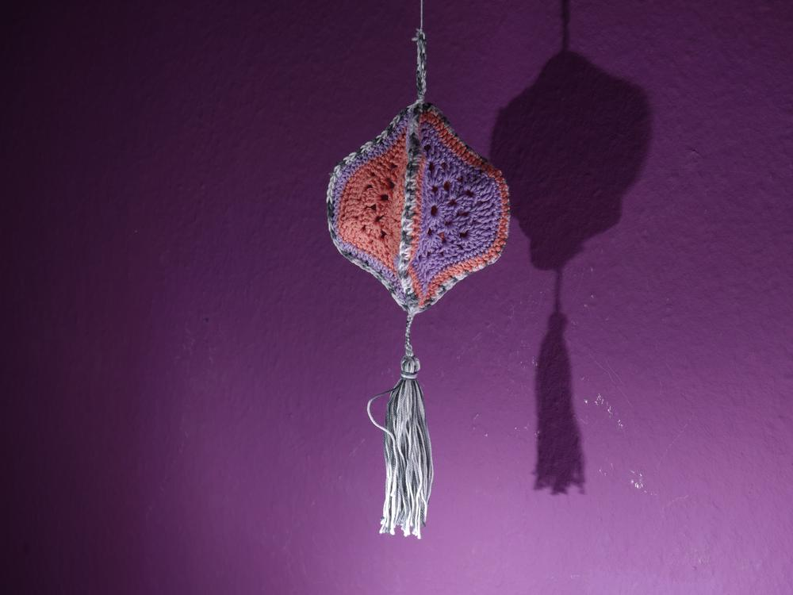
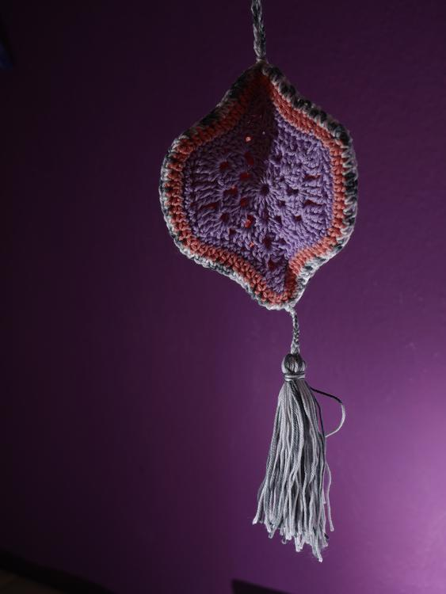
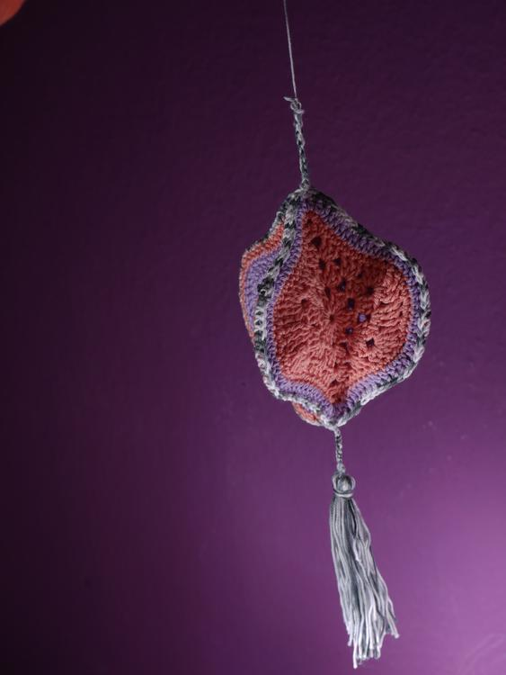
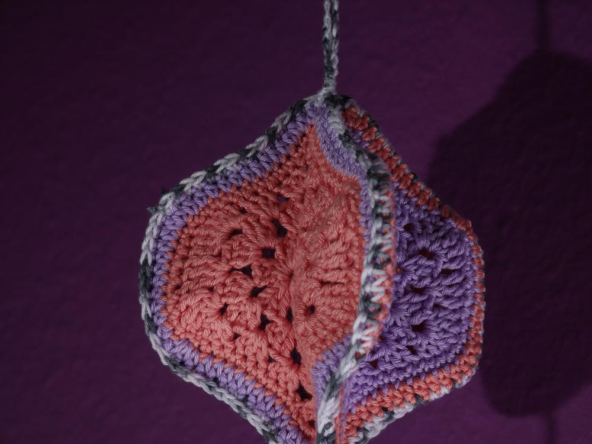
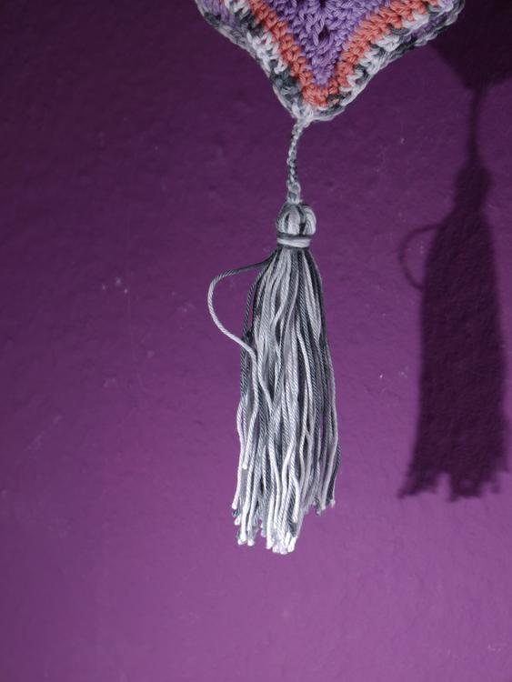
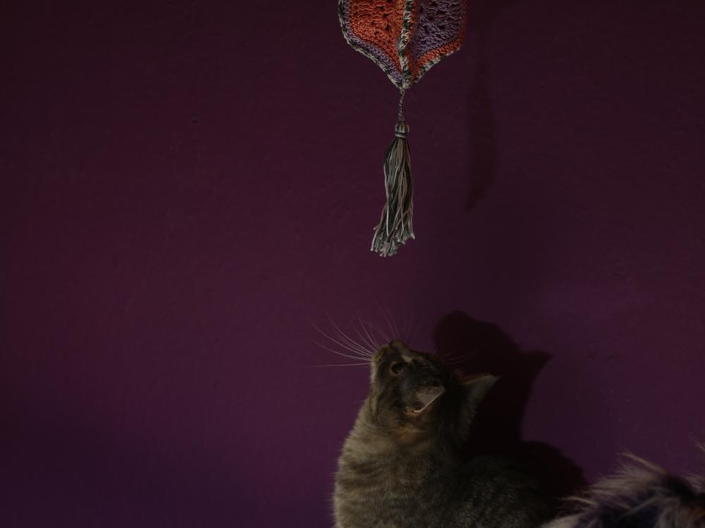
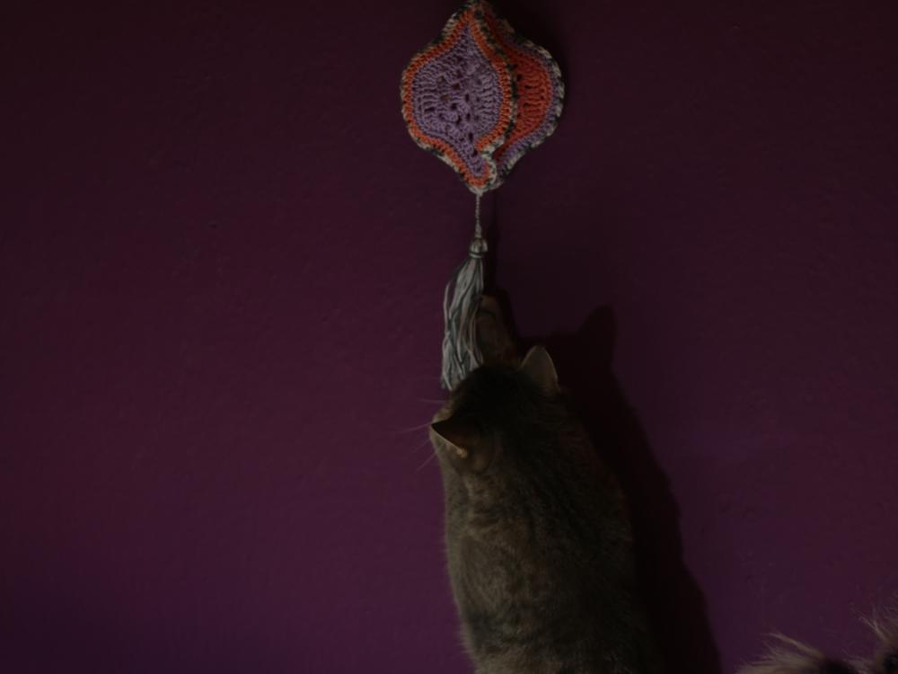
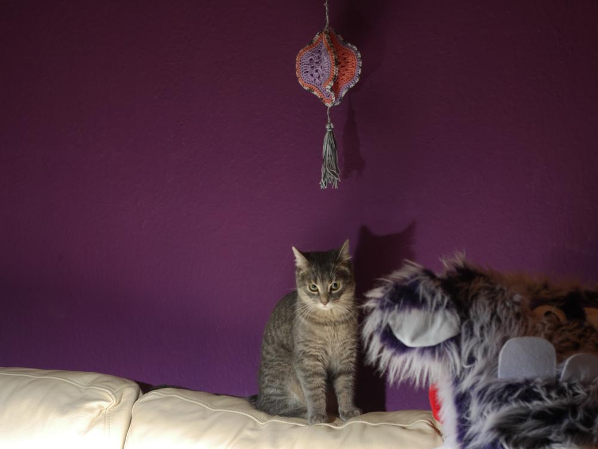
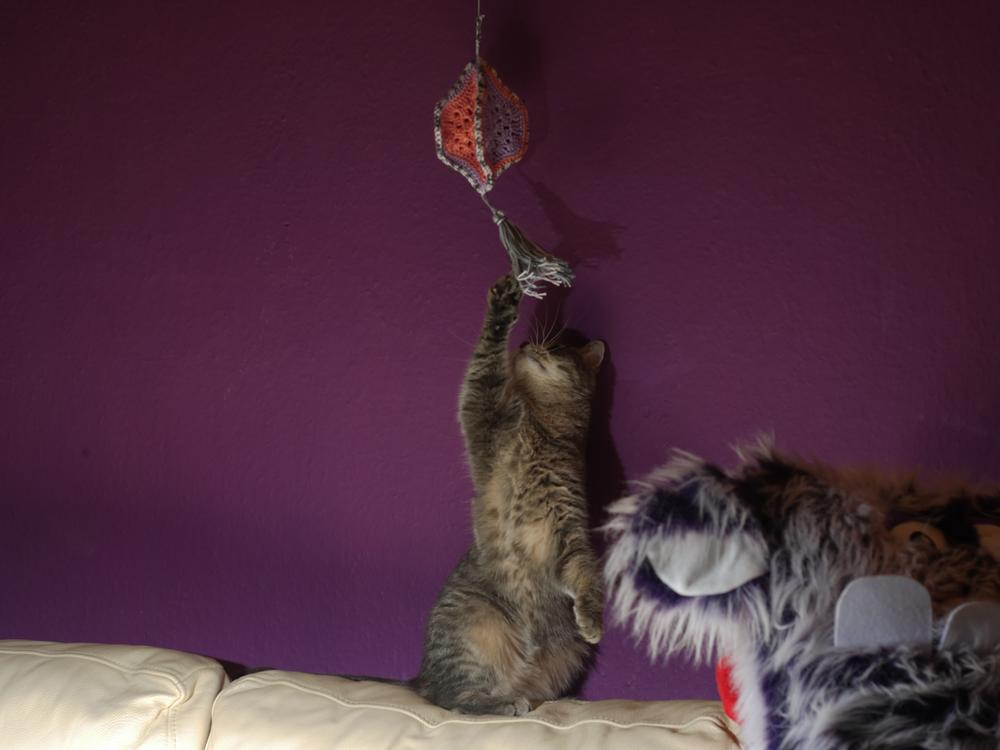

Ich war auf der Suche nach einem besonderen Muster für eine Granny-Square-Häkeldecke. Ich fand bei Pinterest eine Variante, die mich sofort begeisterte. Die [Anleitung](https://janiecrow.co.uk/presta/crochet-patterns/238-mystical-lanterns-blanket-kit-5060480960008.html) ist kostenpflichtig aber mit ein wenig Übung, habe ich mir anhand eines Bildes den Patch selbst erarbeitet. 

Da ich aber nach Janies Idee gearbeitet habe, werde ich hier auch nur meine Ergebnisse teilen und nicht die Anleitung preis geben. In meinen Erprobungen war ich diesmal so übereifrig, dass gleich 5 dieser Ornament-Patches enstanden sind. Aus Vieren davon habe ich einen Baumler gemacht. 

Da ich jetzt dieses Muster kann, ist das nächste Projekt nicht weit, pro Patch benötige ich etwa 7 Gramm Baumwolle und 15 Minuten Zeit. Aber bis zu einer ganzen Decke dauert es noch etwas. Und wie fast immer, wenn Fotos hier bei uns gemacht werden, sind meine kamerafreudigen Katzen nicht weit, diesmal konnte Jemima sich nicht zurückhalten und musste dieses neue unbekannte Objekt erforschen.

Und ich nur: "Jemima! Das berühren der Figüren mit den Pfoten ist verboten!"

Scheinbar beeidruckt sie das Heinz Erhardt Zitat nicht die Bohne.

Deshalb macht sie auch einfach weiter.

In dem Sinne wünsche ich euch ein schönes Wochenende, eine angenehme Himmelfahrtswoche und bleibt neugierig, eure Ermeline.
