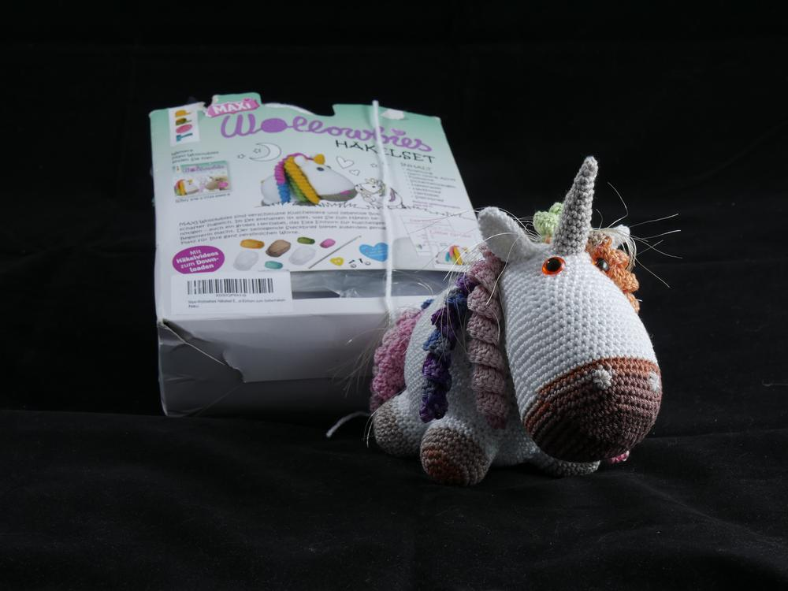
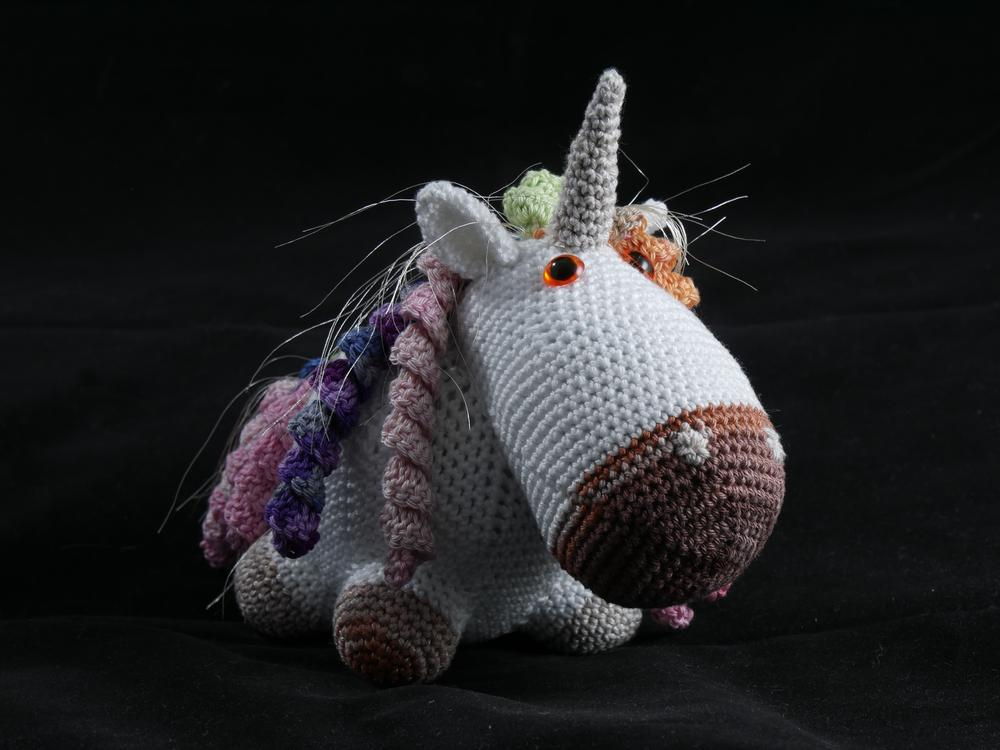
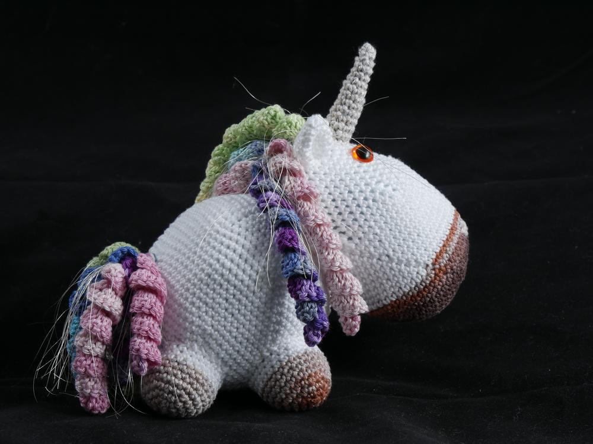
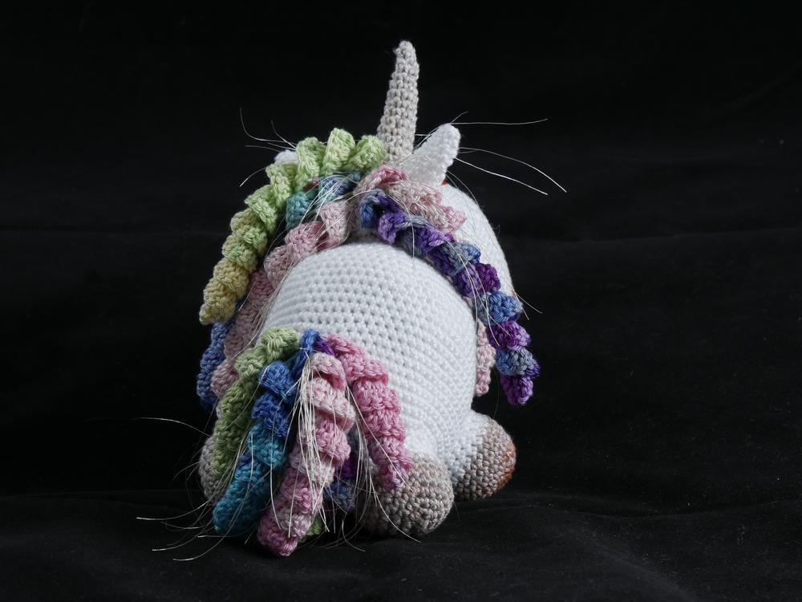
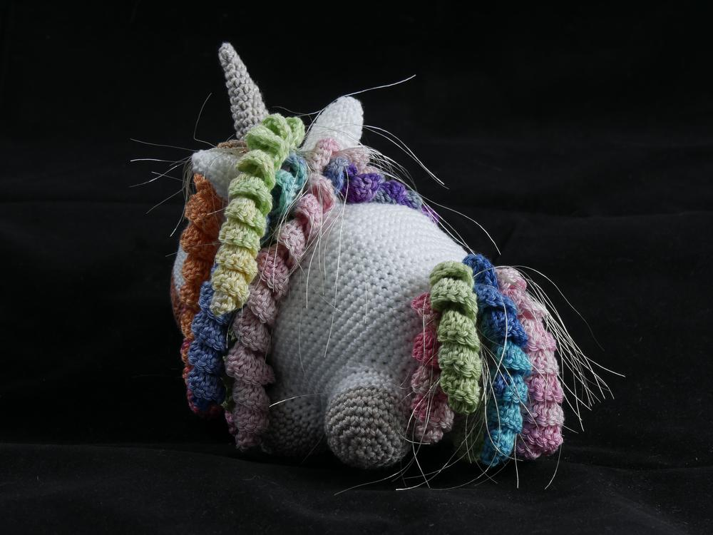
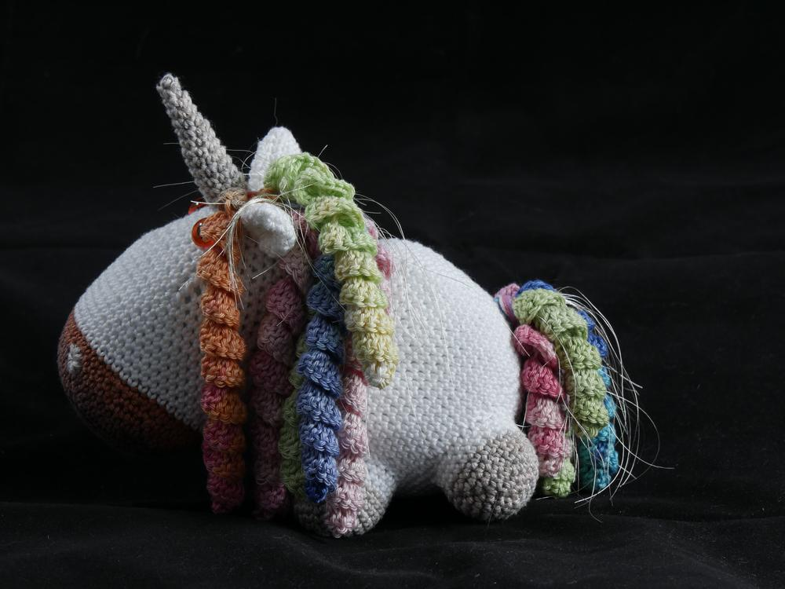
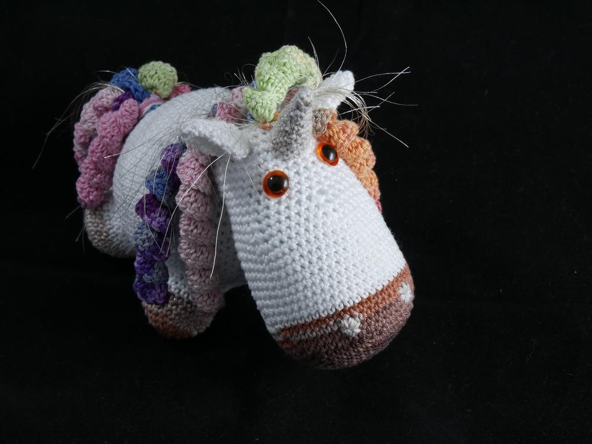
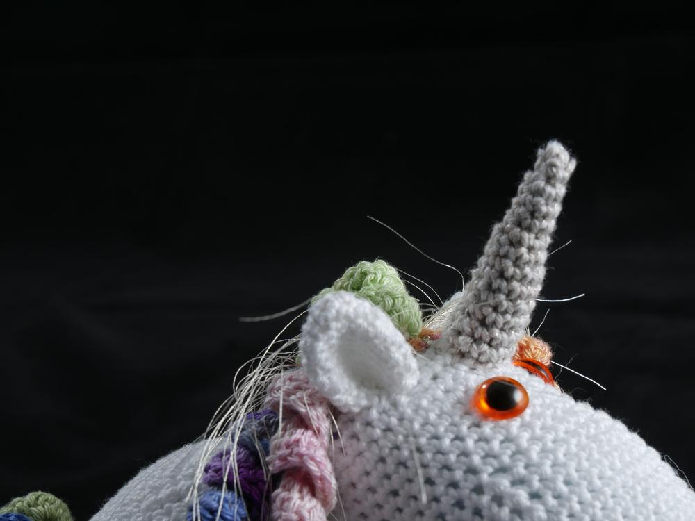

Wenn man Dinge häkeln muss, weil man anderen erklären will wie es geht. Dieses Einhorn ist ein gutes Beispiel, denn gelegentlich kommt es vor, dass ich Freunden erklären soll, wie man gewisse Anleitungen umsetzt. 

Naja es hat sich herausgestellt, dass es mir schwer fällt mich auf das Stricken zu konzentrieren und nebenbei noch eine Häkelanleitung zu erklären, dann lege ich meine eigentlichen Projekte beiseite und häkel einfach mit. Meine Freundin hat ein Einhorn-Komplett-Häkel-Set geschenkt bekommen. Ich habe dann erstmal passende Wolle und Augen zusammengesucht, des weiteren musste eines meiner alten Kissen sein Innenleben hergeben. Aber das opfert man ja gerne für ein süßes Einhorn.

Wenn mir dann an der Anleitung etwas nicht gefällt, und so war es mit der Anzahl der Locken, dem Horn, dem Schweif und den Ohren, dann mache ich einfach mein eigenes Ding. Zudem bin ich der Meinung, ein Einhorn sollte glitzern und schimmern, darum finde ich die Baumwollvariante auch netter als die Fertig-Packung aus Polyacryl aber das ist halt kostengünstiger im Vertrieb.

Manchmal bin ich dann so von den Projekten angefixed, dass ich in meinem Handarbeitsexkurs eine eigene Interpretation entwickle. 

![Babyeinhorn] (_1080553.JPG)

Und darum gibt es nächste Woche dann die Anleitung für meine eigene Baby-Einhorn Variante, das könnte der Anfang einer Fabelwesen-Amigurumi-Reihe werden, den [Drachen](/2014/07/amigurumi-hakeldrache/) habe ich ja auch schon.

Ich wünsche Euch einen schimmernden Sonntag, Eure Ermeline.
