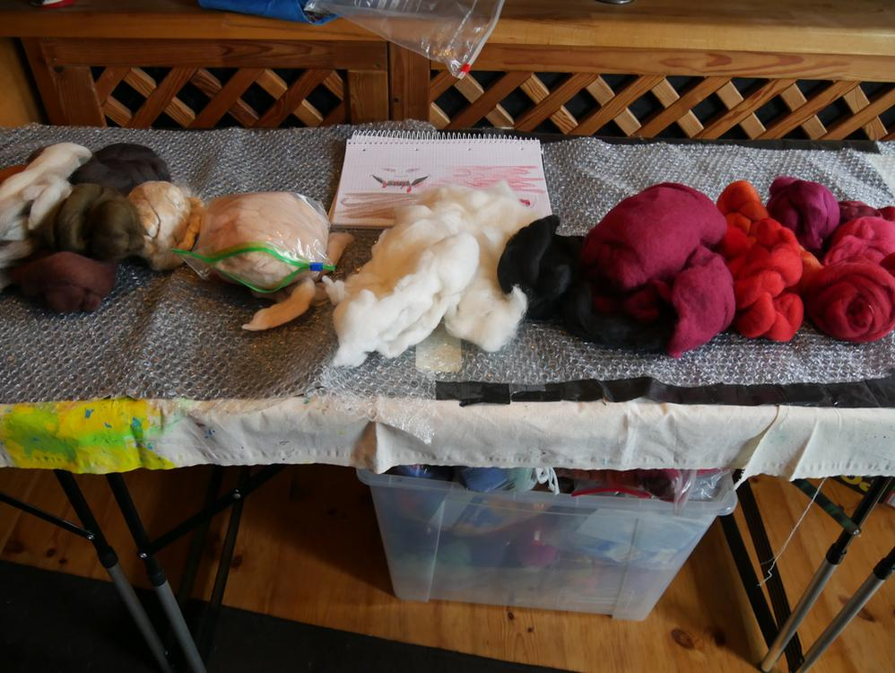
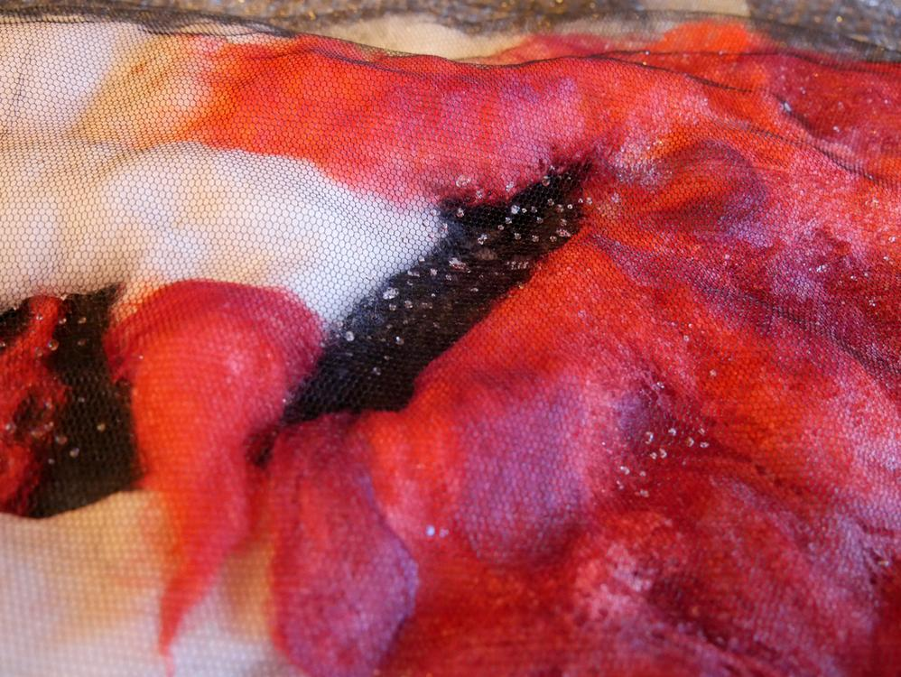

Ein Schal mit Biss für Vampirfans. Hmm wie kam es zur Idee für diesen Schal. Ich wachte am 1.1.2019 auf und musste am meine [Monsterschals](/2015/02/kuschelmonster/) denken und dass ich es schade finde, diese wegegeben zu haben. Joa aber wieder einen Monsterschal wollte ich nicht, ich mache ja nur Unikate. Dann habe ich überlegt was man denn noch mit dieser Schleimtechnik machen könnte und ich kam auf Blut... viel Blut und zu Blut passen Vampire, also Stift und Papier her und eine erste Skizze machen.

Die Skizze hat mich nun überzeugt, ob ich das so umgesetzt bekomme, ist noch die andere Frage aber erstmal suchte ich die Wolle raus.

Daraus lässt sich doch was machen. Den Tapeziertisch habe ich auch schon vorbereitet. Auf den Tisch lege ich immer erst ein Tuch, darüber eine Plastiktüte und dann arbeite ich auf der Luftpolsterfolie. 

Dann ging es ans Auslegen der Wolle, praktischer Weise habe ich noch genug Wolle im Vließ gehabt um damit die Basis zu schaffen. Und so fing es dann an mit der Wollmalerei und dem Umsetzen der Vorlage.

Als die Basis gelegt war, habe ich mich an die Details gemacht.

Ich wollte das Ganze gar nicht nass machen, ob das dann auch noch gut aussieht, wenn es gefilzt ist?

Ich habe insgesamt 4 Stunden am Auslegen gearbeitet und mich total in die Details verliebt.

Naja aber nur rumliegen bringt ja nix. Also mit dem Fliegengitter bedecken und nass machen.

Luft rausdrücken und anfilzen.

 
Wenn schon angefilzt ist, umdrehen und weiterreiben.

Und langsam reibe ich doller.

Nachdem ich dann endlich beim Walken angekommen war und der Schal fertig gefilzt schien, habe ich ihn ausgespült und mit Essig neutralisiert und wieder gut ausgespült. Ganze zwölf Stunden habe ich gebraucht bis der Schal nun feucht vor mir lag. Abends habe ich noch die ersten Perlen befestigt. Über Nacht habe ich den Schal dann trocknen lassen um am nächsten Tag die letzten Applikationen aufzusticken und damit den Schal fertigzustellen.

Die Applikationen bestehen aus einer Stickerei, die die Strukturen des Schals wieder hervorheben sollen. Aus den Resten der verwendeten Wolle, die ich nicht verfilzt habe, habe ich dann die Wolle gesponnen mit der ich gestickt habe. Jemima hat mir dabei auf dem Sofa Gesellschaft geleistet.

Das fertige Ergebnis überzeugt mich. Ich war nur etwas zu faul das Fotozelt wieder rauszuholen. Darum liegt jetzt hier der blutige Schal auf rotem Grund.

So und jetzt kann man sich der romantischen Fantasie hingeben, immer einen Vampirbiss um den Hals zu tragen.
Ein unblutiges, jedoch romantisches Wochenende wünscht eure Ermeline.

