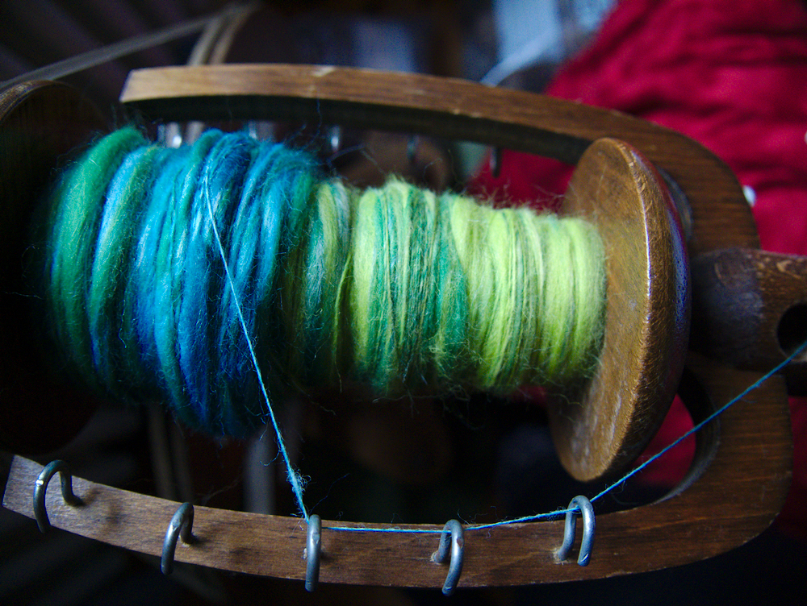

Das war mal ein Monsterprojekt, das nicht nach einem solchen aussieht. Ein weiteres [Revontuli-Tuch](https://flauschiversum.de/2015/07/gut-betucht/), diesmal aus einem 
selbstgemischten und gesponnenen Garn. Ich will hier heute mal einen kompletten Prozess vom Wollemischen bis zum fertigen Tuch zeigen. Aber fangen wir am Anfang an.

Angefangen hat alles damit, dass ich wieder Lust hatte Wolle mit meinem Kardiertier zu mischen und mir einen Kammzug mit 
einem schönen Farbverlauf zu gestalten. Wie man das macht, habe ich in meinem Beitrag über die verschiedenen [Vorbereitungen
zum Spinnen](https://flauschiversum.de/2019/03/vlies-kammzug-rolag-fauxlag-punis/) beschrieben.

Die Farben haben mir Appetit auf mehr gemacht und ich habe an diesem Tag noch einige Farbverläufe gemischt, davon aber 
in einem anderen Beitrag mehr. Aber diese grün-blaue Mischung hat mich angeregt sie direkt zu verspinnen. Also habe ich 
mir mein Rädchen genommen und innerhalb kürzester Zeit (etwa 3 Tage) den gasamten Kammzug versponnen und fertig verzwirnt.
Diesmal habe ich auch etwas experimentiert mit verschiedenen Spinntechniken, so ist hier ein leichtes Flammengarn entstanden.
Ein Flammengarn ist ein grundsätzlich dünn gesponnenenes Garn welches jedoch mit dickeren Stellen versehen wird. Beim Verzwirnen 
ergeben sich dadurch kleine "Flämmchen" mit deren Ausprägung man auch gut variieren kann.

Hier sind nun die verschiedenen Fortschritte vom Spinnen.

Meine Spule war von dem Single schon gut gefüllt und obwohl ich weiß, dass beim Verzwirnen das Volumen nochmal wächst,
habe ich bis zum Anschlag die Spule gefüllt. Verzwirnt habe ich dann mit einem weißen Nähgarn und einem türkisen 
Glitzerfaden, der sich sehr gut mit den Farben der Wolle ergänzt. 

Auf dem Nähgarn habe ich zusätzlich Perlen aufgezogen, die ich mit verzwirnt habe und auch in etwa dem Farbverlauf angepasst habe. 

So konnte ich meine vermischten Perlen mal 
minimieren und mein Garn wird immer mehr zum Experiment und fordert mich auf vielen Ebenen zum Improvisieren heraus. Da
es ein langes Garn ist und ich dementsprechend viele Perlen hatte, musste ich für den Verzwirnvorgang dafür sorgen, dass 
die Perlen nicht direkt am Anfang mit in das Rad laufen und ich immer gezielt meine Perlen über das Garn verteilen kann. 
Mein Himmelbett bietet sich da dann immer gut an, ich hängte die Perlenschnur über eine der Stangen und so rutschten die 
Perlen am Faden herunter und ich konnte wie gewohnt verzwirnen und mit dem Vorrat aus meiner Hand gezielt Perlen platzieren.

Und so füllt sich Stück für Stück die nächste Spule und leert sich die andere.

Hier sieht man mal eine Pause.

Das Inselurlaubsgarn ist fertig. Diese Masse muss nun gehaspelt werden, dann ins Entspannungsbad und nach dem Trocknen
aufgewickelt werden um dann verstrickt werden zu können. Meine Haspel habe ich mit meinem ersten Spinnrad zusammen verkauft und darum musste ich auch hier etwas experimentieren.
Eine drehbare Servierplatte und mein Wohnzimmertisch haben aber gut funktioniert.

Nach dem Trocknen kann man sich nun schön die Strukturen ansehen.

Und damit man das Ganze nun auch verarbeiten kann, muss man den Strang zum Knäul wickeln, gelobt sei der Erfinder des Wollwicklers.

Und ran geht's ans Revontuli.

Das nennt man Arbeit unter erschwerten Bedingungen.

Und weiter geht das wilde Stricken.

Und natürlich muss nach dem Stricken das Tuch noch gespannt werden. Mangels eines Raumes in dem ich meine Sachen lagern kann,
liegen also meine Matten im Wohnzimmer und ich muss mich nicht wundern, dass meine Katzen die Spielwiese entdecken.

Und zum Schluss ein paar Detailfotos.

Es ist so flauschig und ich kann nun immer etwas Inselurlaub mit mir herumtragen. Warum beschreibe ich das Ganze hier?
Ich möchte gerne ein Bewusstsein dafür schaffen, wieviel Arbeit in manchen unscheinbaren Werken steckt. Ich nehme deshalb 
selbst keine Aufträge für andere an, aber ich freue mich immer, wenn jemand von meinem Wissen profitiert und ich eventuell neue 
Inspiration bringen kann. 

Einen kuschligen Sonntag wünscht euch eure Ermeline .
