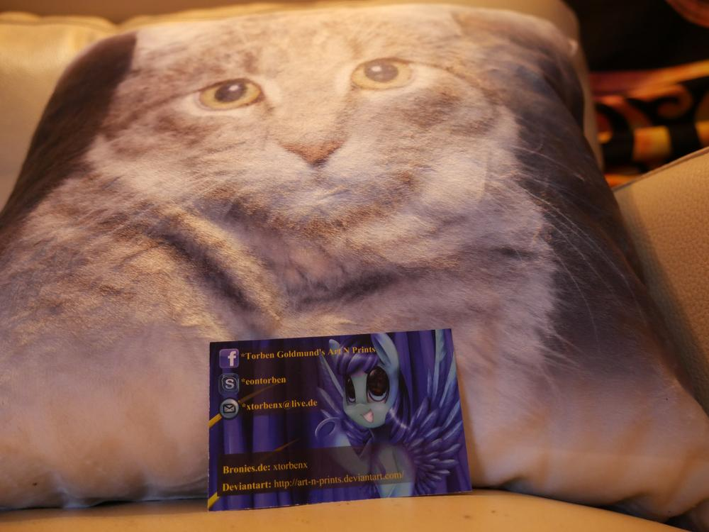
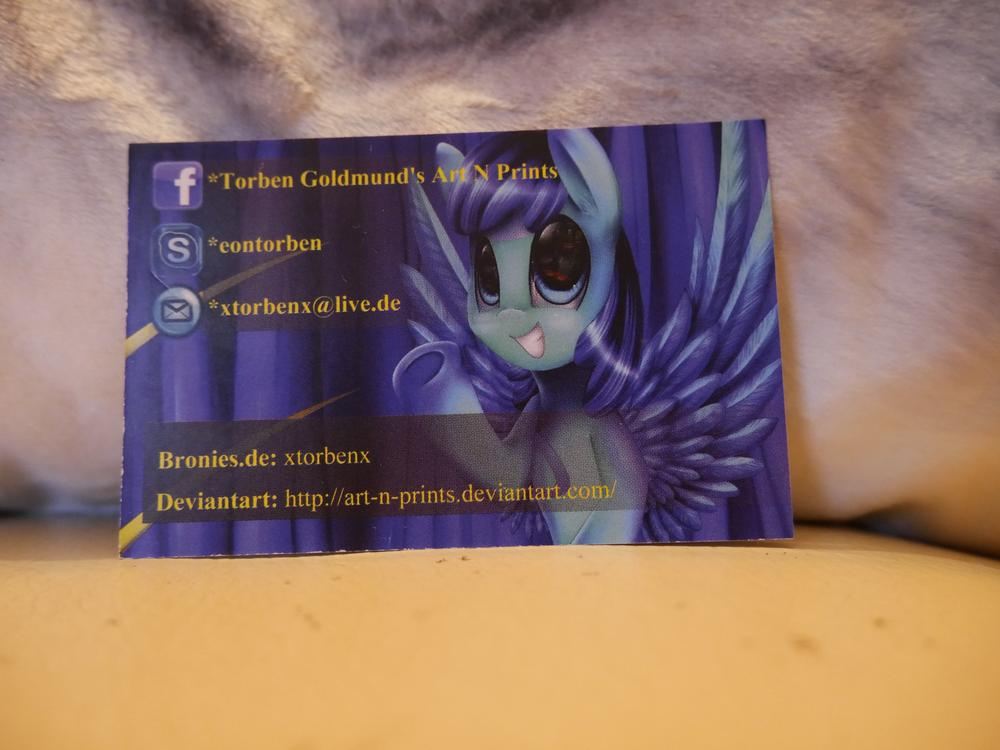
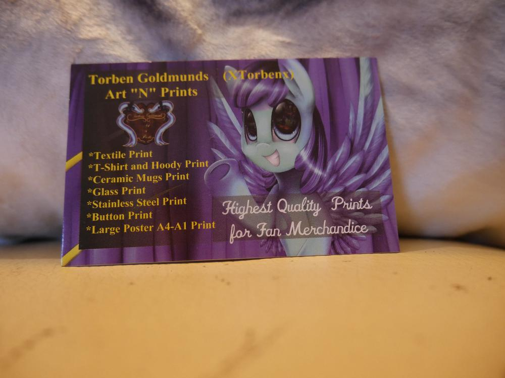
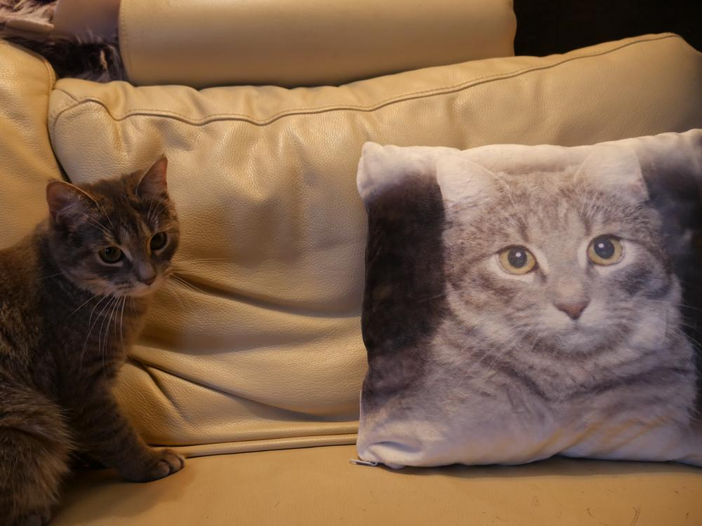
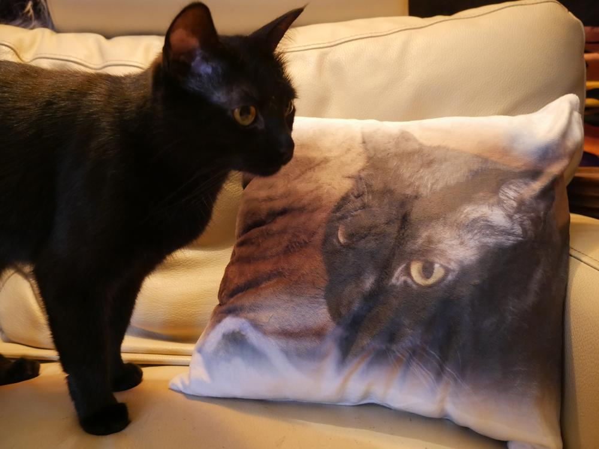

Dass ich der wohl größte Fan von Shubia und Jemima bin, ist wohl kaum zu übersehen... Heute auf der Kieler [Unicon](http://www.akf-hsg.uni-kiel.de/unicon/) bin ich dann an einen Stand geraten, an dem ich meine Schnuffels auf Stoff drucken lassen konnte. 

Gewählt habe ich mir ein Plüschkissen, das mindestens so weich ist wie meine Mietzen, mal eben zwei Bilder ausgesucht und dann für 25€ bedrucken lassen. Jahhh der Preis ist etwas hoch, ich musste jedoch auch etwas mehr zahlen, weil ich auf beiden Seiten unterschiedliche Bilder haben wollte. 

Damit kann ich leben, jetzt kann ich auch im Urlaub meine Schnuffels mitnehmen und flauschen. Da ich derzeit gesundheitlich etwas angeschlagen bin, gibt es an der fertigen-Projekte-Front noch nichts Neues, dafür habe ich aber zwei angefangene Großprojekte, bei denen ich gut vorankomme, wenn ich im Bett liege und mich schone. 

In dem Sinne, erholsames Wochenende und eine gesunde Woche, wünscht euch Ermeline.
