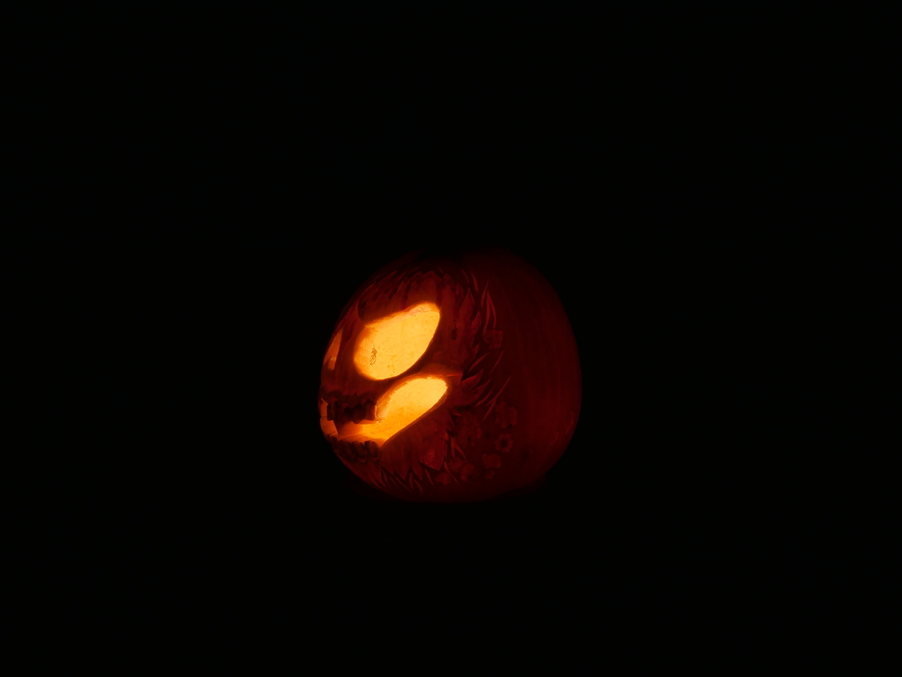

Es ist wieder die gruselige Jahreszeit und da muss man einen Kürbis haben. Da passt es doch ins Bild, dass mich wieder 
die Muse geküsst hat und ich mir einen neunen orangen Freund geschnitzt habe. 
Wie ich ein Kürbisgesicht palne, habe ich gemeinsam mit Tomcat schon beschrieben in dem Beitrag 
[Warum liegt denn hier Kürbis](/2014/10/warum-liegt-denn-hier-kurbis/).
Ich stelle euch hier und heute dann mal Dörte vor. 

Weil Dörte sehr vergänglich ist da sie schon einige Druckstellen hatte, als ich sie kaufte, haben meine bessere Hälfte 
und ich noch ein Fotoshootig mit Ihr eingeschoben. 

Dörte hat tapfer alles mitgemacht, im Folgenden zeige ich euch ihre 
besten Bilder.

Auch bei einem Fotoshooting geht manchmal etwas schief, hier wollten wir eine Rauchbombe starten und irgendwie war die 
Rauchbombe eine Funkenbombe.

Und zum Schluss gibts dann noch einen Rundumblick damit ihr Dörtes zauberhaftes Lächeln von allen Seiten betrachten 
könnt. 

Ich wünsche euch ein zauberhaft gruseliges Halloween, bleibt gesund und keep smiling, Eure Ermeline