Mein Hobby, Wolldecken zu stricken, entwickelte sich eher zufällig. Ich fand alte Hefte mit gestrickten Spitzendeckchen und probierte die Muster mit Wolle statt dünner Baumwolle aus. So entstanden mehrere Patches mit unterschiedlichen Mustern, mal rund gestrickt (die quadratischen) und mal in Hin- und Rückreihen (die länglichen). Die Verbindungsstücke habe ich an den Außenkanten der Patches aufgenommen und dann an 4 Ecken abnehmend nach innen gestrickt. Für die Umrandung wurde jedes kleine Quadrat über Eck gestrickt, also in jeder 2. Reihe die mittleren 3 Maschen zusammen gestrickt, bis alle Maschen abgenommen sind.

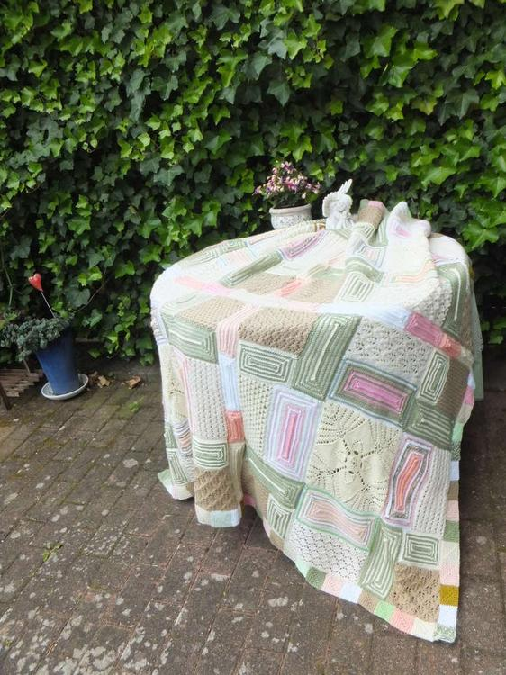
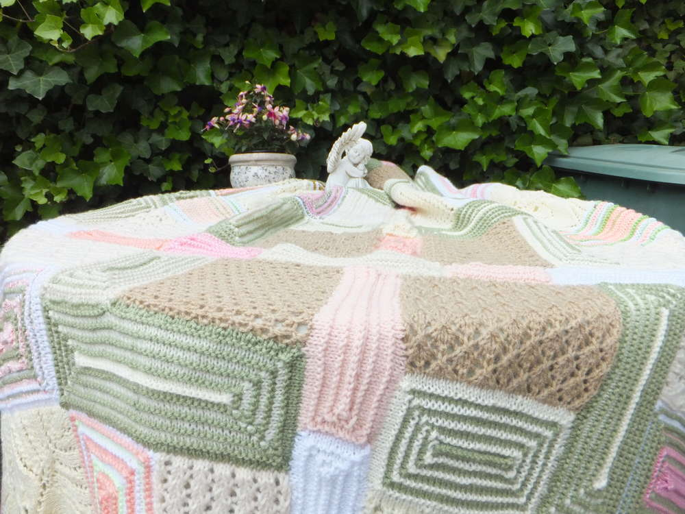

Einmal bekam ich einen ganzen Karton voller Restwolle in den unmöglichsten Farben geschenkt. Dazu fiel mir absolut nichts ein, bis ich dann die Reste mit Wolle in gemäßigteren, hübscheren Farben kombinierte. Mit einer dunklen Hintergrundfarbe (hier: schwarz) bekommen die kunterbunten Teile einen einheitlichen Rahmen. Diese Decke wird von außen nach innen gestrickt. Daher muß man sich schon ziemlich zu Anfang entscheiden, wie groß sie werden soll. Der weiße Mittelteil ist genauso gearbeitet, wie bei der vorherigen Decke beschrieben - nur in einer größeren Dimension (und mit einer sehr langen Rundstricknadel).

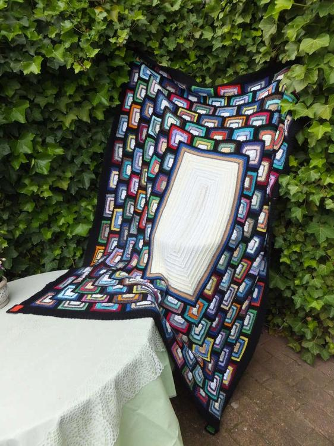

Die rote Stola ist ebenfalls nach diesem Prinzip gearbeitet. Ich habe dafür alles genommen, was ich an Noppen- und Lurexgarn und anderen möglichst edlen Materialien bekommen konnte.

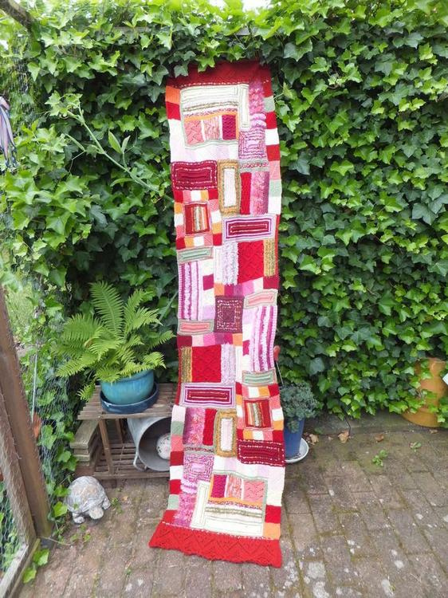
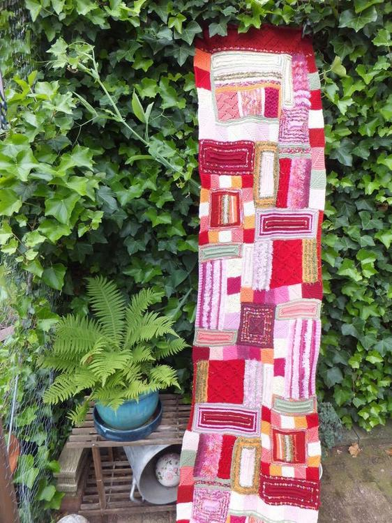
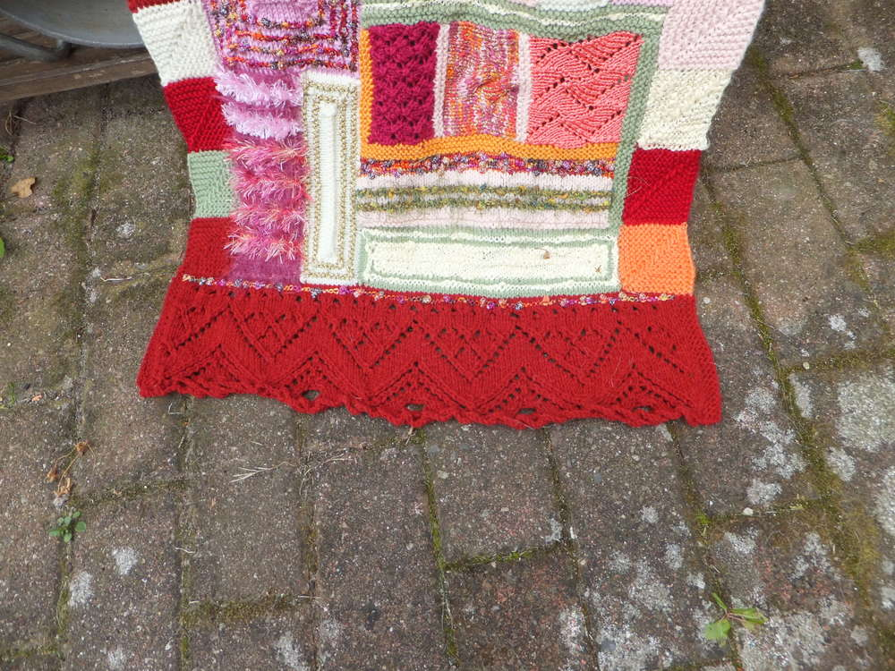

Die Decke auf dem Bett stammt aus meiner beginnenden Double-Face-Ära. Als Vorbild diente mir ein Exemplar von Kaffe Fassett, meinem Lieblingsdesigner. Aber ich habe sie noch ein bißchen abgewandelt. Die bunten Patches im Karomuster wurden mit melierter Wolle (feste Maschen) umrandet und dann mit dunkler Wolle zusammengehäkelt.Man kann die Decke je nach Anzahl der Patches in jeder beliebigen Größe nachmachen.

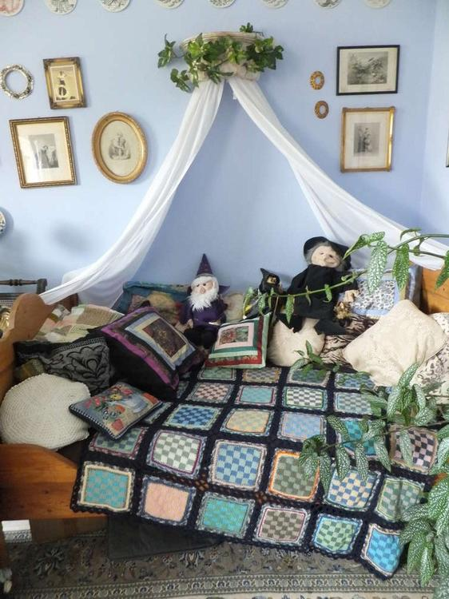
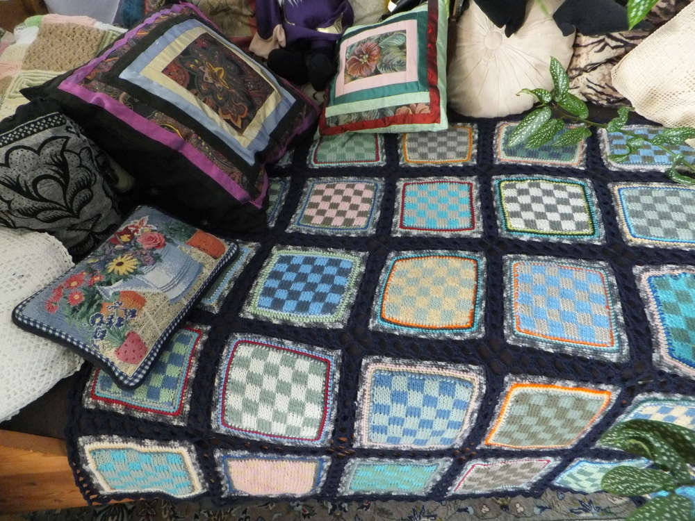

Auch für die nächste Decke stand der liebe Kaffe Pate. Aber während er sie in einem Stück gearbeitet hat, habe ich die Strickrichtung geändert und ein gutes Dutzend Streifen in verschiedenen Breiten und Mustern erst doppelt gestrickt und später zusammengenäht. Als Umrandung wählte ich dann noch zusätzlich ein Streifen- und Karomuster und habe schließlich noch 2 Runden darumgehäkelt.

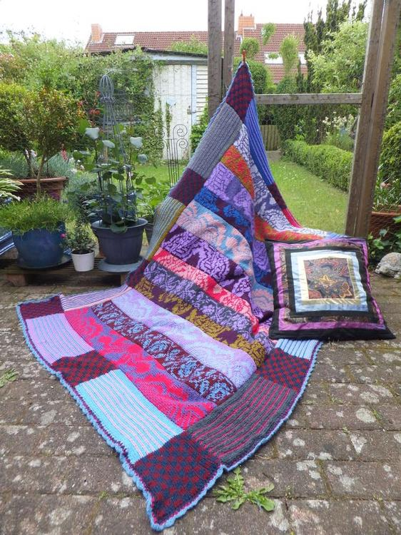
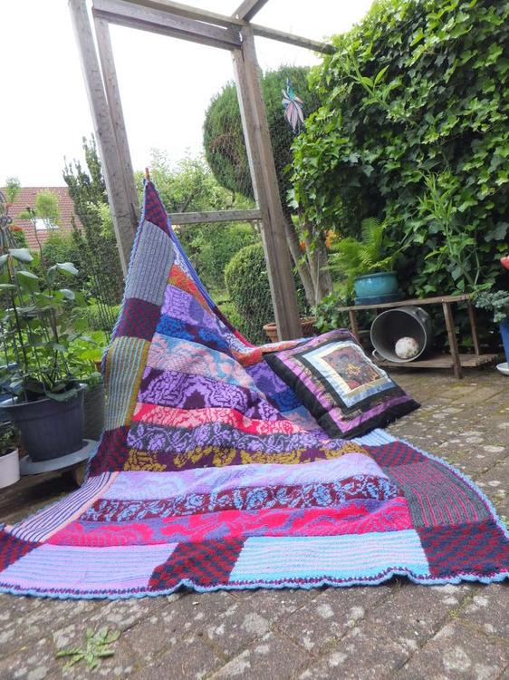

Meine nächste Decke hatte ich schon lange im Kopf, bevor ich endlich die passende Wolle fand (mintgrünes und wollweißes Mohairgarn) und dann in die Tat umsetzte. Sie ist auch wieder im Double-Face-Verfahren gearbeitet, aber eben nicht aus Restwolle. Die Mitte ist aus einem Teil (also: viele Maschen - lange Rundstricknadel!) und hat ein ziemlich einfach zu strickendes Rautenmuster. Der Rand ist in Rechtsrippen (Hin- und Rückreihe re M) jede Seite für sich gemacht, weil eine ganze Runde einfach zu viele Maschen hätte.Weil mir die Decke nach dem Zusammennähen aber noch zu langweilig aussah, habe ich noch ein paar Blumen gestrickt und mit Nähgarn aufgenäht. Die einzelnen Blütenblätter werden um eine kleine Häkelrosette herum genäht. Die Knospen bestehen aus nur eine länglichen Blütenblatt.

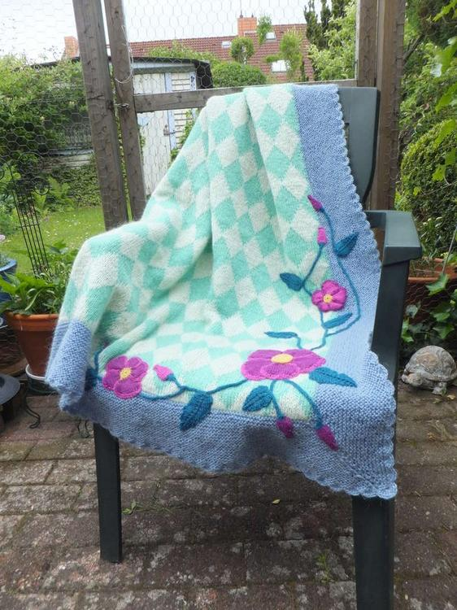
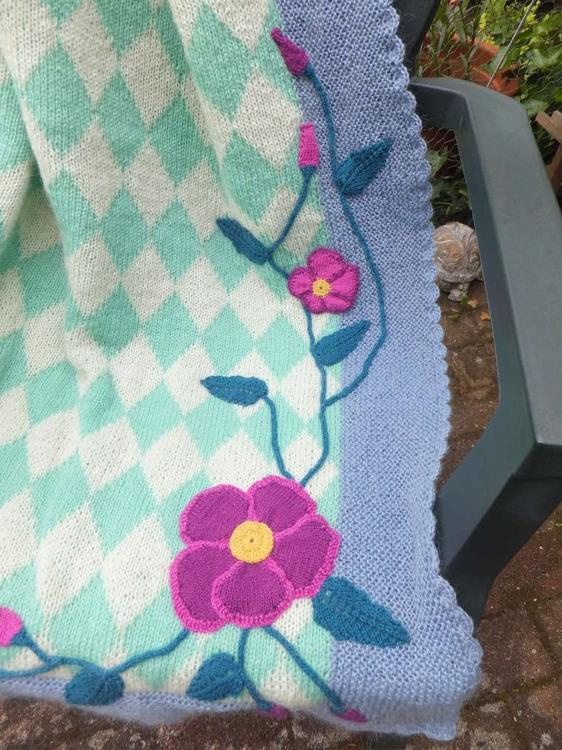

Mein letztes Werk dieser Art ist eine Hommage an Marilyn Monroe, von der ich ein Fan bin. Das Zählmuster für ihr Konterfei läßt sich mit einem speziellen Programm am PC herstellen. Am besten fügt man bei dem Strickteil alle 10 Maschen einen dünnen!!! Hilfsfaden ein und markiert so auch das Zählmuster, denn sonst kommt man bei mehreren hundert Maschen leicht mal durcheinander. Drumherum habe ich in Streifen die US-Flagge gearbeitet. Die Sterne sind gehäkelt, die Rose wie bei der Rautendecke gestrickt.

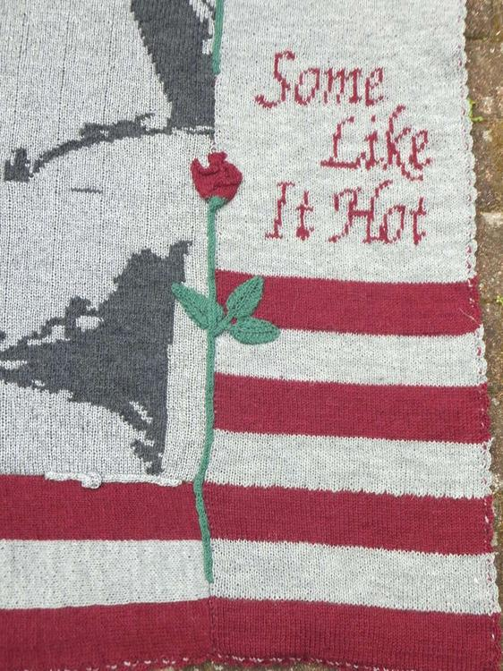

