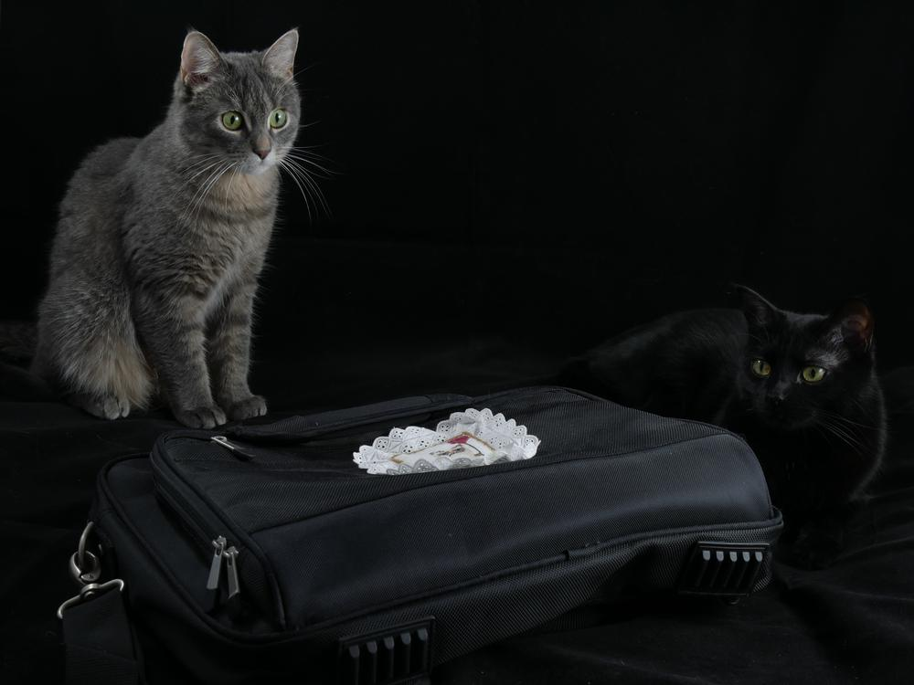
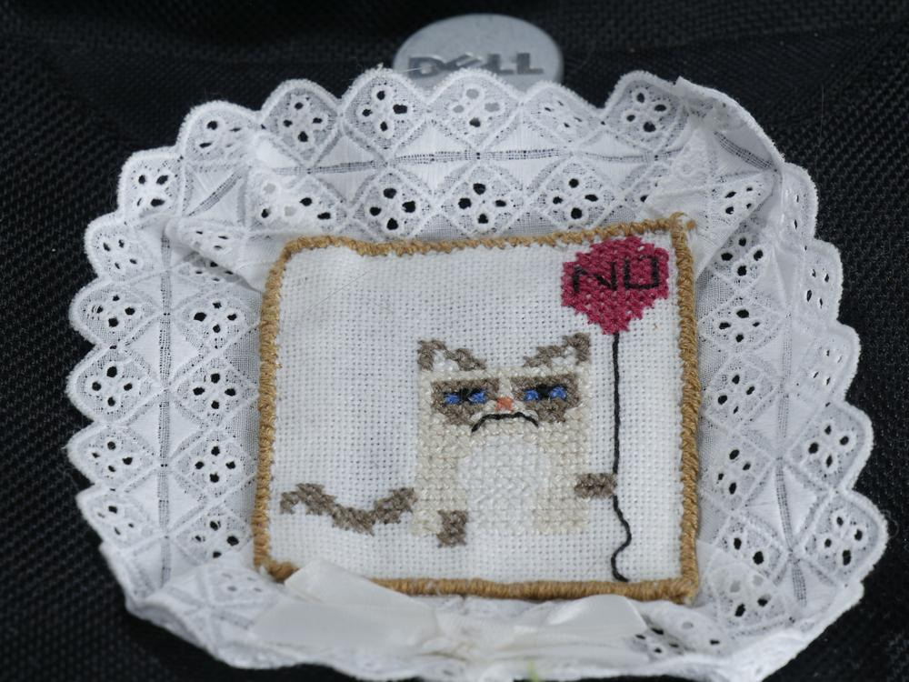

Es sind die kleinen Dinge, die einen schlechten Tag zu einem guten werden lassen können. Es gibt diese Tage, da hat man das Gefühl auf nichts Lust zu haen und nichts zu schaffen. So ein Grumpy-Tag war es auch, als ich meine Laptoptasche aufhübschte. 

Die Stickerei lag schon lange ungenutzt herum. Nun hatte ich endlich eine Verwendung, denn Laptoptaschen gibt es wie Sand am Meer und sie sehen alle gleich aus. In meine Tasche passt tatsächlich auch aller Kram für die FH und die wollte ich individualisiert haben. Also ein wenig Nähen dort und Spitze da, ein Schleifchen und schwupps... man erkennt, dass die Tasche mir gehört.

Mein Tag war schlagartig besser, manchmal ist das so. Als meine beiden Schnuffels dann auch noch so brav bei den Fotos waren, hat das natürlich allem noch ein Krönchen aufgesetzt.

Ich wünsche euch einen ungrumpigen Sonntag, Eure Ermeline.
