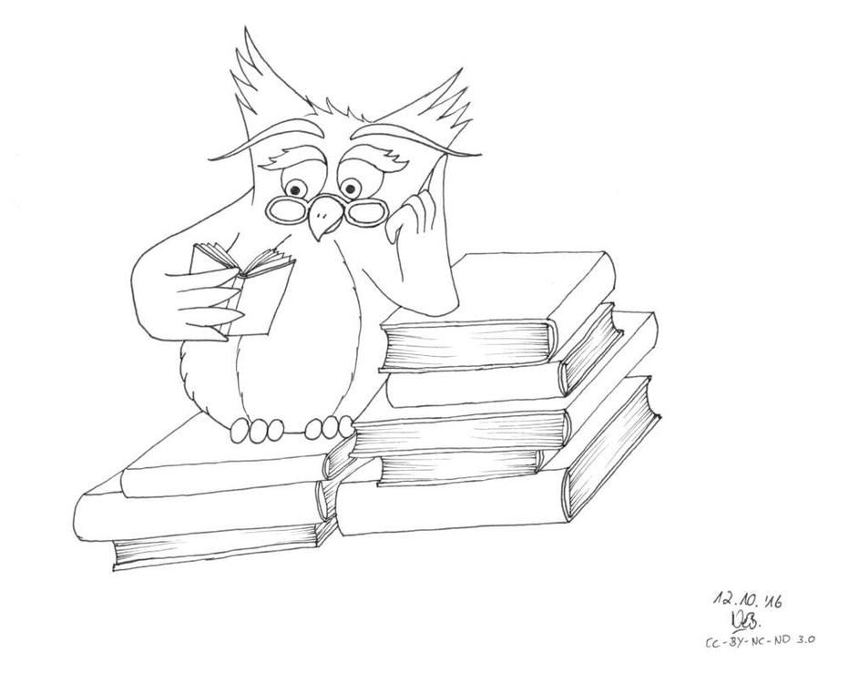

Gelegentlich küsst mich dann die Muse über Umwege. In diesem Falle war es eine Kollegin, die sich für Lesezeichen und Karteien aussagekräftige Bilder wünschte wie zum Beispiel Leseratte und Bücherwurm. Was sie im Internet fand ließ sich schwer aufgrund verschiedener Lizenzen verwenden auch entsprachen diese Bilder nicht ihren Vorstellungen. Da hab ich mich dann mal selbst rangesetzt. Zwei Bilder sind noch nicht fertig coloriert, der Rest kann sich schon sehen lassen. Nach dieser Aktion weiß ich jetzt aber auch, warum ich es immer nur bei Skizzen und Outlines belasse, das Anmalen dauert mir einfach zu lange. Diese Bilder laufen unter der Lizenz CC-BY-NC-ND 3.0 sie dürfen verwendet werden, jedoch nicht kommerziell, ohne Abänderungen und mit Nennung des Urhebers. 
Es hat mal wieder Spaß gemacht zu zeichnen, demnächst fängt dann aber auch die Filz-Saison wieder für mich an. 

## Der Bücherwurm 

## Die Büchereule oder Leseeule

## Die Leseratte

Einen kuscheligen, lesefreudigen Herbst und einen schönen Sonntag wünscht Eure Ermeline.

