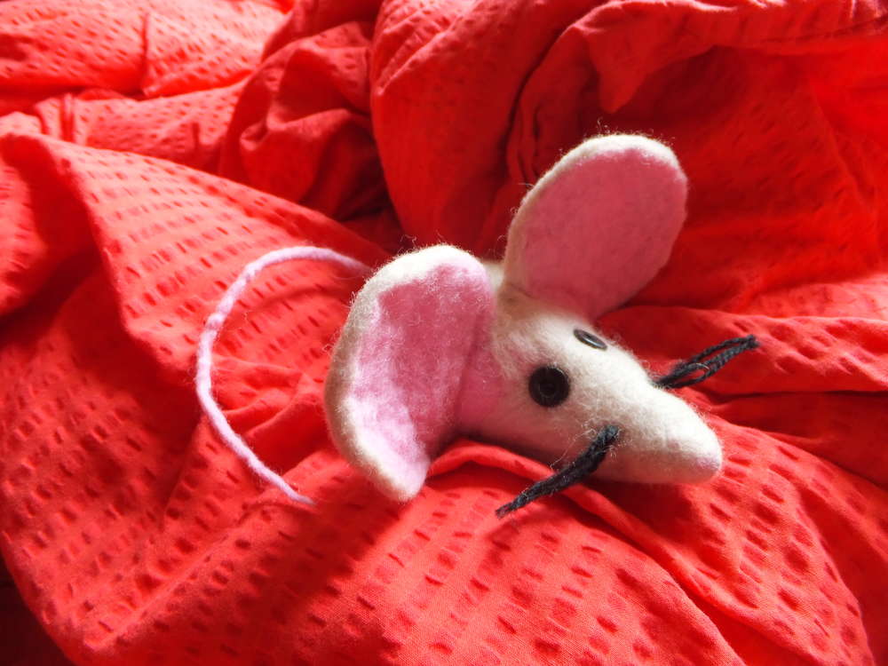
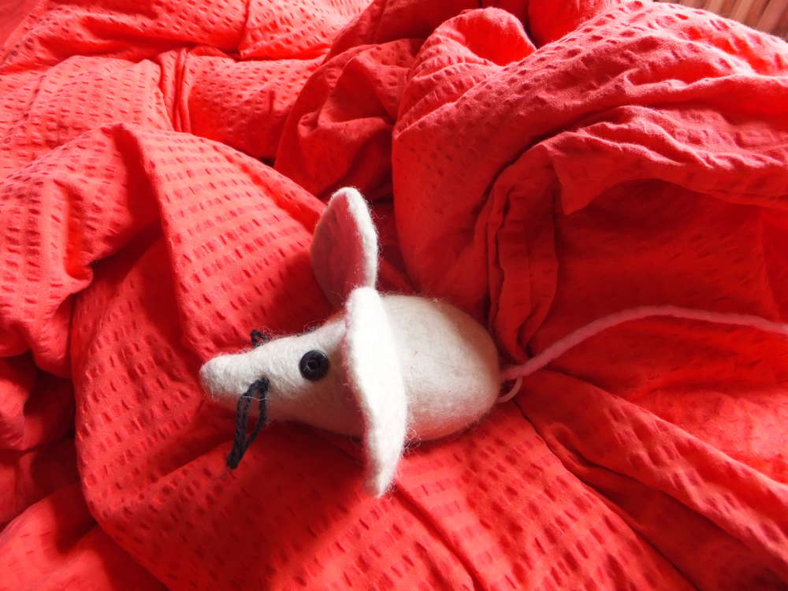
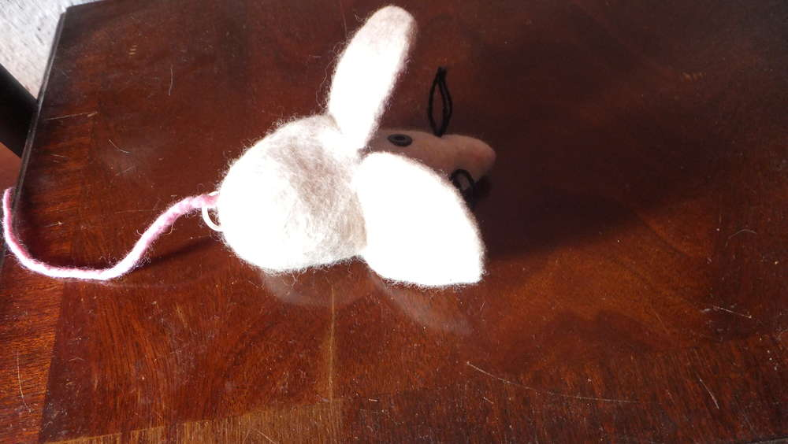

Und die Maus antwortet: "Rrrrrrrrr"... Tja, dieses kleine Kerlchen entstand gestern Abend in einem Wahn von Ich-muss-heute-noch-unbedingt-was-filzen. Ich hab von einem kleinen Aufziehspielzeug für Katzen das Rüttelmodul (heißt das so? Ihr wisst schon was ich meine) ausgebaut (man könnte auch sagen das Spielzeug unterlag meiner Schere und wurde brutalst zerhackstückt :) ). Dieses besagte Modul um das es mir eigentlich ging habe ich nun mit vielen Lagen Wolle umwickelt und versucht eine mauseähnliche Form hinzubekommen, dann ab mit Mausi in einen Probierstrumpf, nass machen, einseifen und schön Ei ei ei machen damit das Mausi filzt. Tadaa und sie rödelt fröhlich vor sich hin.
