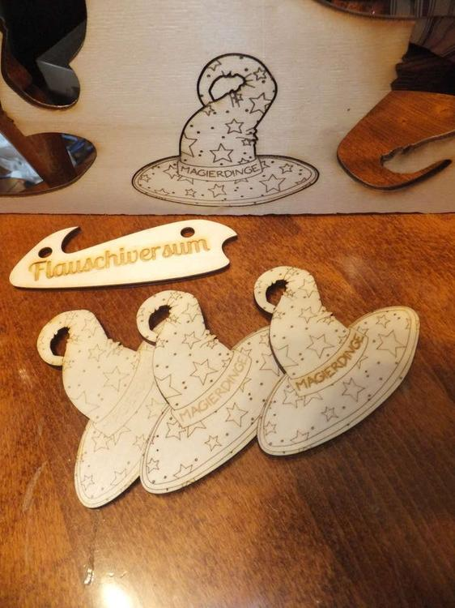
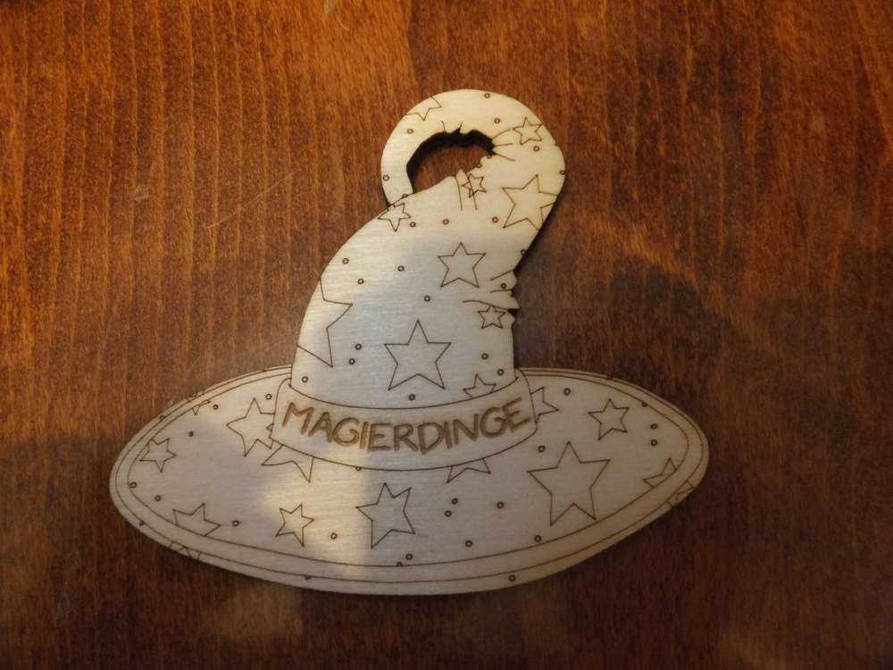
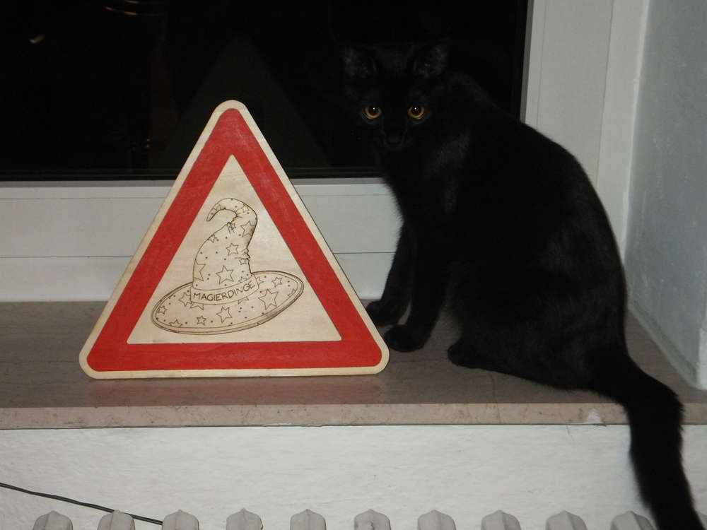

Dies ist ein Branding, wie ich es von Hand nie zu stande bringen kann. In Kiel hat das [FabLab](http://fablab.sh/) seine Tore geöffnet. Dort gibt es neben vielen anderen interessanten Gerätschaften einen Lasercutter. Den haben wir uns mal vorgenommen, mit einer Zeichnung, die wir mit InkScape zu einer Vektorgrafik umgewandelt haben, ist innerhalb von 3 Minuten der erste kleine Magierdinge-Spitzhut entstanden. Nach ein paar Nachjustierungen in der Brennstärke, kann man auch den Schriftzug zufriedenstellend lesen. Fertig sind unsere Anhänger für die [Bewahrer des Gleichgewichts](https://magierdinge.de/). Im ersten Testlauf wurde auch noch ein kleines Flauschiversum-Schild aus einem Reststück erschaffen.

Das Witzigste und der eigentlich Grund für unseren Besuch im FabLab war jedoch dieses Warnschild. Wenn unsere Magier mal wieder ein vermurkstes Ritual durchführen oder allgemein Blödsinn machen, dann müssen wir unbedingt dieses Warndreieck aufstellen. Leider kann ich gerade kein anderes Foto hochladen, da das Schild schon zu diesem Zeitpunkt die erste Bewährungsprobe auf CON hat. Aber was ich dazu erzählen kann ist, dass ich mit nachtleuchtender Farbe ein paar Akzente gesetzt habe, denn auch des Nachts ist man nicht sicher vor dem Wirken der Bewahrer des Gleichgewichts.

