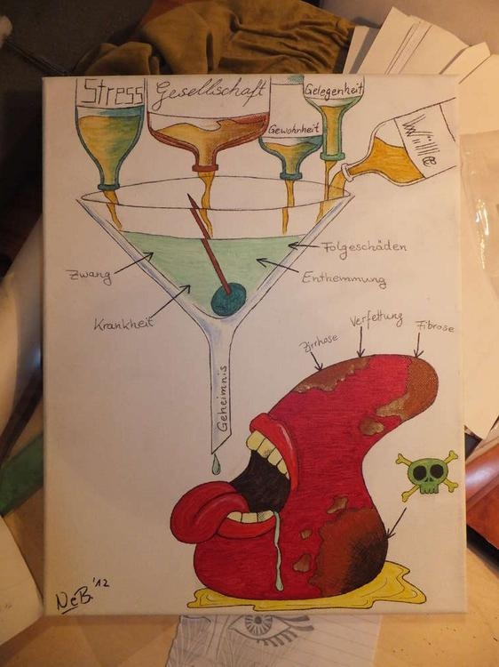

So dieses Werk entstand im Ernährungslehreunterricht. Es sollten laut Aufgabe, die Ursachen und Folgen von übermäßigem Alkoholkonsum visualisiert werden. Die Zeichnung gefiel mir so gut, dass sie direkt mit Ölfarben auf Leinwand gebannt wurde.
