Es war einmal ein Acrylmal-Wochenende in der schönen Schule... Naja unbedingt schön ist es nicht am Wochenende in der Schule zu sein, aber das Endergebnis stellt doch sehr zufrieden und darf aufgehängt werden. Auf einer Leinwand von 60 * 80 cm hab ich mich zunächst, komplett am Prozess orientiert, ausgetobt.

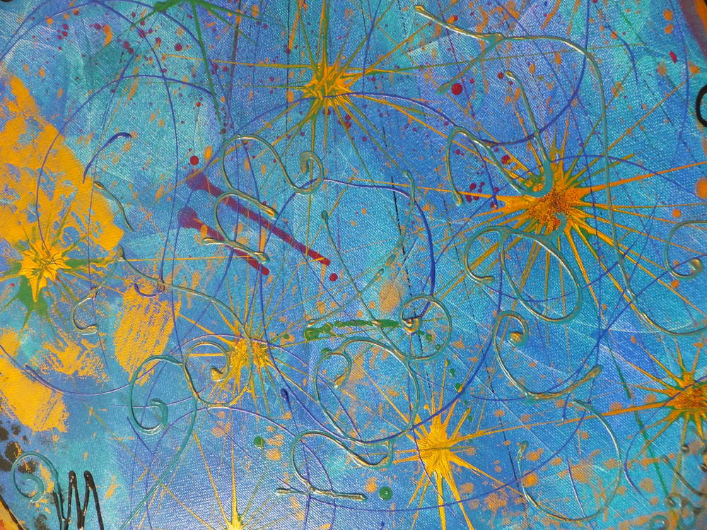

Es hat damit angefangen, dass ich zunächst mit zwei verschiedenen Blautönen und unter Zuhilfenahme eines Spachtels, eine Basis geschaffen habe. Die auf deisem Bild sichtbaren Farbkleckse sind mit der Marmorier-Technik gemacht, dazu wird mit Wasser verdünnte Farbe auf die Leinwand getropft und eine andere Farbe hinzugefügt und dann mit einem Zahnstocher zu Mustern verwirbelt. Ein bisschen Glitzer schadet an dieser Stelle nie! Wer genau hinschaut erkennt den als letztes hinzugefügten Schriftzug "I'm not crazy, my reality ist just different than yours!" als Zitat der Grinsekatze aus Alice im Wunderland. Den Schriftzug und auch die Wirbel habe ich mithilfe von Spritzflaschen gemacht, diese haben eine kleine Öffnung, mit deren Hilfe man gezielt applizieren kann. Später habe ich noch mit einem Schwamm eine andere Farbe über die angetrockneten, erhabenen Buchstaben drübergestrichen.

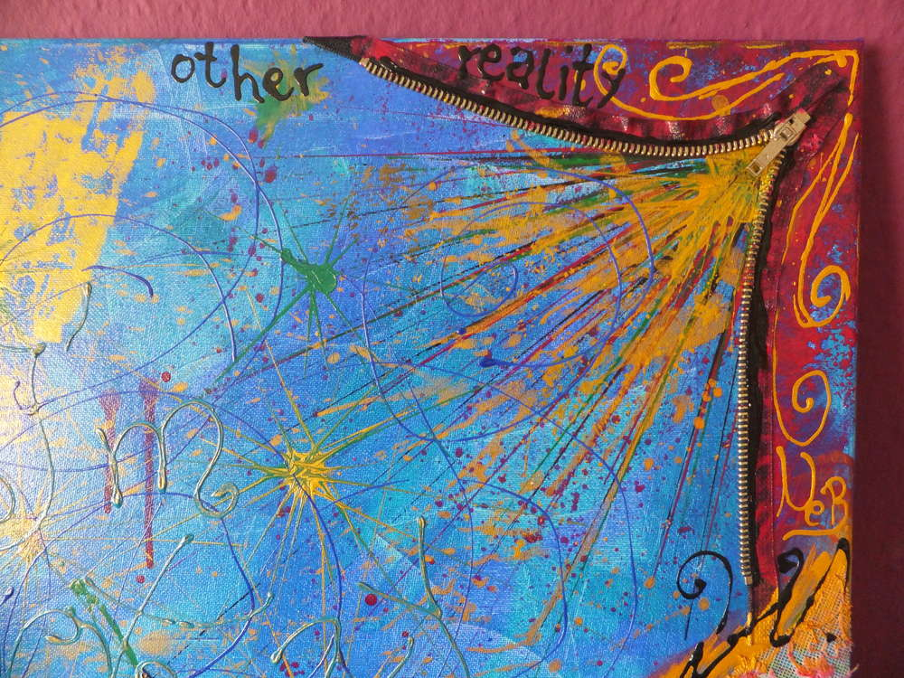

Als nächstes habe ich dann mit einem Schwamm und dem Pink experimentiert und auch mit dem Spachtel die Strahlen aus der Bildecke gezogen. Ich habe auch verflüssigte Farbe mit einem Strohhalm über das Bild gepustet. Da kam mir dann die Idee den Reißverschluss einzuarbeiten, weil so ein starker Kontrast entstehen würde. Es steht das geteilte "other reality" was den Spruch der Katze noch untermalen soll auf den gegensätzlichen Seiten des Reißverschlusses. Fast so als wäre die kleine Ecke hinter dem Reißverschluss die diesseitige Realität und die verspielte Seite der Grinsekatze die "Andere" Realität.

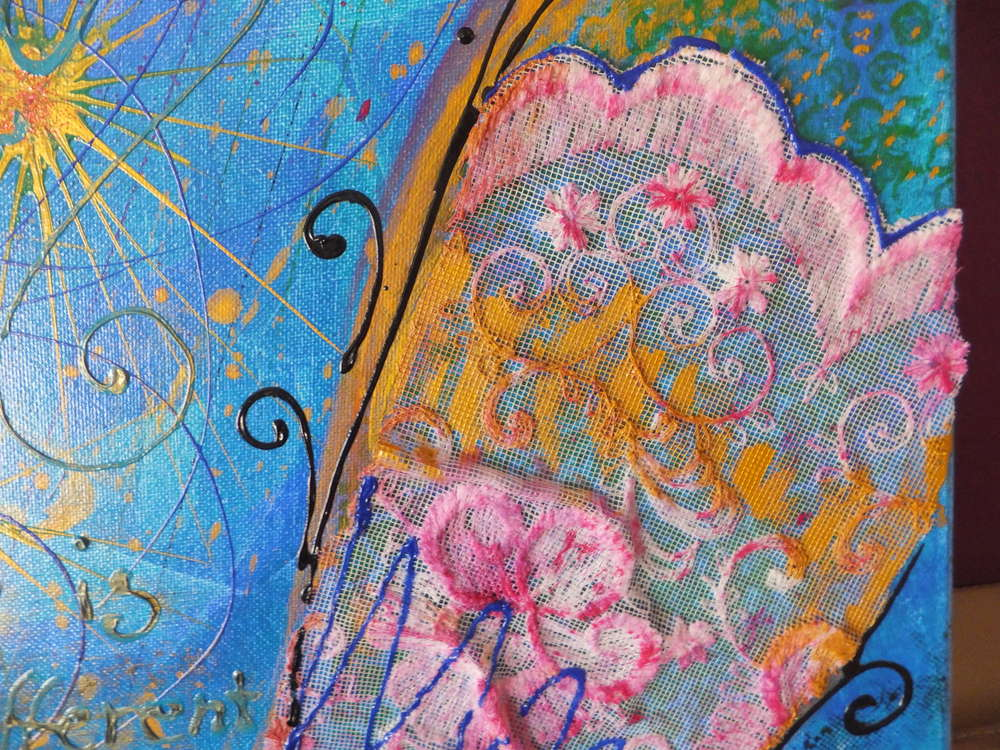

ich habe auch recht früh mit Krebband ein paar Streifen abgeklebt und so den Platz gefunden, an den meine mitgebrachte Spitze angebracht werden sollte. ich habe sie mit einem zarten rosa-pink abgetupft, sodass die Struktur mit den Blumen farbig wurde.

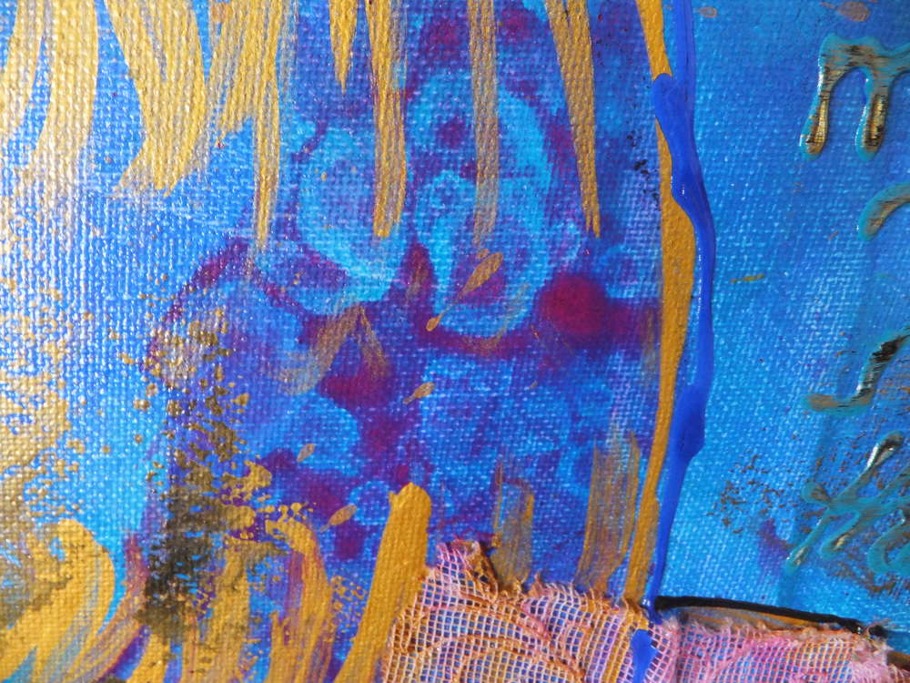

Auf diesem Bild kann man das Pink auf blauem Untergrund erkennen, es hat eine gepardenähnliche Fleckenoptik, diese wurde erzielt, indem verflüssigte Farbe mit dem Schwamm aufgetragen wurde und dann mit Brennspiritus Tropfen drüber gespritzt wurden (macht dabei ein Fenster auf!!), dies hat dafür gesorgt, dass die Farbe dem Spiritus ausweicht. Da es sich schnell verflüchtigt, gibt es keinen Einfluss auf die schon getrocknete Farbe.

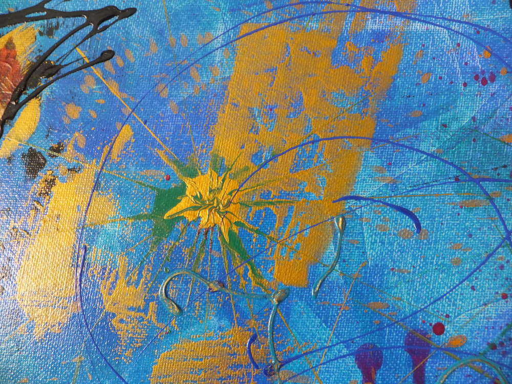

Das Gold habe ich mit einer Folie, die ich mit Farbe eingestrichen habe aufgegtragen, dazu wird die bestrichene Folie auf die Leinwand gelegt und nur minimal angedrückt, so entstehen die interessantesten Strukturen.

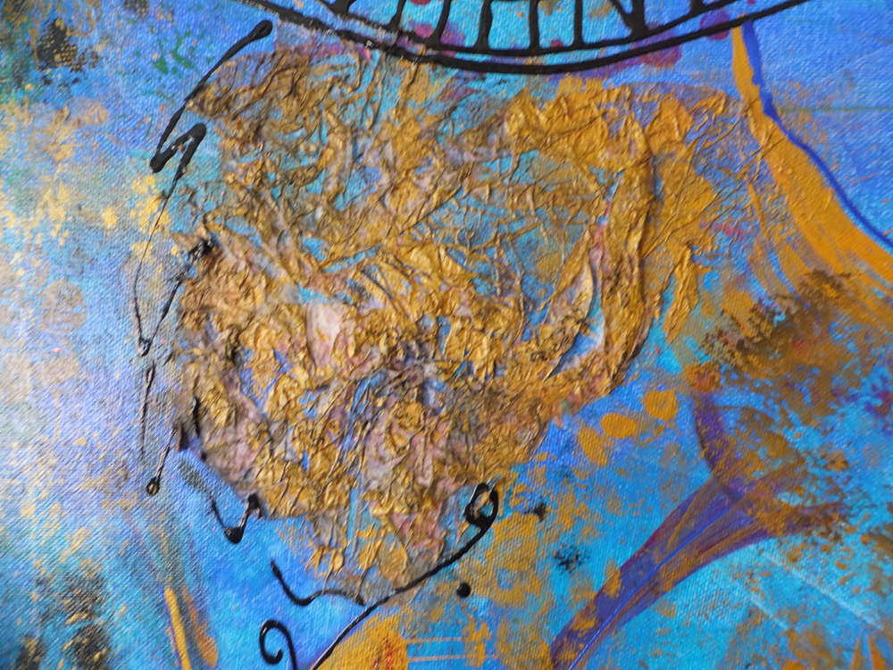
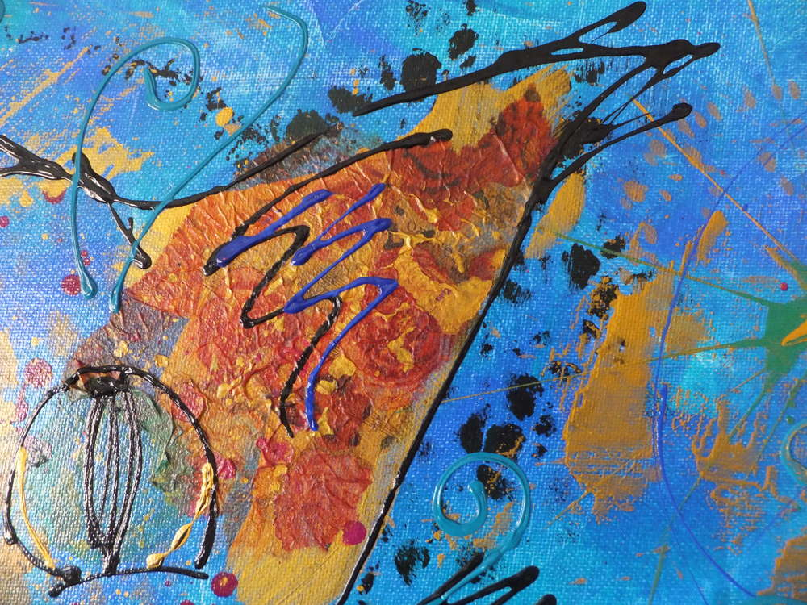

An diesen Stelle habe ich mit der Serviettentechnik gearbeitet, ich habe also auf die noch nicht getrocknete Farbe Serviettenstücke aufgelegt. Damit es sich besser an das Bild schmiegt, habe ich an den Ohren nur die farbintensivste, erste Serviettenschicht genommen, den Rest habe ich bei dem Brustfell verwendet.

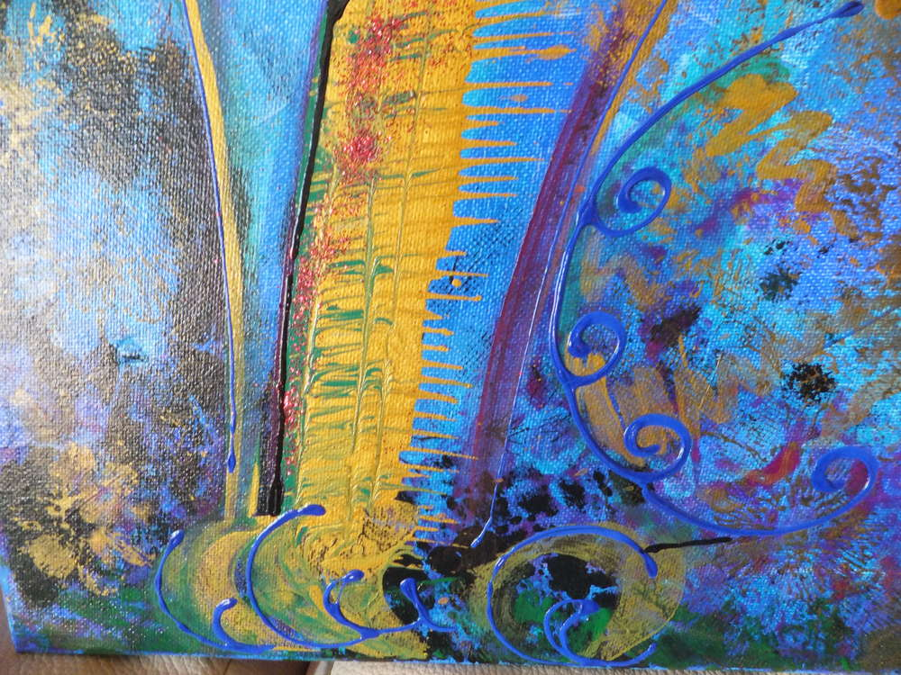

Auch hier kann man nochmal die Marmoriertechnik sehen, an dieser Stelle habe ich bewusst begonnen die Katze heraus zu arbeiten.

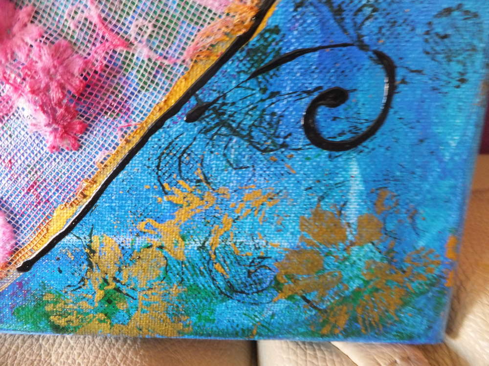
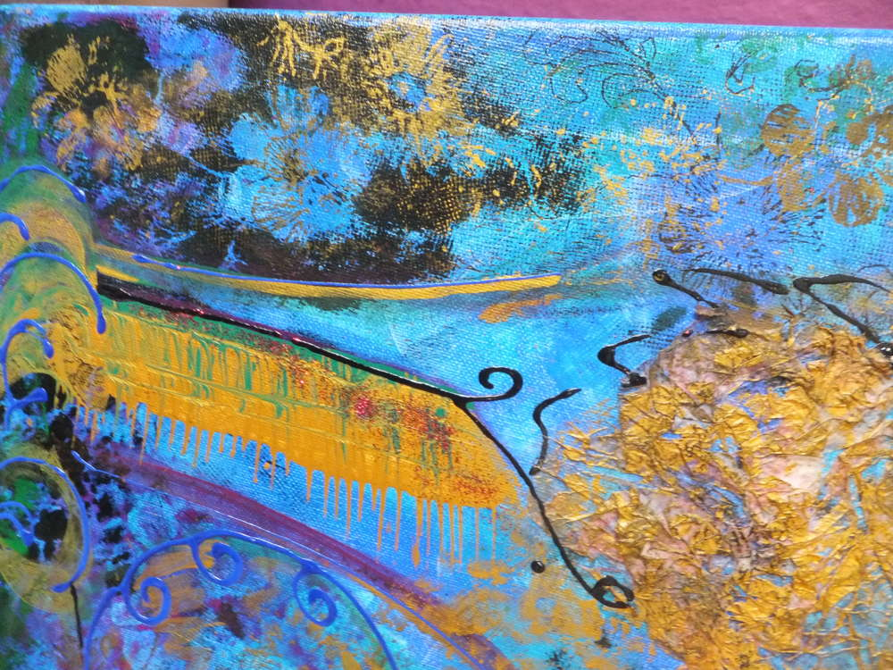

Hier habe ich mit den Stoffresten vom Schwanz gearbeitet, ich habe sie mit einer Farbrolle angestrichen und dann das Muster aufs Bild gedruckt, an manchen Stellen habe ich auch den Stoff auf dem Bild selbst abgerollt und so im Negativ die Blumen auf das Bild gebracht. Hier ein Stempel, da ein Stempel...

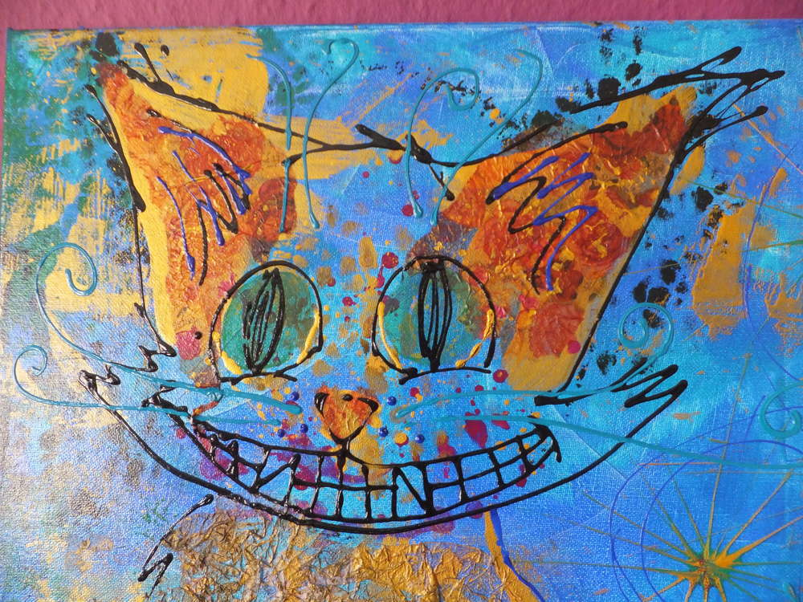

Zum Schluss habe ich dann die Katze mit den Spritzflaschen konkretisiert und ein paar leichte Konturen gemacht, die Grinsekatze (wie es ihre Art halt so ist) verschmilzt dadurch leicht mit dem Bild, ist aber auf den nächsten Blick noch erkennbar.

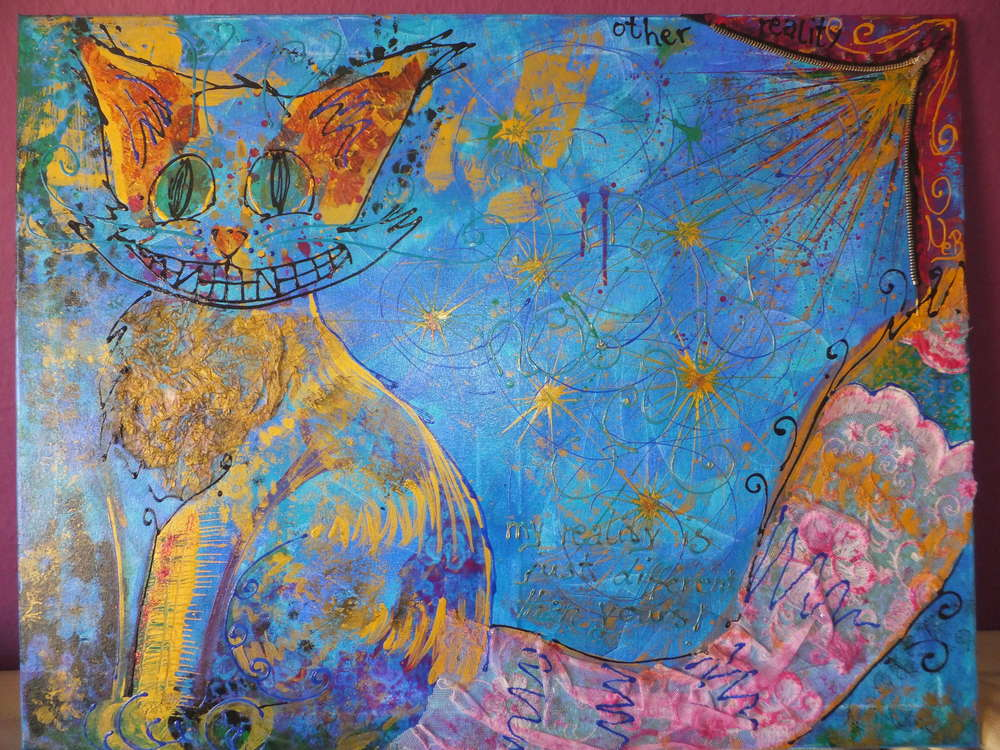

Nachdem das getrocknete Bild noch mit einer Schutzlasur versehen wurde, gläntzt es richtig und die Farben strahlen. Mich erinnert der Stil und die Farben ein wenig an eine Kreuzung aus Rosina Wachtmeister, Friedensreich Hundertwasser und Gustav Klimt - ein echter Wollknoll halt :D
