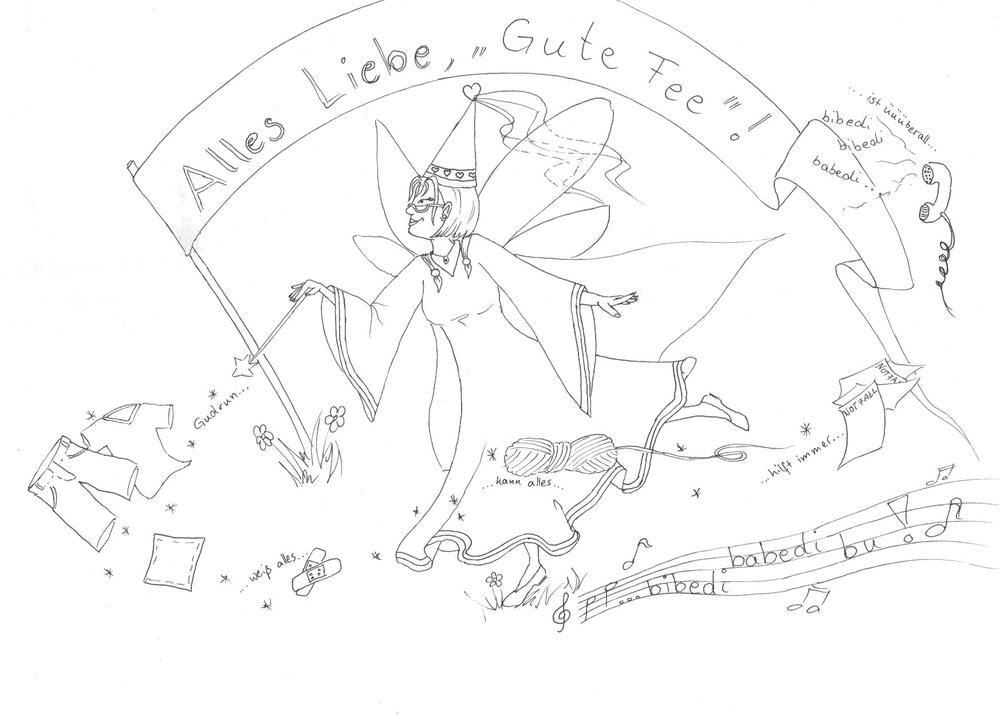

Gute Kollegen müssen gewertschätzt werden. Ich habe immer besonders große Freude daran, mich kreativ für einen guten Zweck auszutoben. Das habe ich schon bewiesen mit dem [Riesenbuntstift](/2017/07/starwars-riesenbuntstift/) und ich will hier noch zwei kleine Karten zeigen, die für zwei weitere Kollegen entstanden sind.

Die erste Karte ist für unseren Hausmeister zur Pensionierung enstanden. Er hat sich nicht nur mit den alltäglichen Reparaturen beschäftigt, sondern auch in anderen Aktivitäten viel Engagement gezeigt, wie z.B. in einer Fußball-AG, die hier Inspiration für die Karte war.

Ein paar Bilder vom Entsehungsprozess will ich euch nicht vorenthalten, natürlich hatte ich flauschige Unterstützung.

Das tolle an dieser Popup-Karte ist, dass man damit sogar Kicken kann.

Auf dem Fußballfeld haben dann die Kollegen unterschrieben.

Diese [individuellen Basteleien](/2016/04/popupbox/) machen mir immer besonders viel Spaß. Und eine meiner Lieblingsstücke, weil sie für ein echtes Goldstück geschaffen wurde, bereitete mir besonders viel Freude.

Die wirklich gute Fee der Grundschule, hat diese vor Sympathie strotzende Karte wirklich verdient. Zum Dienstjubiläum sollten alle Kinder (was über 400 Bilder bedeutet) ein Bild von ihr malen, und ich schloss mich dieser Aufgabe an, denn direkt bekam ich die Idee zu diesem Bild.

Was soll man dazu noch sagen, in solchen Fällen freut man sich doch so tolle Kollegen zu haben.

Einen kollegialen Sonntag wünscht Eure Ermeline.

