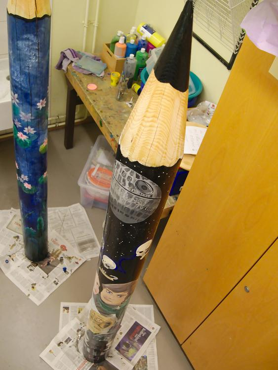

Ich bin StasWarsFan genug, um diesen Stift selbst behalten zu wollen. Leider ist dies nicht möglich, denn er ist als Abschiedsgeschenk für einen langjährigen Kollegen gedacht und nicht ich habe den großen Stift, der die Grundlage meines künstlerischen Wirkens ist, gekauft. Aber sind nicht die schönsten Geschenke die, die man selbst behalten will?

Auf dem Flur sprach mich meine Chefin an: "Sag mal, du bist doch so kreativ unterwegs?" "Joa so'n bisschen.", sagte ich lächelnd. 
Als sie mir dann sagte was sie wollte und für wen der Stift bemalt werden sollte, war mir das Thema sofort klar und ich war so angefixed, dass ich mich Zuhause hinsetzte und direkt nach Feierabend die erste Skizze machte, die ich am nächsten Tag (meinem dienstfreien Freitag) direkt meiner Chefin zeigte. 

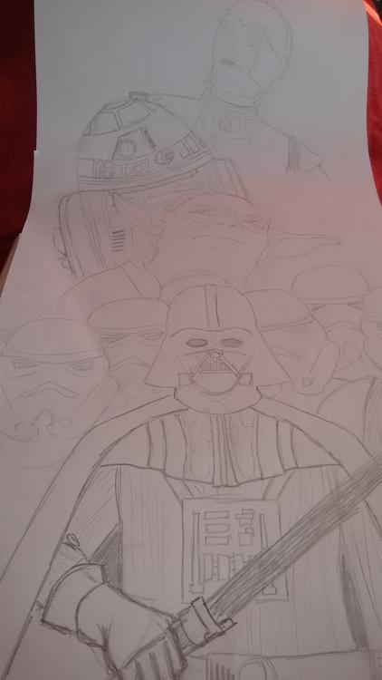
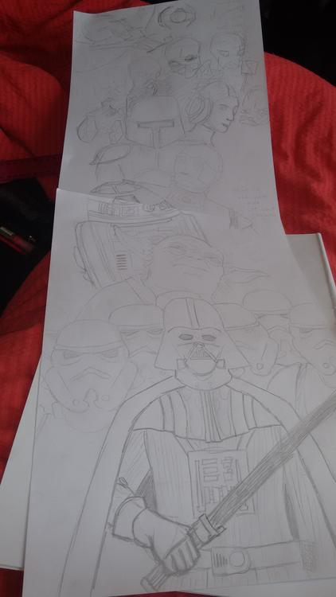

Sie ließ mir freie Hand, mir schien es aber zunächst auch so, dass kaum einer glaubte ich würde es so hinbekommen, wie es letztendlich wurde, aber ich liebe es ja immer wieder, wenn ich Leute positiv überraschen kann. 
Mit etwa 2m Höhe und ca. 55cm Umfang hatte ich eine große Leinwand der etwas anderen Art, die ich zunächst mit grobem Schleifpapier von den gröbsten Splittern befreite und danach mit verdünnter weißer Wandfarbe grundierte. Schon stand ich vor dem nächsten Problem: wie bekommt man denn jetzt vernünftig das gewünschte Bild auf die gebogene Fläche? Erstmal suchte ich mir aus dem Internet Vorlagen, die ich auf den Stift übertragen wollte, ich skalierte sie auf die gewünschte Größe und malte die Rückseite der Vorlagen mit einem weichen Bleistift komplett an. Auf diese Weise habe ich mir ein Pauspapier gemacht, das ich wegradieren kann und ich spare mir viel mögliches Verrutschen dadurch, dass nur ein Blatt am Stift fixiert und die Konturen durchgepaust werden müssen. 
So übertrug ich Charakter um Charakter auf den Stift und zeichnete sie nochmals nach. Allein bis jetzt waren schon ca. 6 Stunden ins Projekt geflossen. 

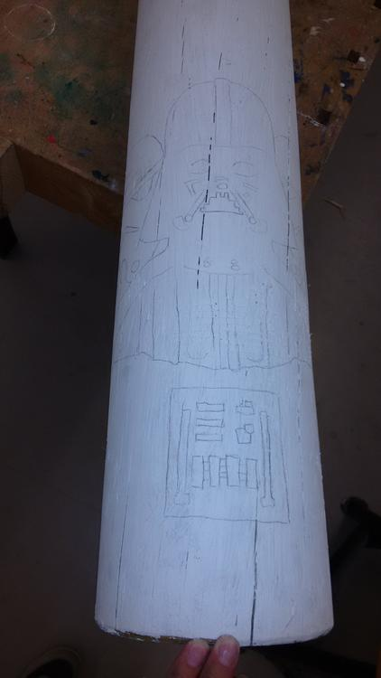
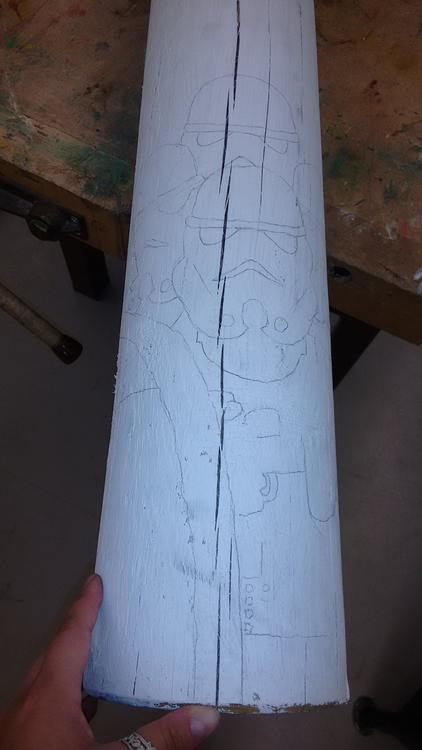
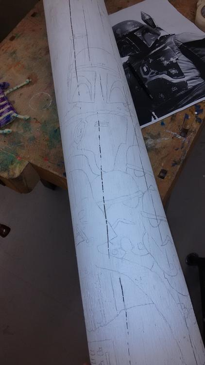

Und dann ging es los, anmalen. Ich begann oben, was sich als gute Entscheidug herausstellte. Zum Einen würde ich so evtentuell herabtropfende Farbklekse übermalen können und sie würden kein schon vorhandenes Bild zerstören, zum Anderen hatte ich so nach einer Freitagsmaleinlage die schwierigen Gesichter fertig und danach war die Luft dann auch, wegen sich anbahnender Krankheit meinerseits, raus. Im Folgenden seht ihr Bilder während der Entstehung.

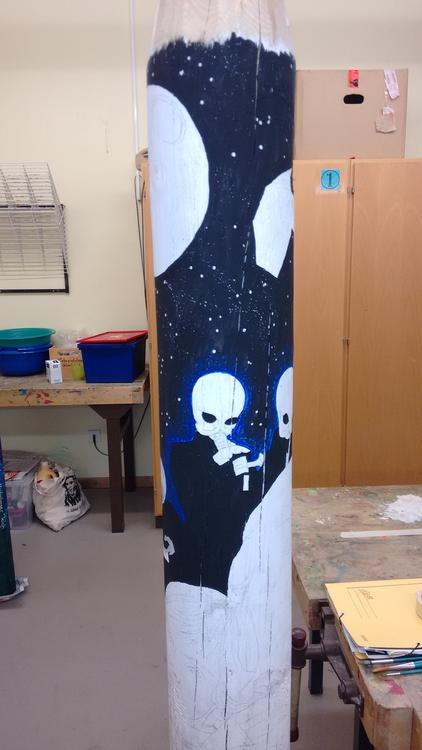
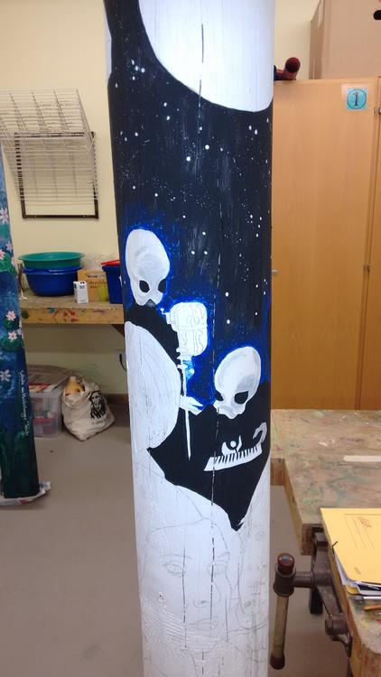
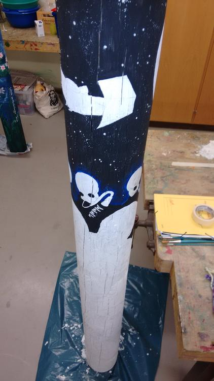
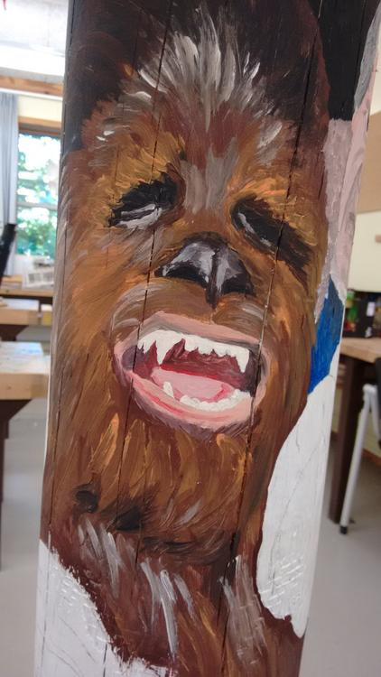
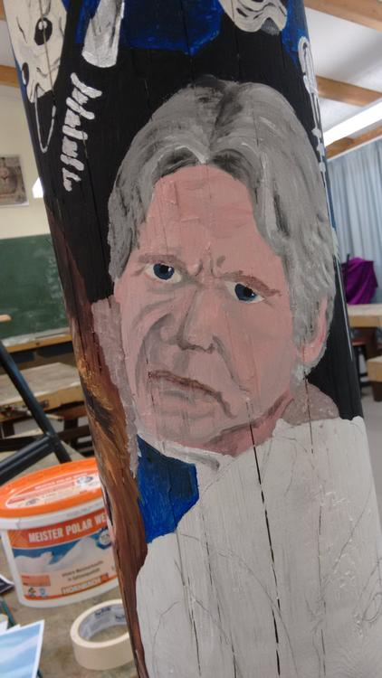
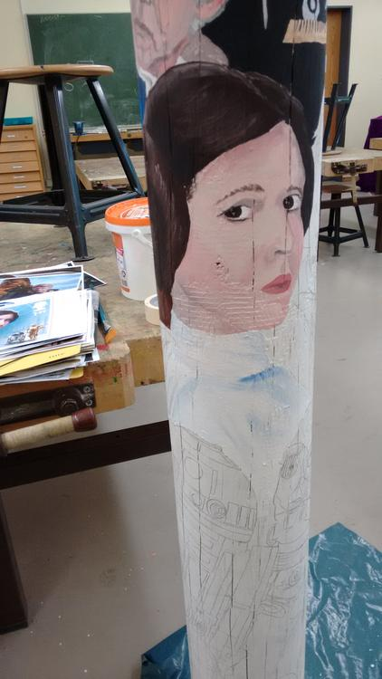
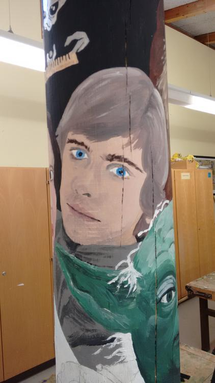
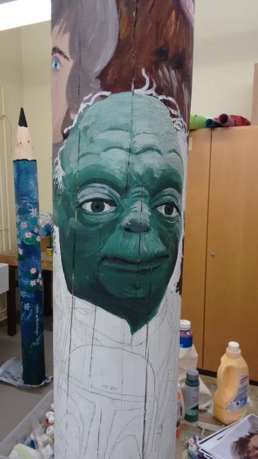

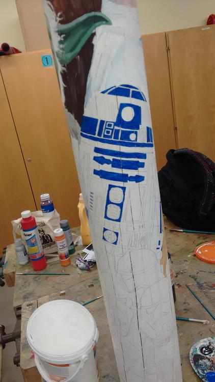
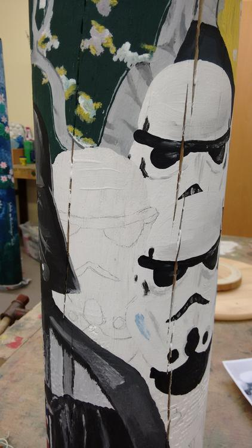

R2D2, die Sturmtruppen und DarthVader waren sehr gnädig mit mir und so konnte ich mich diesen einfach zu zeichnenden Charakteren auch in nicht so geistig und körperlich fittem Zustand widmen. In der Zwischenzeit hatten viele Kollegen hier und da reingeluschert und die Begeisterung gab mir die nötige Kraft in kürzester Zeit diesen Stift fertig zu bekommen. Die  wohl beste Reaktion, war die meiner Chefin, die in der Tür stehen blieb, bedächtig auf den Stift zuging und fragte: "Hast du mal Kunst oder sowas studiert?" "Nee, ich male nur gerne mal." spätestens jetzt war ihr, glaube ich, klar, dass ich die Richtige für den Job war. :) Seele-streicheln!! 
Aber auch Nervenkitzel durfte bei der ganzen Sache nicht fehlen, denn der Kollege durfte von der ganzen Aktion ja nichts mitbekommen, das war schon recht brenzlich, als er einer Gruppe Personen die Einrichtung zeigte und ich seine Stimme direkt vor dem Werkraum vernahm. Das Herz rutschte mir in die Hose, ich ließ alles fallen, rannte zur Tür, steckte den Schlüssel ins Schloss, schloss ab, ließ den Schlüssel stecken und hielt die Türklinke fest. 

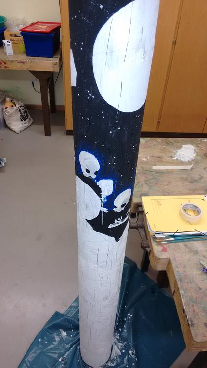
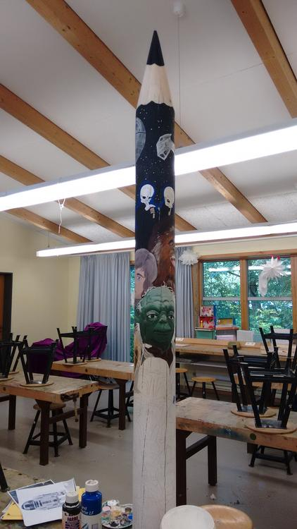
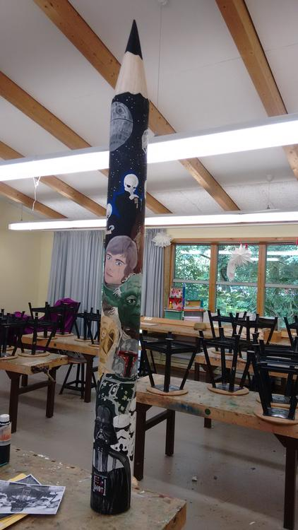

Ich gebe zu, ich habe die Chance genutzt etwas Großes daraus zu machen, weil ich, glaube ich, nicht all zu oft die Gelegenheit bekomme etwas so großes machen zu können. Ich hätte auch tiefer stapeln können und in einem Bruchteil der Zeit etwas Anderes machen können, aber ich hatte einfach Bock und da sind wir wieder an dem Punkt, wo ich StarWarsFan genug bin um mich dem Stift so intensiv zuwidmen, wie ich es getan habe. Zudem hatte ich lange nicht mehr gemalt und da gab es gewisse Kapazitäten die herausgefordert werden wollten. Für mich ist das die ultimative FanArt und das Leuchten in den Augen des beschenkten Kollegen hat für den Stift gesprochen. Als er dann realisierte, dass der Stift für Ihn bestimmt war, war die Freude umso größer. Als wenn wir einen größeren StarWarsFan als Ihn im Kollegium gehabt hätten...
Und hier nun ein Rundumblick um den riesen Buntstift.

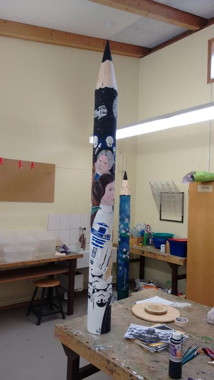
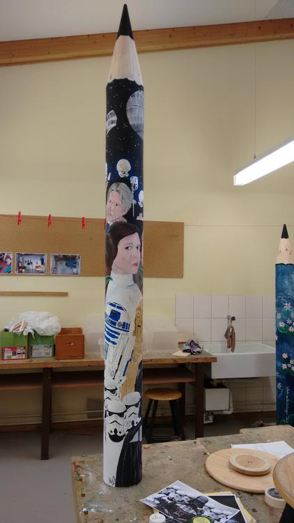
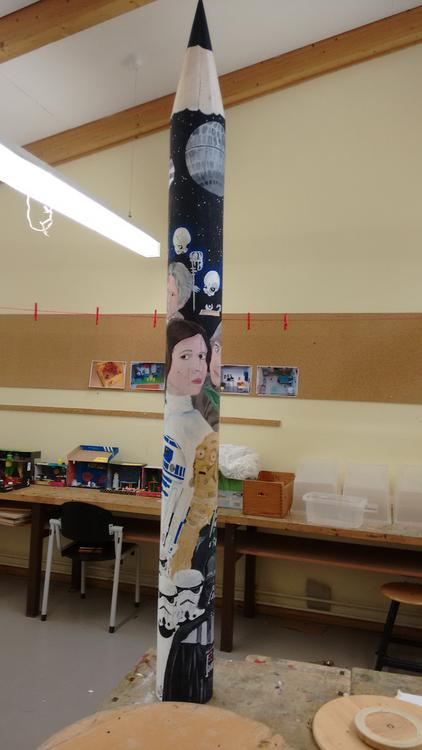
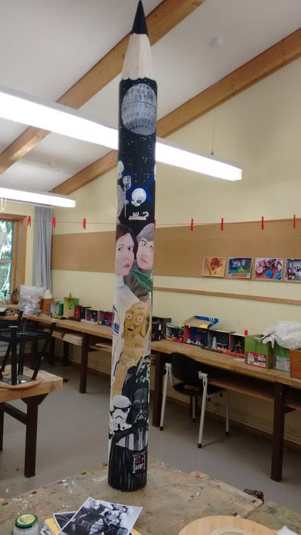
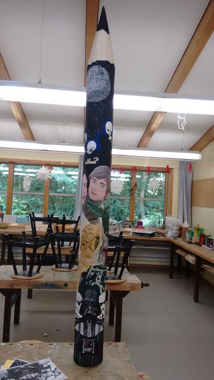

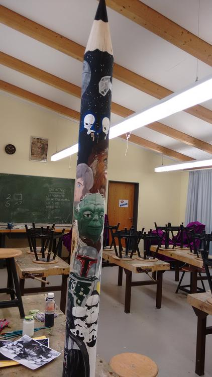
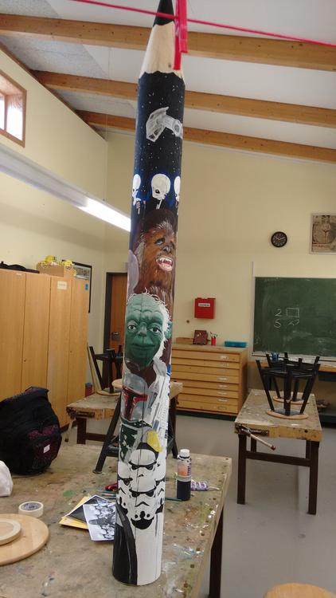
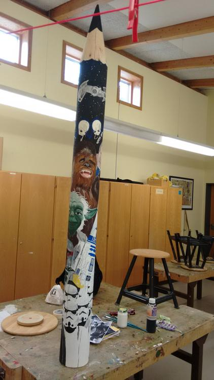
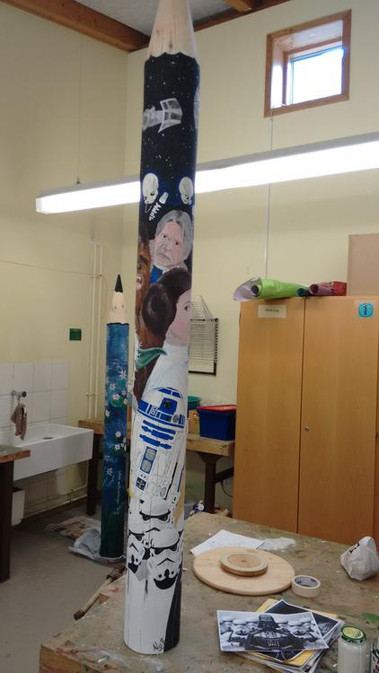

Zu diesem Zeitpunkt war schon die erste Lackschicht aufgetragen, daher die Lichtreflexe.

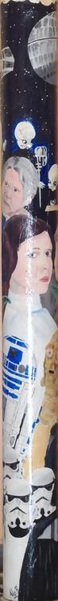
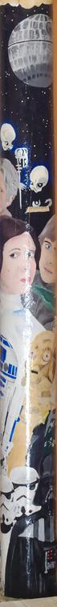
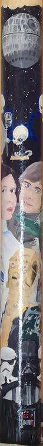
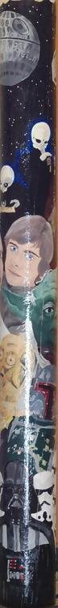
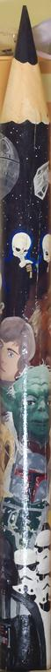
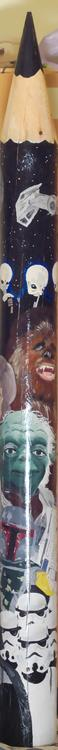
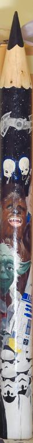
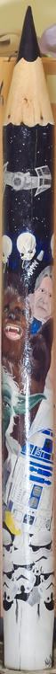
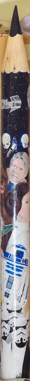

Ich hoffe dieses Projekt, dass insgesamt über 20 Stunden in Anspruch geommen hat, entschädigt für den letzte Woche ausgefallenen Post, aber ich hatte neben Arbeit und diesem Monster definitiv keine Zeit für andere Kreativitäten. Möge die Macht mit euch sein, Eure Ermeline.

