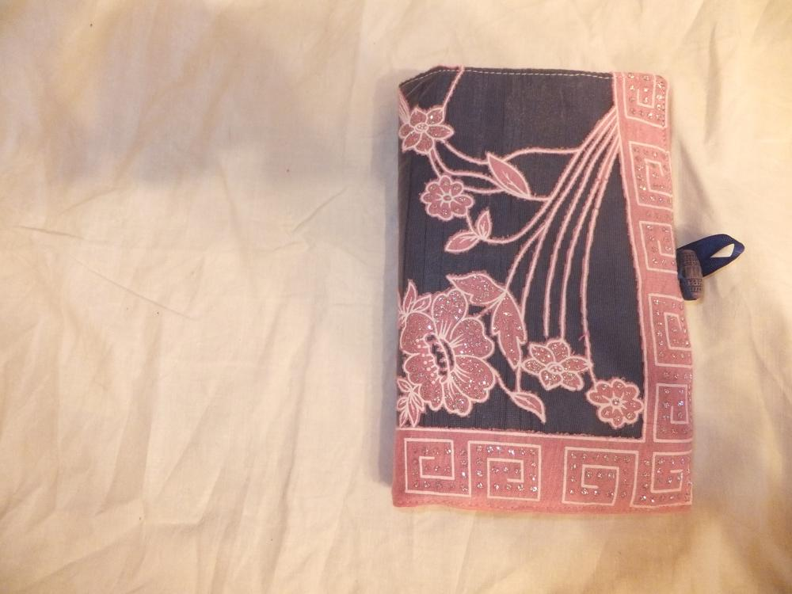
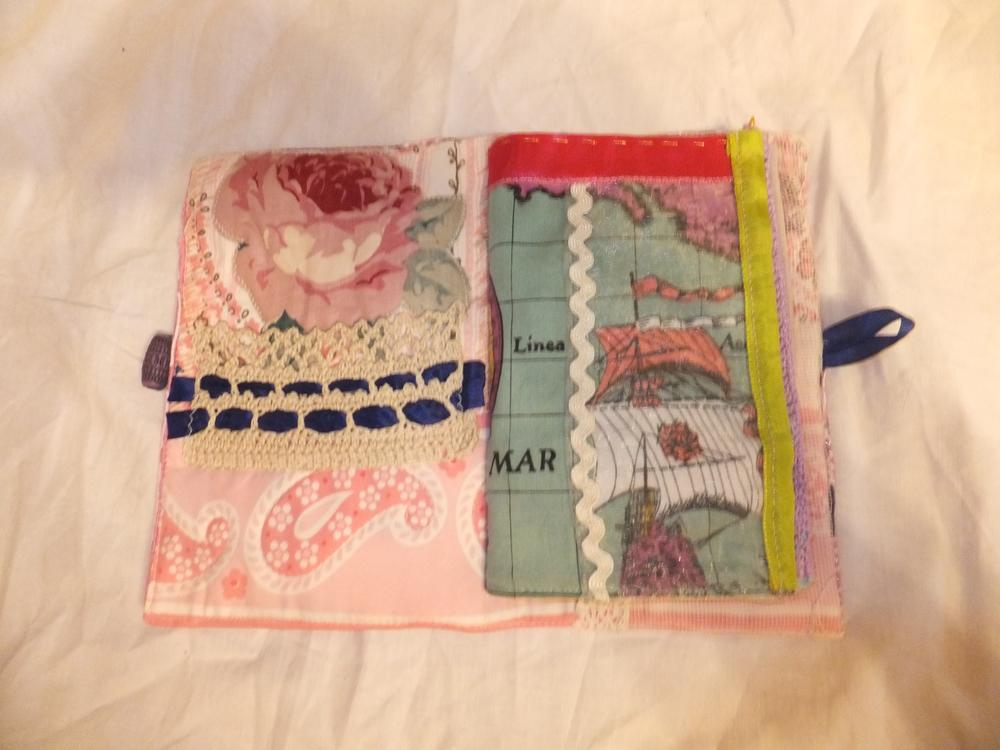
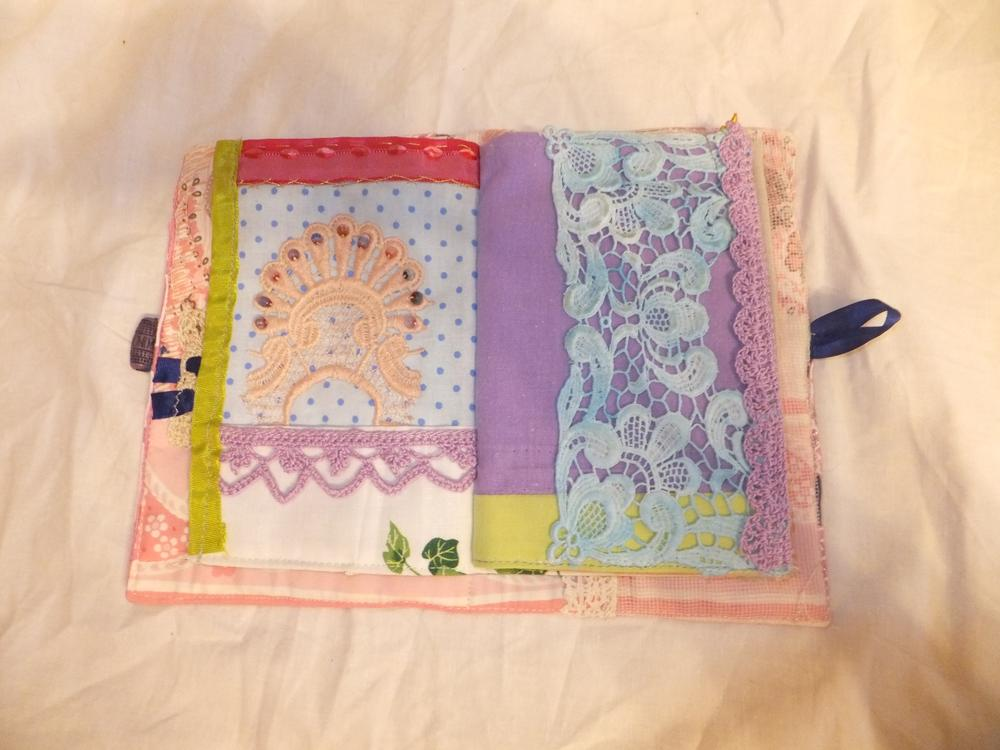

Was habe ich mich gefreut. Lucy hat mir auch ein Dokumentenmäppchen genäht, ganz nach meiner derzeitigen Farbpräferenz - bunt. 
Hier ist Platz für die "Visitenkarten von verschiedensten Veranstaltungen" (Alliterationsalarm!).  

 in Hamburg. Nach dem Treffen vieler netter Menschen und Praktizieren anstrengender Schlafpositionen bin ich endlich wieder zuhause und freue mich über Kuscheleinheiten von Shubia, eine Dusche und mein kuscheliges Bett. Daher auch heute nur ein kleines Postchen.

