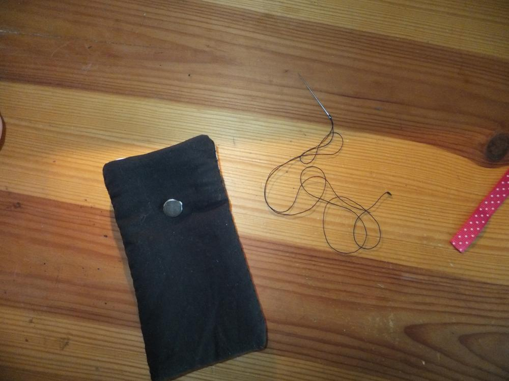

Tomcat und ich waren einkaufen. Ich konnte diesen Stoff einfach nicht liegenlassen, er brachte uns derart zum Schmunzeln, dass ich die 9,50€ in einen halben Meter investierte.

Mein erster Gedanke war, dass man eine Handyhülle nähen könnte, da die Motive die perfekte Größe hatten. Ich habe aber kein Handy für das es sich lohnen würde eine solche Tasche zu nähen, also soll Tomcat für sein Handy eine Hülle bekommen. Ich setzte mich noch am selben Tag an das Projekt, die Maße des Handys wurden mir schnell zugetragen. Mit diesen Maßen baute ich mir dann einen Handydummy.

Ich wollte schon länger mal versuchen ein Etui zu nähen, bei dem man keine unschönen Nähte sehen würde. Also ging es los, erst das gewünschte Motiv ausschneiden und mit dem schwarzen Stoff zusammennähen. Das wird meine sichtbare Außenseite. Ein Stück Fleece soll als Stoßschutz dienen.

Anhand der Ziernähte konnte ich auch abschätzen wo ich die Seiten zusammennähen musste. Zum Glück hab ich den Dummy. Ich ließ immer etwas Spiel, damit die Hülle (hoffentlich) nicht zu eng wird.

Die Außenhülle legte ich erst einmal zur Seite und widmete mich dann dem Innenfutter. Ich hatte noch ein vom Schneiden im Laden halbiertes Katzenbild, dieses möchte ich als kleinen Gag Innen im Futter haben. Also auch hier erst einmal die Stoffe zusmmenführen und das Innenfutter nähen.

Im nächsten Schritt verbinde ich die Teile mit einer einfachen Naht, dies hat später zur Folge, dass man das Innenfutter nicht mehr mehr aus der Tasche herausziehen kann, weil die Ecken miteinander fixiert sind.

Nun habe ich die Kanten umgeschlagen, sodass die offenen Seiten der Stoffe zwischen den Futtern liegen werden. Dann erstmal mit Nadeln feststecken.

Zum Verschließen habe ich eine Magnetvorrichtung mit einer Lasche in betracht gezogen, diese kann man zwischen der äußeren und der Fleeceschicht festnähen. Passt das Pünktchenband nicht super? Achtet darauf die sich anziehenden Seiten der Magneten richtig einzunähen! PS: Nicht auf den abblätternden Nagellack achten... Dumdidum

Dann muss ja nur noch per Hand eine Naht an der Einschuböffnung gesetzt werden. Im gleichen Zuge wird die Verschlusslasche festgenäht. Ich hab noch ein Tatzenbamselchen an die Lasche genäht.

Hoffentlich freut Tomcat sich, lange liegen lassen werde ich es nicht, gleich Montag wechselt es den Besitzer.

