Tja, das hätte das ausrangierte T-Shirt, das da auf dem Flohmarkt so vor mir lag, sich bestimmt nicht träumen lassen, einmal so zu enden. Aber wenn man bedenkt, dass die meisten anderen Shirts irgendwann in der Altkleidersammlung landen, dann ist dies ja wohl das Beste, was ihm passieren konnte. Den Anstoß gab mir Ermeline, die das schon lange herumliegende Stück Stoff sah und meinte: "Mach da doch 'nen Wandbehang draus!" 

Also legte ich los und da ich im Laufe meines Lebens etliche reich gefüllte Nähkästchen geerbt habe, konnte ich aus dem Vollen schöpfen: Knöpfe, Perlen, Stoffe, Spitze, Tüll und Brokat: geschnitten, gerissen, genäht, gestickt, eingefärbt und zu Blumen verarbeitet. Um den leicht düsteren Touch nicht zu stören, habe ich sogar auf meinen Espresso zum Nachtisch verzichtetund statt der Amarettini die weißen Baumwollspitzen hineingetunkt.

Für die Ecken habe ich mal das Muster "cathedral window" ausprobiert, weil ich finde, dass es ganz prima zum Thema passt. Allerdings wäre es wesentlich einfacher, dafür dünne Baumwollstoffe zu nehmen, denn das von mir verwendete Synthetikmaterial ist zwar wunderschön, aber seine Eigenschaften (rutschig, steif, paillettenbesetzt) haben mich dem Wahnsinn nahe gebracht.

Alles in allem finde ich aber, die Mühe hat sich gelohnt. Eine kreative Woche wünscht euch Lucy.

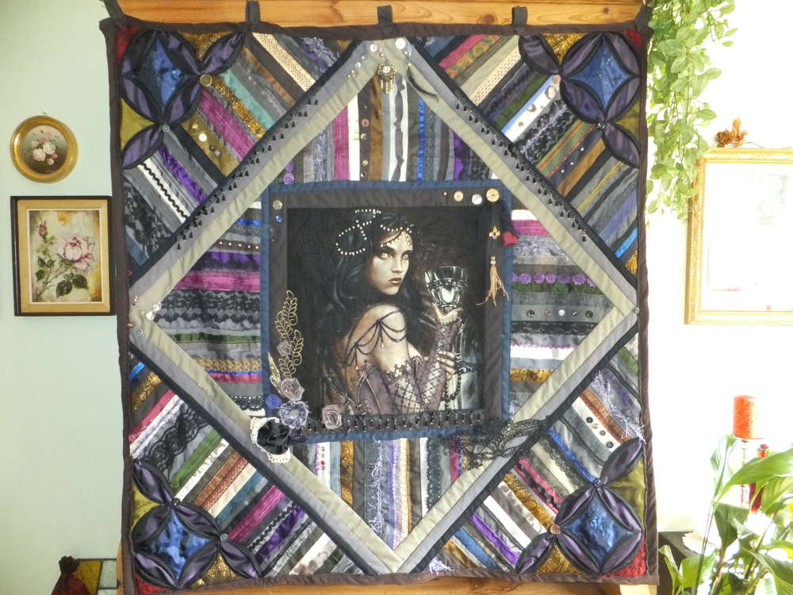
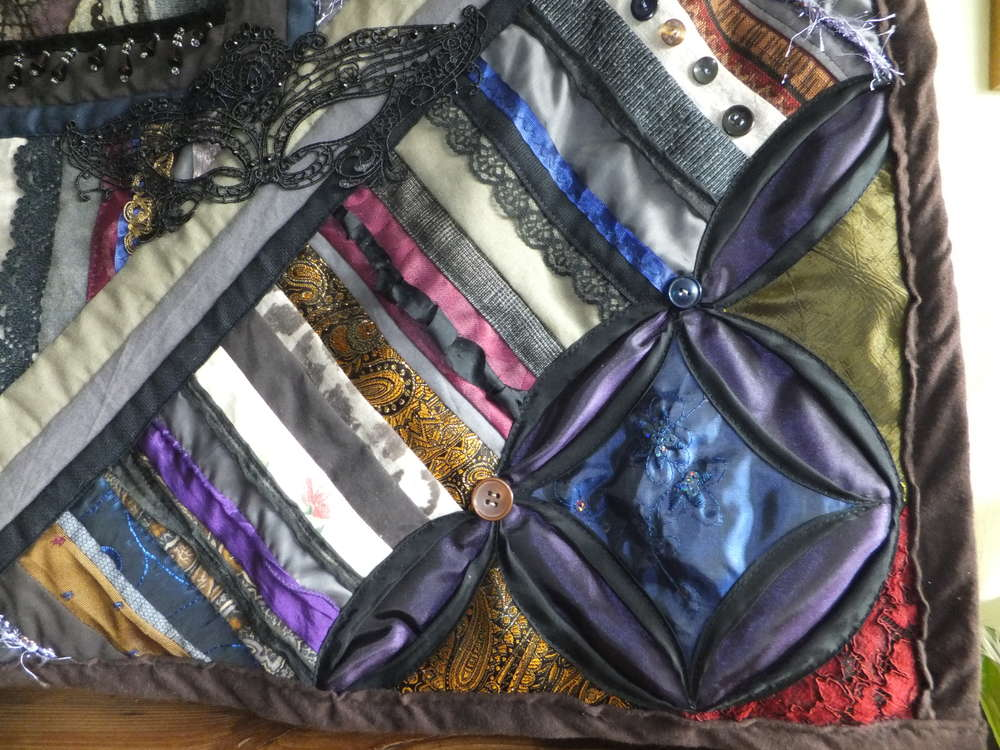
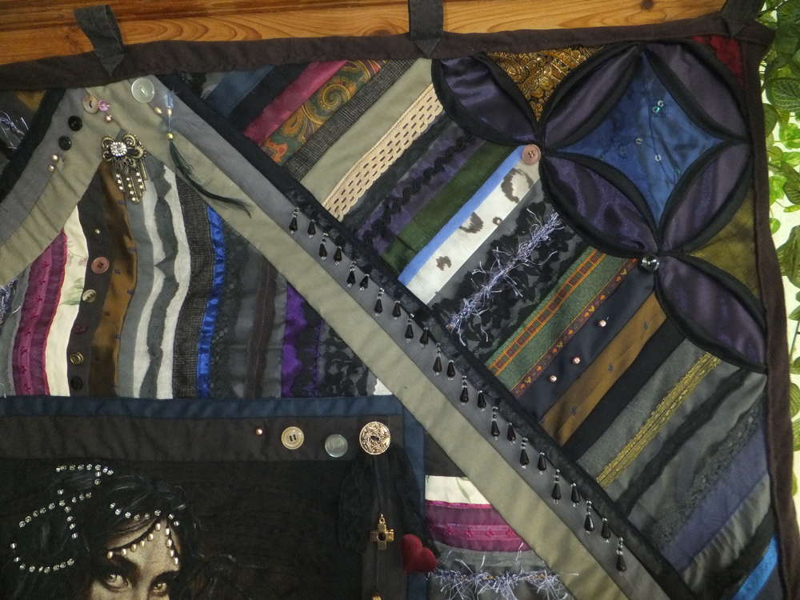
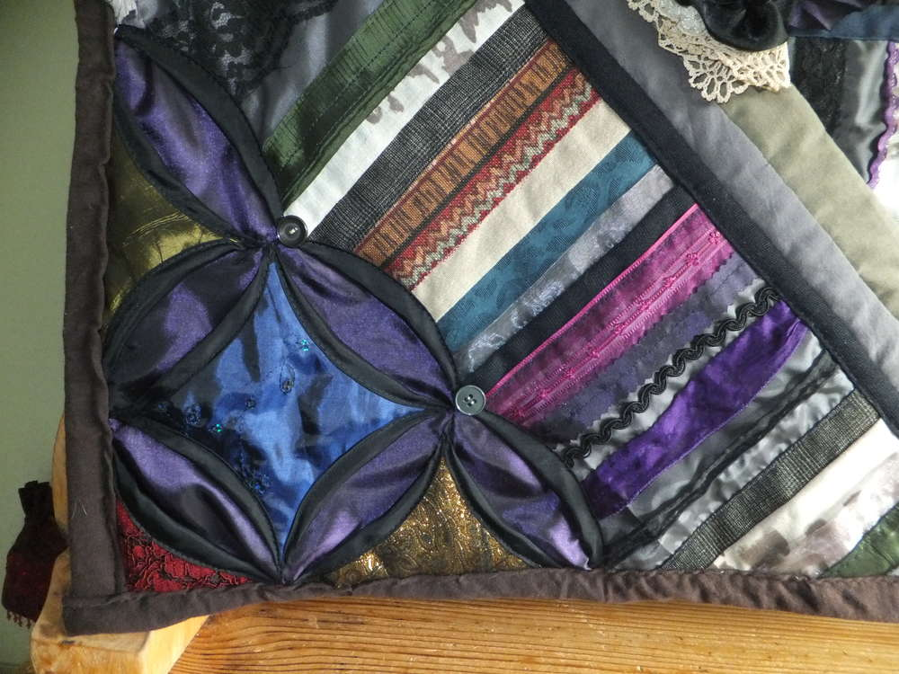
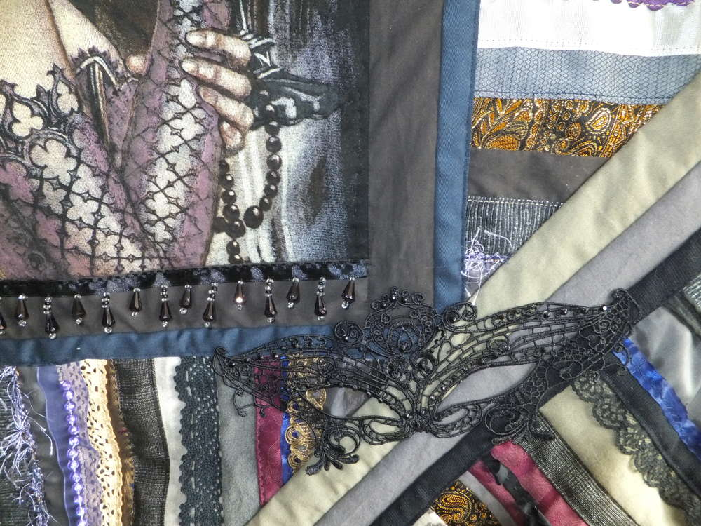
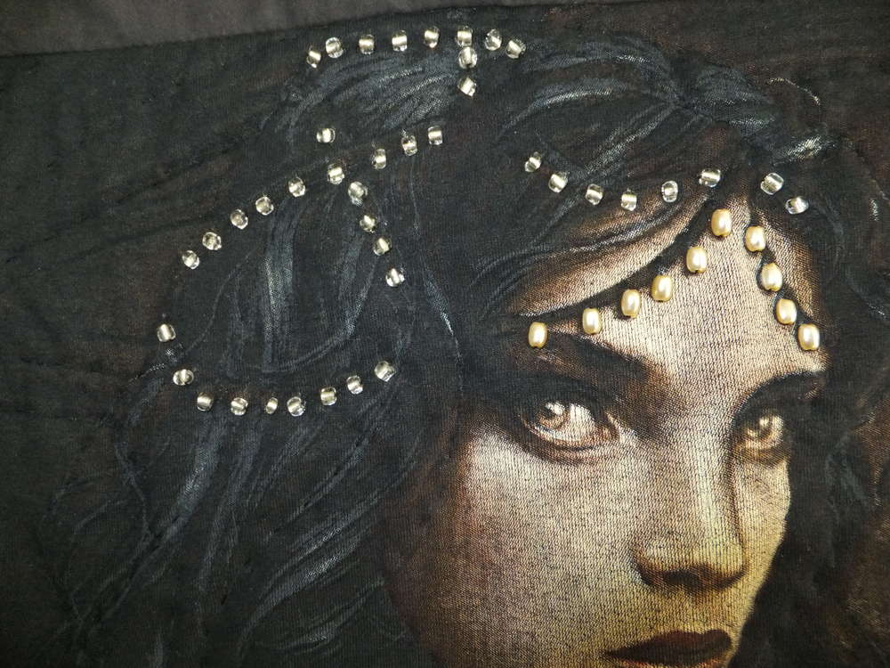

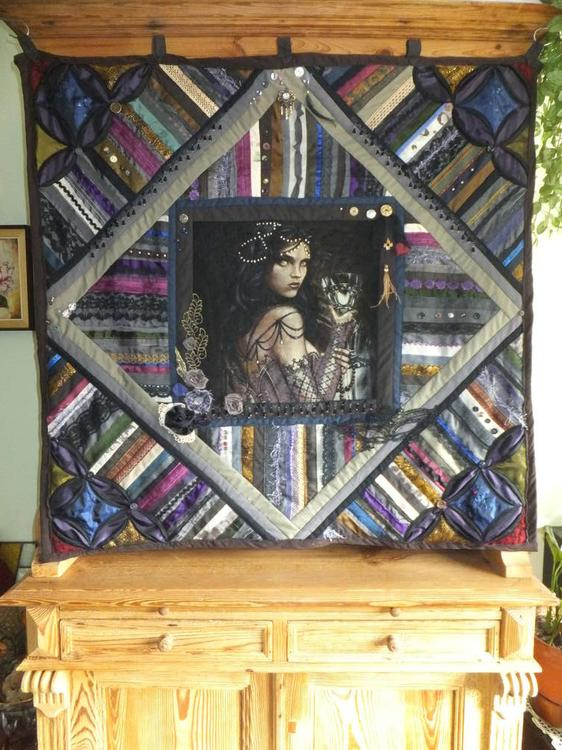
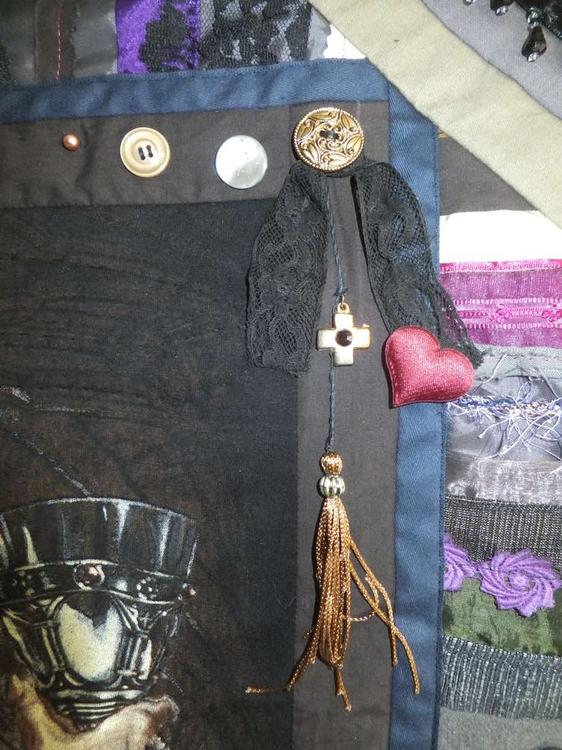
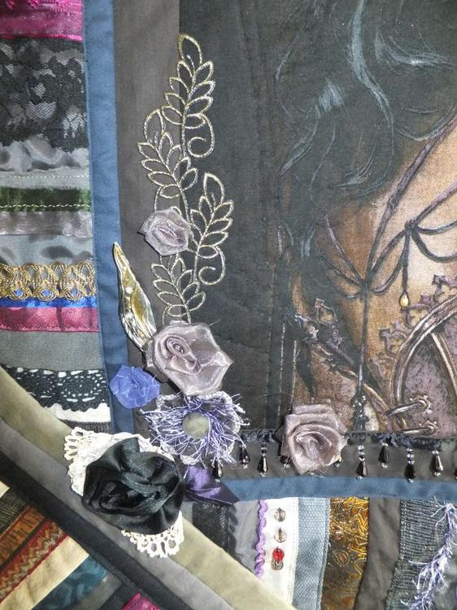
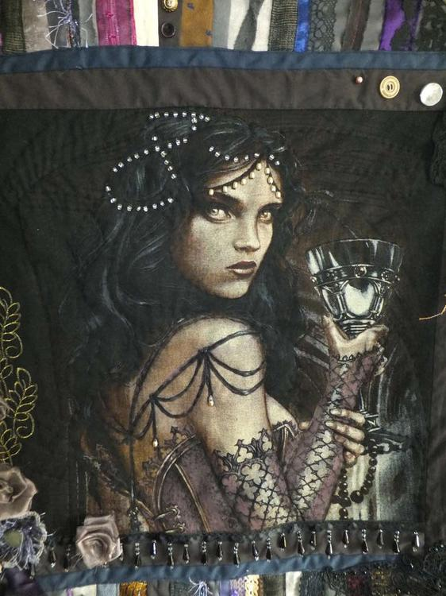
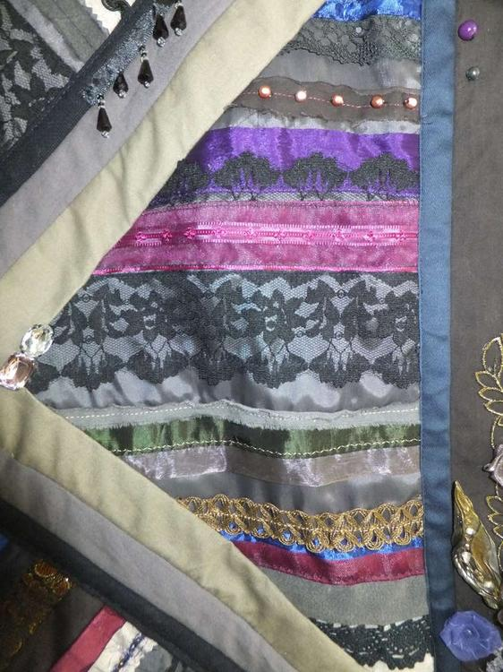

