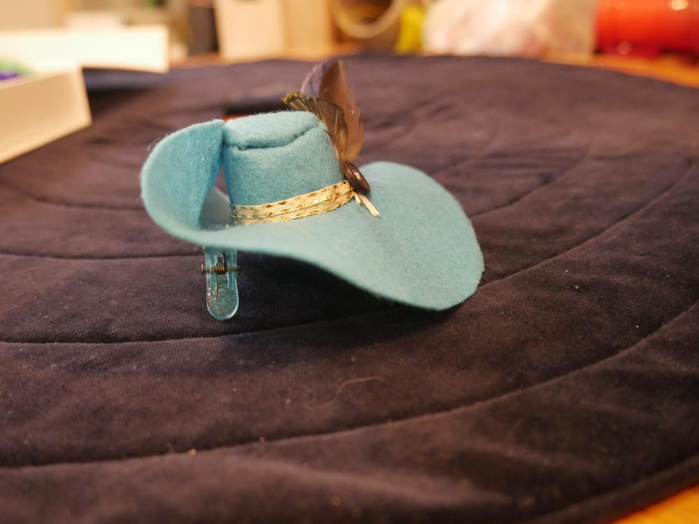
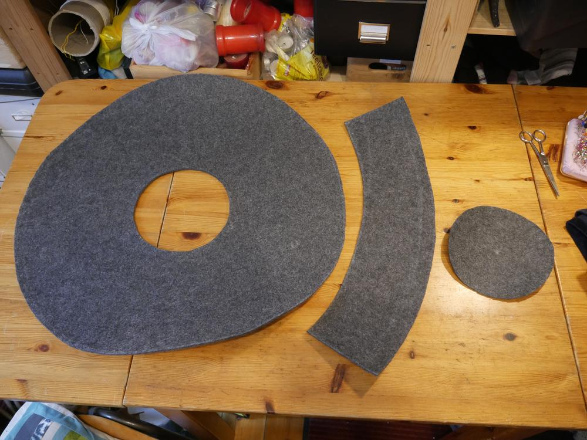
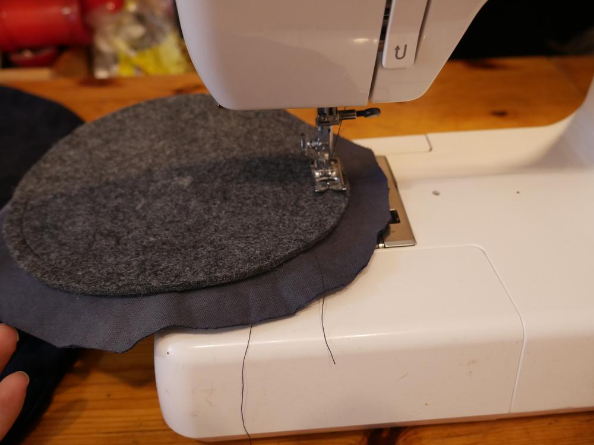
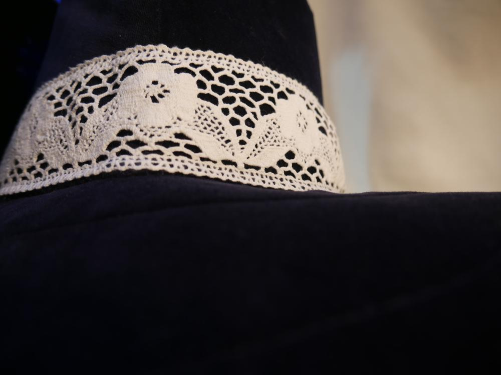

Dieser Hut ist wahrlich sooo groß - er muss wichtig sein!
Die Charaktererstellung für einen General fürs LARP erfordert früher oder später die Erstellung eines Hutes, der zeigt wie wichtig der General ist. Also habe ich mal wieder entworfen und überlegt und ausprobiert. Diesmal sollte es nichts Gefilztes sein, etwas Hochwertiges, Edles musste her. Trotzdem pompös und überkandidelt, passend zur Magiergarde der [Bewahrer des Gleichgewichts](http://magierdinge.de/). Für 10€ wurde bei Karstadt ein Polyesterfilz in 3mm Stärke erworben, bis auf die Federn hatte ich alles andere schon Zuhause. Den blauen Samt habe ich als Vorhang für 2€ auf dem - na, wer kann sich's denken? - Flohmarkt erworben. Genauso wie die Klöppelspitze; den Knopf hatte ich schon seit Ewigkeiten rumfliegen.

Schaut man sich einen Hut mal an,kann es ja wohl nicht so schwer sein, einen zu nähen. Eine Krempe, eine Krone und ein Dach... mit dem Basiswissen von Umfangberechnung und Durchmessern erstellte ich diese Skizze.

Eine Probe musste gemacht werden, es wäre fatal, wenn ich den Filz umsonst zerschnippeln würde. Also rechnete ich ein wenig herum und machte ein kleines Probehütchen.

Irgendwie war es süß und zu schade um es nach dem Nähen weg zu werfen also kamen noch Federn und ein Knöpfchen dran und mit einer alten Haarspange kann man den als Miniaccessoire im Haar tragen... Fasching ist coming!!!

Nun ja, nachdem mein Probehut geglückt ist, ging es daran meine Skizze zur Realität werden zu lassen.
Die Krempe soll 60cm im Durchmesser haben, mein Endabnehmer hat einen Kopfumfang von ca. 58cm also wird der Durchmesser des Kopflochs etwa 19cm haben. 

Auf der Skizze seht ihr zwei Teilkreise, diese habe ich genutzt um die Krone zu berechnen, genutzt wird nur der äußere Teilkreis. Dafür habe ich ausgehend vom Mittelpunkt der Krempe mit größeren Kreisen experimentiert. Der Hut soll nach oben hin schmaler werden aber nur wenig, oben soll er 50cm Umfang haben und unten 60cm. Um euch meinen Gedankengang und den langen Weg zu meiner Lösung zu ersparen, nenne ich euch hier einfach nur den Radius des Teilkreises für die Krone - 48cm und 55cm. 

Ich  habe mir einen Zirkel aus einer Stecknadel einer Schnur und einer Kreide gemacht.

Markiert euch den Punkt wo die Nadel festgesteckt ist, von dort aus könnt ihr an der Schnur entlang eine verbindende Gerade zwischen den beiden Teilkreisen ziehen. Meine Krone ist ca. 12cm breit.

Aus dem Kopfloch könnt ihr super den Deckel nähen, bloß nichts verschwenden. 

Um den Samtstoff zu zu schneiden habe ich einfach den Stoff doppelt genommen (Samt nach Innen) und ihn mit dem Filz zusammengesteckt. Achtet drauf, dass ihr keine Falten im Stoff habt. Danach habe ich großzügig ausgeschnitten und mit der Nähmaschine den Stoff zusammengenäht. Lasst den Filz ruhig festgesteckt, dann könnt ihr euch weiteres Abstecken und anzeichnen sparen, einfach nah am Filz zusammennähen, das hat später auch den Vorteil, dass ihr das Kopfloch einfach aufschneiden könnt ohne die Stelle suchen zu müssen. Am Ende schneide ich mit einer Zickzackschere den Stoffüberschuss ab, das Kopfloch mit einer normalen Schere über Kreuz auf, entferne die Nadeln und den Filz und wende den Stoff.

Für die anderen beiden Teile braucht ihr jeweils nur eine Lage Stoff.

Ihr müsst nun durch das Loch den Filz in die Stoffkrempe bringen, alles glattstreichen und richtig platzieren. Da meine Krempe so riesig ist und noch in Form gebracht werden soll, muss ich den Stoff mit dem Filz zusammensteppen, damit sich die Schichten nicht unschön trennen. Achtet wirklich gut darauf, dass alles sitzt, bei mir sind ein paar blöde Falten entstanden, aber es muss ja nicht alles perfekt sein.

Die Krone habe ich mit dem Stoff umschlagen und unten mit der Maschine zusammengenäht. Hier ist der Zeitpunkt, wo man einmal Probetragen sollte, denn man kann noch ein paar Zentimeter mit dem Stoff dazugeben, sollte der Umfang zu klein sein, das musste ich auch machen.

Den Deckel habe ich auch in Kreisen zusammengesteppt. 

Nun nähe ich mit der Hand den Stoff an Deckel und Krone in engen Stichen zusammen. Steckt euch zur Hilfe den Stoff an dem Filz fest, so gibt es keine unschönen Falten oder der Stoff rutscht ab.

Näht sehr eng an den Filzkanten den Stoff zusammen. In meinem Falle gab es einen Rechenfehler bei den Maßen des Deckels, er hatte noch die 19cm Durchmesser, was für 50cm Umfang zu viel sind. Ich schnitt ringsum nah an der Steppnaht etwas Filz weg, das reichte aber nicht, mein Kompromiss, der Hut bekommt einen Kniff. Sieht sogar ziemlich gut aus.

Sieht schon ganz gut aus. Dann wollen wir das mal zusammennähen.

Das Grundgerüst steht, an dieser Stelle empfehle ich euch das Versäubern der Innenkanten zu machen, ich habe es ganz zum Schluss gemacht, was echt unhandlich war mit den Federn...
Jetzt kann man auch noch sehr gut ein Hutband, in meinem Fall eine Klöppelspitze, annähen.

Innen Versäubern und dann noch mein Flauschiversum-Label reinnähen. Um den Knick nach unten auf der rechten Seite schön in Form zu bringen habe ich noch zwei Drähte eingezogen.

Federn ran und feddich!!!!

Hier noch ein paar Details.

Einen behüteten Sonntag wünscht Euch die Ermeline.

