Jetzt endlich mussten sie mal verarbeitet werden. Lange gehütete Spitzen, Brokatstoffe, Perlen, Omas Kleiderkragen, sie alle habe ich zu meinen Kleinodien verarbeitet. Entstanden sind zwei Anhänger und ein Dokumenten-Etui. 

## Troddeln
Die Troddeln habe ich aus sämtlichen Spitzenresten und mit Zickzackschere zugeschnittenen Stoffresten gebastelt. Alles mit Draht zusammenfassen und an einem Korken oder Ähnlichem befestigen. Für die Verzierung kann man seiner Fantasie freien Lauf lassen.

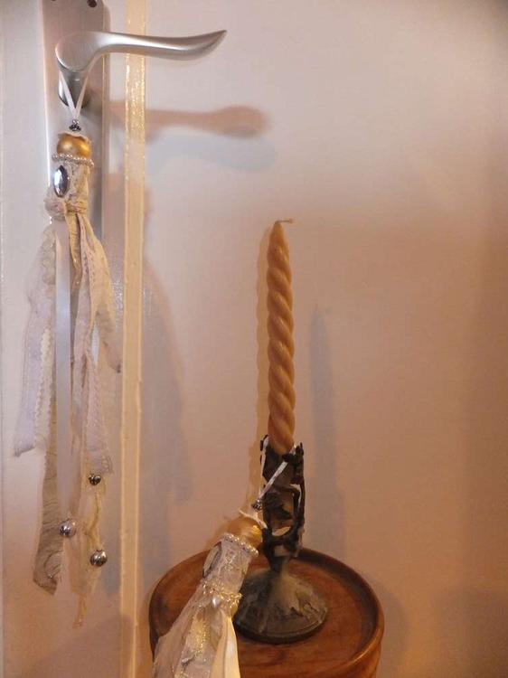
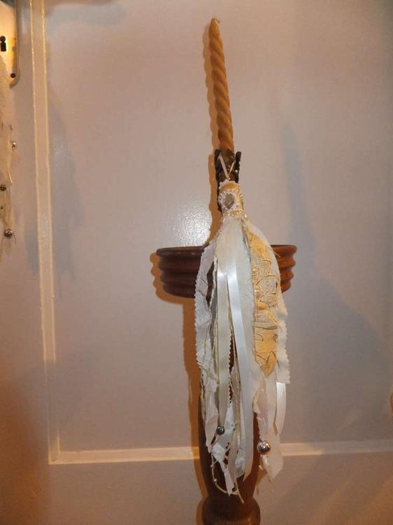
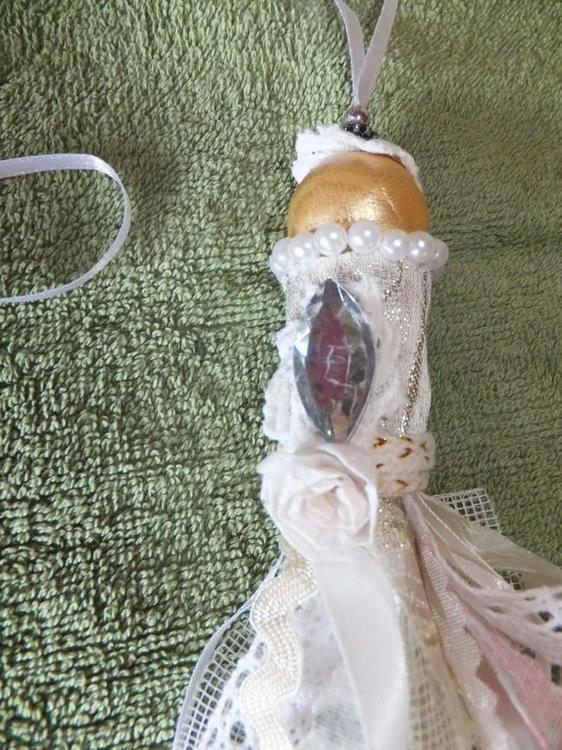

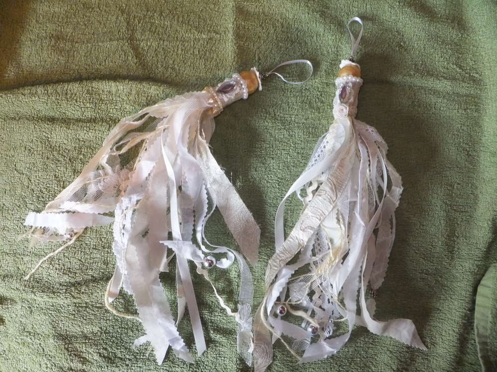
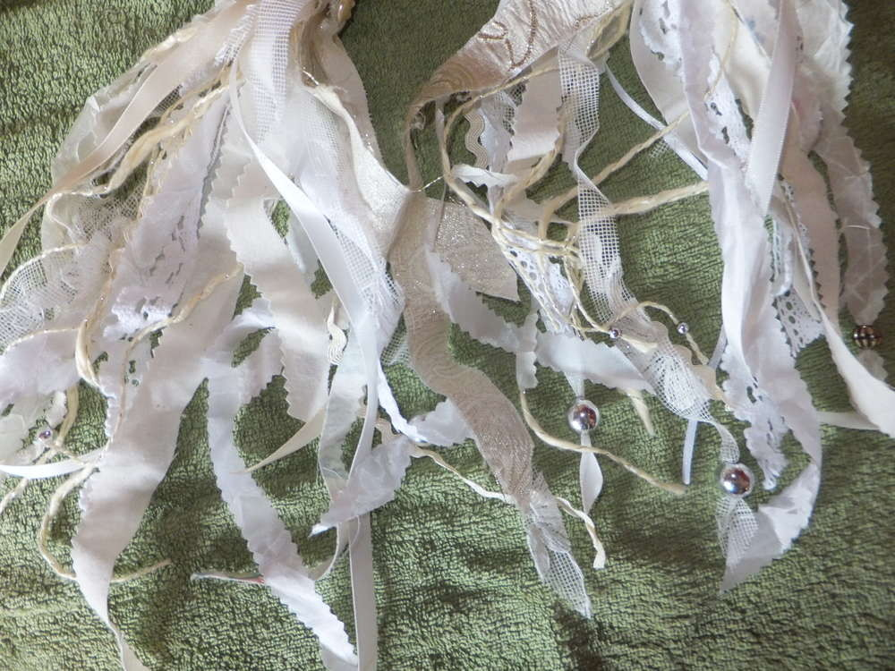

## Etui
Meine Dokumente wollte ich leicht und flach untergebracht wissen. Also habe ich ein Cover und zwei Doppelseiten genäht. Mit verscheidenen Fächern und Stoffen, wo sich alles wichtige unterbringen lässt. Statt Plastikfenstern eignen sich sehr gut Tüllstoffe. Zum Schluss alle Seiten in der Mitte zusammengenäht, zwei Knöpfe aus einem alten Blusenverschluss und eine aufbügelbare Rose - fertig ist das Spitzen-Etui. 

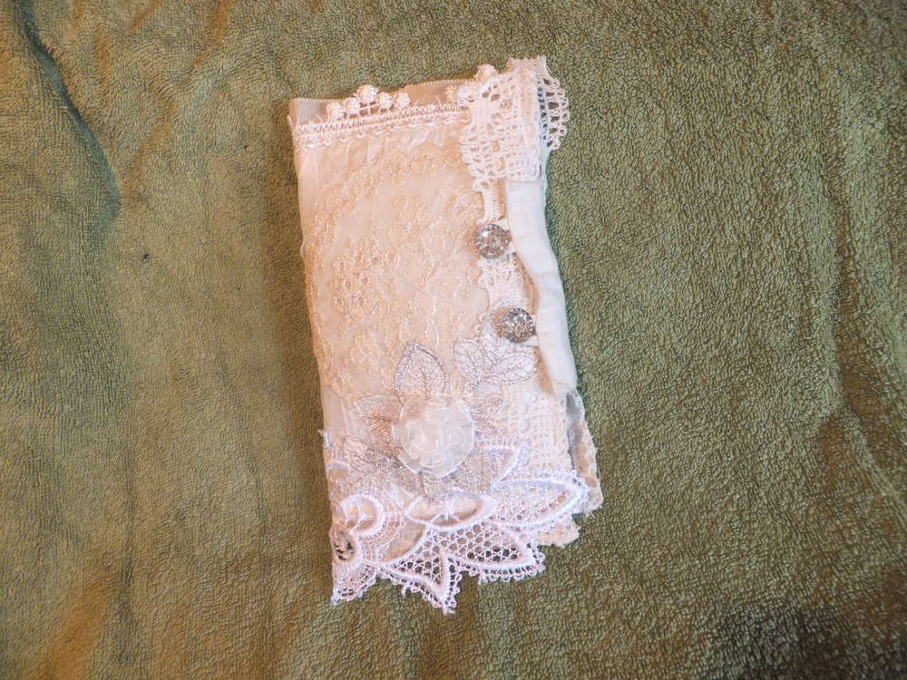
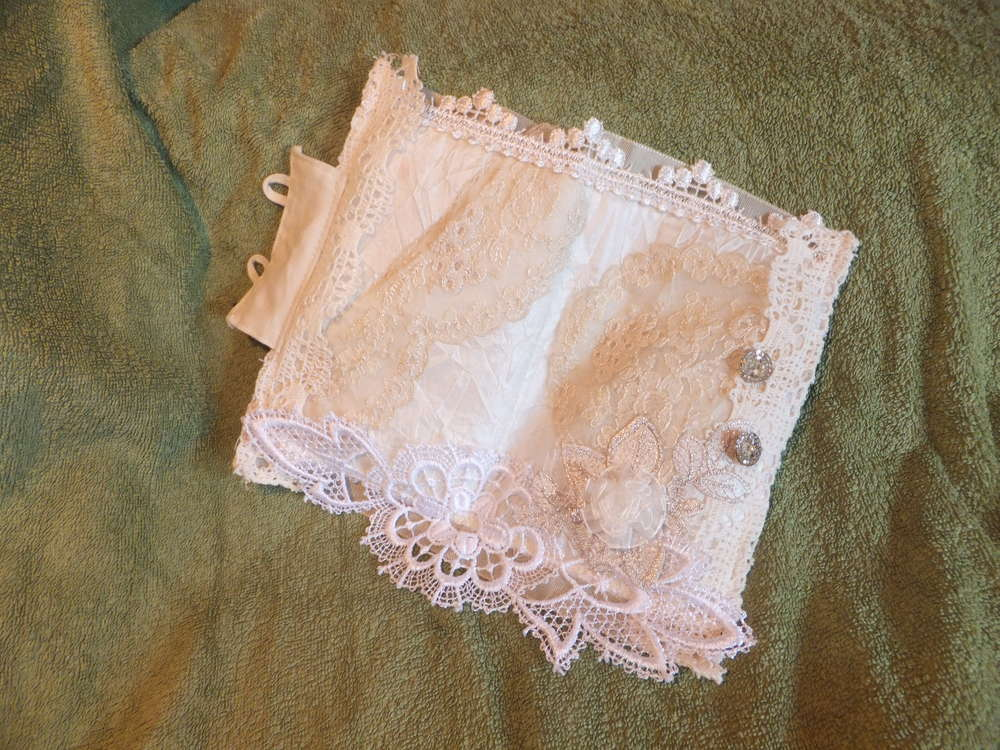
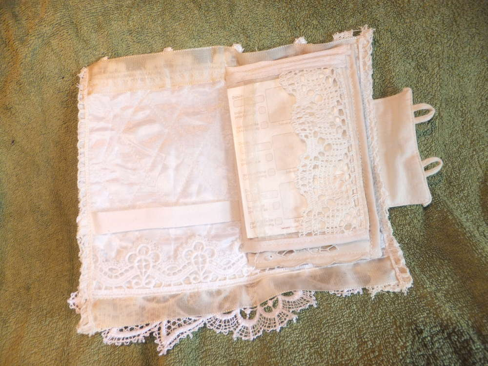
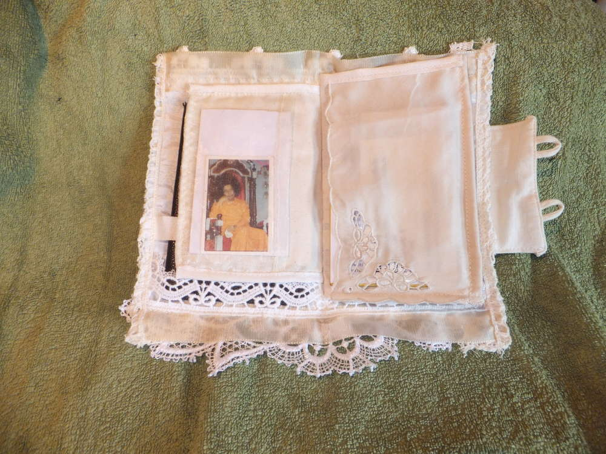
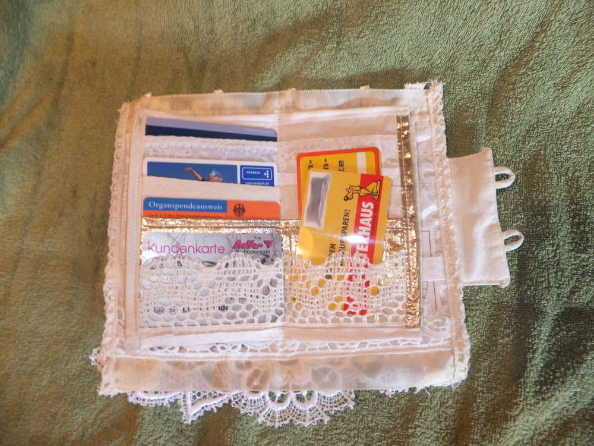
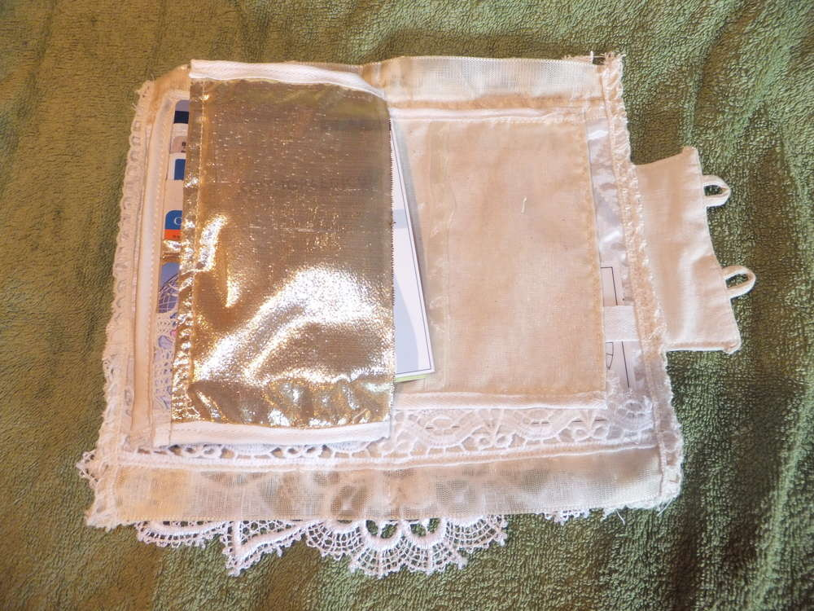
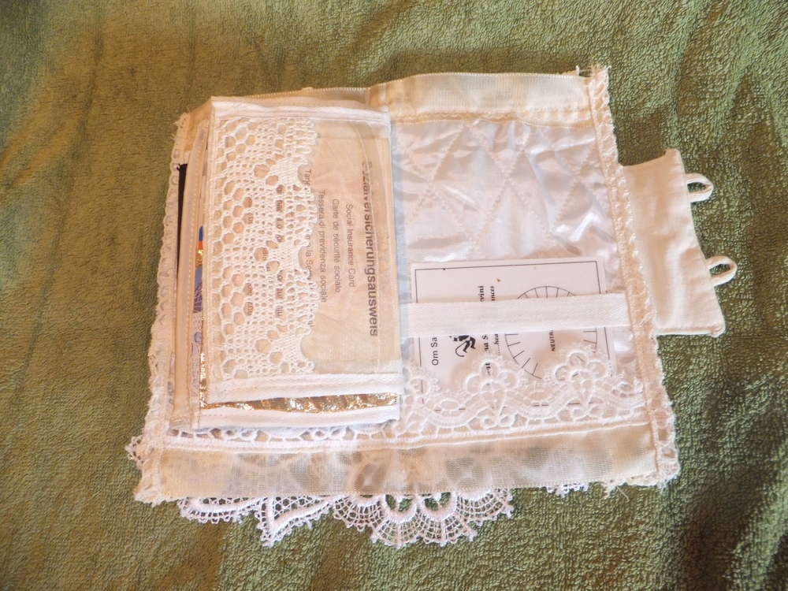

Wenn ich eurer Kreativität einen Anstoß geben konnte, freue ich mich wie immer über Bilder eurer Werke.
Viel Spaß dabei, eure Lucy.

