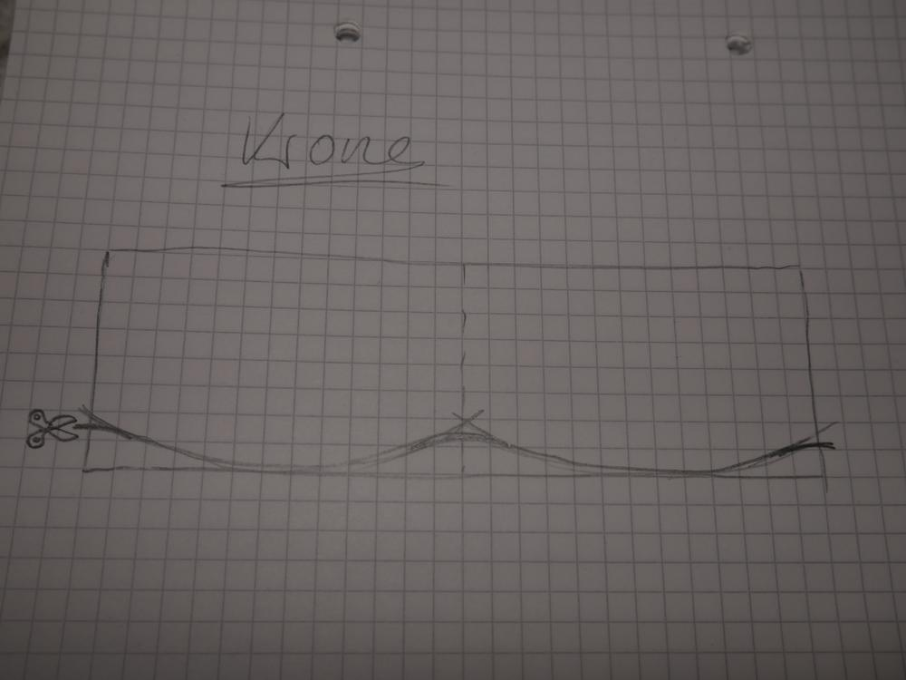
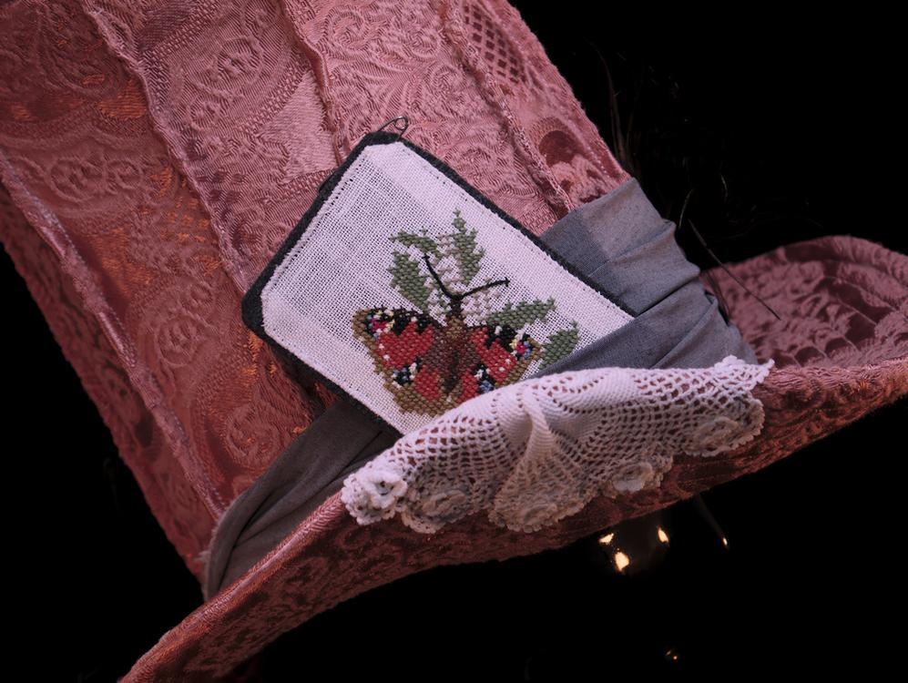
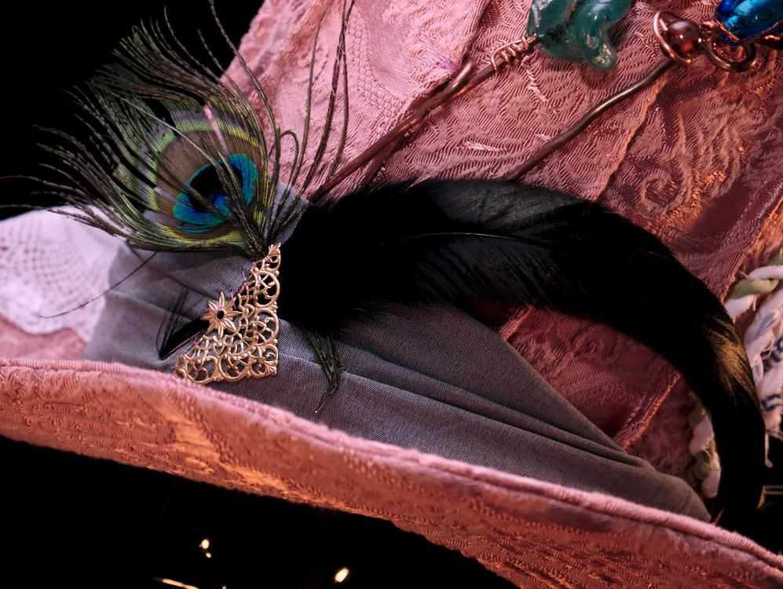

Ein alter Hut in neuer, eigener Interpretation ist entstanden. Dieses Jahr wollte ich als Grinsekatze aus Alice im Wunderland zum Fasching gehen. Ein paar Kollegen versuchte ich (zum Glück mit Erfolg) zu Partnerkostümen zu überreden. So gab es neben mir als Grinsekatze noch das weiße Kaninchen (wie immer zu spät), eine Alice (die leider verhindert war) und eine sehr überzeugende Hutmacherin. Der Hut für eben diese Kollegin musste noch angefertigt werden und da ich gerade in Übung durch den letzten Hut war, setzte ich mich direkt wieder an die Nähmaschine. Ich werde heute nur die Änderungen im Vergleich zum letzten Hut erläutern, die detailliertere Anleitung findet ihr dann beim [wichtigen Hut](/2017/02/ein-wichtiger-hut/).

Angefangen hat alles wieder mit einer Skizze. Ein Zylinder, der oben breiter wird und dessen Krempe sich an den Seiten nach oben wölbt, inspirieren lassen habe ich mich von verschiedenen Hüten auf Pinterest, ich bin definitiv nicht die Erste, die sich an den Hut des Hutmachers wagt. Auch dieser Hut besteht aus Deckel, Krone und Krempe. Er ist mit den hier angegebenen Maßen für eine Kopfgröße von ca. 54cm gedacht, er sitzt sehr eng, was jedoch bei dem Gewicht der Verzierungen nicht unbedingt verkehrt ist, sonst würde er immer wieder verrutschen.

Ich wollte zwar, dass sich der Hut oben weitet aber nicht so extrem, weshalb der Durchmesser des Deckels 22cm beträgt also nur geringfügig mehr als der Durchmesser des Kopfloches, nämlich 18cm. Die Krone besteht zunächst aus einem geraden Stück Filz für den Zylinder (55cm*35cm), die oberen 7cm wurden bei mir im Abstand von 5cm eingeschnitten, sodass sich der Hut oben weiten kann. Insgesamt habe ich 11 Laschen, die sich durch die Einschnitte ergeben. Da ich immer mit einem stabilen Filz als Basis arbeite und diesen dann mit den Stoffen beziehe, stellte die Krone hier ein besonderes Problem dar, was ich mit abnehmenden Falten beim Stoff gelöst habe. Mein Bezugsstoff hat eine Länge von 70cm ich nähte ihn zunächst zum Schlauch zusammen. 70cm durch 11 Laschen egeben 6,36cm obwohl die Abstände zwischen den Laschen des Filzes nur 5cm betragen, es sind also 1,35cm zu viel und das ist der Stoff aus dem ich die Abnahmen mache.

Man kann diese Abnahmen auch auf der Innenseite des Stoffes belassen, in meinem Falle wollte ich dass man sie sieht und damit sind sie an der Außenseite gut sichtbar.

Damit sich die Krempe an den Seiten wölbt, muss man an dieser nichts verändern vielmehr ist bei diesem Hut die Krone das Geheimnis. Ich habe mir den Filz der Krone mittig gefaltet und darauf die Wölbung angezeichnet. Damit die Krempe sich später nicht in den Ecken als Knick manifestiert, müssen die Ecken abgerundet werden. Auf meiner Skizze sind die eingeschnittenen Laschen nicht eingezeichnet,sie befinden sich aber an der geraden Oberkante.

Soviel zu den ganzen Maßen und Einzelteilen. Als Basis habe ich nun 3 Einzelteile, die ich mit Stoff beziehen muss. Im Hintergrund seht ihr die frischbezogene, ungesteppte Krempe. Vorne liegt der Deckel noch ohne Stoff.

Ich habe da einen (t)ollen Vorhangstoff vom Flohmarkt verwendet. 

Für die Krempe werden zwei Stoffteile zusammengenäht, gewendet und der Stoff eingelegt, eine genaue bebilderte Anleitung findet ihr im vorhergehenden Hut-Post. Bei diesem Hut habe ich ebenfalls mit der Nähmaschine die Schichten zusammengesteppt, ich entschied mich für ein Spiralmuster, welches sich auch am Deckel wiederfindet. 

Beim nächsten Hutmacherhut werde ich vielleicht sogar einen farblich kontrastreicheren Faden nehmen, weil die Spirale jetzt sehr dezent ist. Wenn alle Stoffe vorbereitet sind und auch um den Filz passen, geht es an die richtige Handarbeit, alles mit Nadel und Faden zusammennähen. Wenn das dann geschafft ist, muss nur noch verziert werden wie man eben lustig ist. Gut wenn man so viele Gedönskisten hat wie ich, wo man alles Mögliche findet zum Verzieren, mit dem Hutband hat es dann nach dem Zusammennähen des Hutes angefangen.

Feeeeeeeertig! Fasching kann kommen. 

Und hier noch ein paar Details.

Besonders stolz bin ich auf den Faschingsschnappschuss meiner Hutmacherin, sind die ganzen Pink- und Rosatöne nicht der Hammer? Mein Hut steht ihr gut, Danke Jenni, dass ich das Bild hier zeigen darf.

Es hat viel Spaß gemacht und nachdem die Feier dann vorbei war, konnte die Grinsekatze dann doch endlich ihren geliebten Hut mitnehmen.

Einen verrückten Sonntag wünscht euch heute mal nicht Ermeline, sondern die Grinsekatze.

