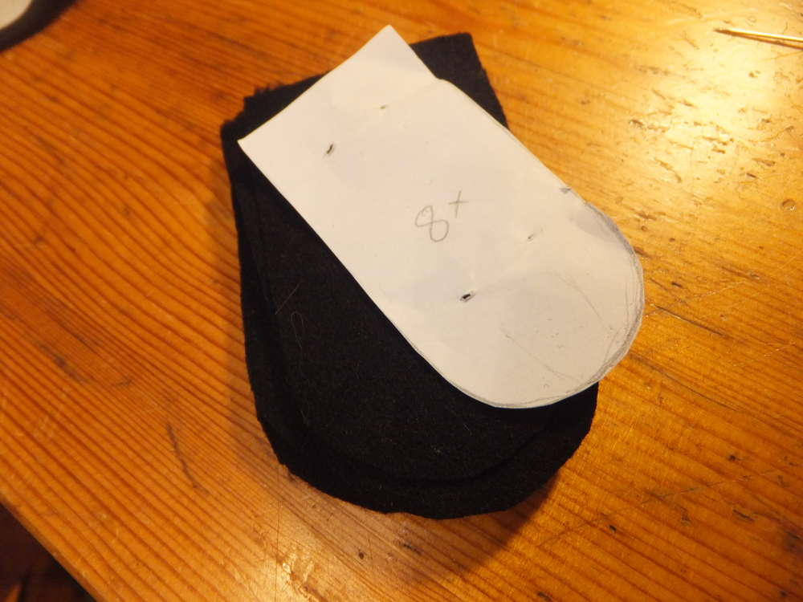

## Katzenfedertasche

Ich habe mir mal eine Federtasche genäht. Hierfür habe ich Reste vom Wollstoff der [Gugel](/2016/07/guck-mal-ne-gugel/) verwendet. 
Inspirieren lassen habe ich mich von der Anleitung zu einem [Hasen-Federmäppchen](http://youandiheartdiy.blogspot.de/2013/11/diy-tiermappchen.html) allerdings habe ich wie so oft einiges abgeändert.
Die Idee mit dem Innenstoff fand ich toll, da ich auch den Tatzenstoff gefunden hatte, würde er perfekt passen. Da aber meines Erachtens nicht Alles, was ich gedachte in das Mäppchen zu tun, reinpassen würde, entschied ich mich für eine etwas andere Form als bei der usprünglichen Anleitung.

Für meine Katze brauchte ich dann noch die Gleidmaßen, den Schwanz und den Kopf erstmal auf Papier vorgezeichnet, dann mussten die Stoffteile ausgeschnitten und zusammengenäht werden.

Der Schwanz kann nun an der Seite mit eingenäht werden und die Pfötchen habe ich in die Ecken der Tasche gesteckt um sie mit festzunähen. 

Die Pfoten habe ich an der offenen Seite so gefaltet, dass der Stoff perfekt in die Ecke der Tasche passt.

Dann muss nur noch alles festgenäht und die Tasche umgekrämpelt werden.

Das Katzengesichtchen habe ich ähnlich dem der ursprünglichen Anleitung gemacht.

Als das Gesicht angenäht war habe ich noch einen Flauschiversum-Zipper gemacht.

Fertig ist die Katzenfedertasche und es passt alles rein.

## Tasche
Kurz nachdem die Federtasche fertig gestellt war, habe ich mir noch einen kleinen Rucksack genäht. Den Tatzenstoff von der Federtasche habe ich hier erneut verwendet als auch den Stoff mit dem ich schon die [Handytasche](/2016/06/crazy-cat-handytasche/) genäht habe. Als Innenfutter habe ich Reste vomInnenstoff der Gugel wiederverwendet. Leider sind mir die Trägerein wenig zu kurz geraten. Ich habe dieses Problem, was sich nur beim Abnehmen der Tasche bemerkbar macht, gelöst indem ich eine Steckschnalle an einer Seite zwischengenäht habe. Jetzt kann ich die Tasche blitzschnell abnehmen.

## Grumpy Cat
Des Nähens müde folgte dann eine Pin-Sammel-Aktion auf Pinterest, wo ich das Stickmuster für eine Mini-Grumpy-Cat fand. Zunächst in normalem Kreuzstich, dann mit der Idee einen Anstecker zu machen für den die Katze kleiner sein muss. In Petit-Point-Stil habe ich dann die kleine Katze gleich mehrfach gestickt. Tomcat hat nun auch eine MiniKatze in der Nähe seines Arbeitsplatzes hängen.

 

