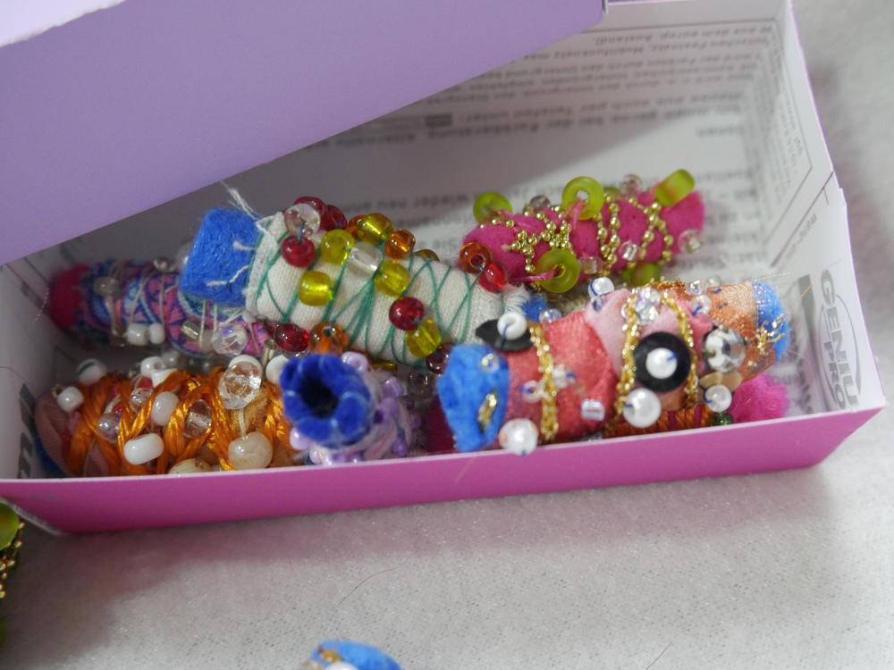
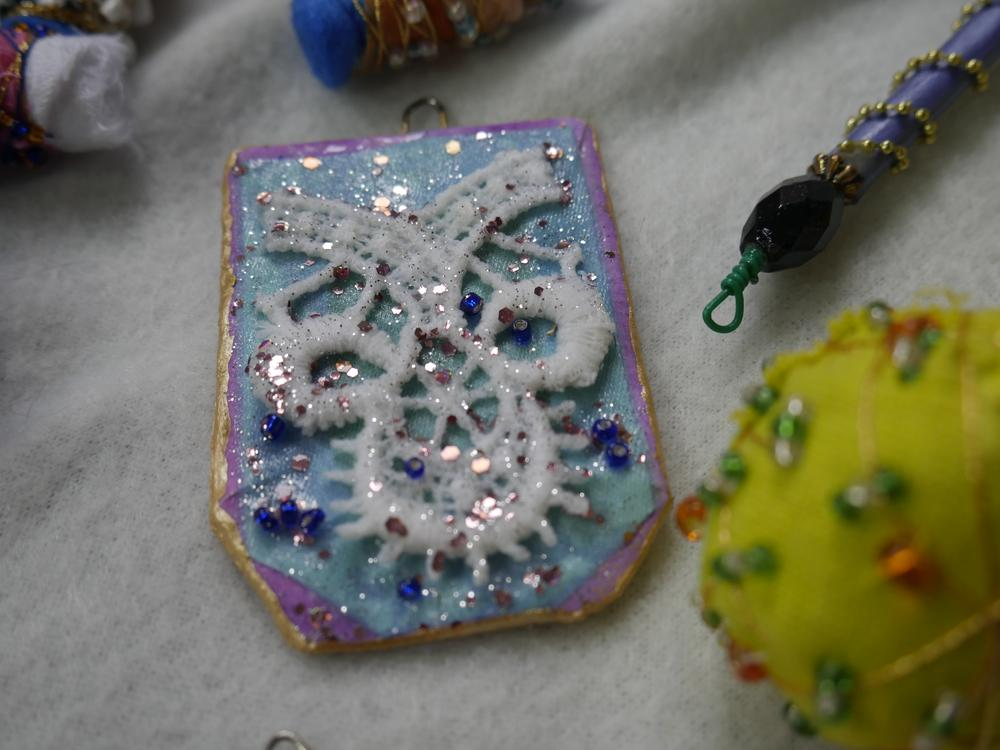

Es ist mal wieder an der Zeit, euch meine ges(t)ammelten Werke der letzten Wochen vorzustellen.

Ich arbeite ja immer an mehreren Projekten gleichzeitig, und die größeren Sachen sind alle nur halb fertig. Hier also jede Menge Kleinigkeiten, die ich so zwischendurch gemacht habe.

Auf dem Flohmarkt habe ich zum Fast-geschenkt-Preis eine destroid-Jeans erstanden. Ich halte diese kaputten Dinger einfach nicht mehr für mein fortgeschrittenes Semester angemessen, aber diese saß wie angegossen, und war viel zu schade zum Zerschnippeln, wie eigentlich geplant. Deshalb habe ich sie bestickt und mit Spitzen die Löcher verdeckt. Spitze geht ja immer! In jedem Alter! Ist jetzt mein absolutes Lieblings-Outfit. An meinen Füßen seht ihr die Katzensocken, die ich für Ermeline gestrickt habe.

Dann habe ich auch noch wieder in Streifen geschnittene Stoffreste verarbeitet; diesmal zu einer großen Tasche, die aus einem langen Stück so zusammengenäht wird, daß ein stabiler Einkaufsbeutel daraus wird. Habe dann noch genähte ausgefranste Federn ausprobiert und als Deko am Henkel aus selbstgedrehter Schnur befestigt. Voila!

Eine weitere einfache Tasche stellt dieses alte T-Shirt dar, was mit ein wenig Bearbeitung einer Schere und Verknotungen zu einem praktischen Einkaufsbeutel werden kann.

Meine umfangreiche Sammlung von Postkarten dümpelt seit Jahren in einer Schreibtischschublade herum. Sie sind zu schade zum Wegwerfen, aber niemand schreibt mehr Postkarten, auch ich nicht. Ich habe daraus kleine Schächtelchen gebastelt. Schächtelchen kann man eher noch gebrauchen, und ich hatte jede Menge Spaß an der Sache. Ein echt meditativer Zeitvertreib, bei dem man seiner Kreativität mit diversen Verzierungen freien Lauf lassen kann.

Wäre da noch mein genäht, gehäkelter mit Perlen bestickter Pompadour-Beutel. Weiß noch nicht, wofür ich ihn verwende, aber mir war mal nach Perlenstickerei.

Ein Probestück ist dieses winzige Täschchen, das einfach aus einer abgeschnittenen Hemdenmanschette entstanden ist. an den Seiten einfach zusammennähen, etwas Spitze oder buntes Band zur Verzierung, und in Null Komma Nichts fertig. Läßt sich natürlich auch noch mehr aufpimpen, wenn man will (Pailetten, Perlen, Stickereien etc.). Da läßt sich aber höchstens ein Schlüssel oder ne EC-Karte drin unterbringen.

Mein Perlenstickexzess fand seinen Höhepunkt allerdings in den herrlich bunten Filz-Stoff-Perlen, die ich um eine Stricknadel herum gearbeitet habe. Die werde ich wohl für eine Kette oder Armbänder verwenden. Mal sehen... Auch die kleinen Anhänger kann ich bestimmt für weitere Projekte verwenden, hierfür habe ich viele kleine Reste verwerten können. 

Zum Schluss zeige ich euch noch, was ich aus zwei alten Polsterkissen für Gartenmöbel gemacht habe. Ich habe sie auf dem Flohmarkt erstanden und noch mit dem alten Bezug in die Waschmaschine getan. Was ichaus dem Bezug gemacht habe, zeige ich euch vielleicht ein anderes Mal, jeden falls ergeben die Polster, zusammen gerollt und mit einem passenden Bezug versehen, super Nackenrollen.

Nachdem dann die Fotokulisse von zwei Stubentigern zum Spielplatz degradiert wurde, endet auch meine Fotostrecke. Ich habe die meisten Ideen für diese Sachen von Pinterest erhalten, und hab sie dann auf meine persönliche Art umgesetzt. Eben Dinge, die die Welt nicht braucht, aber schöööön!

Lebt also eure Kreativität aus, und habt eine fantasievolle Woche. Eure Lucy 
