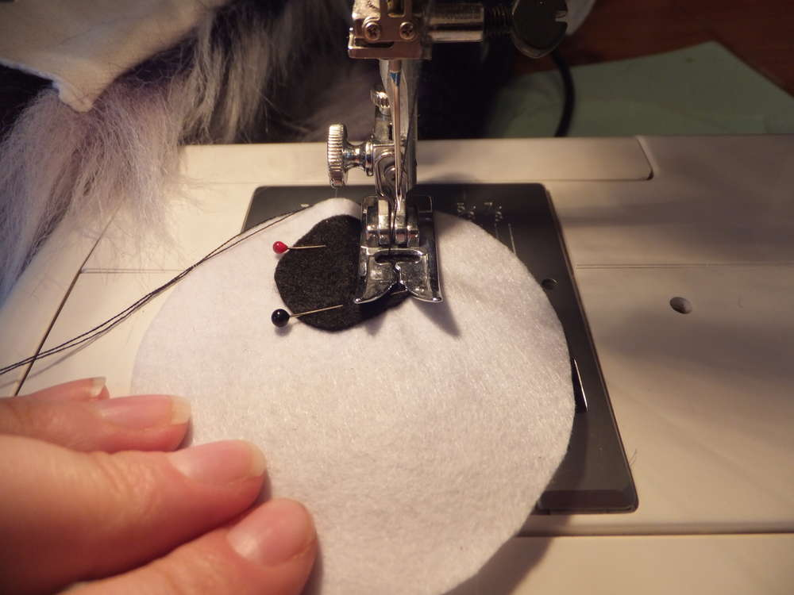
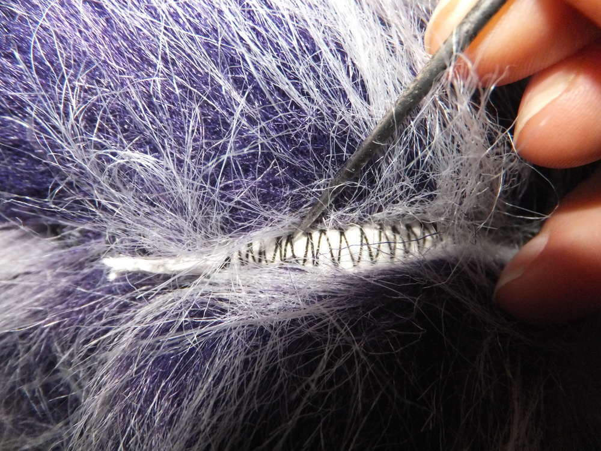
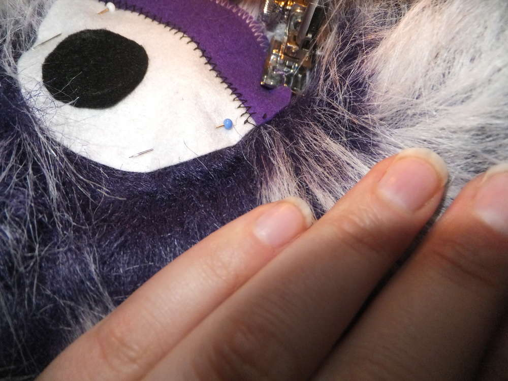
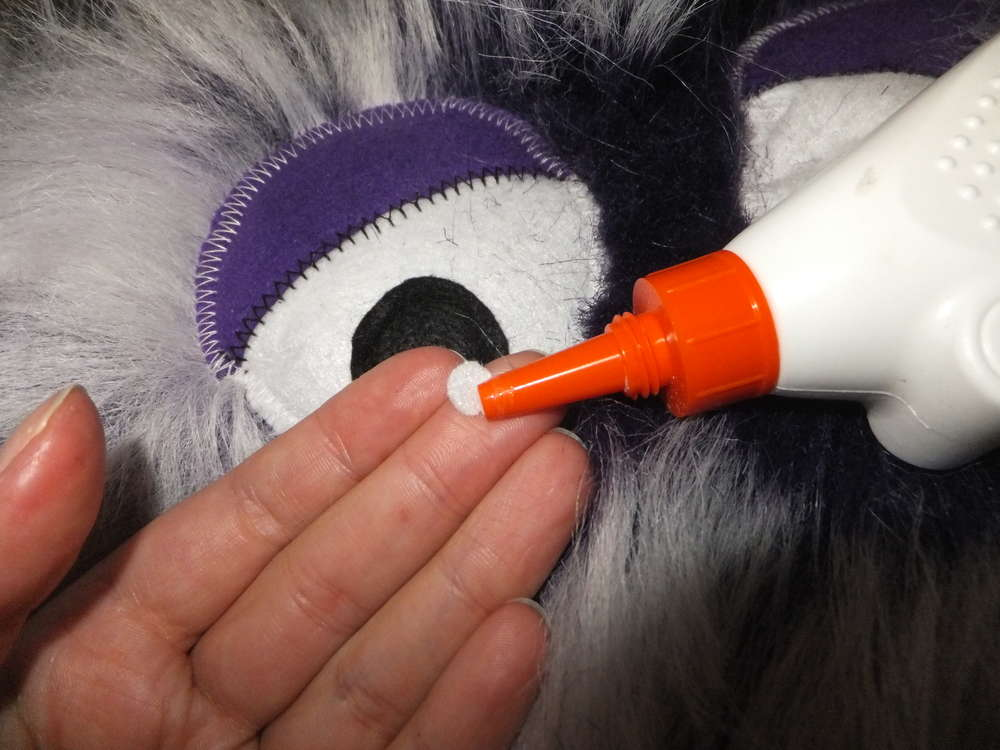
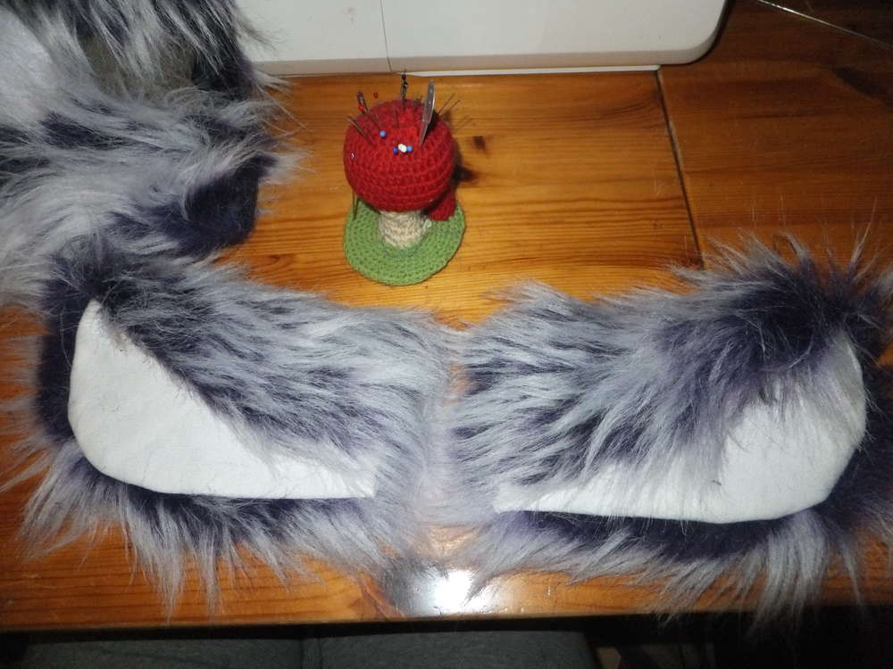

Wer hat ein hässliches Kissen zuhause und wollte sich schon immer mal an einem Kissenbezug versuchen? Das ist der beste Zeitpunkt die gute alte Nähmaschine wieder raus zu holen. Mein Kissen hat die Maße 45 cm \* 30 cm.

Und der lila Plüschstoff schreit mich förmlich an zu einem Monsterkissen verarbeitet zu werden. Also mal 'ne Skizze anfertigen und der Plan steht.

Also meinen Stoff schneide ich auf 50 cm Breite und etwa 70 cm Länge zu.

Wenn du so plüschigen Stoff benutzt wie ich, schadet es nicht, beim Schneiden einen Staubsauger parat zu haben um den Fusselflug zu minimieren. Nachdem der Stoff zugeschnitten ist, werden die anderen Teile vorbereitet, damit du dich später einfach nur dem Nähen widmen kannst. Du solltest jetzt also Zähne, Augen und Ohren vorbereiten. Das sollte für den Anfang reichen, natürlich können zukünftig noch Hörner, Nase oder Pfoten etc. zur Liste hinzugefügt werden.

Für die Zähne nutze ich wie auch schon für meine [Monstertasche](http://flauschiversum.de/2014/12/mobile-monster-macht-man-selbst/ "mobile Monster macht man selbst") dicken weißen Bastelfilz. Die Zähne sollten nicht über die ganzen 50 cm des zugeschnittenen Stoffes gehen, sondern nur ca 40 cm (in meinem Falle) breit sein, denn du hast beim Zuschneiden des Stoffes eine Nahtzugabe (den Stoff breiter zugeschnitten als das Kissen ist) einbezogen, diese wird im letzten Schritt dem Zusammennähen der Seiten benötigt. Wenn nun dein dicker Bastelfilz über die volle Länge geht erschwert dies nur das spätere Nähen.

Die Augen sind aus dünnem Bastelfilz, für Augen wie ich sie mache brauchst du 2 weiße Kreise, 2 passende Augenlider für den verschlafenen Blick, 2 schwarze kleine Kreise als Pupille und 2 Punkte als Lichtreflexe. Die Augenlider passe ich mithilfe der weißen Kreise an.

So sieht das Ganze dann aus wenn man sie probehalber zusammen hinlegt.

Wenn dir die Augen so gefallen, dann ran ans Nähen. Erst die Pupille auf dem weißen Auge, dann die Lider. Ich nehme für die Augenlider eine Zickzacknaht, da ich sie nicht verstecken kann und so bekommt mein Monster dekorative Wimpern für den perfekten Augenaufschlag. Den Lichtreflexen widme ich mich später, da sie aufgeklebt weden und noch leicht bei der Arbeit verloren gehen können.

Meine Ohren zeichne ich mir auf eine Schablone, da insgeamt 4 gleiche Teile ausgeschnitten werden müssen - jeweils 2 flauschige Außenohren und Innenohren. Ich benutze hierfür Kreide, da diese sich leicht auftragen aber auch entfernen lässt und gut sichtbar ist.

Das Innere meiner Ohren werd ich aus dem Stoff eines alten Sweatshirts machen. Dafür teste ich vorher an ob die Schablone darufpasst, ich achte hierbei auf die Webrichtung des Stoffes. Wenn du so wie ich faul bist, dann steckst du dir 2 Schichten zusammen und schneidest sie gleichzeitig aus.

Wenn du die Ohren zugeschnitten hast, kannst du sie auch zusammenähen. Lege das was später Außen sichtbar sein soll nach innen gewandt zusammen und stecke die beiden Teile mit Nadeln fest. Dein Plüsch und die bevorzugte Seite fürs Innenohr sollten nun innenliegen. Achte beim Zusammenstecken darauf, dass der Plüsch möglichst nicht am Rand hinausguckt. Denn nicht nur wir mögen es plüschig, die Nähmaschine hat den Plüsch auch zum Fressen gern.

Die Ohren nähst du nun zusammen und sicherst den Rand gegen Aufribbeln indem du eine Zickzacknaht setzt. Wenn du mit dem Nähen fertig bist, kannst du das Ohr umkrämpeln und austesten wie es dir am besten gefällt. Wenn du das Ohr zusammenklappst erlangst du eine richtige Ohrmuschel. Du kannst deinem Monster mit den Ohren einen unterschiedlichen Charakter verleihen, denn wie auch echte Tiere mithilfe ihrer Ohren ihre Gefühlswelt offenlegen, kann das auch dein Monster. Sind sie offen, aufrecht gestellt oder hängen sie?

Du hast nun alles soweit vorbereitet und kannst mit dem Annähen der Einzelteile beginnen. Fangen wir mit den Zähnen an. Lege vor dich die 50 cm Kante und schlage ca. 3 cm um. Stecke ein paar Nadeln zur Sicherung fest und lege dir nun die Zähne obendrauf. Denke an den Abstand zum Rand der als Nahtzugabe dient.

Kommen wir nun zu dem bereits von mir erwähnten Problem, dass die Nähmaschine gerne Fussel nascht... Die Lösung ist Klopapier. Einfach aber genial, den jeder sollte das Zuhause haben ;) du legst es auf die fusselige Seite und schon hat deine Maschine nichts mehr zu naschen.  

Nach dem Nähen kanst du das perforierte Klopapier einfach abreißen. Bei der Zickzacknaht musst du ein wenig fummeln um die Fitzel heraus zu bekommen, aber auch das geht. Ich habe mir eine Nadel zur Hilfe genommen.

Deine Naht sieht jetzt so aus, wenn du die Nadel zur Hilfe nimmst, kannst du den Flausch aus der Naht entfernen und so verstecken.

Die Zähne sind nun festgenäht und weiter gehts.

So teste jetzt mal mit dem Kissen wie deine Kissenhülle passt. Du kannst jetzt abschätzen wo du die Augen platzieren musst, damit sie nicht von den Zähnen verdeckt werden.

Wir nähen jetzt die andere 50 cm Kante um und benutzen dafür den Klopapiertrick auf beiden Seiten.

Steck die Augen fest und näh sie an, achte darauf, dass die Augen nicht von den Zähnen verdeckt werden.

Weil es doof aussieht, wenn man Haare zwischen den Augen hat, muss das Monster zum Friseur. Schneide nicht zu viel weg, nur soviel wie nötig ist. Beim späteren Kuscheln fummelt man eh an der Frisur herum, das geht nicht, wenn nichts mehr da ist.

Jetzt kannst du dich schonmal um das gewisse Funkeln in den Augen kümmern und die Lichtreflexe aufkleben. Du kannst sie natürlich auch per Hand aufnähen aber ich klebe mit Expressleim.

Mache dir unter Zuhilfenahme des Original-Kissens Markierungen, wo die Falte gelegt wird. Dort klappst du Unterkiefer und Stirn später um.

Du bereitest deinen Kissenbezug jetzt für das finale Zusammennähen vor. Du arbeitest also jetzt mit der Innenseite außen. Falte erst den Unterkiefer bis zu deiner Markierung und dann die Stirn. Machst du es anders herum, sind deine Zähne von der Oberlippe verdeckt, wenn du deine Arbeit später wendest, also wären sie unnötig, da nicht sichtbar.

Schnapp dir jetzt deine Ohren und lege sie nach Innen, mit der Faltkante an die Oberseite des Kopfes. Achte dabei auf genug Nahtzugabe, am besten lässt du ein paar Zentimeter überstehen.

Gleich bist du auf der Zielgeraden... stecke dir nun alles fest und überprüfe den Sitz der Ohren. Meine Nähmaschine hat bei der Dicke der Stofflagen schlapp gemacht. Das war aber auch echt viel Plüsch... Eventuell musst du mit der Hand ran und alles festnähen, wenn dein Plüsch aber kürzer ist, sollte es mit der Maschine keine Probleme geben.

 

Wenn du alles genäht hast, kannst du den Bezug umkrämpeln. Kümmere dich nun darum die Flauschfasern, die mit eingenäht wurden wieder heraus zu ziehen, ich hab dafür wieder meine lange Nadel benutzt. Lass dein Monster die Bekanntschaft mit dem Staubsauger machen und sauge die losen Fasern weg. Jetzt darf dein Monster das Kissen verschlucken und Tadaaaa...

Fertig ist dein Kuschelmonster und du hast ein hässliches Kissen weniger. ;)
