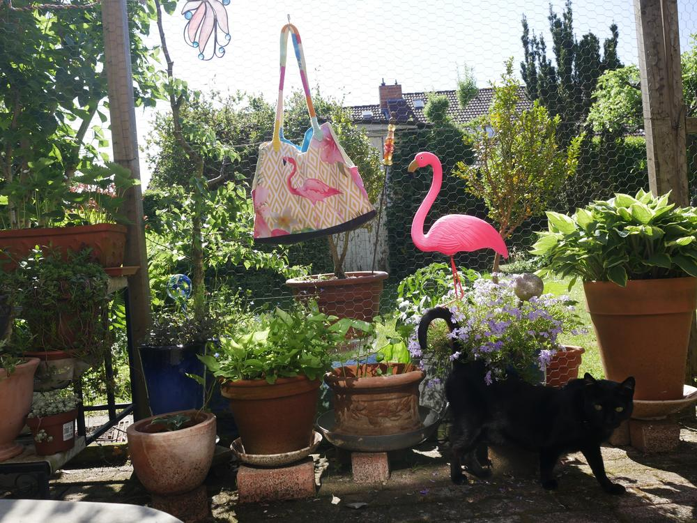
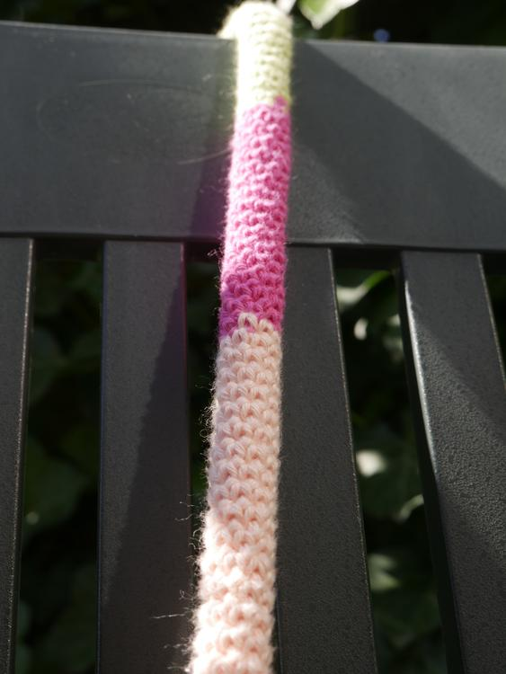

Der Sommer kann kommen. Ich habe die passende Handtasche!

Mit den sommerlichen Temperaturen erwachte in mir mal wieder der Wunsch nach einer neuen Tasche. Ich fand einen Kissenbezug aus festem Synthetikstoff in herrlich frischen Farben, und da ich seit Jahren voll auf Flamingos abfahre, war dieses Teil natürlich bestens für meine Zwecke geeignet.

Der Schnitt ist wie bei anderen schon von mir genähten Taschen, nur aufgrund des flächigen Motivs etwas höher und breiter. Zum Ausgleich habe ich an der Tiefe gespart, denn es sollte ja schließlich kein Einkaufsbeutel werden. An den Seiten befinden sich wieder tiefe Taschen, in denen man prima z.B. Schlüssel versenken kann, ohne ein Herausrutschen befürchten zu müssen. Auf der Rückseite habe ich dann noch eine kleine Tasche für meine Brille, weil ich die gern gleich griffbereit haben möchte.

Das Innenfutter besteht aus mehreren leuchtend bunten Stoffresten. Es sind auch jede Menge Täschchen eingearbeitet, damit der Kleinkram geordnet untergebracht ist. In dem großen Reißverschlussfach habe ich meine Papiere und evtl. andere Wertgegenstände sicher verstaut.

Die Träger sind aus Baumwollgarn gehäkelt. Wenn ihr wissen wollt, wie anstrengend es ist, mit nur 9 festen Maschen in der Runde zu arbeiten, dann probiert es aus. Mir taten nach einiger Zeit ziemlich die Finger weh, weil die Angelegenheit sehr fummelig ist. Aber mit dem Ergebnis bin ich äußerst zufrieden. In den Häkelschlauch habe ich dann noch zur Verstärkung eine selbstgedrehte Kordel aus Stoffstreifen gezogen.

Und wenn ich mit diesen Kordeln erstmal anfange, dann kann ich einfach nicht mehr damit aufhören. Habe deshalb noch ein paar unterschiedlich lange Stücke gedreht und damit den Kaninchenzaun auf meiner Terrasse verschönt. Als alte Pazifistin konnte ich so auch gleich eine Botschaft anbringen.

Eine friedliche Woche bei wunderschönem Sonnenschein wünscht euch Lucy 
