Also um mein Gedöns zum Basteln aufzubewahren, benutze ich Kartons. Normalerweise sind sie schwarz und von einem bekannten Möbelhaus. Dieses Möbelhaus jedoch hat das Design der Kästen verändert und ich sah mich gezwungen zu improvisieren. 

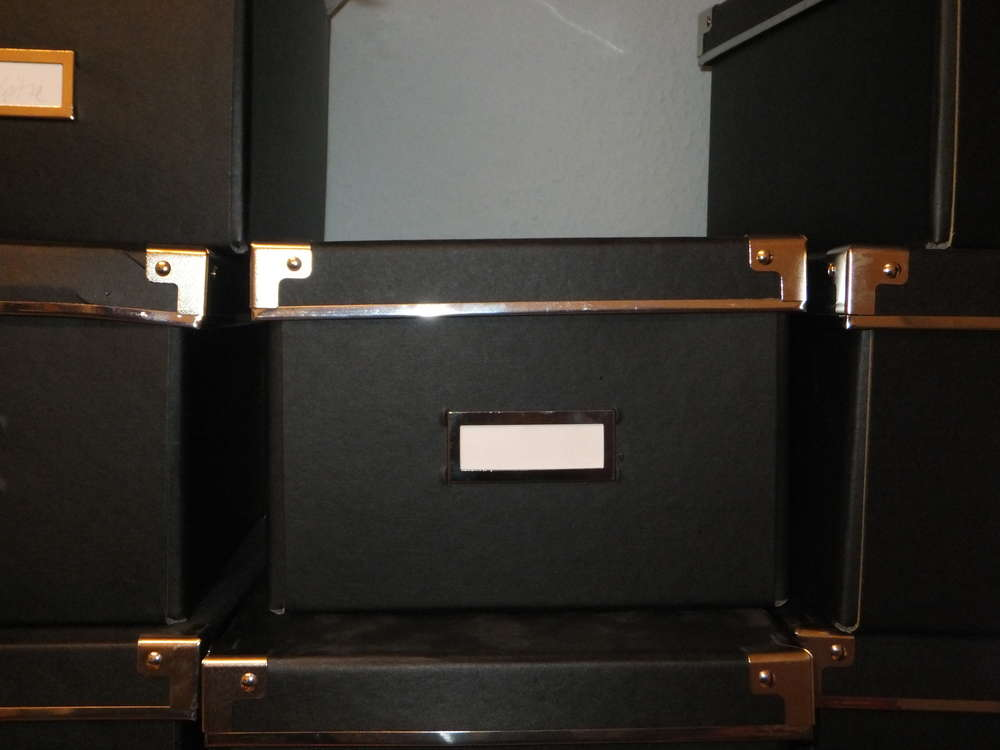

Dies tat ich mit vielerlei verschiedenen Kartons, die mit der Post und durch andere Gelegenheiten kamen... ihr kennt das ja. Die sahen aber doof aus und der langen Rede kurzer Sinn: Heute geht es darum hässliche Kartons wieder aufzuhübschen, weil sie einfach zu nützlich sind zum Wegwerfen.

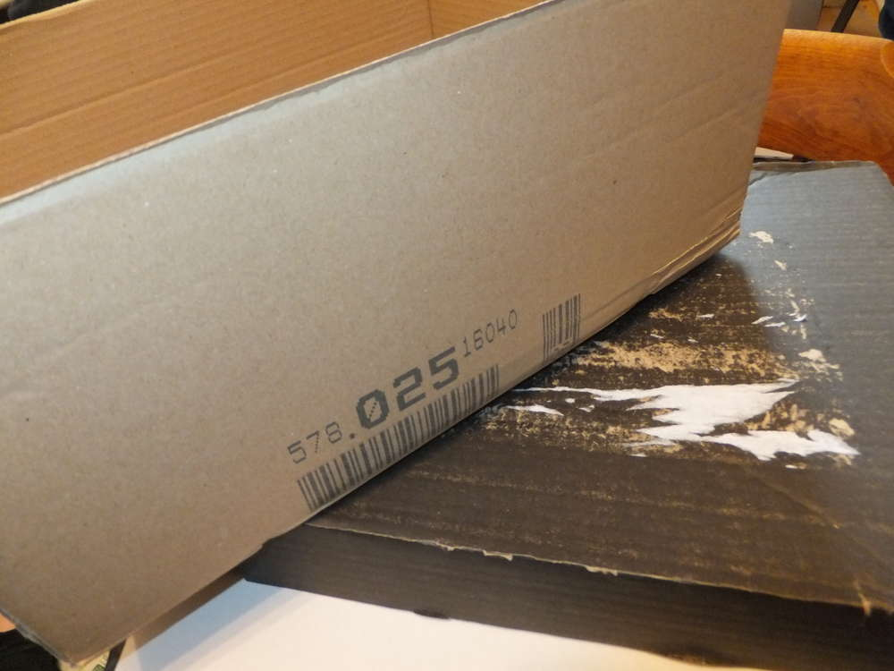
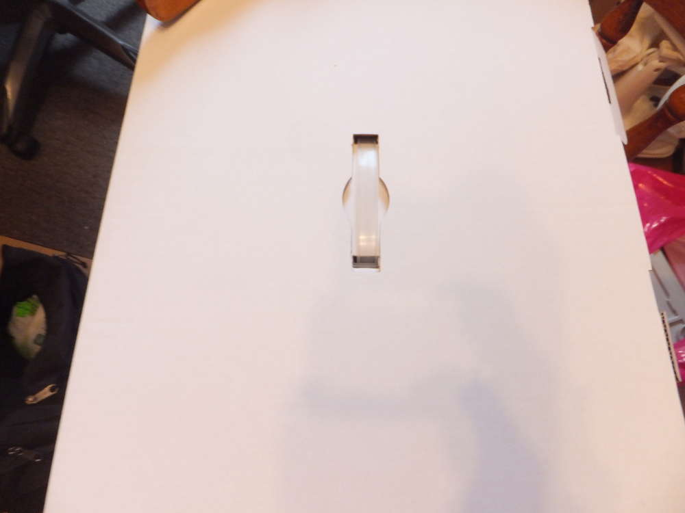

Ich hab bei dem einen Karton mit der Serviettentechnik experimentiert, leider war das Ergebnis nicht so zufriedenstellend, deshalb hab ich wieder mit Abtönfarben drübergepinselt. Sowas soll bei mir auch mal vorkommen...

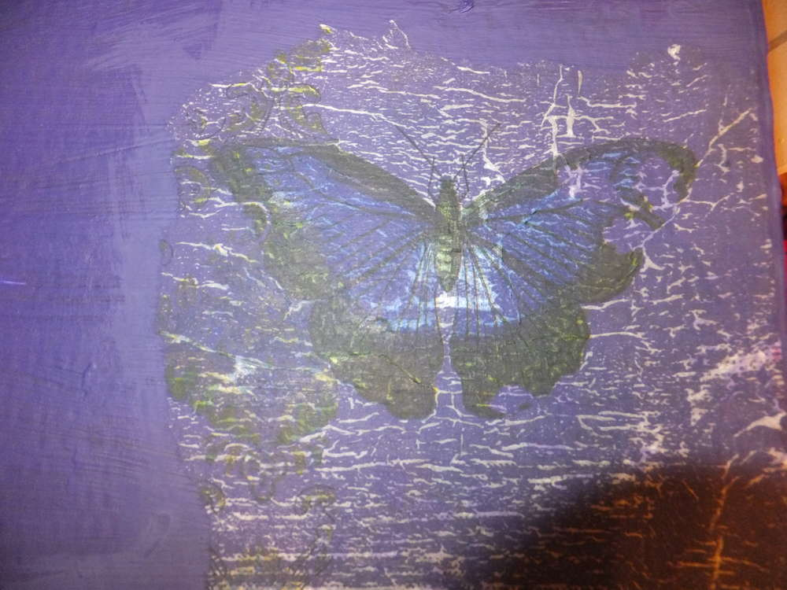

Der Karton wird erstmal einfach so bleiben, der größere Karton war mir dann aber in komplett lila zu langweilig. Deshalb hab ich mal eine alte Tapete, die auch schon Verwendung im Grusellabyrinth Kiel und NRW gefunden hat, rausgekramt und einem dekorativen Zweck zugeführt. Ich habe die Tapete mit einer Bastelleim und Wasser Mischung mit dem Pinsel eingekleistert und dann auf den Karton geklebt. Später bin ich nochmal mit dem Edding an den Kanten langgefahren und fertig soll er sein. Hier sind die Bilder vom Entstehungsprozess.

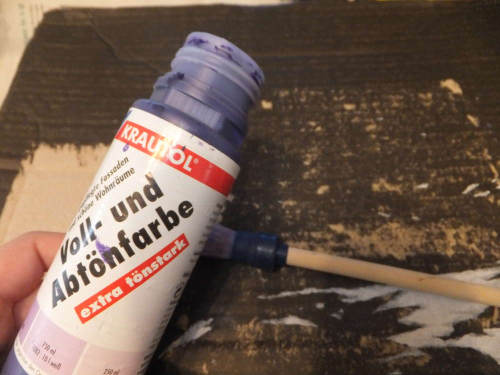
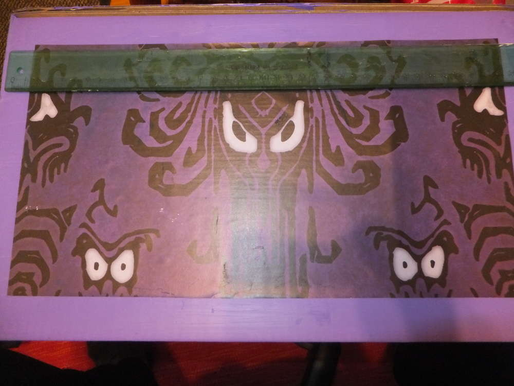
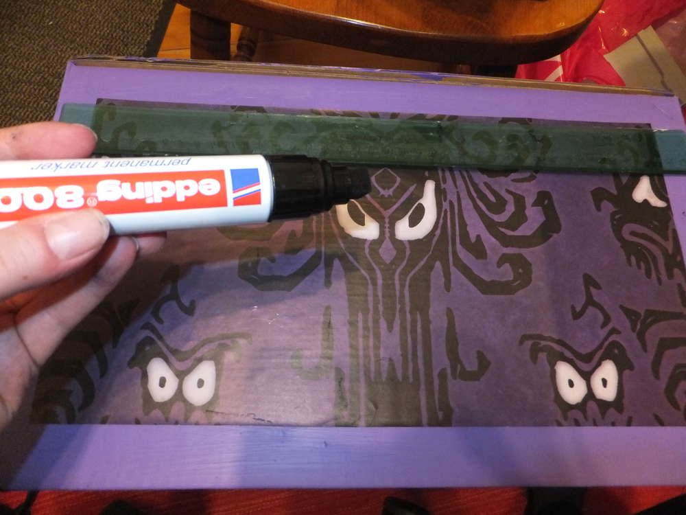
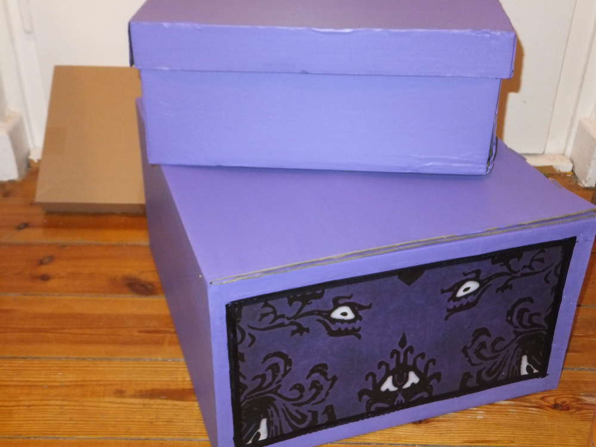
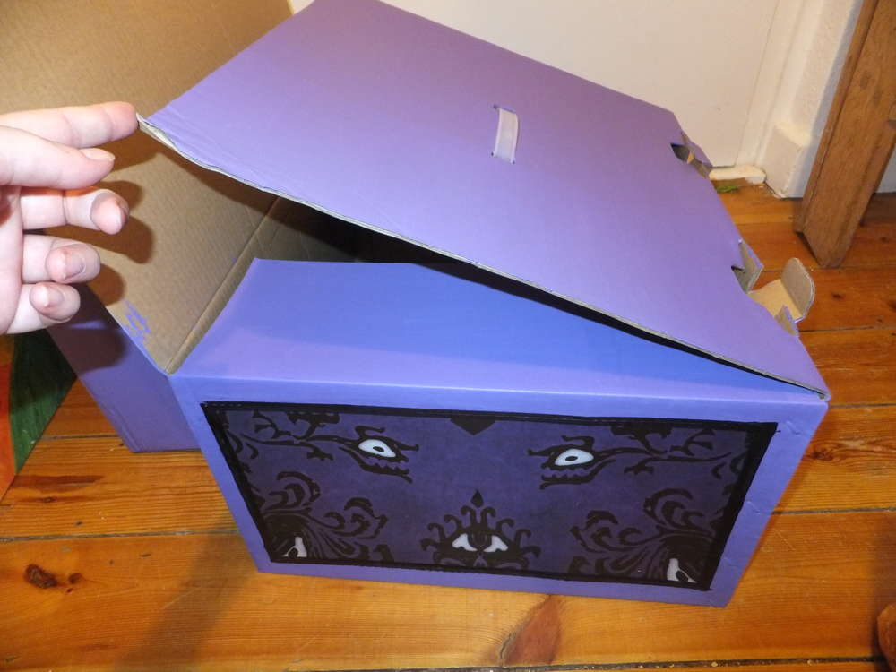
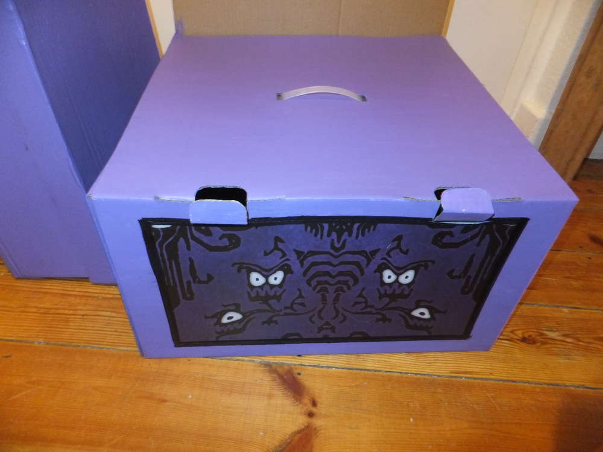
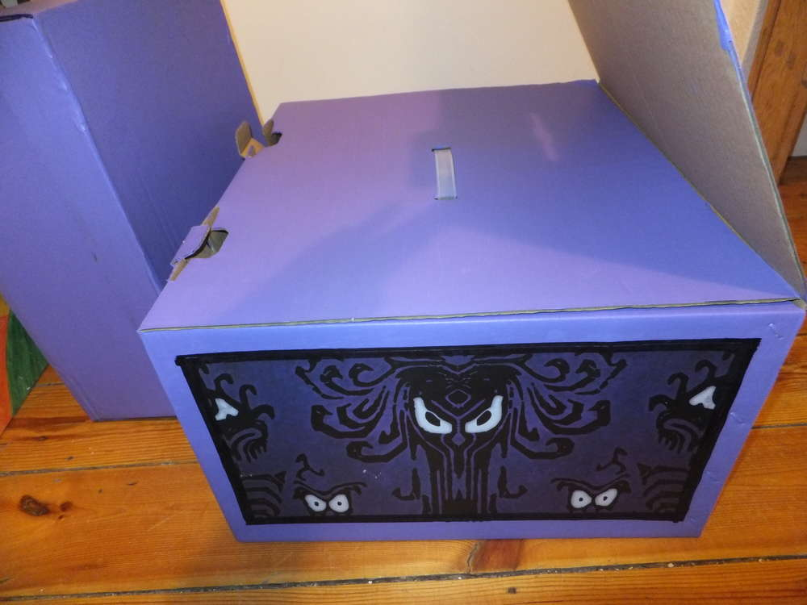

Ich werde mich nun an ein paar anderen nützlichen Kartons austoben und dann mal meine Bastelsachen sortieren, ich habe heute auf dem Flohmarkt wieder ein paar Errungenschaften gemacht.
Natürlich kann man auch den ganzen Karton mit Papier oder Stoff einschlagen und anderweitig dekorieren, wie immer freue ich mich auch über Bilder deiner Werke, schicke sie einfach an ermeline@flauschiversum.de und ich werde sie dem Beitrag hinzufügen, solange noch keine Kommentarfunktion existiert. Viel Spaß dabei.

