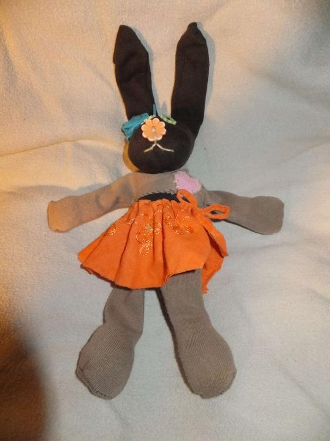
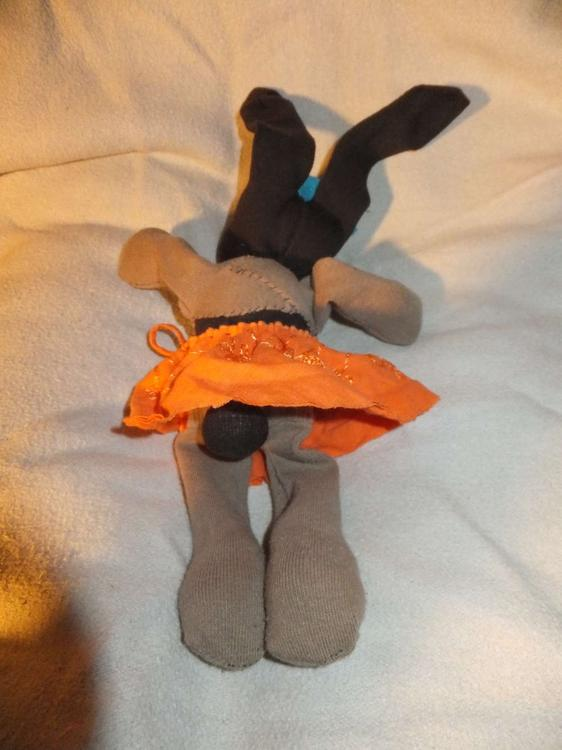
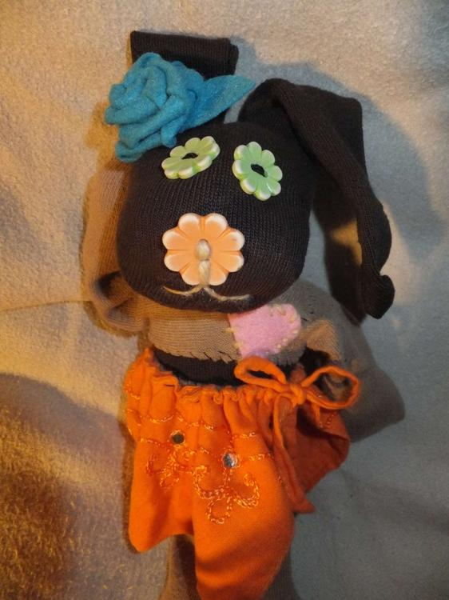

Diese liebenswerte Hasendame hat seit gestern nicht nur einen Platz in meiner Einzelne-Socken-Kiste geräumt, sondern auch einen in meinem Herzen erobert.

Wer kennt das nicht? Du wirfst zwei Socken in die Waschmaschine rein aber nur eine kommt raus und weil es noch die Hoffnung gibt, die Zweite könnte wieder auftauchen, packt man sie in eine eigens für diesen Zweck erwählte Schublade... Diese Hoffnung hab ich über Bord geworfen, zumindest bei einigen meiner Sockensingles. Sieht die Socke noch gut aus, dann ist das die beste Voraussetzung um ein Sockentier daraus zu machen.

Der Fantasie sind dabei keine Grenzen gesetzt. Für meine Hasendame habe ich die Socke an der Fusspitze eingeschnitten um daraus die Hasenohren zu nähen und dann aus der Hacke das Gesichtchen gemacht, am Hals hab ich mit einem Faden abgeschnürt, und den Rest als Rumpf ausgefüllt. Eine Zweite Socke wurde für die Pfötchen verwendet, die Beinchen wurden wie eine Hose angezogen und am Rumpf festgenäht. Dank eines kleinen Loches konnte ich sogar aus der darunterliegenden Socke ein Bürzelchen machen.

Der Rest ist nur Detailarbeit. Ein Gesicht, eine kleine Filzrose sowie ein Röckchen und ein Herz am Rechten Fleck und fertig ist die kleine Hasendame.
