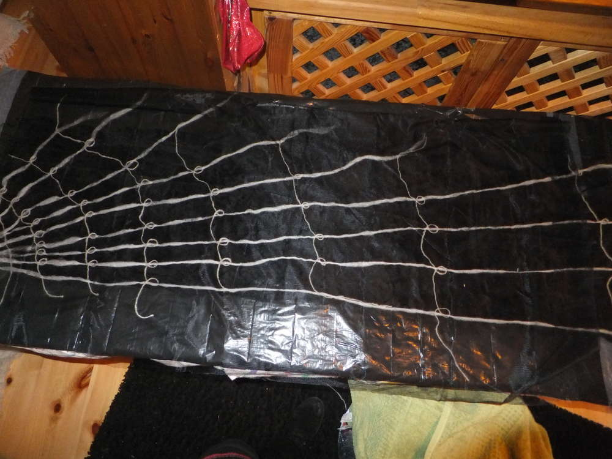
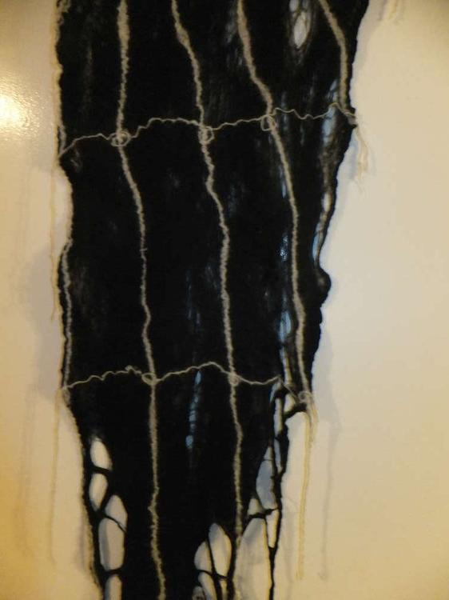
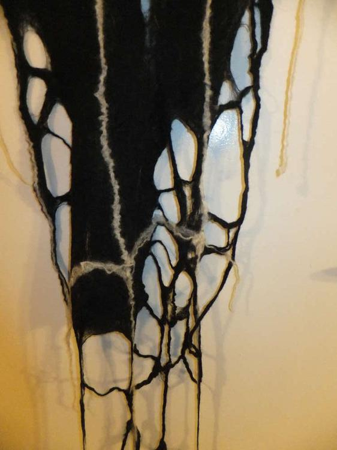
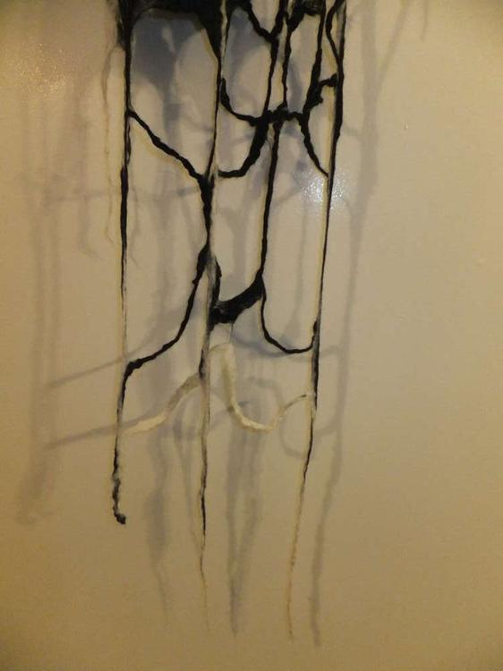
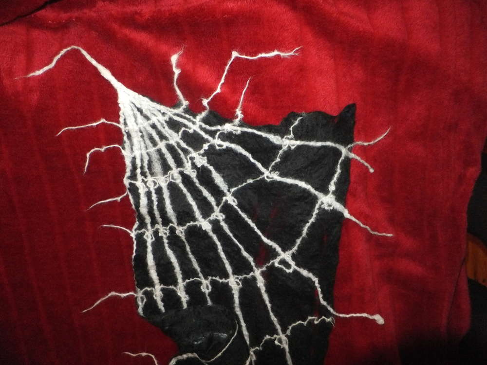

Im Zuge einer experimentellen Erprobung habe ich mich mit der Spinnwebtechnik auseinandergesetzt. Bei dieser Technik werden nur dünne kurze Fasern aus dem Kammzug kreuz und quer gelegt, sodass ein löchriges Gewebe entsteht, ich habe mich bei diesem Schal offensichtlich vom Namen der Technik inspirieren lassen und einen hauchdünnen Spinnenwebenschal gefilzt, der als Basis nur aus dem auseinandergezupften Kammzug besteht. Ein von mir gesponnenes Garn aus Alpakawolle nutzte ich für die Spinnenweben.

Hier ein paar Fotos vom Entstehungsprozess

Dann schauen wir uns das Schätzchen mal im Detail an wie es aussieht, wenn es fertig ist.

