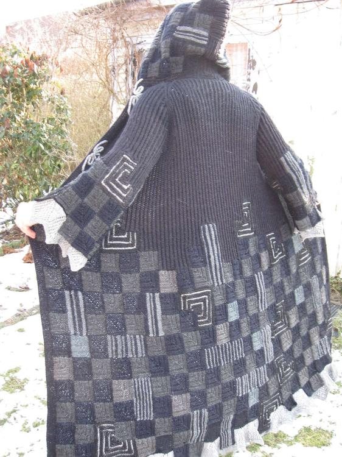

Das Strickmuster welches ich für meine kunterbunte Restedecke benutzt habe, habe ich auch für meinen Mantel benutzt. Den habe ich kreuz und quer und über 1, 2 und 3 Ecken in schwarz und mehreren Grautönen genadelt. Das Oberteil ist dann im Bündchenmuster (hier: 1M re, 1M li) und ab Raglanschrägung werden alle 5 Teile (re vorn, re Ärmel, Rücken, li Ärmel, li vorn) auf einer Rundstricknadel weitergearbeitet. Die  Kapuze dann wieder in Kreuz- und Quermustern stricken und annähen. An den Abschlüssen eine gekräuselte Spitze (na klar auch wieder aus nem alten Heftchen!), ein paar gestrickte Rosen, Blätter und Perlen aufgenäht, und schon ist das gute Stück fast fertig. Die Ornamente an den Verschlüssen sind mit der Strickliesel gemacht und mit Nähgarn befestigt, denn das ist von vorne und hinten kaum zu sehen.
