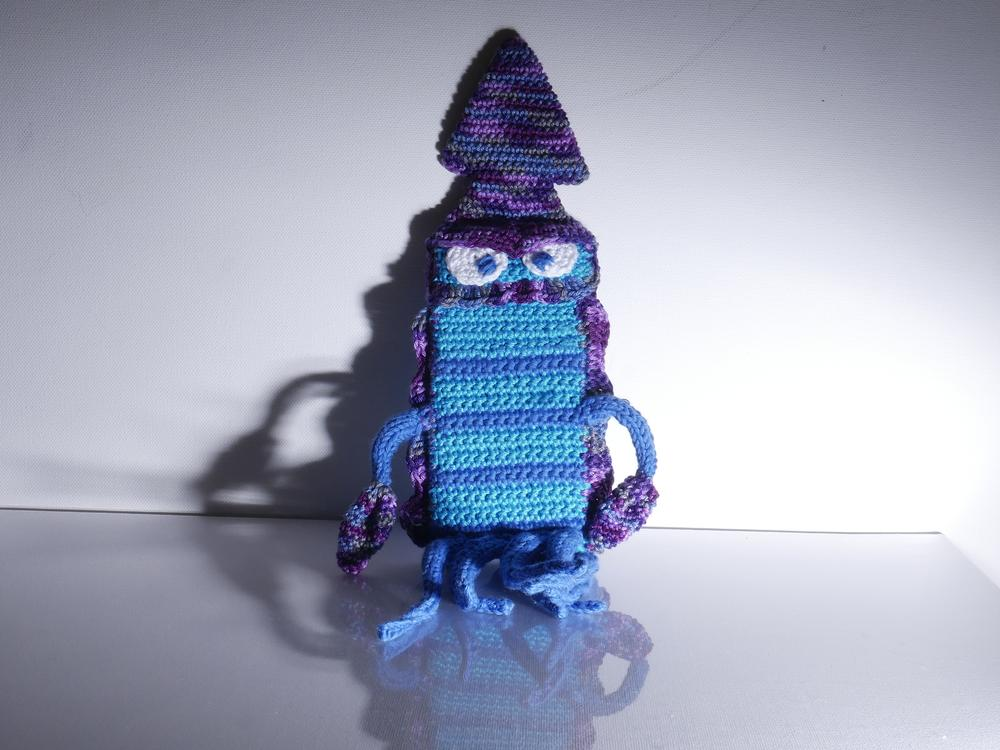
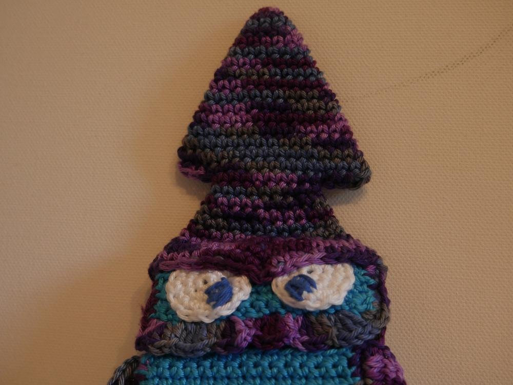
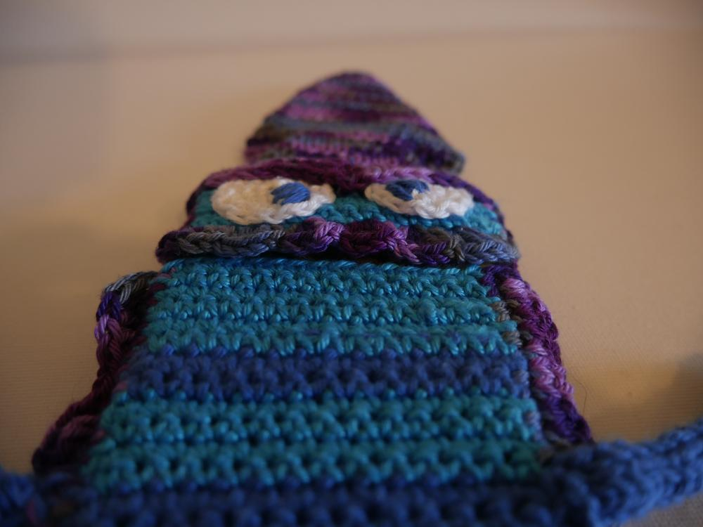

Mal wieder ein Fall von: Danke für die Inspiration! Eine Kollegin sah meine neue [Monsterhandyhülle](/2017/06/handymonster/) und war gleich begeistert. Da ich weiß, dass sie einer der größten Tintenfischfans ist, die es geben kann, habe ich mich dann mal an die gehäkelte Variante eines Kalamars gemacht, in dem sie ihr Handy zukünftig verstauen kann. 

Praktisch ist was anderes, aber darum geht es ja auch nicht. Sowas werden aber auch nur Unikate bleiben... Warum? Weil es echt frickelig ist die ganzen Tentakeln zu stricken und anzunähen, aber ich liebe die Herausforderung und die darauffolgende Freude, die ich dann meinen Mitmenschen machen kann, wenn ich sie gemeistert habe.
