Wir wollen Trickfilme drehen. Wie ich schon bei Facebook angekündigt habe, waren wir an diesem Wochenende in der Kieler Uni beim Hackathon. Um dort unseren Trickfilm drehen zu können, mussten wir uns zunächst auf die Art des Films und den Stil einig werden, da ich ganz akzeptabel zeichnen kann und meine bessere Hälfte sich gerne mit dem Lasercutter im [FabLab](http://fablab.sh/) auseinandersetzt, beschlossen wir uns Gelenkpuppen zuschneiden zu lassen. Als Vorbilder dienten uns unsere [LARP-Charaktere](http://magierdinge.de/) Ehrlich B. Standen, Ermeline A. Wollknoll und Ader Pechsteyn. Näheres zum Vorgang des Lasercutting habe ich im Beitrag [Magierdinge](/2016/03/magierdinge/) geschrieben. Auch die Hüte der drei Magier [Ehrlich](/2014/01/rincewind-hut/), [Ermeline](/2014/01/mein-erster-filzhut/) und [Ader](/2014/04/ein-hut-fur-steinfreunde/) sind schon im Flauschiversum aufgetaucht. Es werden vermutlich noch weitere Charaktere folgen, zunächst haben wir uns auf diese drei beschränkt. Wir wollen damit Szenen aus unseren Con-Abenteuern nachstellen. An diesem Wochenende ist ein Teil der ersten Episode entstanden, da aber noch ein paar kurze Szenen fehlen, muss noch ein wenig auf den fertigen Film gewartet werden.
Da Ehrlich unser Haupcharakter von 'Ehrlichs ABENTEUER' ist, haben wir von ihm eine Front- und eine Seitenansicht erstellt. die Gelenke wollten wir zunächstmit Heftzwecken fixieren, damit aber nicht immer alles auseinander fällt sind wir auf Drähte umgestiegen, da uns beim Lasern aber ein kleiner Fehler, was die Tiefe mancher Cuts angeht, unterlaufen ist, brachen gelegentich Teile beim Verbinden mit Draht ab, sodass wir viel Zeit beim Zusammenleimen verlohren. Alles in allem hat es dann trotzdem für unseren Zweck gereicht.
Hier sind aber nun die fertigen Trickfilm-Figuren...

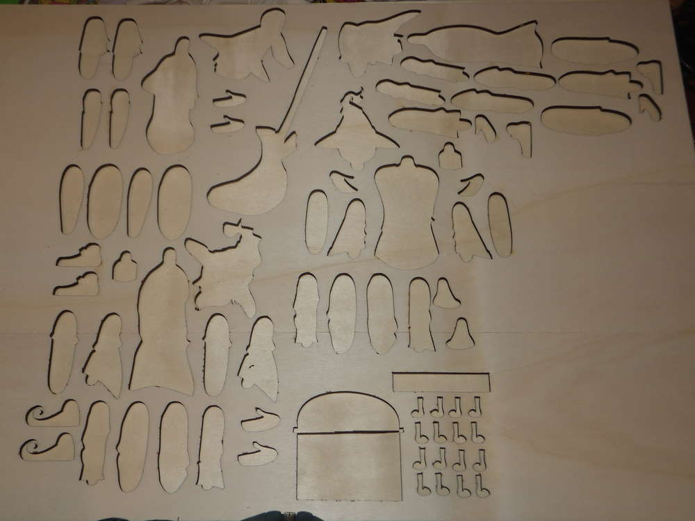

Ehrlich
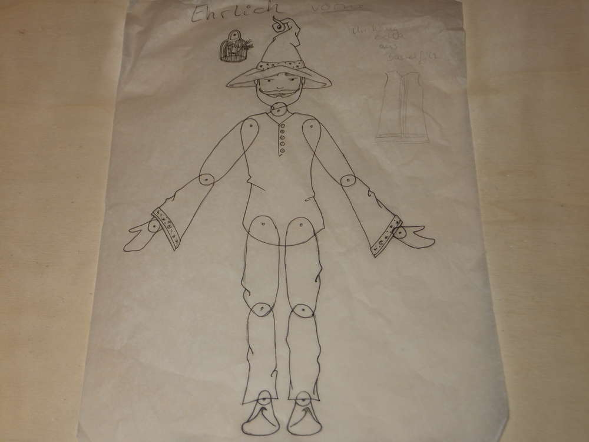
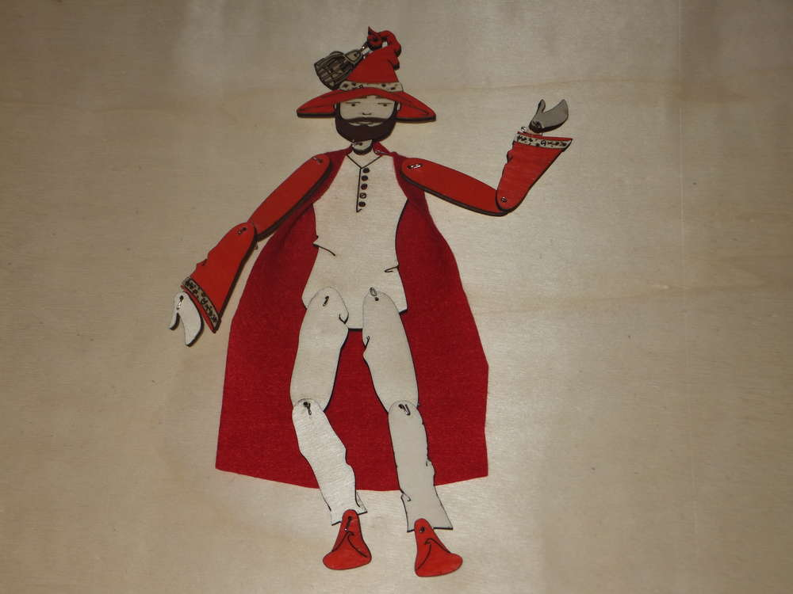
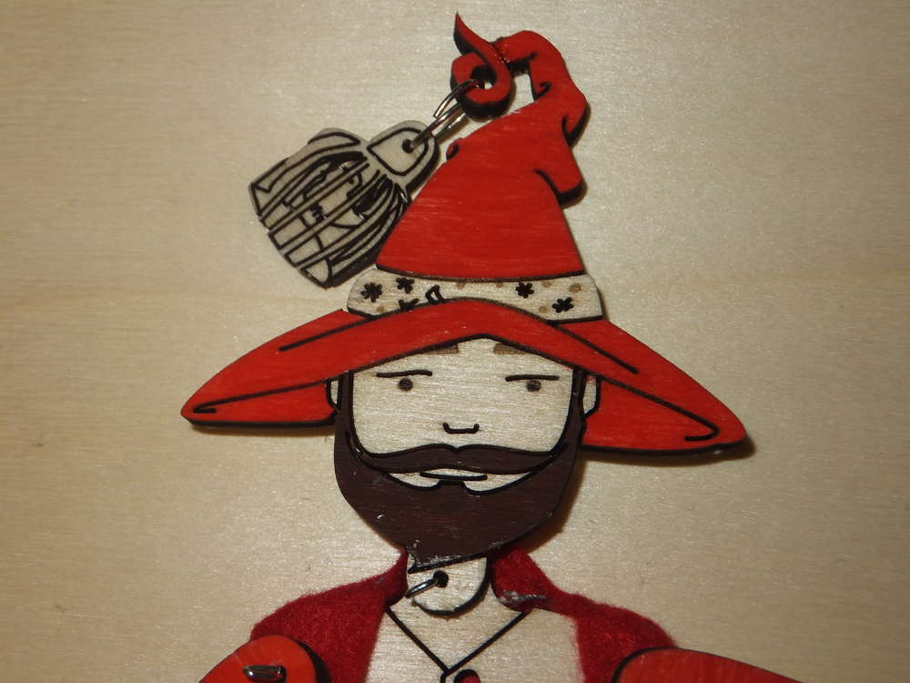
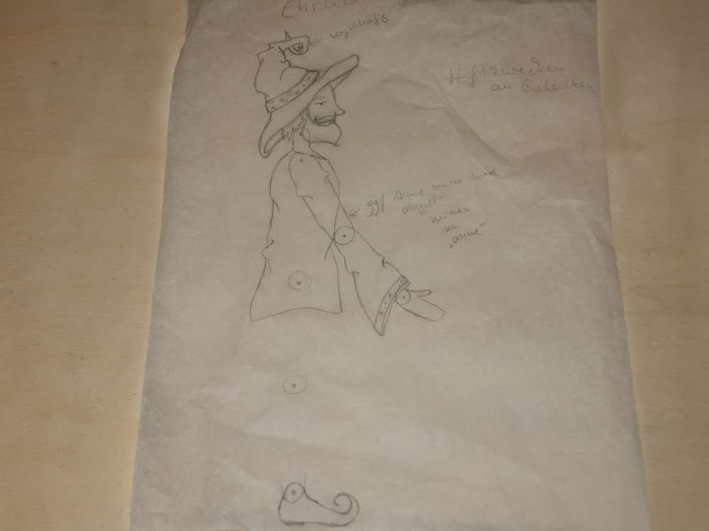
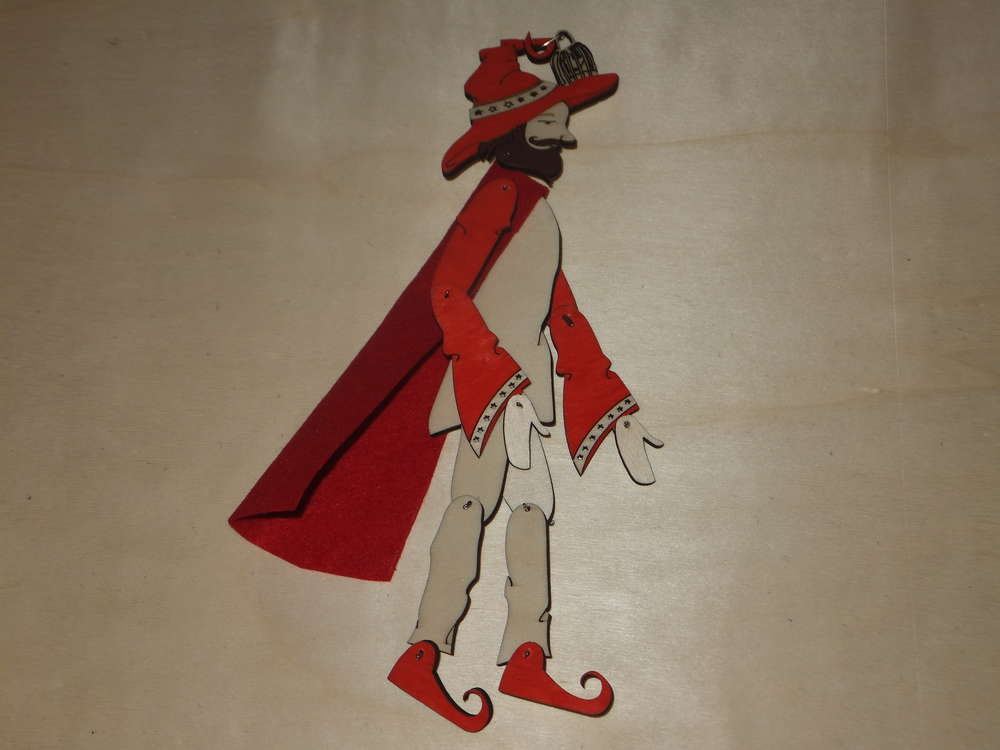
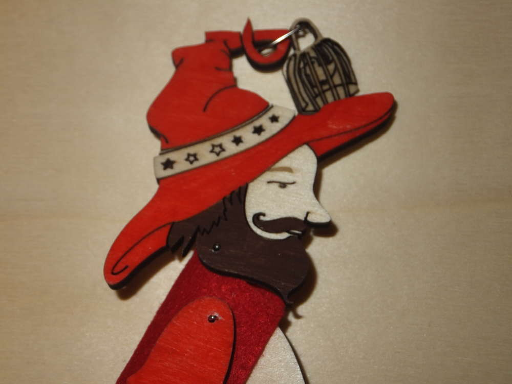

Ermeline
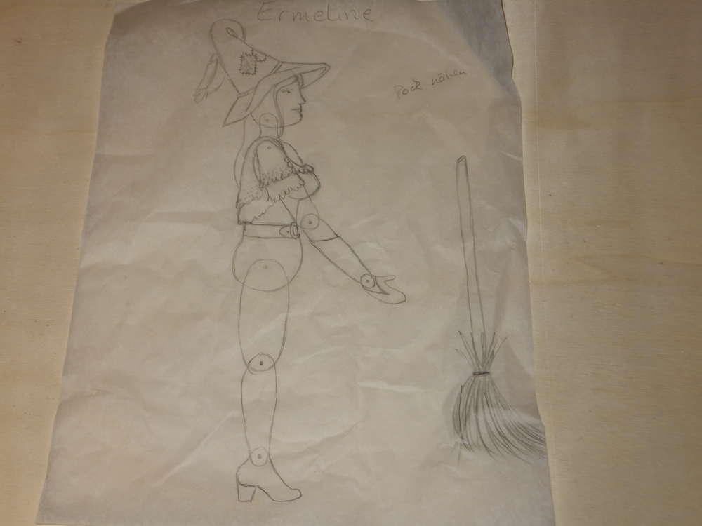
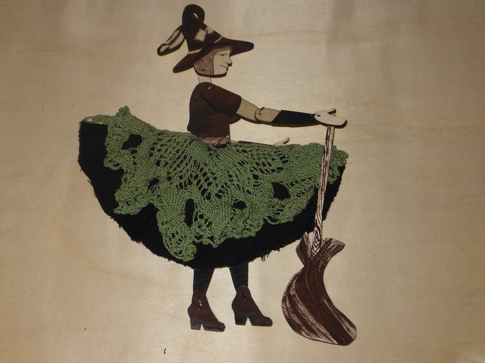
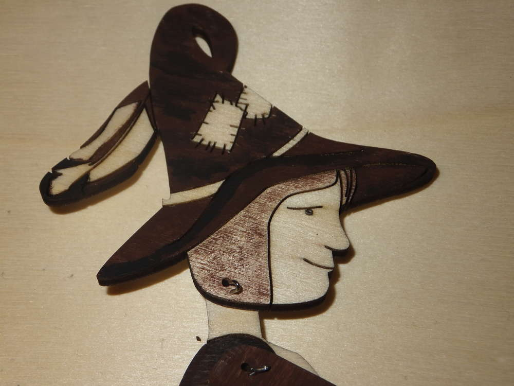

Ader
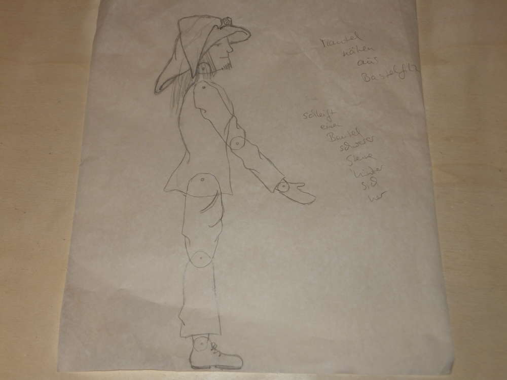
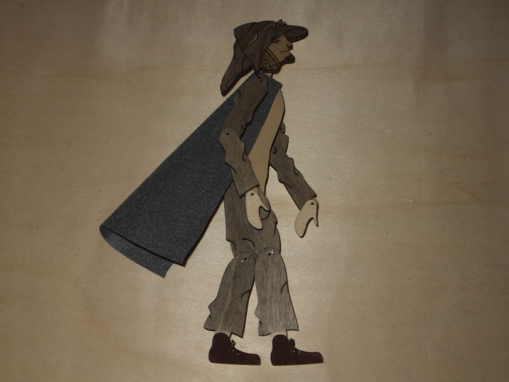
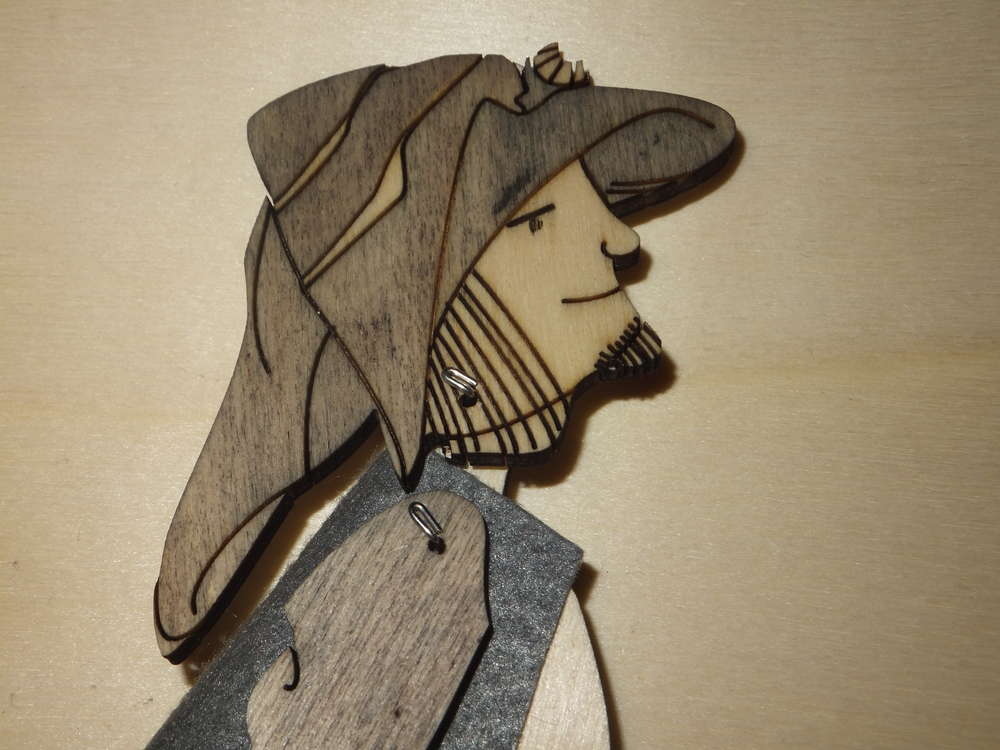

Einen angenehmen Sonntag wünscht euch Ermeline!!!
