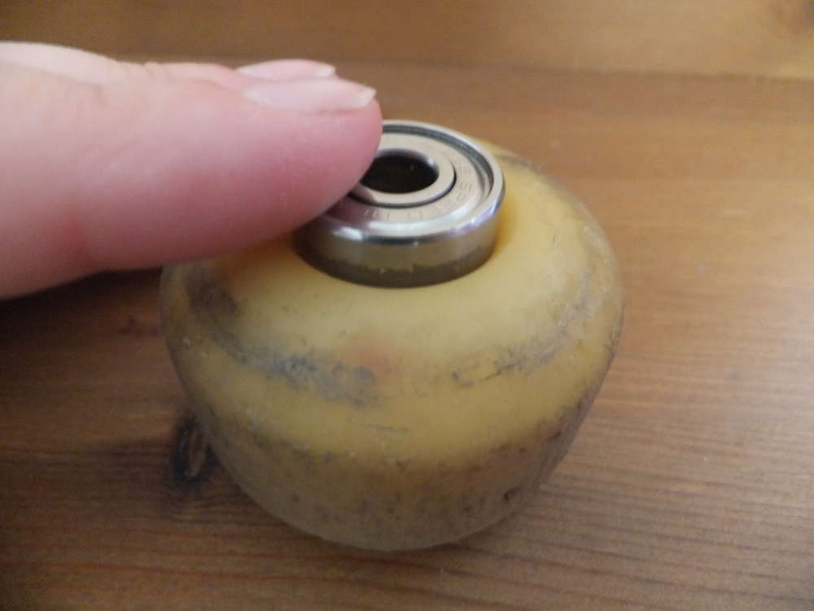

Ich habe ein Problem, ich habe mir ein traumhaftes Fingergarn von SchoppelWolle besorgt und wollte mir ein schönes Lacegarn spinnen. Wie ihr seht, ist noch was von dem Garn übrig, aber die Spindel ist mittlerweile so schwer geworden, dass sie sich super träge dreht. Ich habe schon Fingerschmerzen vom andrehen. Doch Hilfe ist nah.

Gut wenn man Skater kennt! Die werfen ihre alten Kugellager aus den Skateboards erst weg, wenn wirklich nix mehr geht. Wenn du ein ausgemustertes Kugellager mit Rad bekommen kannst, ist deine unterstützte Spindel schon fertig. Solange die Spindel auf das Kugellager aufgesetzt werden kann, kann man diese einfache Variante nutzen um die schwere träge Spindel zu beschleunigen.

Jetzt kann der Rest zuende gesponnen werden. Wenn ich dann mal wieder kreativ bin, werde ich das olle Rad noch verschönern. 

Wenn ihr sehen wollt, was aus der Wolle geworden ist, dann schaut euch mal diesen [Post](http://flauschiversum.de/2015/07/gut-betucht/) an.
